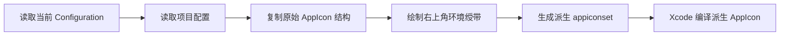

# `JobsAppIconRibbon`


[toc]

---

## 🔥 <font id=前言>前言</font>

> `JobsAppIconRibbon` 是一个构建期 App 图标环境绶带生成器。它会在原始 AppIcon 的右上角绘制 `DEBUG`、`RELEASE` 或自定义文案，方便从桌面图标直接识别安装包环境。

该模块没有运行时代码，不需要在 [**Swift**](https://www.swift.org/) 或 [**Objective-C**](https://developer.apple.com/library/archive/documentation/Cocoa/Conceptual/ProgrammingWithObjectiveC/Introduction/Introduction.html) 中 `import`。它由 [**CocoaPods**](https://cocoapods.org/) 注册到 [**Xcode**](https://developer.apple.com/xcode) Build Phase，并在资源编译前生成派生 AppIcon。

## 一、功能特点 <a href="#前言" style="font-size:17px; color:green;"><b>🔼</b></a> <a href="#🔚" style="font-size:17px; color:green;"><b>🔽</b></a>

- 原始 `.appiconset` 始终只读，不覆盖设计源图。
- Debug 默认显示 `DEBUG`，Release 默认显示 `RELEASE`。
- 绶带背景默认棕色 `#8B4513`，文字默认白色 `#FFFFFF`。
- 默认字体为 `HelveticaNeue-Bold`，字体名称和字号比例均可配置。
- 支持自定义构建环境及对应文案，例如 `UAT`、`TEST`、`PRE`。
- 每次构建仅重建当前 Configuration 对应的派生 `.appiconset`。

## 二、目录结构 <a href="#前言" style="font-size:17px; color:green;"><b>🔼</b></a> <a href="#🔚" style="font-size:17px; color:green;"><b>🔽</b></a>

```text
JobsAppIconRibbon@Pods/
├── JobsAppIconRibbon.podspec
├── README.md
└── Scripts/
    ├── JobsAppIconRibbon.sh
    └── JobsAppIconRibbonGenerator.swift
```

- `JobsAppIconRibbon.podspec`：声明构建前脚本阶段。
- `Scripts/JobsAppIconRibbon.sh`：解析 [**Xcode**](https://developer.apple.com/xcode) 构建环境并调用生成器。
- `Scripts/JobsAppIconRibbonGenerator.swift`：读取 AppIcon、绘制绶带并输出派生图标集。
- 项目根目录的 `../../JobsAppIconRibbon.config`：调用方配置入口。

## 三、接入方式 <a href="#前言" style="font-size:17px; color:green;"><b>🔼</b></a> <a href="#🔚" style="font-size:17px; color:green;"><b>🔽</b></a>

### 3.1、引入本地 Pod

在项目的 `Podfile` 或依赖拆分文件中加入：

```ruby
pod 'JobsAppIconRibbon', :path => './JobsByPods/JobsAppIconRibbon@Pods'
```

然后在项目根目录执行：

```shell
pod install --no-repo-update
```

### 3.2、创建项目配置

在项目根目录创建 `JobsAppIconRibbon.config`：

```properties
SOURCE_APPICONSET=项目内原始AppIcon.appiconset的相对路径
OUTPUT_NAME_PREFIX=JobsAppIconRibbon

RIBBON_TEXT=
DEBUG_TEXT=DEBUG
RELEASE_TEXT=RELEASE

BACKGROUND_COLOR=#8B4513
TEXT_COLOR=#FFFFFF
FONT_NAME=HelveticaNeue-Bold
FONT_SIZE_RATIO=0.105
```

`SOURCE_APPICONSET` 必须相对于项目根目录，且必须指向包含 `Contents.json` 的原始 `.appiconset`。

### 3.3、切换 AppIcon 名称

在 App Target 的 Build Settings 中配置 `Asset Catalog App Icon Set Name`：

| Configuration | AppIcon 名称 |
| --- | --- |
| Debug | `JobsAppIconRibbon-Debug` |
| Release | `JobsAppIconRibbon-Release` |

对应的原始配置键为：

```text
ASSETCATALOG_COMPILER_APPICON_NAME
```

完成后直接构建 App 即可，不需要添加任何业务层调用代码。

## 四、配置项 <a href="#前言" style="font-size:17px; color:green;"><b>🔼</b></a> <a href="#🔚" style="font-size:17px; color:green;"><b>🔽</b></a>

| 配置项 | 默认值 | 说明 |
| --- | --- | --- |
| `SOURCE_APPICONSET` | 无 | 原始 AppIcon 的项目相对路径，必填 |
| `OUTPUT_NAME_PREFIX` | `JobsAppIconRibbon` | 派生 AppIcon 名称前缀 |
| `RIBBON_TEXT` | 空 | 非空时强制所有环境使用同一文案 |
| `DEBUG_TEXT` | `DEBUG` | 名称包含 Debug 的构建环境文案 |
| `RELEASE_TEXT` | `RELEASE` | 名称包含 Release 的构建环境文案 |
| `BACKGROUND_COLOR` | `#8B4513` | 绶带背景色，支持 `#RRGGBB`、`#RRGGBBAA` |
| `TEXT_COLOR` | `#FFFFFF` | 文字颜色，支持 `#RRGGBB`、`#RRGGBBAA` |
| `FONT_NAME` | `HelveticaNeue-Bold` | macOS 字体名称，不存在时回退到系统粗体 |
| `FONT_SIZE_RATIO` | `0.105` | 字号占图标边长的比例 |

## 五、自定义环境 <a href="#前言" style="font-size:17px; color:green;"><b>🔼</b></a> <a href="#🔚" style="font-size:17px; color:green;"><b>🔽</b></a>

例如新增名为 `UAT` 的 Build Configuration：

1. 在 `JobsAppIconRibbon.config` 中添加：

   ```properties
   TEXT_UAT=验收
   ```

2. 将该 Configuration 的 `ASSETCATALOG_COMPILER_APPICON_NAME` 设置为：

   ```text
   JobsAppIconRibbon-UAT
   ```

自定义 Configuration 会转换为大写配置键；非字母数字字符转换为下划线。例如 `Pre-Release` 对应 `TEXT_PRE_RELEASE`，生成的图标集名称为 `JobsAppIconRibbon-Pre-Release`。

## 六、工作流程 <a href="#前言" style="font-size:17px; color:green;"><b>🔼</b></a> <a href="#🔚" style="font-size:17px; color:green;"><b>🔽</b></a>



生成目录与原始 `.appiconset` 位于同一个 `.xcassets` 中，名称为：

```text
<OUTPUT_NAME_PREFIX>-<CONFIGURATION>.appiconset
```

建议在项目 `.gitignore` 中忽略：

```gitignore
**/JobsAppIconRibbon-*.appiconset/
```

## 七、手动验证 <a href="#前言" style="font-size:17px; color:green;"><b>🔼</b></a> <a href="#🔚" style="font-size:17px; color:green;"><b>🔽</b></a>

正常使用时直接通过 [**Xcode**](https://developer.apple.com/xcode) 构建。需要单独验证脚本时，在项目根目录执行：

```shell
JOBS_APP_ICON_RIBBON_NONINTERACTIVE=1 \
CONFIGURATION=Debug \
PODS_PODFILE_DIR_PATH="$PWD" \
zsh './JobsByPods/JobsAppIconRibbon@Pods/Scripts/JobsAppIconRibbon.sh'
```

日志写入系统临时目录中的 `JobsAppIconRibbon.log`。

## 八、常见问题 <a href="#前言" style="font-size:17px; color:green;"><b>🔼</b></a> <a href="#🔚" style="font-size:17px; color:green;"><b>🔽</b></a>

### 8.1、提示找不到配置文件

确认 `JobsAppIconRibbon.config` 位于项目根目录；多工程目录还要确认 `PODS_PODFILE_DIR_PATH` 指向正确项目。

### 8.2、提示找不到源 AppIcon

确认 `SOURCE_APPICONSET` 是项目根目录下的相对路径，并检查目录名大小写及 `Contents.json` 是否存在。

### 8.3、构建后仍显示原始 AppIcon

确认当前 Configuration 的 `ASSETCATALOG_COMPILER_APPICON_NAME` 已切换到派生名称，并重新构建 App。

### 8.4、字体没有生效

`FONT_NAME` 使用 macOS PostScript 字体名称。找不到指定字体时会自动使用系统粗体，构建不会因此中断。

## 九、风险边界 <a href="#前言" style="font-size:17px; color:green;"><b>🔼</b></a> <a href="#🔚" style="font-size:17px; color:green;"><b>🔽</b></a>

- 模块只删除并重建当前环境对应的派生 `.appiconset`，不会删除或覆盖 `SOURCE_APPICONSET`。
- 不要把 `SOURCE_APPICONSET` 指向 `JobsAppIconRibbon-*` 派生目录，否则会重复叠加绶带。
- App Store 包是否保留 `RELEASE` 绶带由项目自行决定；如正式包不需要文字，可使用独立 Configuration 和透明度配置，或将该 Configuration 切回原始 AppIcon 名称。
- 修改图标、配置或脚本后应至少构建 Debug 与 Release 各一次，确认文字长度和图标编译结果。

<a id="🔚" href="#前言" style="font-size:17px; color:green; font-weight:bold;">我是有底线的➤点我回到首页</a>
