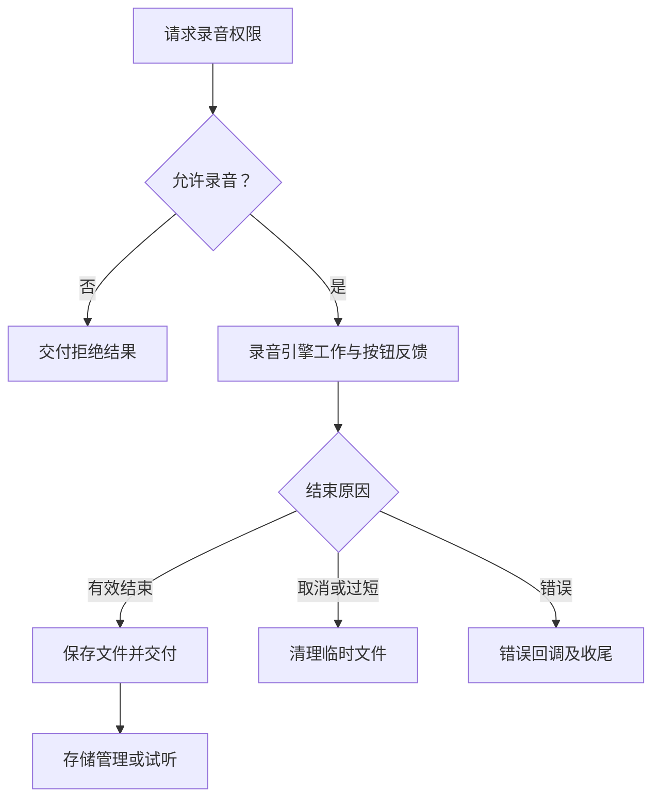

# JobsAudioRecorder

> 中文架构入口：[架构脉络与关键设计](#jobs-architecture)。

录音与本地音频管理组件。Core 分为录音引擎、文件仓库、播放器与按住录音按钮；圆形录音快门统一使用微信风格的白色内圆、留白间隔和白色外圈，按住后红色进度沿外圈推进，白色门槛刻度标记最短有效录音位置；达到门槛后松开保存、移出取消，长录音由单例引擎承接前后台录制。

- `JobsAudioRecordButton.minimumValidDuration` 默认 `3` 秒；不足时先走 `onCancel` 删除临时录音，再走 `onTooShort` 交给业务层提示。
- 导火索复用 `JobsFuseAnimation.byFusePressStart(...)` / `byFusePressStop(...)`；门槛位置按 `minimumValidDuration / duration` 自动换算。

## Jobs DSL 调用约定

Pod 内 Jobs 自维护代码统一采用“一镜到底”：同一配置语义的主对象只作为链起点出现一次；子对象通过宿主级 `byXxx` 或配置闭包继续收口。缺少链式入口时，先在低层补齐返回 `Self` 的 DSL，再改调用端。

## 一、架构脉络与关键设计

本节用于用中文快速理解组件，并为按框架重建提供入口；关注职责、运行关系和关键边界，不要求逐行复刻。

### 1.1、设计目的与职责划分

由录音引擎、录音按钮、录音模型与存储、播放引擎分层组成。引擎对接系统音频录制和权限，按钮组织操作与视觉进度，存储层管理成品，播放层负责试听。

### 1.2、运行脉络

获取麦克风权限 → 启动录音 → 用户结束、取消或到达上限 → 保存有效录音 → 按需试听或管理文件

下图用于说明主要关系；异常、退出与线程边界结合下一节阅读。

### 1.3、关键设计与边界

- 结束保存与取消丢弃是不同出口，错误或中断也必须回报，不能都当成录音成功。
- minimumValidDuration 与最大时长是两个约束，进度上的门槛位置按最小时长与总时长比例表达。
- 按钮动效依赖 JobsFuseAnimation，节拍依赖 JobsSwiftTimer；视觉倒计时不应取代录音引擎的实际结果。
- 宿主负责用途说明及业务上传，录音文件生成不等于已发送。

### 1.4、阅读与重建顺序

先读 Recording 模型与 RecorderEngine，再看 RecordButton 如何协调结果、时长和动效，最后看 Store 与 PlayerEngine。

源码定位（路径以本 README 所在目录为基准；只带走 README 时，可把文件名作为职责定位线索）：

- [Core/JobsAudioPlayerEngine.swift](<./Core/JobsAudioPlayerEngine.swift>)
- [Core/JobsAudioRecorderEngine.swift](<./Core/JobsAudioRecorderEngine.swift>)
- [Core/JobsAudioRecordButton.swift](<./Core/JobsAudioRecordButton.swift>)
- [Core/JobsAudioRecording.swift](<./Core/JobsAudioRecording.swift>)
- [Core/JobsAudioRecordingStore.swift](<./Core/JobsAudioRecordingStore.swift>)

依赖与编译入口：[JobsAudioRecorder.podspec](<./JobsAudioRecorder.podspec>)。其中显式依赖声明包括 `JobsFuseAnimation`、`JobsSwiftBaseDefines`、`JobsSwiftDSL`、`JobsSwiftTimer`。源码范围、资源及可选 subspec 以这里的声明为准；辅助脚本动态补充的依赖不在上述摘录中展开。
