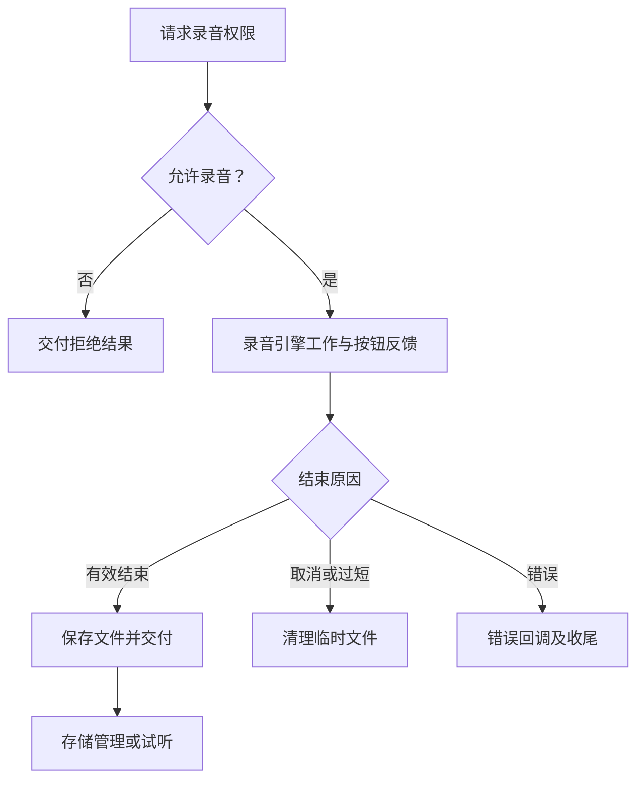

# <span id="前言">JobsAudioRecorder</span>


[toc]

> 中文架构入口：[架构脉络与关键设计](#jobs-architecture)。

录音与本地音频管理组件。Core 分为录音引擎、文件仓库、播放器与按住录音按钮；圆形录音快门统一使用微信风格的白色内圆、留白间隔和白色外圈，按住后红色进度沿外圈推进，白色门槛刻度标记最短有效录音位置；达到门槛后松开保存、移出取消，长录音由单例引擎承接，后台录音需宿主配置音频后台模式。

- `JobsAudioRecordButton.minimumValidDuration` 默认 `3` 秒；不足时先走 `onCancel` 删除临时录音，再走 `onTooShort` 交给业务层提示。
- 导火索复用 `JobsFuseAnimation.byFusePressStart(...)` / `byFusePressStop(...)`；门槛位置按 `minimumValidDuration / duration` 自动换算。

## Jobs DSL 调用约定 <a href="#前言" style="font-size:17px; color:green;"><b>🔼</b></a> <a href="#🔚" style="font-size:17px; color:green;"><b>🔽</b></a>

Pod 内 Jobs 自维护代码统一采用“一镜到底”：同一配置语义的主对象只作为链起点出现一次；子对象通过宿主级 `byXxx` 或配置闭包继续收口。缺少链式入口时，先在低层补齐返回 `Self` 的 DSL，再改调用端。

<a id="jobs-architecture"></a>

## 一、架构脉络与关键设计 <a href="#前言" style="font-size:17px; color:green;"><b>🔼</b></a> <a href="#🔚" style="font-size:17px; color:green;"><b>🔽</b></a>

本节用于用中文快速理解组件，并为按框架重建提供入口；关注职责、运行关系和关键边界，不要求逐行复刻。

### 1.1、设计目的与职责划分 <a href="#前言" style="font-size:17px; color:green;"><b>🔼</b></a> <a href="#🔚" style="font-size:17px; color:green;"><b>🔽</b></a>

由录音引擎、录音按钮、录音模型与存储、播放引擎分层组成。引擎对接系统音频录制和权限，按钮组织操作与视觉进度，存储层管理成品，播放层负责试听。

### 1.2、运行脉络 <a href="#前言" style="font-size:17px; color:green;"><b>🔼</b></a> <a href="#🔚" style="font-size:17px; color:green;"><b>🔽</b></a>

获取麦克风权限 → 启动录音 → 用户结束、取消或到达上限 → 保存有效录音 → 按需试听或管理文件

下图用于说明主要关系；异常、退出与线程边界结合下一节阅读。


```mermaid
flowchart TD
    A["请求录音权限"] --> B{"允许录音？"}
    B -->|否| C["交付拒绝结果"]
    B -->|是| D["录音引擎工作与按钮反馈"]
    D --> E{"结束原因"}
    E -->|有效结束| F["保存文件并交付"]
    E -->|取消或过短| G["清理临时文件"]
    E -->|错误| H["错误回调及收尾"]
    F --> I["存储管理或试听"]
```

### 1.3、关键设计与边界 <a href="#前言" style="font-size:17px; color:green;"><b>🔼</b></a> <a href="#🔚" style="font-size:17px; color:green;"><b>🔽</b></a>

- 结束保存与取消丢弃是不同出口，错误或中断也必须回报，不能都当成录音成功。
- minimumValidDuration 与最大时长是两个约束，进度上的门槛位置按最小时长与总时长比例表达。
- 按钮动效依赖 JobsFuseAnimation，节拍依赖 JobsSwiftTimer；视觉倒计时不应取代录音引擎的实际结果。
- 宿主负责用途说明及业务上传，录音文件生成不等于已发送。

### 1.4、阅读与重建顺序 <a href="#前言" style="font-size:17px; color:green;"><b>🔼</b></a> <a href="#🔚" style="font-size:17px; color:green;"><b>🔽</b></a>

先读 Recording 模型与 RecorderEngine，再看 RecordButton 如何协调结果、时长和动效，最后看 Store 与 PlayerEngine。

源码定位（路径以本 README 所在目录为基准；只带走 README 时，可把文件名作为职责定位线索）：

- [Core/JobsAudioPlayerEngine.swift](<./Core/JobsAudioPlayerEngine.swift>)
- [Core/JobsAudioRecorderEngine.swift](<./Core/JobsAudioRecorderEngine.swift>)
- [Core/JobsAudioRecordButton.swift](<./Core/JobsAudioRecordButton.swift>)
- [Core/JobsAudioRecording.swift](<./Core/JobsAudioRecording.swift>)
- [Core/JobsAudioRecordingStore.swift](<./Core/JobsAudioRecordingStore.swift>)

依赖与编译入口：[JobsAudioRecorder.podspec](<./JobsAudioRecorder.podspec>)。其中显式依赖声明包括 `JobsFuseAnimation`、`JobsByUIKit`、`JobsSwiftBaseDefines`、`JobsSwiftDSL`、`JobsSwiftTimer`。圆形路径使用 JobsByUIKit 的 `UIBezierPath.make(ovalIn:)`。源码范围、资源及可选 subspec 以这里的声明为准；辅助脚本动态补充的依赖不在上述摘录中展开。

## 二、音频会话与结束合同 <a href="#前言" style="font-size:17px; color:green;"><b>🔼</b></a> <a href="#🔚" style="font-size:17px; color:green;"><b>🔽</b></a>

Recorder/Player 公开操作与状态读取统一到主线程执行；后台同步调用会等待主线程，宿主不要让主线程同步等待这些调用者。delegate、权限回调和播放器 onError 在主线程。修改 delegate/onError 也应在主线程。

本模块的所有引擎实例通过 [会话协调器](./Core/JobsAudioSessionCoordinator.swift) 独占音频会话，同时录音/播放会抛出错误；stop 只释放自己的 token，不停掉其它实例。会话使用完后恢复进入模块前的 category/mode/options。宿主其它音频库不受此协调器管理，需集中协调 AVAudioSession；系统无法提供任意第三方会话的激活所有权。

start 验证 prepareToRecord 与 record 的 Bool；toggle 验证 prepareToPlay/play。启动失败清理文件与会话并抛错。maximumDuration 省略表示不限时，显式值必须为有限正数。结束处理未完成时不能再开始录音；delegate 只接受当前 recorder/player 身份，旧实例回调不能清空新会话。取消立即清理并回调一次，编码错误/中断/媒体服务重置通过错误出口结束，不自动恢复麦克风录制。stopAndSave 等待当前录音器完成后返回成品；文件完成不等于已经上传。

## 三、文件、按钮与回归 <a href="#前言" style="font-size:17px; color:green;"><b>🔼</b></a> <a href="#🔚" style="font-size:17px; color:green;"><b>🔽</b></a>

文件名包含时间与 UUID，避免同毫秒碰撞。`preparedURL(mode:)` 创建目录并抛出存储错误；兼容 `makeURL` 只生成路径。Store 保留注入的 FileManager，`recordingsThrowing()` 区分空列表与读取失败，旧 recordings() 保留空列表回退；delete 只允许当前录音目录。海量文件列表仍应在后台读取，宿主可分页呈现。

按钮 duration 必须为有限正数，minimumValidDuration 为有限非负数，单次按住时快照门槛，以实际单调时钟计算长度。重入按下忽略；取消、移出窗口和公开 cancelRecording 终止活动输入，过短先 onCancel 后 onTooShort。支持代码与 coder 初始化。视觉倒计时不能当作录音成功证明。

设备验收覆盖拒绝麦克风权限、prepare/record/play false、连续 stop/start、旧 sender 迟到、取消、来电中断/媒体重置、录音期间试听、目录不可写和同毫秒 URL。使用 Xcode 的 Thread Sanitizer 检查并发调用，设备确认最终文件可播放。后台录音还要求宿主用途说明、后台能力和页面生命周期策略。


## 四、生产交付与全量门禁 <a href="#前言" style="font-size:17px; color:green;"><b>🔼</b></a> <a href="#🔚" style="font-size:17px; color:green;"><b>🔽</b></a>

生产源码排除 Tests / Test、Demo / Example、build / DerivedData、测试入口及临时文件；回归脚本位于宿主 `.github/tests/JobsPodsUpgrade`，不被 Pod 生产 target 编入。

隐私清单通过独立资源 bundle 交付。当前所需理由 API：`SystemBootTime`（35F9.1）、`FileTimestamp`（C617.1）。理由对应本库实际用途；宿主仍需核对业务数据收集、App Group / 用户授权文件等实际使用场景，资源声明与最终 App 内 bundle 都应验收。

从宿主根目录执行当前 Pod 单元验证：

```shell
ruby .github/tests/JobsPodsUpgrade/validate_builds.rb --pods JobsAudioRecorder --skip-host
```

全量命令为 `ruby .github/tests/JobsPodsUpgrade/validate_builds.rb`：逐个自建 Pod 编译成功后才构建宿主 workspace。当前集成验证使用最低部署目标 iOS 15.6 / arm64 Simulator / Swift 5 语言模式；独立 Pod 更低部署目标、动态集成和真机行为需相应消费配置验证。编译日志、JSON 结果及行为回归边界见宿主根目录《JobsByPods升级与编译验收报告.md》，不能用 Parse 或 fixture 的成功替代真实模块 / App 编译。

<a id="🔚" href="#前言" style="font-size:17px; color:green; font-weight:bold;">我是有底线的➤点我回到首页</a>
