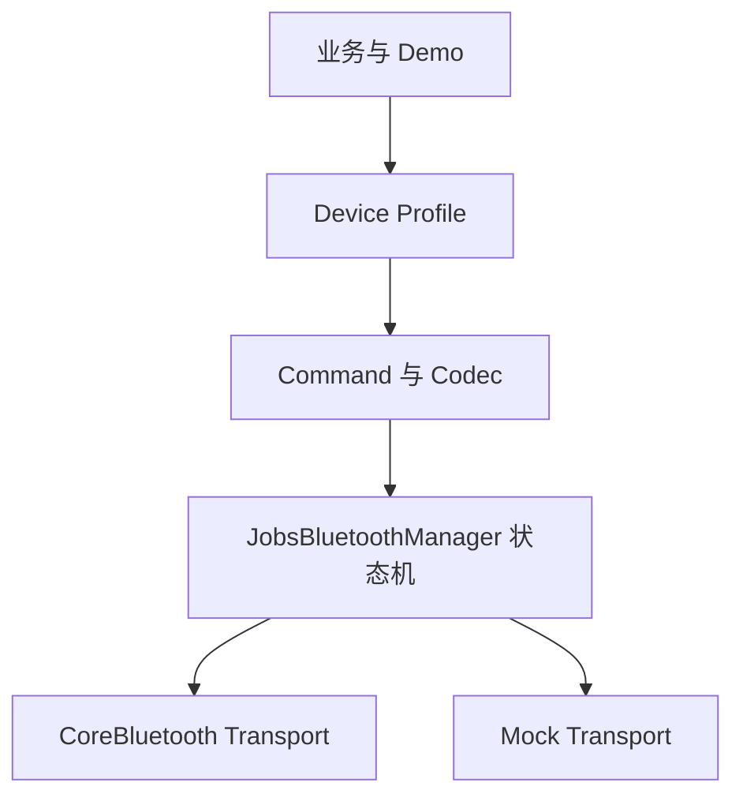

# `JobsBluetooth`


[toc]

> 中文架构入口：[架构脉络与关键设计](#jobs-architecture)。

---

## 🔥 <font id=前言>前言</font>

> `JobsBluetooth` 是面向 [**iOS**](https://developer.apple.com/ios/) BLE 中央设备场景的通用基础设施。它把 [**CoreBluetooth**](https://developer.apple.com/documentation/corebluetooth) 与设备协议、业务 UI 分离，并通过点语法和链式 DSL 完成配置。

## 一、能力边界 <a href="#前言" style="font-size:17px; color:green;"><b>🔼</b></a> <a href="#🔚" style="font-size:17px; color:green;"><b>🔽</b></a>

- 支持扫描、连接、断开、Service / Characteristic 发现、读取、写入和通知。
- 支持设备 Profile、Encoder / Decoder、命令模型以及 Mock Transport。
- 本 Pod 面向 BLE，不承诺任意经典蓝牙、蓝牙音频或未经 MFi 授权的 ExternalAccessory 能力。

## 二、架构

流程图见[架构脉络与关键设计](#jobs-architecture-diagram-1)。

## 三、DSL 快速开始

```swift
let profile = JobsBluetoothProfile()
    .byIdentifier("jobs.sensor")
    .byServiceUUIDStrings(["FFF0"])
    .byWriteUUIDString("FFF1")
    .byNotifyUUIDString("FFF2")
    .byScanTimeout(10)
    .byMaximumReconnectCount(3)

let manager = JobsBluetoothManager(profile: profile)
    .byMockTransport(JobsBluetoothMockTransport().byEnabled(true))
    .onLog { print($0) }

manager.startScan()
```

## 四、线程与生命周期

- 回调默认投递到主队列，可通过 `byCallbackQueue` 指定。
- 业务层只接触不可变外设快照，不直接修改 `CBPeripheral`。
- 配置 DSL 返回当前对象；扫描、连接、发送等终止动作保持真实异步语义。

## 五、权限配置

- App 的 `Info.plist` 至少配置 `NSBluetoothAlwaysUsageDescription`。
- 兼容旧系统时同时配置 `NSBluetoothPeripheralUsageDescription`。
- 后台 BLE 由宿主 App 显式启用 `bluetooth-central`。

## 六、协议扩展

- UUID 与连接策略写入 Profile。
- Encoder 把业务命令转换为字节。
- Decoder 把 Notify 字节转换为业务对象。
- CRC、加密、分包和应答匹配作为独立策略注入。

## 七、Demo 覆盖

Demo 覆盖权限、扫描、过滤、RSSI、连接、多设备、服务发现、Read、Write、Notify、MTU、分包、命令队列、超时、重试、重连、前后台、Profile、Codec、校验、握手、Mock、录制回放、诊断、DSL、OTA 扩展和未知协议占位。

<a id="jobs-architecture"></a>

## 八、架构脉络与关键设计

本节用于用中文快速理解组件，并为按框架重建提供入口；关注职责、运行关系和关键边界，不要求逐行复刻。

### 8.1、设计目的与职责划分

以 Manager 组织 BLE 扫描、单个当前连接、服务特征发现、读写和通知，Profile 描述 UUID 与编解码入口，Command 保存 payload 及扩展参数，MockTransport 提供模拟广告与回显。当前实现是基础传输骨架。

### 8.2、运行脉络

配置 Profile → 扫描并连接 → 发现服务和特征 → 写入 payload 并立即回报提交 → 独立接收 Notify 数据并解码

<a id="jobs-architecture-diagram-1"></a>

原「二、架构」流程图集中于此，原章节的参数说明和示例仍保留。



### 8.3、关键设计与边界

- Command 虽有 timeout、retryCount、priority、responseMatcher 字段，当前 Manager 没有消费这些字段形成命令队列、超时重试或应答匹配；不能把参数预留写成已实现能力。
- 真实发送在调用系统 writeValue 后立即回报空数据成功，不表示设备确认或业务响应成功；Notify 走独立的数据回调。
- Manager 保存多个已发现外设，但只持有一个 connectedPeripheral，不是完整的多连接管理器。
- ready 在发现特征回调中设置，业务还需确认所需特征及握手条件；Mock 回显成功不能替代真实协议验证。
- 原文架构图表达分层意图，Demo 覆盖项不等于每项都在 Core 落地。重建可先完成现有路径，再明确设计队列、分包、重连等扩展。

### 8.4、阅读与重建顺序

先读 Profile、Command 和状态定义，再逐步跟踪 Manager 的 scan/connect/send/Notify，最后看 MockTransport；补扩展时单独定义结束与错误语义。

源码定位（路径以本 README 所在目录为基准；只带走 README 时，可把文件名作为职责定位线索）：

- [Core/JobsBluetoothManager/JobsBluetoothManager.swift](<./Core/JobsBluetoothManager/JobsBluetoothManager.swift>)
- [Core/JobsBluetoothCommand/JobsBluetoothCommand.swift](<./Core/JobsBluetoothCommand/JobsBluetoothCommand.swift>)
- [Core/JobsBluetoothMockTransport/JobsBluetoothMockTransport.swift](<./Core/JobsBluetoothMockTransport/JobsBluetoothMockTransport.swift>)
- [Core/JobsBluetoothPeripheral/JobsBluetoothPeripheral.swift](<./Core/JobsBluetoothPeripheral/JobsBluetoothPeripheral.swift>)
- [Core/JobsBluetoothProfile/JobsBluetoothProfile.swift](<./Core/JobsBluetoothProfile/JobsBluetoothProfile.swift>)

依赖与编译入口：[JobsBluetooth.podspec](<./JobsBluetooth.podspec>)。源码范围、资源及可选 subspec 以这里的声明为准；辅助脚本动态补充的依赖不在上述摘录中展开。

<a id="🔚" href="#前言" style="font-size:17px; color:green; font-weight:bold;">我是有底线的➤点我回到首页</a>
