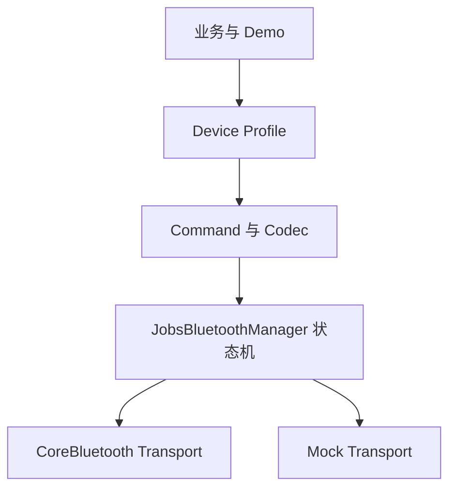

# `JobsBluetooth`


[toc]

---

## 🔥 <font id=前言>前言</font>

> `JobsBluetooth` 是面向 [**iOS**](https://developer.apple.com/ios/) BLE 中央设备场景的通用基础设施。它把 [**CoreBluetooth**](https://developer.apple.com/documentation/corebluetooth) 与设备协议、业务 UI 分离，并通过点语法和链式 DSL 完成配置。

## 一、能力边界 <a href="#前言" style="font-size:17px; color:green;"><b>🔼</b></a> <a href="#🔚" style="font-size:17px; color:green;"><b>🔽</b></a>

- 支持扫描、连接、断开、Service / Characteristic 发现、读取、写入和通知。
- 支持设备 Profile、Encoder / Decoder、命令模型以及 Mock Transport。
- 本 Pod 面向 BLE，不承诺任意经典蓝牙、蓝牙音频或未经 MFi 授权的 ExternalAccessory 能力。

## 二、架构



## 三、DSL 快速开始

```swift
let profile = JobsBluetoothProfile()
    .byIdentifier("jobs.sensor")
    .byServiceUUIDStrings(["FFF0"])
    .byWriteUUIDString("FFF1")
    .byNotifyUUIDString("FFF2")
    .byScanTimeout(10)
    .byMaximumReconnectCount(3)

let manager = JobsBluetoothManager(profile: profile)
    .byMockTransport(JobsBluetoothMockTransport().byEnabled(true))
    .onLog { print($0) }

manager.startScan()
```

## 四、线程与生命周期

- 回调默认投递到主队列，可通过 `byCallbackQueue` 指定。
- 业务层只接触不可变外设快照，不直接修改 `CBPeripheral`。
- 配置 DSL 返回当前对象；扫描、连接、发送等终止动作保持真实异步语义。

## 五、权限配置

- App 的 `Info.plist` 至少配置 `NSBluetoothAlwaysUsageDescription`。
- 兼容旧系统时同时配置 `NSBluetoothPeripheralUsageDescription`。
- 后台 BLE 由宿主 App 显式启用 `bluetooth-central`。

## 六、协议扩展

- UUID 与连接策略写入 Profile。
- Encoder 把业务命令转换为字节。
- Decoder 把 Notify 字节转换为业务对象。
- CRC、加密、分包和应答匹配作为独立策略注入。

## 七、Demo 覆盖

Demo 覆盖权限、扫描、过滤、RSSI、连接、多设备、服务发现、Read、Write、Notify、MTU、分包、命令队列、超时、重试、重连、前后台、Profile、Codec、校验、握手、Mock、录制回放、诊断、DSL、OTA 扩展和未知协议占位。

<a id="🔚" href="#前言" style="font-size:17px; color:green; font-weight:bold;">我是有底线的➤点我回到首页</a>
