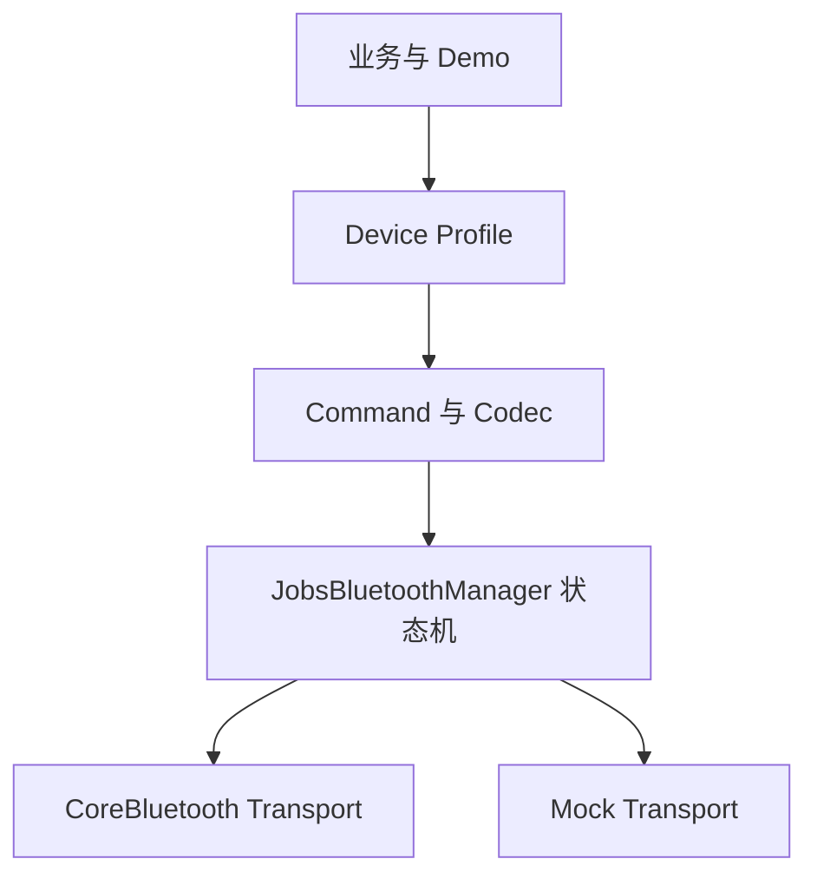

# `JobsBluetooth`


[toc]

> 中文架构入口：[架构脉络与关键设计](#jobs-architecture)。

---

## 🔥 <font id=前言>前言</font>

> `JobsBluetooth` 是面向 [**iOS**](https://developer.apple.com/ios/) BLE 中央设备场景的通用基础设施。它把 [**CoreBluetooth**](https://developer.apple.com/documentation/corebluetooth) 与设备协议、业务 UI 分离，并通过点语法和链式 DSL 完成配置。

## 一、能力边界 <a href="#前言" style="font-size:17px; color:green;"><b>🔼</b></a> <a href="#🔚" style="font-size:17px; color:green;"><b>🔽</b></a>

- 支持扫描、连接、断开、Service / Characteristic 发现、读取、写入和通知。
- 支持设备 Profile、Encoder / Decoder、命令模型以及 Mock Transport。
- 本 Pod 面向 BLE，不承诺任意经典蓝牙、蓝牙音频或未经 MFi 授权的 ExternalAccessory 能力。

## 二、架构 <a href="#前言" style="font-size:17px; color:green;"><b>🔼</b></a> <a href="#🔚" style="font-size:17px; color:green;"><b>🔽</b></a>

流程图见[架构脉络与关键设计](#jobs-architecture-diagram-1)。

## 三、DSL 快速开始 <a href="#前言" style="font-size:17px; color:green;"><b>🔼</b></a> <a href="#🔚" style="font-size:17px; color:green;"><b>🔽</b></a>

```swift
let profile = JobsBluetoothProfile()
    .byIdentifier("jobs.sensor")
    .byServiceUUIDStrings(["FFF0"])
    .byWriteUUIDString("FFF1")
    .byNotifyUUIDString("FFF2")
    .byScanTimeout(10)
    .byMaximumReconnectCount(3)

let manager = JobsBluetoothManager(profile: profile)
    .byMockTransport(JobsBluetoothMockTransport().byEnabled(true))
    .onLog { print($0) }

manager.startScan()
```

## 四、线程与生命周期 <a href="#前言" style="font-size:17px; color:green;"><b>🔼</b></a> <a href="#🔚" style="font-size:17px; color:green;"><b>🔽</b></a>

- 内部状态、CoreBluetooth 调用、队列与截止时间均在主线程。公开操作/状态查询会同步切主线程；宿主不要让主线程等待调用这些操作的后台任务。
- 回调（包含 send completion）默认投递到主队列，可通过 `byCallbackQueue` 指定；它只影响用户回调，不改变内部工作上下文。
- Profile、MockTransport、Command 在主线程配置，send 时快照命令；不要在执行中跨线程修改可变模型。需要改 Profile/Transport 时使用 Manager DSL，它会结束现有扫描/连接/命令。
- 公开回调属性与对应 DSL 的读写统一到主线程；自定义队列回调里的耗时解析不得反向阻塞主线程。
- decoder/matcher 在主线程同步执行，允许重入断连/连接/发送；返回后按连接、命令与尝试身份复核，旧数据不能完成新命令。decoder 内切换连接时不再发布原连接的数据。
- 活跃连接与扫描均属于当前 Manager；释放时取消截止时间/连接并向未完成命令返回 cancelled。
- 业务层只接触不可变外设快照，不直接修改 `CBPeripheral`。
- 配置 DSL 返回当前对象；扫描、连接、发送等终止动作保持真实异步语义。

## 五、权限配置 <a href="#前言" style="font-size:17px; color:green;"><b>🔼</b></a> <a href="#🔚" style="font-size:17px; color:green;"><b>🔽</b></a>

- App 的 `Info.plist` 至少配置 `NSBluetoothAlwaysUsageDescription`。
- 兼容旧系统时同时配置 `NSBluetoothPeripheralUsageDescription`。
- 后台 BLE 由宿主 App 显式启用 `bluetooth-central`。

## 六、协议扩展 <a href="#前言" style="font-size:17px; color:green;"><b>🔼</b></a> <a href="#🔚" style="font-size:17px; color:green;"><b>🔽</b></a>

- UUID 与连接策略写入 Profile。
- Encoder 把业务命令转换为字节。
- Decoder 把 Notify 字节转换为业务对象。
- CRC、加密、设备业务握手、OTA 协议和包重组由设备协议层提供；发送入口消费已经编码的 payload，encoder 为宿主可用的编码策略。
- `allowsChunking` 默认 false，超出协商 MTU 明确失败；只有协议允许连续字节分片时才设 true。库按当前 write type 的 maximumWriteValueLength 分片；不擅自添加包头、序号或 CRC。

## 七、Demo 覆盖 <a href="#前言" style="font-size:17px; color:green;"><b>🔼</b></a> <a href="#🔚" style="font-size:17px; color:green;"><b>🔽</b></a>

Demo 的功能入口包含扫描、RSSI、连接、Read/Write/Notify、Profile/Codec 与 Mock，以及 OTA/未知协议的扩展展示。入口数量不证明存在设备协议实现。Core 管理单个当前连接，多个设备需独立 Manager；不提供固件协议、录制回放、业务鉴权或后台恢复保证。

<a id="jobs-architecture"></a>

## 八、架构脉络与关键设计 <a href="#前言" style="font-size:17px; color:green;"><b>🔼</b></a> <a href="#🔚" style="font-size:17px; color:green;"><b>🔽</b></a>

本节用于用中文快速理解组件，并为按框架重建提供入口；关注职责、运行关系和关键边界，不要求逐行复刻。

### 8.1、设计目的与职责划分 <a href="#前言" style="font-size:17px; color:green;"><b>🔼</b></a> <a href="#🔚" style="font-size:17px; color:green;"><b>🔽</b></a>

以 Manager 组织 BLE 扫描、单个当前连接、服务特征发现、读写和通知，Profile 描述 UUID 与编解码入口，Command 保存 payload 及扩展参数，MockTransport 提供模拟广告与回显。Manager 提供单连接身份、就绪检查与可靠命令队列；设备业务协议由宿主承接。

### 8.2、运行脉络 <a href="#前言" style="font-size:17px; color:green;"><b>🔼</b></a> <a href="#🔚" style="font-size:17px; color:green;"><b>🔽</b></a>

配置 Profile → 扫描/连接与截止时间 → 全部必需服务/特征及通知就绪 → 优先级队列执行 → 写确认/业务应答或错误一次终结

<a id="jobs-architecture-diagram-1"></a>

原「二、架构」流程图集中于此，原章节的参数说明和示例仍保留。


```mermaid
flowchart TD
    A["业务与 Demo"] --> B["Device Profile"]
    B --> C["Command 与 Codec"]
    C --> D["JobsBluetoothManager 状态机"]
    D --> E["CoreBluetooth Transport"]
    D --> F["Mock Transport"]
```

### 8.3、关键设计与边界 <a href="#前言" style="font-size:17px; color:green;"><b>🔼</b></a> <a href="#🔚" style="font-size:17px; color:green;"><b>🔽</b></a>

- 扫描每次有独立 generation 和可取消截止时间，旧扫描不结束新扫描。scanTimeout 有限正数启用截止（最高一天）；0/非法数停用截止。重新扫描会结束已有连接，避免单一状态同时表示 ready/scanning。
- 一个 Manager 只有一个当前连接。A→B 先结束 A、清空特征及命令，收到 A 断开后再连接 B；所有设备回调按当前 peripheral 身份过滤。未知外设返回失败。连接/服务/特征/notify 整个准备阶段受 connectTimeout 约束（默认 12 秒，非有限/非正值使用默认，最高一天）。
- ready 要求 Profile 指定的全部服务存在；所有 service 的特征回调结束后检查 UUID 与 read/write/notify 属性，指定 Notify 默认自动订阅并等待系统确认。ready 不代表设备业务鉴权完成。
- 异常断连/超时最多重连 maximumReconnectCount（0...10，默认 3），退避 1/2/4/8/16 秒，主动 disconnect 不重连；蓝牙关→开恢复 idle，业务决定是否重新扫描/连接。
- 命令队列最多 256 个等待项，同优先级 FIFO，较高 priority 优先；当前命令不被抢占。timeout 必须为有限正数，默认 5 秒，截止最高一天；retryCount 0...10，默认 0。responseMatcher 等待匹配通知/读取响应；没有应答不得回报 applicationResponse。
- 优先 `.withResponse` 并等待 didWrite；只有外设仅支持无响应写时选择 `.withoutResponse` 并等待系统背压允许。写入未完成时发生超时会断开并失败全部队列，避免迟到 ACK 被下一命令误用。应用应答超时可按显式 retryCount 重试；重试可能重复设备动作，payload/matcher 必须带业务事务身份并具备幂等策略。
- `sendReliably` 回报 `submitted`（无响应写已提交）、`writeAcknowledged`（系统写确认）、`applicationResponse`（matcher 匹配的数据）；三者不混淆。旧 send 回报 receipt.data，前两者为空 Data，matcher/Mock 回显有数据。主动断连、Profile切换、通知关闭、释放、超时都终结命令一次。
- Mock 默认开启，不实例化真实 CBCentralManager；固定三个广告标识，latency 可控，dropsResponses/injectedError/responseTransform 可注入丢应答、错误与不匹配数据。Mock 结果只是本地协议演示。

### 8.4、阅读与重建顺序 <a href="#前言" style="font-size:17px; color:green;"><b>🔼</b></a> <a href="#🔚" style="font-size:17px; color:green;"><b>🔽</b></a>

先读 Profile、Command 和状态定义，再逐步跟踪 Manager 的 scan/connect/send/Notify，最后看 MockTransport；补扩展时单独定义结束与错误语义。

源码定位（路径以本 README 所在目录为基准；只带走 README 时，可把文件名作为职责定位线索）：

- [Core/JobsBluetoothManager/JobsBluetoothManager.swift](<./Core/JobsBluetoothManager/JobsBluetoothManager.swift>)
- [Core/JobsBluetoothCommand/JobsBluetoothCommand.swift](<./Core/JobsBluetoothCommand/JobsBluetoothCommand.swift>)
- [Core/JobsBluetoothMockTransport/JobsBluetoothMockTransport.swift](<./Core/JobsBluetoothMockTransport/JobsBluetoothMockTransport.swift>)
- [Core/JobsBluetoothPeripheral/JobsBluetoothPeripheral.swift](<./Core/JobsBluetoothPeripheral/JobsBluetoothPeripheral.swift>)
- [Core/JobsBluetoothProfile/JobsBluetoothProfile.swift](<./Core/JobsBluetoothProfile/JobsBluetoothProfile.swift>)

依赖与编译入口：[JobsBluetooth.podspec](<./JobsBluetooth.podspec>)。源码范围、资源及可选 subspec 以这里的声明为准；辅助脚本动态补充的依赖不在上述摘录中展开。

## 九、回归验收 <a href="#前言" style="font-size:17px; color:green;"><b>🔼</b></a> <a href="#🔚" style="font-size:17px; color:green;"><b>🔽</b></a>

`../../.github/tests/JobsPodsUpgrade/Network/BluetoothRegression.swift` 直接编译真实 Core，使用 Mock 验证扫描重启不受旧截止影响、matcher、丢应答超时/重试、优先级顺序、断连后迟到回显隔离、decoder/matcher 重入后旧响应隔离、释放与取消一次结束。原生 macOS CoreBluetooth 编译与 Mock 回归已通过；不申请系统蓝牙权限，不连接真实设备。工程根执行 `ruby .github/tests/JobsPodsUpgrade/Network/run_regressions.rb --output-dir /tmp/JobsPodsUpgradeNetwork` 可复现并保存日志。

真机仍需验证缺服务/缺特征、多个 service 回调顺序、A→B、旧设备迟到、写入拒绝、超过 MTU、无响应背压、通知订阅失败、蓝牙关开与连接超时。宿主权限、后台 BLE 和设备实际协议必须独立验证。源码包括 [命令回执](./Core/JobsBluetoothCommand/JobsBluetoothCommandReceipt.swift) 与 [队列快照](./Core/JobsBluetoothCommand/JobsBluetoothPendingCommand.swift)。


## 十、生产交付与全量门禁 <a href="#前言" style="font-size:17px; color:green;"><b>🔼</b></a> <a href="#🔚" style="font-size:17px; color:green;"><b>🔽</b></a>

生产源码排除 Tests / Test、Demo / Example、build / DerivedData、测试入口及临时文件；回归脚本位于宿主 `.github/tests/JobsPodsUpgrade`，不被 Pod 生产 target 编入。

隐私清单通过独立资源 bundle 交付。当前所需理由 API：清单内未声明所需理由 API。理由对应本库实际用途；宿主仍需核对业务数据收集、App Group / 用户授权文件等实际使用场景，资源声明与最终 App 内 bundle 都应验收。

从宿主根目录执行当前 Pod 单元验证：

```shell
ruby .github/tests/JobsPodsUpgrade/validate_builds.rb --pods JobsBluetooth --skip-host
```

全量命令为 `ruby .github/tests/JobsPodsUpgrade/validate_builds.rb`：逐个自建 Pod 编译成功后才构建宿主 workspace。当前集成验证使用最低部署目标 iOS 15.6 / arm64 Simulator / Swift 5 语言模式；独立 Pod 更低部署目标、动态集成和真机行为需相应消费配置验证。编译日志、JSON 结果及行为回归边界见宿主根目录《JobsByPods升级与编译验收报告.md》，不能用 Parse 或 fixture 的成功替代真实模块 / App 编译。

<a id="🔚" href="#前言" style="font-size:17px; color:green; font-weight:bold;">我是有底线的➤点我回到首页</a>
