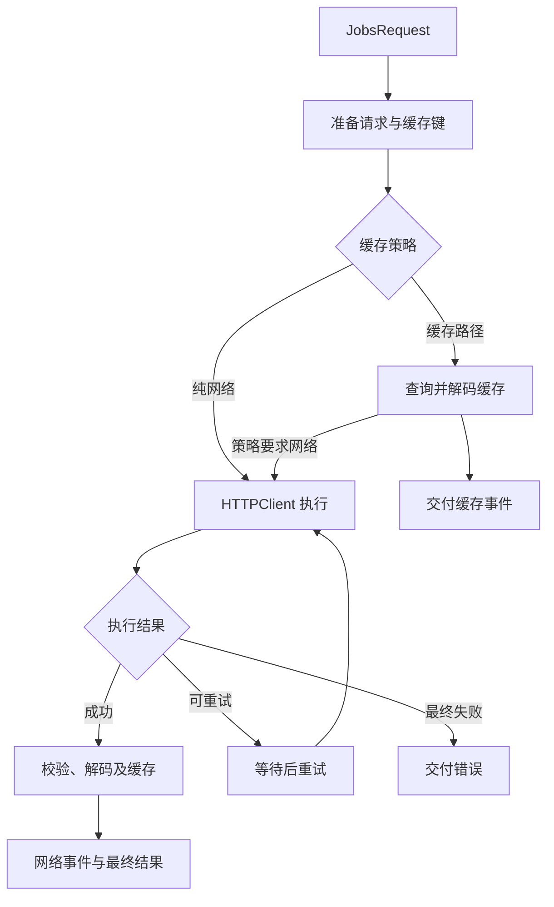

> 中文架构入口：[架构脉络与关键设计](#jobs-architecture)。

## Jobs DSL 调用约定

Pod 内 Jobs 自维护代码统一采用“一镜到底”：同一配置语义的主对象只作为链起点出现一次；子对象通过宿主级 `byXxx` 或配置闭包继续收口。缺少链式入口时，先在低层补齐返回 `Self` 的 DSL，再改调用端。

## 一、架构脉络与关键设计

本节用于用中文快速理解组件，并为按框架重建提供入口；关注职责、运行关系和关键边界，不要求逐行复刻。

### 1.1、设计目的与职责划分

以 JobsRequest 描述请求，JobsAgent 定义发送与观察接口，JobsDefaultAgent 负责准备参数、缓存、重试及解码，HTTPClient 适配 Alamofire。上传下载、异步调用、批量和工作流在外层组合，PromiseKit 是可选适配。

### 1.2、运行脉络

构造请求 → 准备 URL/编码/头 → 按缓存策略选择来源 → 网络执行或重试 → 校验并解码 → 事件流或最终结果

下图用于说明主要关系；异常、退出与线程边界结合下一节阅读。

### 1.3、关键设计与边界

- observe 的事件可能先来自缓存再来自网络，不能把第一次事件一律当最终结果；send 与观察模式的用途需要区分。
- cacheElseLoad 与 staleWhileRevalidate 不同：前者可直接消费缓存，后者还会继续网络刷新；旧别名应按当前映射解释。
- 取消令牌、requestId、重试和异步 continuation 需要共同保证结束语义，取消后不应继续把旧结果当新请求完成。
- 业务 Envelope 解码与 HTTP 传输成功是两层校验，错误要保留来源。
- AF4/AF5 目录保留兼容占位，实际网络实现位于 Core 所包含的文件；不能据目录名生成两套并行网络引擎。

### 1.4、阅读与重建顺序

先读 JobsRequest、JobsAgent 与 JobsCachePolicy，再跟踪 JobsDefaultAgent 的 perform/fetchNetwork/decode，最后看 HTTPClient、Async 和可选适配。

源码定位（路径以本 README 所在目录为基准；只带走 README 时，可把文件名作为职责定位线索）：

- [Request/JobsRequest.swift](<./Request/JobsRequest.swift>)
- [Agent/JobsAgent.swift](<./Agent/JobsAgent.swift>)
- [Agent/JobsDefaultAgent.swift](<./Agent/JobsDefaultAgent.swift>)
- [Agent/HTTPClient.swift](<./Agent/HTTPClient.swift>)
- [Cache/JobsCachePolicy.swift](<./Cache/JobsCachePolicy.swift>)

依赖与编译入口：[JobsNetworking.podspec](<./JobsNetworking.podspec>)。其中显式依赖声明包括 `Alamofire`、`JobsSwiftDSL`、`PromiseKit`。源码范围、资源及可选 subspec 以这里的声明为准；辅助脚本动态补充的依赖不在上述摘录中展开。
