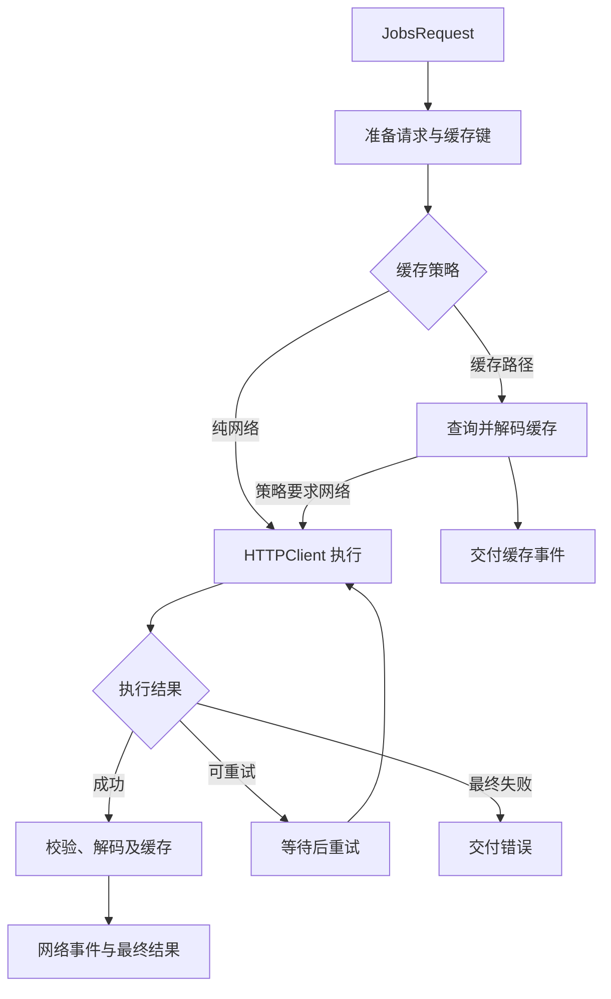

# `JobsNetworking`


[toc]

> 中文架构入口：[架构脉络与关键设计](#jobs-architecture)。


## <span id="前言">Jobs DSL 调用约定 <a href="#前言" style="font-size:17px; color:green;"><b>🔼</b></a> <a href="#🔚" style="font-size:17px; color:green;"><b>🔽</b></a></span>

Pod 内 Jobs 自维护代码统一采用“一镜到底”：同一配置语义的主对象只作为链起点出现一次；子对象通过宿主级 `byXxx` 或配置闭包继续收口。缺少链式入口时，先在低层补齐返回 `Self` 的 DSL，再改调用端。

- Debug 环境入口：`JobsNetworkingDebugEnvironment.shared.byBaseURL(URL?)` 为现有 agent 的后续相对路径请求与上传切换 BaseURL；传 `nil` 恢复各 agent 自身配置。已发出请求、重试与绝对 URL 保持原目标，缓存按最终 URL 区分。此类型和读取分支均只在 Debug 编译，Release 使用原配置；宿主由 [JobsDebugPanel](../JobsDebugPanel@Pods/README.md) 的环境回调接入。

<a id="jobs-architecture"></a>

## 一、架构脉络与关键设计 <a href="#前言" style="font-size:17px; color:green;"><b>🔼</b></a> <a href="#🔚" style="font-size:17px; color:green;"><b>🔽</b></a>

本节用于用中文快速理解组件，并为按框架重建提供入口；关注职责、运行关系和关键边界，不要求逐行复刻。

### 1.1、设计目的与职责划分 <a href="#前言" style="font-size:17px; color:green;"><b>🔼</b></a> <a href="#🔚" style="font-size:17px; color:green;"><b>🔽</b></a>

以 JobsRequest 描述请求，JobsAgent 定义发送与观察接口，JobsDefaultAgent 负责准备参数、缓存、重试及解码，HTTPClient 适配 Alamofire。上传下载、异步调用、批量和工作流在外层组合，PromiseKit 是可选适配。

### 1.2、运行脉络 <a href="#前言" style="font-size:17px; color:green;"><b>🔼</b></a> <a href="#🔚" style="font-size:17px; color:green;"><b>🔽</b></a>

构造请求 → 准备 URL/编码/头 → 按缓存策略选择来源 → 网络执行或重试 → 校验并解码 → 事件流或最终结果

下图用于说明主要关系；异常、退出与线程边界结合下一节阅读。


```mermaid
flowchart TD
    A["JobsRequest"] --> B["准备请求与缓存键"]
    B --> C{"缓存策略"}
    C -->|纯网络| E["HTTPClient 执行"]
    C -->|缓存路径| D["查询并解码缓存"]
    D --> F["交付缓存事件"]
    D -->|策略要求网络| E
    E --> G{"执行结果"}
    G -->|成功| H["校验、解码及缓存"]
    G -->|可重试| I["等待后重试"]
    I --> E
    G -->|最终失败| J["交付错误"]
    H --> K["网络事件与最终结果"]
```

### 1.3、关键设计与边界 <a href="#前言" style="font-size:17px; color:green;"><b>🔼</b></a> <a href="#🔚" style="font-size:17px; color:green;"><b>🔽</b></a>

- observe 的事件可能先来自缓存再来自网络，不能把第一次事件一律当最终结果；send 与观察模式的用途需要区分。
- cacheElseLoad 与 staleWhileRevalidate 不同：前者可直接消费缓存，后者还会继续网络刷新；旧别名应按当前映射解释。
- 取消令牌、requestId、重试和异步 continuation 需要共同保证结束语义，取消后不应继续把旧结果当新请求完成。
- 业务 Envelope 解码与 HTTP 传输成功是两层校验，错误要保留来源。
- AF4/AF5 目录保留兼容占位，实际网络实现位于 Core 所包含的文件；不能据目录名生成两套并行网络引擎。

### 1.4、阅读与重建顺序 <a href="#前言" style="font-size:17px; color:green;"><b>🔼</b></a> <a href="#🔚" style="font-size:17px; color:green;"><b>🔽</b></a>

先读 JobsRequest、JobsAgent 与 JobsCachePolicy，再跟踪 JobsDefaultAgent 的 perform/fetchNetwork/decode，最后看 HTTPClient、Async 和可选适配。

源码定位（路径以本 README 所在目录为基准；只带走 README 时，可把文件名作为职责定位线索）：

- [Request/JobsRequest.swift](<./Request/JobsRequest.swift>)
- [Agent/JobsAgent.swift](<./Agent/JobsAgent.swift>)
- [Agent/JobsDefaultAgent.swift](<./Agent/JobsDefaultAgent.swift>)
- [Agent/HTTPClient.swift](<./Agent/HTTPClient.swift>)
- [Cache/JobsCachePolicy.swift](<./Cache/JobsCachePolicy.swift>)

依赖与编译入口：[JobsNetworking.podspec](<./JobsNetworking.podspec>)。其中显式依赖声明包括 `Alamofire`、`JobsSwiftDSL`、`PromiseKit`。源码范围、资源及可选 subspec 以这里的声明为准；辅助脚本动态补充的依赖不在上述摘录中展开。

## 二、请求与参数合同 <a href="#前言" style="font-size:17px; color:green;"><b>🔼</b></a> <a href="#🔚" style="font-size:17px; color:green;"><b>🔽</b></a>

Core 最低 iOS 12，Async 入口最低 iOS 13，传输使用 [**Alamofire**](https://github.com/Alamofire/Alamofire)。path 支持相对 BaseURL 或完整 HTTP/HTTPS URL，必须有主机。timeout 必须为有限正数。JSON/Form/Raw 请求把 query 编码到 URL 的独立通道，JSON/Form 的 body 保留自己的编码，不静默吞掉 query。URL 已有查询项继续保留；query 中数组/布尔遵循 Alamofire URLEncoding。urlQuery 拒绝第二个 body，rawData 拒绝额外结构化 body，multipart 使用 upload。

`JobsValue(Any?)` 保留构造签名，但创建时快照为不可变、可发送的 JSON 树：null、Bool、数字、String、数组、字符串键字典；URL/Date/Data 转成字符串/ISO8601/Base64。raw 返回规范化值（null 保持 nil），不再持有任意外部可变对象。非有限数字、超过 64 层嵌套和不支持对象在请求准备时返回 invalidRequest；validationError 可提前检查。修改原 NSMutableArray/Dictionary 不改变已创建值。JobsEnvelope 仅在 Payload: Sendable 时符合 Sendable；同步 Decodable 调用保留。

## 三、执行、取消与回调 <a href="#前言" style="font-size:17px; color:green;"><b>🔼</b></a> <a href="#🔚" style="font-size:17px; color:green;"><b>🔽</b></a>

每次发送有独立内部 operationID，与业务 trace.requestId 分开；复用同一个 JobsRequest 并发发送也各自取消和登记。取消令牌受锁保护、幂等，先取消后注册 handler 仍执行；完成与取消争抢一个终态。每个待重试 work item 有独立 generation，替换/取消/完成会使旧登记失效，旧 item 不清空新 item；取消撤销待重试任务、取消已注册 transport，禁止取消后的后续重试发包，最终 completion 恰好一次。成功终态提交后再取消是无操作。执行链持有必要 agent 直到完成，避免调用方释放 agent 后静默丢失 completion。

Async 桥接使用受锁保护的 continuation/token box，锁只保护终态/token/continuation 及一次性交付，不使任意可变 Value 自动安全跨 actor；异步调用方应优先使用 Sendable 响应模型，现有泛型签名兼容保留。任务提前取消、同步完成、令牌返回前取消都一次结束；不要求底层 callback 在取消后再回来才结束 Task。observe 可有 cache/network 多事件，但 completion 只有一次；Stream 终止取消底层令牌。

公共回调执行上下文保持入口语义：缓存/参数错误可能在调用栈内返回，普通请求/上传的 Alamofire 响应默认主队列，下载的文件校验/摘要与成功安装在 utility 工作队列回调，取消在调用 cancel 的上下文返回，延时重试在工作队列发起；调用方需要固定队列时自行调度。Model/config/hooks 的配置必须在共享前完成，JSONDecoder 自定义策略/observer/logger/headerHook 内部线程安全由提供者负责，不跨线程变更 decoder。并行 Batch tasks 使用 @Sendable，原 chain 保留顺序处理与任意 Value，步骤之间检查 Task 取消。

重试 maxRetries 收口 0...100，取消绝不重试；默认只重试 GET/HEAD/PUT/DELETE 的 transport/5xx。初始延迟、增长、jitter 与 customDecider 的延迟做有限数/非负规范，最长一天；customDecider 同样服从最大次数。PUT/DELETE 重试可能重复业务副作用，接口必须明确幂等性。

## 四、缓存身份与容量 <a href="#前言" style="font-size:17px; color:green;"><b>🔼</b></a> <a href="#🔚" style="font-size:17px; color:green;"><b>🔽</b></a>

缓存键采用带类型的规范 JSON、递归排序与 SHA256，纳入实际 URL、query/body、rawBody、编码、非追踪请求头、version、userScope。String/数字、null/空字符串与不同原始字节不会复用；正文中 &/= 不影响身份。认证/租户仍应通过显式 userScope 隔离。业务追踪头不作为缓存身份。键不把 token/正文原文写进磁盘文件名。

内建 DiskCache 使用固定 64 字符摘要 + `.cache` 文件名，namespace 保持在缓存根内，长 namespace 使用摘要。写入原子化；读取前检查普通文件、符号链接与文件字节数，超过当前预算或损坏的项删除并返回 miss，避免小预算重建后读入旧大项和反复解码坏 JSON。读取/写入/清理错误通过 init 的 onError 回调观察（锁外执行）；默认缓存故障不导致网络业务失败。缓存身份格式变化允许冷启动，不迁移旧临时缓存。

默认 MemoryCache 256 项/10 MiB，DiskCache 500 项/100 MiB，按最近访问淘汰；构造可设置上限（至少 1）。过期值保留 staleGrace（默认 300 秒，0...一天），普通 get 不返回过期值，SWR 可读取宽限期内旧值并始终刷新网络，超宽限删除。第三方 JobsCacheStore 的新读取方法有默认实现，既有 conformance 不需修改；要支持 stale 则实现 `get(key:allowExpired:)`。缓存 TTL 非有限/非正不写，最长一年。同步磁盘接口可能等待 IO，大体量场景应测首屏耗时并使用合适 store。

Memory 字节预算只计正文 `data.count`；Disk 字节预算计 JSON/base64 及元数据编码后的文件长度。Disk 每次成功 set 后按 namespace 总数/总文件字节淘汰，get 校验并删除当前超预算项；新建小预算实例不会立即清理其他未读取的旧项。锁只保护同一个 store 实例，不提供同 namespace 多实例或跨进程的全局事务硬上限；共享 namespace 时应统一 store 与预算。预算限制缓存容量，不限制请求/响应总量或所有临时内存。

## 五、上传与下载 <a href="#前言" style="font-size:17px; color:green;"><b>🔼</b></a> <a href="#🔚" style="font-size:17px; color:green;"><b>🔽</b></a>

上传先校验所有指定文件为可打开的可读普通文件；任何必需文件缺失时返回 invalidRequest，网络请求数为 0。fileURL multipart 交给 Alamofire 按其内存阈值/临时文件编码，不把所有附件提前读成 Data；Data 附件保持兼容。请求生命周期内宿主应保留附件，若预检后被移除，底层编码返回失败。结构化 form 用 JSON 编码，String 保留 UTF-8 文本；不发送 Swift 字典描述。

下载只写本次同目录唯一临时文件。在 utility 队列校验 2xx、可适用的 Content-Length、可选 expectedByteCount/expectedSHA256 后争抢提交终态，分块摘要过程中也检查取消并替换最终文件。取消在终态提交前胜出时不安装；成功提交后 cancel 无操作。失败/截断/摘要不符不覆盖旧文件，临时文件清理。expectedByteCount 为非负字节数，SHA256 为 64 位十六进制；没有期望摘要时只验证传输层，不声称了解业务文件内容。系统透明内容解码时不把压缩 Content-Length 当解码后长度。

```swift
let request = JobsDownloadRequest(
    absoluteURL: downloadURL,
    destinationURL: localURL,
    expectedByteCount: expectedBytes,
    expectedSHA256: trustedDigest
)
agent.download(request) { result in
    // digest 应来自可信业务元数据；成功 URL 指向最终文件。
    handle(result)
}
```

默认日志不输出响应正文，错误对象仍携带原 Data 供业务按需诊断；日志路径不含 query。业务自定义日志仍需自行控制敏感字段。

## 六、回归入口与证据边界 <a href="#前言" style="font-size:17px; color:green;"><b>🔼</b></a> <a href="#🔚" style="font-size:17px; color:green;"><b>🔽</b></a>

在工程根执行：

```sh
ruby .github/tests/JobsPodsUpgrade/Network/run_regressions.rb --output-dir /tmp/JobsPodsUpgradeNetwork
```

入口允许 `--repo-root`、`--output-dir`、`--timeout-seconds`（单命令默认 600 秒），SWIFTC 环境变量可指定编译器，日志与 results.json 保存于指定临时输出目录；不运行 pod install/xcodebuild，不改变用户缓存/录音，不访问外部网络。依赖 macOS Swift 工具链及工程已安装的 Alamofire 源码。

回归使用真实生产源码、真实 Alamofire 原生模块与本机 loopback HTTP 服务，覆盖 query/body、404/500/短响应旧文件保护、200 原子安装与 SHA256、不匹配摘要保护、12 MiB 文件 multipart；可控 HTTPClient 覆盖退避取消、重试替换、提前 Task 取消、复用 request 独立取消、缺附件不发包、缓存碰撞/长键/SWR/LRU、小预算重建、坏 JSON 清理、可变入参快照。Swift 6 typecheck 单独覆盖 JobsValue/cache/token/envelope。

NativeDSLFactoryFixture 仅在原生 CLI 测试替代 JSONDecoder.make/byDateDecodingStrategy 两个无业务逻辑入口，避免 UIKit DSL 的 macOS 边界；网络逻辑与 Alamofire未被替换。iOS Pod/宿主构建使用真实 JobsSwiftDSL，不能把原生 CLI 回归当成完整 iOS 模块构建。BLE 回归使用真实 Core 和 Mock，不是真外设；Crypto 回归直接编译原生算法源码。真机音频/BLE/WebSocket/TLS pinning 与 Thread Sanitizer 另行验收。


## 七、生产交付与全量门禁 <a href="#前言" style="font-size:17px; color:green;"><b>🔼</b></a> <a href="#🔚" style="font-size:17px; color:green;"><b>🔽</b></a>

每个显式 subspec 同步继承生产排除集合，避免只消费子模块时带入测试/示例源码。

生产源码排除 Tests / Test、Demo / Example、build / DerivedData、测试入口及临时文件；回归脚本位于宿主 `.github/tests/JobsPodsUpgrade`，不被 Pod 生产 target 编入。

隐私清单在 Core subspec 中通过独立资源 bundle 交付，显式消费 Core、AF5、AF4、Async 或 PromiseKit 入口也会带入清单。当前所需理由 API：`FileTimestamp`（C617.1）。理由对应本库实际用途；宿主仍需核对业务数据收集、App Group / 用户授权文件等实际使用场景，资源声明与最终 App 内 bundle 都应验收。

从宿主根目录执行当前 Pod 单元验证：

```shell
ruby .github/tests/JobsPodsUpgrade/validate_builds.rb --pods JobsNetworking --skip-host
```

全量命令为 `ruby .github/tests/JobsPodsUpgrade/validate_builds.rb`：逐个自建 Pod 编译成功后才构建宿主 workspace。当前集成验证使用最低部署目标 iOS 15.6 / arm64 Simulator / Swift 5 语言模式；独立 Pod 更低部署目标、动态集成和真机行为需相应消费配置验证。编译日志、JSON 结果及行为回归边界见宿主根目录《JobsByPods升级与编译验收报告.md》，不能用 Parse 或 fixture 的成功替代真实模块 / App 编译。

<a id="🔚" href="#前言" style="font-size:17px; color:green; font-weight:bold;">我是有底线的➤点我回到首页</a>
