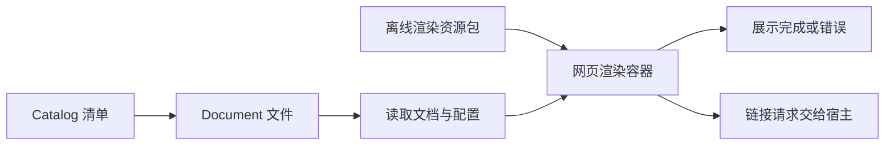

# <span id="前言">JobsSwiftMarkdown</span>


[toc]

> 中文架构入口：[架构脉络与关键设计](#jobs-architecture)。

---

## 一、能力 <a href="#前言" style="font-size:17px; color:green;"><b>🔼</b></a> <a href="#🔚" style="font-size:17px; color:green;"><b>🔽</b></a>

`JobsSwiftMarkdown` 是面向 Jobs Swift 工程的本地 Markdown 渲染 Pod。它使用
`WKWebView` 承载成熟的 Web 解析内核，支持：

- CommonMark / GFM、表格、删除线、任务列表；
- `[toc]`、标题锚点、文档内跳转；
- Objective-C、Swift、Shell 等代码高亮与复制；
- Mermaid、KaTeX；
- 原始 HTML、项目相对图片和其它本地资源；
- 浅色、深色、跟随系统与自定义 CSS；
- UTF-8 文本在原生层与 JavaScript 运行时之间安全传输；
- 构建期文档清单，以及 Markdown 文件之间的链接。

## 二、接入 <a href="#前言" style="font-size:17px; color:green;"><b>🔼</b></a> <a href="#🔚" style="font-size:17px; color:green;"><b>🔽</b></a>

```ruby
pod 'JobsSwiftMarkdown', :path => 'JobsByPods/JobsSwiftMarkdown@Pods'
```

宿主 App 还需要在构建阶段调用 `Support/JobsMarkdownPackager.rb`，把当前仓库的
Markdown 和被引用的本地资源写入 App 内的 `JobsMarkdownDocuments.bundle`。
打包器会主动把 Xcode 非交互 Shell 返回的文件系统路径规范为 UTF-8，中文目录
不会因为构建进程缺少 `LANG` / `LC_ALL` 而导致清单 JSON 生成失败。
脚本只允许把该固定名称 Bundle 写入构建产物目录，并默认跳过 `.git`、`Pods`、
手工第三方、Unity、构建目录和生成报告。

## 三、读取与渲染 <a href="#前言" style="font-size:17px; color:green;"><b>🔼</b></a> <a href="#🔚" style="font-size:17px; color:green;"><b>🔽</b></a>

```swift
let catalog = try JobsMarkdownCatalog.bundled()
let document = catalog.documents[0]
let markdownView = JobsMarkdownView()
markdownView.load(document)
```

文档列表属于宿主 Demo；Pod 只负责清单模型、文件读取与渲染。宿主 Demo 的
详情导航标题跟随当前文档标题，列表点按态使用主题语义背景色。

## 四、第三方内核 <a href="#前言" style="font-size:17px; color:green;"><b>🔼</b></a> <a href="#🔚" style="font-size:17px; color:green;"><b>🔽</b></a>

资源包内原样包含 `markdown-it`、`highlight.js`、`Mermaid`、`KaTeX` 和
`DOMPurify` 的浏览器发行文件。版本与许可证见 `ThirdPartyLicenses`，Jobs 自有
代码不修改这些第三方文件。

## Jobs DSL 调用约定 <a href="#前言" style="font-size:17px; color:green;"><b>🔼</b></a> <a href="#🔚" style="font-size:17px; color:green;"><b>🔽</b></a>

Pod 内 Jobs 自维护代码统一采用“一镜到底”：同一配置语义的主对象只作为链起点出现一次；子对象通过宿主级 `byXxx` 或配置闭包继续收口。缺少链式入口时，先在低层补齐返回 `Self` 的 DSL，再改调用端。

<a id="jobs-architecture"></a>

## 五、架构脉络与关键设计 <a href="#前言" style="font-size:17px; color:green;"><b>🔼</b></a> <a href="#🔚" style="font-size:17px; color:green;"><b>🔽</b></a>

本节用于用中文快速理解组件，并为按框架重建提供入口；关注职责、运行关系和关键边界，不要求逐行复刻。

### 5.1、设计目的与职责划分 <a href="#前言" style="font-size:17px; color:green;"><b>🔼</b></a> <a href="#🔚" style="font-size:17px; color:green;"><b>🔽</b></a>

Catalog 与 Document 管理清单和文件位置，Configuration 管理外观与渲染选项，MarkdownView 通过网页容器展示文档，资源包承载转换、代码高亮、图表、公式及净化运行库。

### 5.2、运行脉络 <a href="#前言" style="font-size:17px; color:green;"><b>🔼</b></a> <a href="#🔚" style="font-size:17px; color:green;"><b>🔽</b></a>

查找文档 → 读取文本及配置 → 加载网页渲染资源 → 完成展示 → 回调链接操作或错误

下图用于说明主要关系；异常、退出与线程边界结合下一节阅读。


```mermaid
flowchart LR
    A["Catalog 清单"] --> B["Document 文件"]
    B --> C["读取文档与配置"]
    D["离线渲染资源包"] --> E["网页渲染容器"]
    C --> E
    E --> F["展示完成或错误"]
    E --> G["链接请求交给宿主"]
```

### 5.3、关键设计与边界 <a href="#前言" style="font-size:17px; color:green;"><b>🔼</b></a> <a href="#🔚" style="font-size:17px; color:green;"><b>🔽</b></a>

- 文件定位、文本转换、网页加载分属不同阶段，应保留各自错误出口。
- 离线显示依赖完整资源包与清单约定，仅复制 [**Swift**](https://www.swift.org/) 视图类不够。
- 链接打开请求通过 delegate 交给宿主，不应默认任意 URL 都可直接执行。
- 第三方浏览器发行文件和许可证保持原样，本库重建范围是 Jobs 的目录组织与原生适配。

### 5.4、阅读与重建顺序 <a href="#前言" style="font-size:17px; color:green;"><b>🔼</b></a> <a href="#🔚" style="font-size:17px; color:green;"><b>🔽</b></a>

先读 Catalog/Document，再看 Configuration 和 View 的加载、桥接与 delegate，最后核对资源及访问边界。

源码定位（路径以本 README 所在目录为基准；只带走 README 时，可把文件名作为职责定位线索）：

- [Core/JobsMarkdownConfiguration.swift](<./Core/JobsMarkdownConfiguration.swift>)
- [Core/JobsMarkdownView.swift](<./Core/JobsMarkdownView.swift>)
- [Core/JobsMarkdownCatalog.swift](<./Core/JobsMarkdownCatalog.swift>)
- [Core/JobsMarkdownDocument.swift](<./Core/JobsMarkdownDocument.swift>)

依赖与编译入口：[JobsSwiftMarkdown.podspec](<./JobsSwiftMarkdown.podspec>)。其中显式依赖声明包括 `JobsSwiftDSL`、`JobsSwiftBaseDefines`、`SnapKit`。源码范围、资源及可选 subspec 以这里的声明为准；辅助脚本动态补充的依赖不在上述摘录中展开。

## 六、使用合同与边界 <a href="#前言" style="font-size:17px; color:green;"><b>🔼</b></a> <a href="#🔚" style="font-size:17px; color:green;"><b>🔽</b></a>

- 文档读取在后台执行，以 renderID 识别最新请求；旧文件读取、导航、JavaScript 完成和桥接消息不会覆盖新文档。网页加载失败和内容进程终止都有 delegate 错误出口。
- `allowsRemoteContent = false` 同时使用 WebKit 内容规则、离线 CSP 与插入前清理，覆盖 HTTP(S) 图片、协议相对 URL、srcset、iframe、CSS import / url 和自定义 CSS。允许网络时仍保留脚本、连接、对象与表单的默认 CSP 限制。
- 第三方解析器、高亮、Mermaid、KaTeX 和净化内核均从资源包本地加载，远程脚本不获得执行权限。原始 HTML 与自定义 CSS 仍需按业务信任范围选择配置。
- 只接受主框架 file URL 页面的桥接消息，除初始化信号外都携带当前 renderID。锚点通过 JSON 字符串字面量传入 JavaScript，引号、反斜杠、换行和非法百分号不会破坏脚本。
- `fontScale` 使用有限的 `0.75...2` 范围，非法值回退到 1；同样会在实际 render 时复核被修改的配置。
- `load(document)` 的文件读取与展示为异步过程，使用 delegate 接收最终渲染与错误，不能在调用返回时假定内容已显示。


## 七、生产交付与全量门禁 <a href="#前言" style="font-size:17px; color:green;"><b>🔼</b></a> <a href="#🔚" style="font-size:17px; color:green;"><b>🔽</b></a>

生产源码排除 Tests / Test、Demo / Example、build / DerivedData、测试入口及临时文件；回归脚本位于宿主 `.github/tests/JobsPodsUpgrade`，不被 Pod 生产 target 编入。

本次没有为未使用所需理由 API 的模块机械添加空隐私清单；业务用途变化后再按实际调用核对。

从宿主根目录执行当前 Pod 单元验证：

```shell
ruby .github/tests/JobsPodsUpgrade/validate_builds.rb --pods JobsSwiftMarkdown --skip-host
```

全量命令为 `ruby .github/tests/JobsPodsUpgrade/validate_builds.rb`：逐个自建 Pod 编译成功后才构建宿主 workspace。当前集成验证使用最低部署目标 iOS 15.6 / arm64 Simulator / Swift 5 语言模式；独立 Pod 更低部署目标、动态集成和真机行为需相应消费配置验证。编译日志、JSON 结果及行为回归边界见宿主根目录《JobsByPods升级与编译验收报告.md》，不能用 Parse 或 fixture 的成功替代真实模块 / App 编译。

<a id="🔚" href="#前言" style="font-size:17px; color:green; font-weight:bold;">我是有底线的➤点我回到首页</a>
