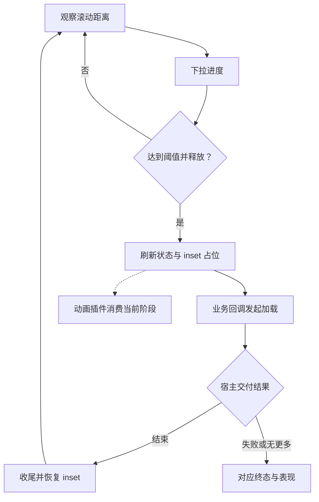

# `JobsSwiftRefresher`

## JobsFuseAnimation 插件热插拔

`JobsSwiftRefresher` 只持有状态机和动画槽位；具体表现由 `JobsFuseAnimation` 的 `JobsRefreshAnimatorProtocol` 提供。系统菊花、单图、多图定时轮播、GIF、Lottie、今日头条和抖音都是同级插件。配置阶段可以直接注入，挂载后也可以原位替换，不会重建或打断当前刷新状态。

```swift
scrollView.byRefreshHeader(
    animator: JobsTodayNewsRefreshView(config: JobsTodayNewsRefreshConfig()),
    container: self,
    height: 72,
    trigger: 64
) {
    // 刷新任务
}

scrollView.byReplaceRefreshAnimator(
    JobsDouyinRefreshView(config: JobsDouyinRefreshConfig()),
    at: .header
)
```


[toc]

> 中文架构入口：[架构脉络与关键设计](#jobs-architecture)。

## 一、简介

* 开发动机 ➤ 逐步舍弃[**MJRefresh**](https://github.com/CoderMJLee/MJRefresh)
  * 年久失修，不更新维护
  * OC代码，需要上升到纯Swift支持
  * 里面存在很多废弃代码
  * 不兼容[**Lottie**](https://github.com/airbnb/lottie-ios)动画，需要额外开支
  * 不支持水平方向的刷新和拉新
  * 不支持阿拉伯习惯（从右往左）
* 已实现功能
  * 横向 / 纵向的刷新和拉新
  * 支持显示最近一次的刷新的时间
  * 支持静默刷新和拉新  ➤ 隐藏刷新的头部和拉新的尾部
  * 支持[**Lottie**](https://github.com/airbnb/lottie-ios)动画  ➤ 如果没有配置[**Lottie**](https://github.com/airbnb/lottie-ios)动画则回退到普通模式
  * 拉动到触发实际操作的时候，有用户感官反馈
    * 震动反馈 ➤ 可以开启 / 关闭
    * 播放声音 ➤ 支持**文件全名**和**主文件名**
    * 支持 ScrollView 全局配置，也支持 Header / Footer / Left / Right 独立配置

## 二、使用方式

### 1、`UITableView`（演示垂直）

```swift
private lazy var tableView: UITableView = {
    UITableView(frame: .zero, style: .plain)
        .byRowHeight(52)
        .byTableFooterView(UIView())
        .byDataSource(self)
        .byAddTo(view) { [unowned self] make in
            make.top.equalTo(collectionView.snp.bottom)
            make.left.right.equalToSuperview()
            make.bottom.equalTo(view.safeAreaLayoutGuide.snp.bottom)
        }
        .showRefreshHeaderInfo(YES)   // 竖向Header + 横向Left
        .showRefreshFooterInfo(NO)  // 竖向Footer + 横向Right
        .setHeaderLottie(.custom(.init(animationName: "LottieLogo1")))
        .setFooterLottie(.disabled) // 强制 footer 回退菊花（即使全局配置了）
        .setHeaderRefreshFeedback(
            JobsRefreshFeedback(
                enablesHaptics: true,
                soundFileName: "Sound.wav"
            )
        )
        // 下拉刷新 Header
        .byRefreshHeader(component: JobsDefaultHeader(),
                         container: self,
                         trigger: 66) { [weak self] in
            guard let self else { return }
            onMainAsync(self) { vc in
                try? await Task.sleep(nanoseconds: 1_000_000_000)
                self.rows = 20
                self.tableView.byReloadData()
                self.tableView.switchRefreshHeader(to: .normal)
                self.tableView.switchRefreshFooter(to: .normal) // 复位“无更多”
            }
        }
        // 上拉加载 Footer
        .byRefreshFooter(component: JobsDefaultFooter(),
                         container: self,
                         trigger: 66) { [weak self] in
            guard let self else { return }
            onMainAsync(self) { vc in
                try? await Task.sleep(nanoseconds: 1_000_000_000)
                if self.rows < 60 {
                    self.rows += 20
                    self.tableView.byReloadData()
                    self.tableView.switchRefreshFooter(to: .normal)
                } else {
                    self.tableView.switchRefreshFooter(to: .noMoreData)
                }
            }
        }
}()
```

### 2、`UICollectionView`（演示水平）collectionView

```swift
private lazy var collectionView: UICollectionView = {
    UICollectionView(frame: .zero, collectionViewLayout: hLayout)
        .byDataSource(self)
        .byDelegate(self)
        .byRegisterCell(HCell.self)
        .byBackgroundView(nil)
        .byShowsHorizontalScrollIndicator(false)
        .byAlwaysBounceHorizontal(true)// 即使不满一屏也允许左右拉
        .byAddTo(view) { [unowned self] make in
            make.left.right.equalToSuperview()
            make.height.equalTo(topHeight)
            if view.jobs_hasVisibleTopBar() {
                make.top.equalTo(self.gk_navigationBar.snp.bottom).offset(10)
            } else {
                make.top.equalTo(view.safeAreaLayoutGuide.snp.top)
            }
        }
				.showRefreshHeaderInfo(NO)   // 竖向Header + 横向Left
				.showRefreshFooterInfo(YES)  // 竖向Footer + 横向Right
        .setLeftLottie(.custom(.init(animationName: "9squares_AlBoardman")))
        .setRightLottie(.inherit)     // 继承全局（没有全局就回退菊花）
        .enableRefreshHaptics(true)
        .setRefreshSound("Sound.wav") 
        // 左侧拉：比如“上一页/回退”
        .bySideRefresh(with: JobsDefaultLeftRefresher(),
                           container: self,
                           at: .left,
                           trigger: 70) { [weak self] in
            guard let self else { return }
            onMainAsync(self) { vc in
                try? await Task.sleep(nanoseconds: 900_000_000)
                // 模拟“刷新完成”：减少一个 item 并刷新
                self.hItems = max(8, self.hItems - 1)
                self.collectionView.byReloadData()
                self.collectionView.switchSideRefresh(.left, to: .normal)
            }
       }
       // 右侧拉：比如“下一页/加载更多卡片”
       .bySideRefresh(with: JobsDefaultRightRefresher(),
                          container: self,
                          at: .right,
                          trigger: 70) { [weak self] in
           guard let self else { return }
           onMainAsync(self) { vc in
               try? await Task.sleep(nanoseconds: 900_000_000)
               self.hItems += 3
               self.collectionView.byReloadData()
               self.collectionView.switchSideRefresh(.right, to: .normal)
           }
       }
}()
```

## 三、未尽事宜

* 需要支持阿拉伯方式，即：
  * 从左到右拉 ➤ 拉新
  * 从右往左拉 ➤ 刷新

## 四、其他

* 附：[⏬ **Lottie** 动画文件下载](https://lottiefiles.com/)
* [演示**Demo**](https://github.com/JobsKits/JobsSwiftBaseConfigDemo)

## 五、特别鸣谢

* [**MJRefresh**](https://github.com/CoderMJLee/MJRefresh) ➤ 关键词：纵向刷新、**Objc**
* [**XZMRefresh**](https://github.com/xiezhongmin/XZMRefresh) ➤ 关键词：横向刷新、参考[**MJRefresh**](https://github.com/CoderMJLee/MJRefresh)、**Objc**
* [**CollectionViewSideRefresh**](https://github.com/dangercheng/CollectionViewSideRefresh) ➤ **Objc**
* [**DGElasticPullToRefresh**](https://github.com/gontovnik/DGElasticPullToRefresh) ➤ **Swift**
* [**ESPullToRefresh**](https://github.com/eggswift/pull-to-refresh) ➤ **Swift**

## Jobs DSL 调用约定

Pod 内 Jobs 自维护代码统一采用“一镜到底”：同一配置语义的主对象只作为链起点出现一次；子对象通过宿主级 `byXxx` 或配置闭包继续收口。缺少链式入口时，先在低层补齐返回 `Self` 的 DSL，再改调用端。

<a id="jobs-architecture"></a>

## 六、架构脉络与关键设计

本节用于用中文快速理解组件，并为按框架重建提供入口；关注职责、运行关系和关键边界，不要求逐行复刻。

### 6.1、设计目的与职责划分

通过 UIScrollView 扩展挂接代理，在上、下、左、右槽位追踪滚动距离与刷新状态。组件定义状态和表现接口，Proxy 管理阈值、占位 inset 和业务动作，动画容器只适配 JobsFuseAnimation。

### 6.2、运行脉络

挂载槽位 → 观察滚动 → 下拉进度到达就绪 → 释放触发刷新 → 宿主结束或报错 → 恢复 inset 与表现

下图用于说明主要关系；异常、退出与线程边界结合下一节阅读。



### 6.3、关键设计与边界

- idle、pulling、ready、refreshing、ending、failed、disabled、noMore、removed 是不同状态，不能只有开始和停止两个布尔值。
- 刷新占用的 inset 必须在结束、禁用或移除时正确恢复，不能覆盖宿主原有边距。
- 换动画插件应保留当前槽位、阈值和刷新状态，并同步当前阶段，不能重建整个状态机。
- 动画结束不代表请求结束；业务需要显式回报结束、失败或没有更多数据。
- Lottie、GIF 等扩展依赖可能来自可选 subspec，应按使用范围接入。

### 6.4、阅读与重建顺序

先读 Enums 与 UIScrollView 入口，再看 Proxy 的观察、状态和 inset，最后读 Component 与 AnimatorContainerView。

源码定位（路径以本 README 所在目录为基准；只带走 README 时，可把文件名作为职责定位线索）：

- [JobsRefreshAnimatorContainerView.swift](<./JobsRefreshAnimatorContainerView.swift>)
- [UIScrollView+JobsSwiftRefresher.swift](<./UIScrollView+JobsSwiftRefresher.swift>)
- [JobsRefreshComponent.swift](<./JobsRefreshComponent.swift>)
- [JobsRefreshDefaultSkins.swift](<./JobsRefreshDefaultSkins.swift>)
- [JobsRefreshEnums.swift](<./JobsRefreshEnums.swift>)

依赖与编译入口：[JobsSwiftRefresher.podspec](<./JobsSwiftRefresher.podspec>)。其中显式依赖声明包括 `SnapKit`、`JobsByUIKit`、`JobsSwiftBaseDefines`、`JobsSwiftBlock`、`JobsSwiftDSL`、`JobsFuseAnimation`、`lottie-ios`、`SDWebImage`。源码范围、资源及可选 subspec 以这里的声明为准；辅助脚本动态补充的依赖不在上述摘录中展开。
