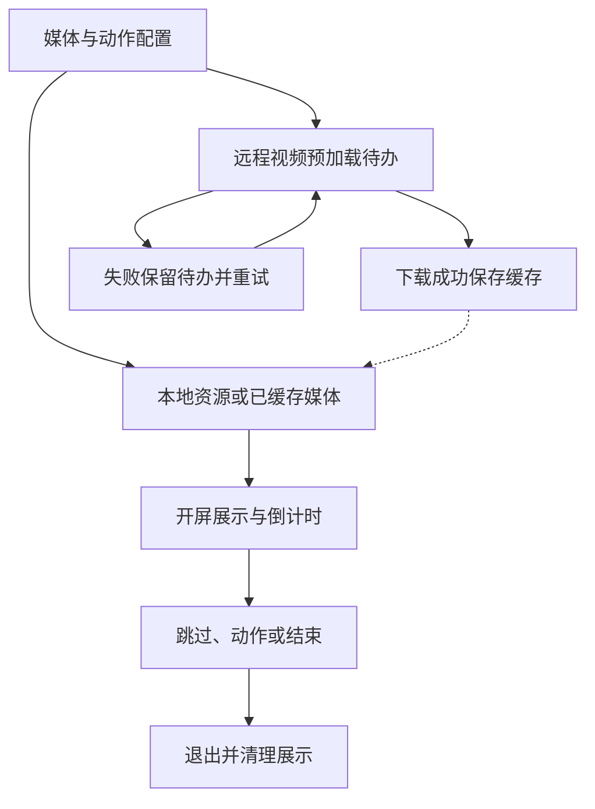

# `JobsSwiftSplash`


[toc]

> 中文架构入口：[架构脉络与关键设计](#jobs-architecture)。

---

## 🔥 <font id=前言>前言</font>

> `JobsSwiftSplash` 是 [**Swift**](https://www.swift.org/) 开屏组件，支持图片、GIF、视频、倒计时跳过和开屏交互行为。

## 一、功能说明 <a href="#前言" style="font-size:17px; color:green;"><b>🔼</b></a> <a href="#🔚" style="font-size:17px; color:green;"><b>🔽</b></a>

- 内容支持本地静态图、本地 GIF、远程图片、本地视频和远程视频。
- 远程视频首次下载到 `Caches/JobsSwiftSplash`，后续直接读取本地缓存。
- 远程视频采用预加载策略：缓存完整时才播放远程文件；未缓存时立即播放配置的本地视频兜底，并在倒计时按钮左侧显示“仅在 Wi-Fi 环境下下载视频”。预加载只允许非蜂窝网络，任务由缓存单例持有，开屏倒计时结束或用户手动移除覆盖层都不会取消；失败后退避重试并跨启动恢复待下载 URL，直到缓存成功。
- 跳过按钮默认显示在安全区右上角，也可以通过 `bySkipButtonFrame` 使用指定 Frame。
- 默认没有倒计时；配置倒计时后，时间结束与用户手动点击都会执行同一套跳过行为。
- 跳过文案默认跟随系统语言，也可以通过 `.code("zh-Hans")` 等语言码固定语言。
- 点击开屏和摇一摇默认通过 `JobsSwiftOpen` 在应用内打开百度，也可以分别替换成自定义闭包或关闭行为。
- 开屏覆盖展示期间会暂停宿主根视图已有的手势，开屏结束后按原状态恢复，避免侧滑抽屉等父级手势穿透触发。
- `JobsSplashPreferences.isEnabledForNextLaunch` 持久化记录下次启动是否展示开屏，首次使用默认为开启。
- `JobsSplashPreferences.contentTypeForNextLaunch` 持久化记录下次启动采用的内容类型，覆盖本地图片、本地 GIF、远程图片、本地视频和远程视频，首次使用默认为本地图片。
- 本 Pod 直接依赖 `JobsSwiftBaseDefines`，系统字体统一由 `JobsFont` 工厂提供。
- Wi-Fi 下载提示与倒计时按钮的位置关系使用 `SnapKit` 约束，Podspec 显式声明直接依赖。

## 二、接入示例 <a href="#前言" style="font-size:17px; color:green;"><b>🔼</b></a> <a href="#🔚" style="font-size:17px; color:green;"><b>🔽</b></a>

```swift
import JobsSwiftSplash
import JobsSwiftOpen

let configuration = JobsSplashConfiguration(
    content: .localImage(name: "Splash")
)
.byCountdownSeconds(5)
.byLanguage(.system)
.bySkipButtonVisible(true)
.byTapAction(.open(JobsOpenConfiguration()))
.byShakeAction(.open(JobsOpenConfiguration().byMode(.externalBrowser)))
.bySkip { _ in
    print("进入首页")
}

JobsSplashPresenter.show(over: homeViewController, configuration: configuration)
```

`JobsSplashPresenter` 把开屏作为首页的子控制器覆盖展示，同时隔离宿主根视图已有手势。点击跳过或倒计时结束后，开屏会被移除，宿主手势按展示前状态恢复，原首页自然显露。

## 三、内容配置 <a href="#前言" style="font-size:17px; color:green;"><b>🔼</b></a> <a href="#🔚" style="font-size:17px; color:green;"><b>🔽</b></a>

```swift
.localImage(name: "Splash")
.localGIF(name: "SplashAnimation")
.localGIF(fileURL: localGIFFileURL)
.remoteImage(URL(string: "https://example.com/splash.jpg")!)
.localVideo(name: "SplashVideo", fileExtension: "mp4")
.remoteVideo(
    URL(string: "https://example.com/splash.mp4")!,
    fallbackName: "SplashVideo",
    fallbackFileExtension: "mp4"
)
```

业务设置页应使用 `JobsSplashContentType.allCases` 完整展示五种内容类型，并把用户选择写入 `JobsSplashPreferences.contentTypeForNextLaunch`；启动入口读取该设置后，再为所选类型提供实际资源名或 URL。Swift Demo 会复用“米老鼠 / 唐老鸭 / 迪斯尼”图片生成本地 GIF 文件，再通过 `.localGIF(fileURL:)` 展示，不依赖额外占位素材。

## 明暗主题契约

- 页面、列表和弹框的普通承载面使用 `JobsCor.systemBackground` / `JobsCor.secondarySystemBackground`，正文、说明和占位文字使用 `JobsCor.label` / `JobsCor.secondaryLabel` / `JobsCor.placeholderText`，确保白天浅底深字、黑夜深底浅字。
- 品牌色、媒体画布、二维码、相机、视频、手写和马赛克内容保留业务色；颜色写入 `CGColor`、`CALayer` 或自绘上下文时，需要在主题 Trait 变化后重新解析和绘制。
- 验证时从 Demo 全局主题入口分别切换白天和黑夜，检查组件的背景、文字、禁用态、占位态与弹出层对比度。

<a id="jobs-architecture"></a>

## 四、架构脉络与关键设计

本节用于用中文快速理解组件，并为按框架重建提供入口；关注职责、运行关系和关键边界，不要求逐行复刻。

### 4.1、设计目的与职责划分

用 Configuration 描述开屏媒体和跳过、点击、摇动等动作，Presenter 负责挂载展示，VC 组织播放及退出，MediaCache 管理远程资源和视频预加载，Preferences 与 Localization 管理独立状态。

### 4.2、运行脉络

配置开屏 → 选择本地资源或缓存 → 挂载展示并计时 → 响应跳过或动作 → 退出展示；预加载任务独立推进

下图用于说明主要关系；异常、退出与线程边界结合下一节阅读。



### 4.3、关键设计与边界

- 展示生命周期与媒体缓存生命周期分离，页面退出不应被理解成所有预加载任务都结束。
- 远程视频使用缓存及预加载策略，下载失败保留待办并退避重试；不能重建成每次进入都直接强制在线播放。
- 倒计时、手势动作和媒体结束可能同时到达，退出路径应保持一次性收尾与宿主状态恢复。
- resumePendingVideoPreloads 当前是空入口，实际恢复逻辑在缓存对象初始化及内部处理，不能按方法名虚构额外恢复行为。
- GIF 帧时长、视频画面模式、跳过按钮布局与语言资源都有独立配置，不应只用一张静态图替代全部类型。

### 4.4、阅读与重建顺序

先读 Configuration 和 Presenter，再看 VC 的展示与关闭，最后追 MediaCache 的持久待办、缓存与重试。

源码定位（路径以本 README 所在目录为基准；只带走 README 时，可把文件名作为职责定位线索）：

- [Core/JobsSplashConfiguration.swift](<./Core/JobsSplashConfiguration.swift>)
- [Core/JobsSplashGIFDecoder.swift](<./Core/JobsSplashGIFDecoder.swift>)
- [Core/JobsSplashLocalization.swift](<./Core/JobsSplashLocalization.swift>)
- [Core/JobsSplashMediaCache.swift](<./Core/JobsSplashMediaCache.swift>)
- [Core/JobsSplashPreferences.swift](<./Core/JobsSplashPreferences.swift>)

依赖与编译入口：[JobsSwiftSplash.podspec](<./JobsSwiftSplash.podspec>)。其中显式依赖声明包括 `JobsInheritance`、`JobsByUIKit`、`JobsSwiftBaseDefines`、`JobsCountdownButton`、`JobsSwiftDSL`、`JobsSwiftOpen`、`SnapKit`。源码范围、资源及可选 subspec 以这里的声明为准；辅助脚本动态补充的依赖不在上述摘录中展开。

<a id="🔚" href="#前言" style="font-size:17px; color:green; font-weight:bold;">我是有底线的➤点我回到首页</a>
