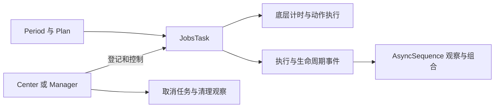

# `JobsSwiftTaskCenter`
> 一个 **强大、灵活、线程安全的 Swift 任务调度框架**，专为 **Apple** 平台设计


[toc]

> 中文架构入口：[架构脉络与关键设计](#jobs-architecture)。

## 一、简介

* **`JobsSwiftTaskCenter`** 提供一套完整的 **任务调度模型 (Task Scheduling
  Model)**，用于在应用中统一管理：
  * 定时任务
  * 延迟任务
  * 重复任务
  * 任务生命周期
  * 执行事件流
  * 并发任务组合

* 底层使用 [**JobsSwiftTimer**]() 提供高精度定时能力，上层负责**任务调度、生命周期管理与执行观察**

## 二、✨ 特性

### 1、完整任务生命周期

* 任务拥有清晰的生命周期：`idle → running → suspended → cancelled / finished`
* 支持：
  * **suspend**
  * **resume**
  * **cancel**
  * **executeNow**
  * 生命周期观察

### 2、`Swift Concurrency` 原生支持

* 完全支持 `Swift Concurrency`

  * `async / await`
  * `AsyncSequence`
  * `structured concurrency`
  * `Sendable`

* 示例：

  ```swift
  await task.waitUntilFinished()
  
  for await execution in task.executions() {
      print(execution)
  }
  ```

### 3、灵活调度策略

**`JobsSwiftTaskCenter`** 支持多种任务调度策略：

| 类型 | 示例 |
|---|---|
| **延迟执行** | `JobsPlan.after(.second * 5)` |
| **指定时间执行** | `JobsPlan.at(date)` |
| **立即执行** | `JobsPlan.now` |
| **定时执行** | `JobsPlan.every(.second)` |
| **限定次数** | `repeatCount` |
| **初始延迟** | `initialDelay` |
| **立即执行一次** | `fireImmediately` |

## 三、🚀 快速开始

``` swift
import JobsSwiftTaskCenter

let task = JobsPlan.after(.second * 2).do {
    print("2 秒后执行")
}
```

------------------------------------------------------------------------

## 四、📄 License

MIT

<a id="jobs-architecture"></a>

## 五、架构脉络与关键设计

本节用于用中文快速理解组件，并为按框架重建提供入口；关注职责、运行关系和关键边界，不要求逐行复刻。

### 5.1、设计目的与职责划分

在计时器之上建立任务计划与集中治理。JobsPeriod/JobsPlan 描述执行间隔，JobsTask 执行动作并维护生命周期，Center 与 Manager 管理实例和标签，执行及状态通过 AsyncSequence 向外观察。

### 5.2、运行脉络

建立计划 → 创建并登记任务 → 按计划执行 → 产出执行或状态事件 → 暂停、取消或自然结束 → 移除观察与任务

下图用于说明主要关系；异常、退出与线程边界结合下一节阅读。



### 5.3、关键设计与边界

- 任务计划、一次执行和整体任务生命周期不同，重复次数结束不能只停止 UI 观察而留下底层计时。
- Center 可给同一实例多个标签，Manager 按任务项和标签提供治理，不能把两者的数据关系混为一个字典。
- 等待、取消和异步完成可能竞争，continuation 必须只恢复一次；锁用于内部状态，不应把任意业务闭包长时间放在锁内。
- filter、map、prefix、window、merge 等执行流组合不等于重新执行原任务，停止订阅与取消任务需要区分。
- 前后台状态接入不代表系统保证后台持续运行，计划时间仍需考虑应用挂起。

### 5.4、阅读与重建顺序

先读 Period/Plan 与 TaskLifecycle，再看 JobsTask 的调度和取消，随后读 Manager/Center，最后读执行流组合。

源码定位（路径以本 README 所在目录为基准；只带走 README 时，可把文件名作为职责定位线索）：

- [JobsTask.swift](<./JobsTask.swift>)
- [JobsTaskManager.swift](<./JobsTaskManager.swift>)
- [JobsTaskManagerExecutionStream.swift](<./JobsTaskManagerExecutionStream.swift>)
- [JobsTaskManagerStatusStream.swift](<./JobsTaskManagerStatusStream.swift>)
- [JobsDropFirstTaskExecutionSequence.swift](<./JobsDropFirstTaskExecutionSequence.swift>)

依赖与编译入口：[JobsSwiftTaskCenter.podspec](<./JobsSwiftTaskCenter.podspec>)。其中显式依赖声明包括 `JobsSwiftTimer`。源码范围、资源及可选 subspec 以这里的声明为准；辅助脚本动态补充的依赖不在上述摘录中展开。
