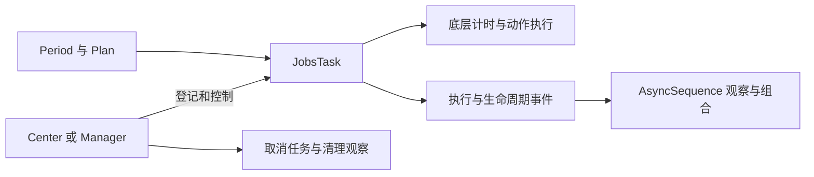

# <span id="前言">`JobsSwiftTaskCenter`</span>


> 一个管理计划、执行与等待生命周期的 **Swift** 任务调度框架，专为 **Apple** 平台设计。内部状态受锁保护，业务 action 遵守调用方自己的并发合同。


[toc]

> 中文架构入口：[架构脉络与关键设计](#jobs-architecture)。

## 一、简介 <a href="#前言" style="font-size:17px; color:green;"><b>🔼</b></a> <a href="#🔚" style="font-size:17px; color:green;"><b>🔽</b></a>

* **`JobsSwiftTaskCenter`** 提供一套完整的 **任务调度模型 (Task Scheduling
  Model)**，用于在应用中统一管理：
  * 定时任务
  * 延迟任务
  * 重复任务
  * 任务生命周期
  * 执行事件流
  * 并发任务组合

* 底层使用 [**JobsSwiftTimer**]() 提供高精度定时能力，上层负责**任务调度、生命周期管理与执行观察**

## 二、✨ 特性 <a href="#前言" style="font-size:17px; color:green;"><b>🔼</b></a> <a href="#🔚" style="font-size:17px; color:green;"><b>🔽</b></a>

### 1、完整任务生命周期 <a href="#前言" style="font-size:17px; color:green;"><b>🔼</b></a> <a href="#🔚" style="font-size:17px; color:green;"><b>🔽</b></a>

* 任务拥有清晰的生命周期：`idle → running → suspended → cancelled / finished`
* 支持：
  * **suspend**
  * **resume**
  * **cancel**
  * **executeNow**
  * 生命周期观察

### 2、`Swift Concurrency` 原生支持 <a href="#前言" style="font-size:17px; color:green;"><b>🔼</b></a> <a href="#🔚" style="font-size:17px; color:green;"><b>🔽</b></a>

* 完全支持 `Swift Concurrency`

  * `async / await`
  * `AsyncSequence`
  * `structured concurrency`
  * `Sendable`

* 示例：

  ```swift
  await task.waitUntilFinished()
  
  for await execution in task.executions() {
      print(execution)
  }
  ```

### 3、灵活调度策略 <a href="#前言" style="font-size:17px; color:green;"><b>🔼</b></a> <a href="#🔚" style="font-size:17px; color:green;"><b>🔽</b></a>

**`JobsSwiftTaskCenter`** 支持多种任务调度策略：

| 类型 | 示例 |
|---|---|
| **延迟执行** | `JobsPlan.after(.second * 5)` |
| **指定时间执行** | `JobsPlan.at(date)` |
| **立即执行** | `JobsPlan.now` |
| **定时执行** | `JobsPlan.every(.second)` |
| **限定次数** | `repeatCount` |
| **初始延迟** | `initialDelay` |
| **立即执行一次** | `fireImmediately` |

## 三、🚀 快速开始 <a href="#前言" style="font-size:17px; color:green;"><b>🔼</b></a> <a href="#🔚" style="font-size:17px; color:green;"><b>🔽</b></a>

``` swift
import JobsSwiftTaskCenter

let task = JobsPlan.after(.second * 2).do {
    print("2 秒后执行")
}
```

------------------------------------------------------------------------

## 四、📄 License <a href="#前言" style="font-size:17px; color:green;"><b>🔼</b></a> <a href="#🔚" style="font-size:17px; color:green;"><b>🔽</b></a>

MIT

<a id="jobs-architecture"></a>

## 五、架构脉络与关键设计 <a href="#前言" style="font-size:17px; color:green;"><b>🔼</b></a> <a href="#🔚" style="font-size:17px; color:green;"><b>🔽</b></a>

本节用于用中文快速理解组件，并为按框架重建提供入口；关注职责、运行关系和关键边界，不要求逐行复刻。

### 5.1、设计目的与职责划分 <a href="#前言" style="font-size:17px; color:green;"><b>🔼</b></a> <a href="#🔚" style="font-size:17px; color:green;"><b>🔽</b></a>

在计时器之上建立任务计划与集中治理。JobsPeriod/JobsPlan 描述执行间隔，JobsTask 执行动作并维护生命周期，Center 与 Manager 管理实例和标签，执行及状态通过 AsyncSequence 向外观察。

### 5.2、运行脉络 <a href="#前言" style="font-size:17px; color:green;"><b>🔼</b></a> <a href="#🔚" style="font-size:17px; color:green;"><b>🔽</b></a>

建立计划 → 创建并登记任务 → 按计划执行 → 产出执行或状态事件 → 暂停、取消或自然结束 → 移除观察与任务

下图用于说明主要关系；异常、退出与线程边界结合下一节阅读。


```mermaid
flowchart LR
    A["Period 与 Plan"] --> B["JobsTask"]
    B --> C["底层计时与动作执行"]
    D["Center 或 Manager"] -->|登记和控制| B
    B --> E["执行与生命周期事件"]
    E --> F["AsyncSequence 观察与组合"]
    D --> G["取消任务与清理观察"]
```

### 5.3、关键设计与边界 <a href="#前言" style="font-size:17px; color:green;"><b>🔼</b></a> <a href="#🔚" style="font-size:17px; color:green;"><b>🔽</b></a>

- 任务计划、一次执行和整体任务生命周期不同，重复次数结束不能只停止 UI 观察而留下底层计时。
- Center 可给同一实例多个标签，Manager 按任务项和标签提供治理，不能把两者的数据关系混为一个字典。
- 等待、取消和异步完成可能竞争，continuation 必须只恢复一次；锁用于内部状态，不应把任意业务闭包长时间放在锁内。
- filter、map、prefix、window、merge 等执行流组合不等于重新执行原任务，停止订阅与取消任务需要区分。
- 前后台状态接入不代表系统保证后台持续运行，计划时间仍需考虑应用挂起。

### 5.4、阅读与重建顺序 <a href="#前言" style="font-size:17px; color:green;"><b>🔼</b></a> <a href="#🔚" style="font-size:17px; color:green;"><b>🔽</b></a>

先读 Period/Plan 与 TaskLifecycle，再看 JobsTask 的调度和取消，随后读 Manager/Center，最后读执行流组合。

源码定位（路径以本 README 所在目录为基准；只带走 README 时，可把文件名作为职责定位线索）：

- [JobsTask.swift](<./JobsTask.swift>)
- [JobsTaskManager.swift](<./JobsTaskManager.swift>)
- [JobsTaskManagerExecutionStream.swift](<./JobsTaskManagerExecutionStream.swift>)
- [JobsTaskManagerStatusStream.swift](<./JobsTaskManagerStatusStream.swift>)
- [JobsDropFirstTaskExecutionSequence.swift](<./JobsDropFirstTaskExecutionSequence.swift>)

依赖与编译入口：[JobsSwiftTaskCenter.podspec](<./JobsSwiftTaskCenter.podspec>)。其中显式依赖声明包括 `JobsSwiftTimer`。源码范围、资源及可选 subspec 以这里的声明为准；辅助脚本动态补充的依赖不在上述摘录中展开。

## 六、使用合同与边界 <a href="#前言" style="font-size:17px; color:green;"><b>🔼</b></a> <a href="#🔚" style="font-size:17px; color:green;"><b>🔽</b></a>

- 等待执行次数返回实际发生的次数；任务提前结束或等待者被取消时，不会把目标次数当作已执行次数。等待者取消会及时退出，并且不会取消底层 `JobsTask`。
- `waitAny` 选出首个终态任务后撤销其余等待者；其余底层任务继续按自身生命周期运行。所有 continuation 只恢复一次。
- 每次执行完成同步 action 快照后唤醒已登记的次数等待者；新登记若发现次数已经达标可立即返回，次数等待不作为通用业务副作用完成屏障。执行序列通过注册的观察 action 产生事件；有限计划的最后一次事件可被 `executions()` 消费，随后才发布自然完成。
- `doAsync` 创建的子任务归属对应 JobsTask。自然 `finished` 等待这些子任务结束；`cancel` 传播取消并立即发布 `cancelled`，业务必须协作处理取消，已进入的清理仍可能继续。
- 同步 action 串行进入，业务回调和生命周期通知都在锁外。空闲时 executeNow 由调用线程立即处理；同一任务正在执行时的重入或并发 executeNow 只登记请求并返回，由当前执行者顺序处理，避免两个任务互相调用时死锁；action 中暂停保留下一时间片，恢复后继续。TaskCenter 对终态任务自动解除登记，不累积历史任务。
- Component 的 tag 读写受锁保护，整数秒转毫秒在溢出时饱和到受支持的时间范围。
- 自定义 Plan iterator 在同步状态事务中生成下一时间片，应只生成 `JobsPeriod`，不重入对应任务或等待其它需要该实例的操作。
- `JobsPeriod` 接受有限的 `0...1_000_000_000` 秒；非法时间归零。异步执行序列默认保留完整事件，长期高速流的消费与内存预算由调用方评估。


## 七、生产交付与全量门禁 <a href="#前言" style="font-size:17px; color:green;"><b>🔼</b></a> <a href="#🔚" style="font-size:17px; color:green;"><b>🔽</b></a>

生产源码排除 Tests / Test、Demo / Example、build / DerivedData、测试入口及临时文件；回归脚本位于宿主 `.github/tests/JobsPodsUpgrade`，不被 Pod 生产 target 编入。

本次没有为未使用所需理由 API 的模块机械添加空隐私清单；业务用途变化后再按实际调用核对。

从宿主根目录执行当前 Pod 单元验证：

```shell
ruby .github/tests/JobsPodsUpgrade/validate_builds.rb --pods JobsSwiftTaskCenter --skip-host
```

全量命令为 `ruby .github/tests/JobsPodsUpgrade/validate_builds.rb`：逐个自建 Pod 编译成功后才构建宿主 workspace。当前集成验证使用最低部署目标 iOS 15.6 / arm64 Simulator / Swift 5 语言模式；独立 Pod 更低部署目标、动态集成和真机行为需相应消费配置验证。编译日志、JSON 结果及行为回归边界见宿主根目录《JobsByPods升级与编译验收报告.md》，不能用 Parse 或 fixture 的成功替代真实模块 / App 编译。

<a id="🔚" href="#前言" style="font-size:17px; color:green; font-weight:bold;">我是有底线的➤点我回到首页</a>
