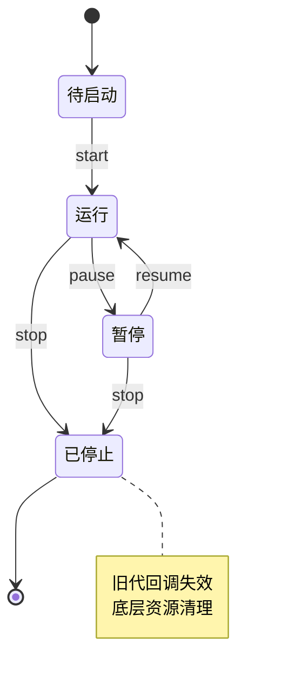

# ⏰ `JobsSwiftTimer`


[toc]

> 中文架构入口：[架构脉络与关键设计](#jobs-architecture)。

---

## 🔥 <font id=前言>前言</font>

> `JobsSwiftTimer` 统一四种定时器内核，并负责线程亲和、回调防穿透和应用活跃态治理。

## 一、定位

`JobsSwiftTimer` 用 `JobsSwiftTimerProtocol` 统一四种定时器内核，并把回调队列、前后台策略与生命周期语义收口到 `JobsTimer`。

| 内核 | `JobsTimerKind` | 线程要求 | 典型场景 |
| ---- | ---- | ---- | ---- |
| GCD | `.gcd` | 生命周期可在任意线程调用 | 后台轮询、非 UI 调度 |
| Foundation | `.foundation` | 创建及生命周期操作必须在主线程 | 常规 UI 定时 |
| DisplayLink | `.displayLink` | 创建及生命周期操作必须在主线程 | 与屏幕刷新同步的视觉更新 |
| CFRunLoopTimer | `.runLoop` | 创建及生命周期操作必须在主线程 | 明确依赖 RunLoop 的场景 |

非 GCD 内核当前只支持 `RunLoop.main`；`runLoopMode` 推荐使用 `.common`。

## 二、基础用法

```swift
import JobsSwiftTimer

private var timer: JobsTimer?

func startTimer() {
    let config = JobsSwiftTimerConfig(
        interval: 1,
        repeats: true,
        tolerance: 0.1,
        queue: .main,
        runLoop: .main,
        runLoopMode: .common,
        pauseInBackground: true,
        autoManageAppState: true
    )

    timer?.stop()
    timer = JobsTimer(kind: .foundation, config: config) {
        // 更新 UI
    }
    timer?.start()
}
```

`JobsSwiftTimerConfig` 会把非有限的 `interval` 回退到 `1` 秒，把有效间隔限制为至少 `0.000001` 秒；非有限的 `tolerance` 回退到 `0`，有效值限制在 `0...interval`。

## 三、一次性任务

```swift
let config = JobsSwiftTimerConfig(
    interval: 0.5,
    repeats: false,
    queue: .main
)

let timer = JobsTimer(kind: .gcd, config: config) {
    print("tick")
}.onFinish {
    print("finish")
}.start()
```

一次性任务先进入终态并销毁底层引擎，再在同一回调队列中依次执行 `tick`、`finish`，避免重复触发和完成顺序漂移。

## 四、生命周期保证

- `start`、`pause`、`resume`、`fireOnce`、`stop` 由生命周期锁串行化。
- `JobsSwiftTimerProtocol.requiresMainThreadLifecycle` 公开生命周期执行上下文；自定义实现默认按主线程路由，Manager 不再依赖具体类型强转。
- 每次状态切换都会刷新 generation token；已排队的旧 tick 在执行前会再次校验，`pause` / `stop` 后不会穿透。
- GCD 内核恢复时会同步重绑 event handler，避免继续携带暂停前的 token。
- Foundation `Timer` 使用弱捕获闭包，`CADisplayLink` 使用弱代理，不会通过回调链反向强持有 `JobsTimer`。
- `CFRunLoopTimer` 使用弱捕获的 block API，不保存未托管裸指针。
- `CADisplayLink` 会按 `config.interval` 节流，不再把每一帧都当成一次业务 tick。
- `deinit` 会撤销底层引擎；非 GCD 引擎在主线程完成失效处理。

## 五、前后台策略

```swift
let config = JobsSwiftTimerConfig(
    interval: 2,
    repeats: true,
    queue: .global(qos: .utility),
    pauseInBackground: true,
    autoManageAppState: true
)
```

`pauseInBackground = true` 且 `autoManageAppState = true` 时，应用进入 `.inactive` 或 `.background` 都会自动暂停；只有收到重新活跃通知时，才恢复由应用状态自动暂停的 timer。手动 `pause` 会清除自动恢复资格，因此控制中心、系统弹窗等 inactive→active 路径不会遗留暂停状态，也不会误恢复手动暂停项。

多定时器、页面复用和 identifier 去重场景统一使用 [JobsSwiftTimerMgr](../JobsSwiftTimerMgr@Pods/README.md)。

## 六、验证

```shell
xcrun swiftc -frontend -parse JobsSwiftTimer.swift JobsSwiftTimerConfig.swift JobsSwiftTimerDefs.swift JobsSwiftTimerProtocol.swift
```

```shell
xcodebuild -workspace JobsSwiftBaseConfigDemo.xcworkspace -scheme JobsSwiftTimer -configuration Debug -destination 'generic/platform=iOS Simulator' CODE_SIGNING_ALLOWED=NO build
```

应用测试 target 还覆盖自动暂停恢复、手动暂停保护以及 Manager 替换句柄隔离。

## 七、系统计时机制对比与选型

### 7.1、先统一概念

日常所说的“iOS 系统 Timer”并不是都属于 UIKit：

- `Timer` 位于 [**Foundation**](https://developer.apple.com/documentation/foundation/timer)，Objective-C 名称是 `NSTimer`。
- `DispatchSourceTimer` 位于 [**Dispatch**](https://developer.apple.com/documentation/dispatch/dispatchsourcetimer)。
- `CADisplayLink` 位于 [**QuartzCore**](https://developer.apple.com/documentation/quartzcore/cadisplaylink)。
- `CFRunLoopTimer` 位于 [**Core Foundation**](https://developer.apple.com/documentation/corefoundation/cfrunlooptimer)，并与 `Timer/NSTimer` toll-free bridged。

它们不是同一种计时器的重复写法，而是四种不同的调度模型。它们都不是硬实时机制，也都不会赋予 App 后台保活能力。

### 7.2、四种内核怎么选

| 系统机制 | 调度模型 | 优势 | 代价与风险 | 推荐场景 | `JobsTimerKind` |
| ---- | ---- | ---- | ---- | ---- | ---- |
| `Timer/NSTimer` | 依赖指定线程的 RunLoop 与 Mode | API 简单；适合 UI 低频刷新；支持 `tolerance` 节能 | RunLoop 忙或 Mode 不匹配会延后；不是实时计时器；需处理失效与引用关系 | 轮播、验证码、普通 UI 倒计时 | `.foundation` |
| `DispatchSourceTimer` | 在指定 GCD Queue 上投递事件，不依赖 RunLoop | 可选择串行/并发队列；适合非 UI 调度；`leeway` 可平衡功耗 | suspend/resume/cancel 状态必须配平；仍受 QoS、系统负载和队列阻塞影响 | 心跳、轮询、缓存清理、工作队列节拍 | `.gcd` |
| `CADisplayLink` | 跟随显示刷新周期回调 | 与屏幕刷新协调；提供 `timestamp` / `targetTimestamp`；适配高刷屏 | 实际帧率会受硬件、低电量、温控和主线程负载影响；不适合业务倒计时 | 逐帧动画、进度绘制、视觉插值 | `.displayLink` |
| `CFRunLoopTimer` | Core Foundation 级 RunLoop Timer | 可显式控制 RunLoop、Mode、下一次触发时间与上下文 | C API 更冗长；所有权与线程亲和更容易出错；仍受 RunLoop 延迟 | 基础设施、需要精细 RunLoop 集成或 C/CF 互操作 | `.runLoop` |

### 7.3、经常被误当成 Timer 的 API

| API | 适合 | 不适合 |
| ---- | ---- | ---- |
| `DispatchQueue.asyncAfter` | 一次性延迟执行 | 重复、暂停、恢复、统一生命周期管理 |
| `Task.sleep` / `Clock.sleep` | Swift 并发流程中的一次性、可取消等待；等待时不阻塞线程 | 页面多 Timer 注册表、OC 调用、天然重复调度 |
| `BGTaskScheduler` | 由系统择机执行后台刷新或维护任务 | 秒级准点触发、常驻后台 Timer |

如果需求只是“稍后执行一次”，优先使用一次性延时 API；不要为了一个延时动作创建重复 Timer。反过来，需要 pause/resume、重复 tick、前后台策略或统一清理时，延时 API 也不能替代 `JobsSwiftTimer`。

### 7.4、场景决策顺序

1. 回调是否必须跟屏幕刷新同步？是，选 `.displayLink`。
2. 是否必须脱离 RunLoop，或需要在工作队列执行？是，选 `.gcd`。
3. 是否只是主线程上的低频 UI 刷新？是，选 `.foundation`，并使用 `.common` Mode。
4. 是否需要直接控制 RunLoop Timer 的底层行为或进行 Core Foundation 互操作？是，选 `.runLoop`。
5. 是否只有一次延迟等待？使用 `Task.sleep` 或 `DispatchQueue.asyncAfter`，不创建重复 Timer。
6. 是否要求 App 被系统挂起后仍按秒运行？四种 Timer 都不满足，应改用合适的后台任务、定位、音频、网络传输等系统机制，并接受系统调度边界。

### 7.5、正确性底线

- “更准”不等于硬实时：GCD Timer 只是避免了 RunLoop Mode 影响，仍可能因队列阻塞、QoS、系统负载和 `leeway` 延后。
- 倒计时以绝对 `endAt` 为时间真值，每次 tick 都重新计算剩余时间；不要把 tick 次数当时间。
- 动画以 `timestamp` / `targetTimestamp` 或单调时钟计算进度；不要假设 DisplayLink 每帧必到。
- 可接受少量延迟的重复任务应设置合理 `tolerance` / `leeway`，减少无意义唤醒。
- 单个局部 Timer 使用 `JobsTimer`；需要 identifier 去重、列表复用、Scope、前后台策略或批量治理时使用 `JobsSwiftTimerMgr`。

<a id="jobs-architecture"></a>

## 八、架构脉络与关键设计

本节用于用中文快速理解组件，并为按框架重建提供入口；关注职责、运行关系和关键边界，不要求逐行复刻。

### 8.1、设计目的与职责划分

用同一协议和配置包裹 GCD、Foundation、RunLoop、DisplayLink 四种计时内核。JobsTimer 管理状态、回调和生命周期，倒计时便利层在其上组合时间计算。

### 8.2、运行脉络

配置内核与队列 → 启动 → 接收并按策略派发 tick → 暂停或恢复 → 停止并使旧回调失效

下图用于说明主要关系；异常、退出与线程边界结合下一节阅读。



### 8.3、关键设计与边界

- 非 GCD 内核要求主线程及主 RunLoop，GCD 的队列行为不能直接套到其余内核。
- generation token 防止停止后的残留事件穿透，GCD suspend/resume/cancel 必须保持配平。
- 回调积压策略影响同一时刻是否允许多个回调、是否仅保留最新 tick，不能默认每次触发都无限排队。
- 手动暂停与应用状态自动暂停分开，回到前台只能恢复由应用状态暂停的计时器。
- 倒计时应以绝对结束时间重算，动画以时间戳算进度；tick 次数与硬实时保证都不能作为时间真值。

### 8.4、阅读与重建顺序

先读 Protocol、Config、Defs，再看 JobsTimer 的状态和线程约束，最后核对各内核清理及 Countdown。

源码定位（路径以本 README 所在目录为基准；只带走 README 时，可把文件名作为职责定位线索）：

- [JobsSwiftTimer.swift](<./JobsSwiftTimer.swift>)
- [JobsSwiftTimerConfig.swift](<./JobsSwiftTimerConfig.swift>)
- [JobsSwiftTimerDefs.swift](<./JobsSwiftTimerDefs.swift>)
- [JobsSwiftTimerProtocol.swift](<./JobsSwiftTimerProtocol.swift>)
- [JobsSwiftTimerCountdown.swift](<./JobsSwiftTimerCountdown.swift>)

依赖与编译入口：[JobsSwiftTimer.podspec](<./JobsSwiftTimer.podspec>)。源码范围、资源及可选 subspec 以这里的声明为准；辅助脚本动态补充的依赖不在上述摘录中展开。
