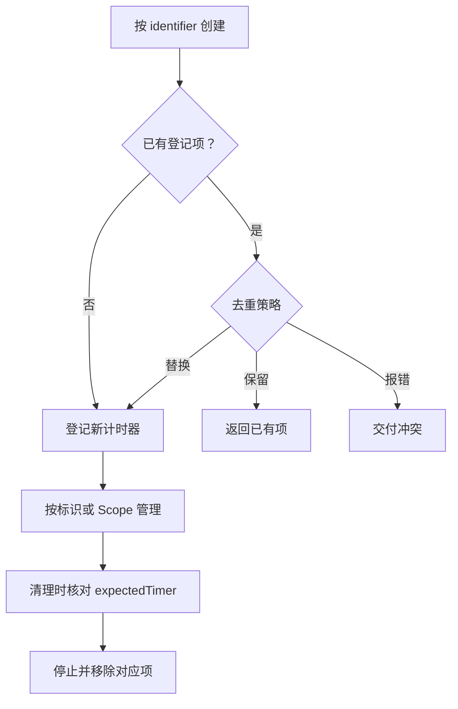

# ⏱️ `JobsSwiftTimerMgr`


[toc]

> 中文架构入口：[架构脉络与关键设计](#jobs-architecture)。

---

## 🔥 <font id=前言>前言</font>

> `JobsSwiftTimerMgr` 负责 identifier 注册、受管生命周期句柄、去重和应用状态策略。

## 一、定位

`JobsSwiftTimerMgr` 是 `JobsSwiftTimer` 之上的 identifier 管理层，负责原子注册、去重、生命周期派发、批量清理和前后台策略。单个 timer 的内核行为留在 `JobsSwiftTimer`，页面或列表内多个 timer 的编排放在 Manager。

## 二、创建与控制

```swift
import JobsSwiftTimer
import JobsSwiftTimerMgr

let identifier = "home.countdown"
let config = JobsSwiftTimerConfig(
    interval: 1,
    repeats: true,
    queue: .main,
    runLoop: .main,
    runLoopMode: .common
)

let timer = try JobsSwiftTimerMgr.shared.create(
    kind: .foundation,
    identifier: identifier,
    config: config,
    dedupPolicy: .replace,
    backgroundPolicy: .pauseAndResume,
    scopeIdentifier: "home.page"
) {
    // 更新倒计时 UI
}

timer.start()
try JobsSwiftTimerMgr.shared.act(.pause, identifier: identifier)
try JobsSwiftTimerMgr.shared.act(.resume, identifier: identifier)
try JobsSwiftTimerMgr.shared.act(.cancel, identifier: identifier)
```

`.cancel` 会停止并移除；`.stop` 只停止，注册项仍可查询。

`create` 返回的是受管句柄：直接调用它的 `start`、`pause`、`resume`、`stop`，Manager 仍会同步 Entry 的手动 / 自动暂停状态。旧句柄在同 identifier 被替换后只能作用于自己的旧内核，不会误控制新注册项。

## 三、治理策略

### 3.1、同 identifier 去重

| 策略 | 行为 |
| ---- | ---- |
| `.keepExisting` | 返回旧 timer，不覆盖旧配置和回调 |
| `.replace` | 原子替换注册项，再在锁外停止旧 timer |
| `.error` | 抛出 `duplicatedIdentifier` |

原子替换保证并发 `create` 时字典不会短暂缺失；停止旧 timer 不占用 Manager 锁，避免回调重入造成死锁。

### 3.2、前后台策略

| 策略 | 行为 |
| ---- | ---- |
| `.ignore` | 不干预 |
| `.pauseAndResume` | 失去活跃态即暂停，重新活跃只恢复自动暂停项 |
| `.cancel` | 后台停止并移除 |

Manager 接管应用状态治理后，会关闭具体 `JobsTimer` 自己的监听，避免双重暂停或恢复。每次 `start` / `resume` 后还会读取当前应用状态：即使 Timer 在应用已经 inactive / background 时才启动，策略也会立即生效；`.cancel` 仍只在真实 background 时停止并移除。

## 四、并发与线程保证

- `defaultDedupPolicy` 与注册字典均在锁内访问。
- `.cancel` 移除前会核对 Entry 身份，不会误删同 identifier 的并发替换项。
- `stopAndRemove(identifier:expectedTimer:)` 同时核对 identifier 与受管句柄；旧 Cell 的延迟清理不会误杀复用后的新 Timer。
- Scope 暂停使用独立的 `.scopePaused` 状态，只恢复 Scope 自己暂停的 Timer，不改变业务主动暂停状态。
- 非 GCD timer 的生命周期动作由 Manager 路由到主线程；GCD timer 保持可跨线程调用。
- 生命周期线程要求来自 `JobsSwiftTimerProtocol`，不再通过 `JobsTimer` 具体类型强转判断。
- Manager、受管句柄和具体 Timer 都声明了受锁保护的并发边界，便于 Swift 6 严格并发检查继续收口。
- `removeAll(stopAll: true)` 先取快照并清空注册表，再在锁外逐个停止。

## 五、复用场景

```swift
let identifier = "cell.\(model.id)"
let scopeIdentifier = "countdown.page"

let timer = try? JobsSwiftTimerMgr.shared.create(
    kind: .foundation,
    identifier: identifier,
    config: JobsSwiftTimerConfig(interval: 1),
    dedupPolicy: .replace,
    scopeIdentifier: scopeIdentifier
) {
    // 用 model.endAt 重新计算剩余时间，不累计 tick
}
timer?.start()

// prepareForReuse / didEndDisplaying
if let timer {
    JobsSwiftTimerMgr.shared.stopAndRemove(
        identifier: identifier,
        expectedTimer: timer
    )
}

// viewWillDisappear / viewWillAppear / deinit
JobsSwiftTimerMgr.shared.pause(scopeIdentifier: scopeIdentifier)
JobsSwiftTimerMgr.shared.resume(scopeIdentifier: scopeIdentifier)
JobsSwiftTimerMgr.shared.stopAndRemove(scopeIdentifier: scopeIdentifier)
```

iOS 13 以上也保留同名 `async` 入口；当前内部仍按同步生命周期语义执行。

## 六、验证

```shell
xcrun swiftc -frontend -parse JobsSwiftTimerMgr.swift JobsSwiftTimerMgrDefs.swift
```

```shell
xcodebuild -workspace JobsSwiftBaseConfigDemo.xcworkspace -scheme JobsSwiftTimerMgr -configuration Debug -destination 'generic/platform=iOS Simulator' CODE_SIGNING_ALLOWED=NO build
```

应用测试 target 还覆盖受管句柄的手动暂停保护、并发替换后的旧句柄隔离、实例安全取消与 Scope 暂停恢复。

## 七、系统计时机制对比与 Manager 选型

### 7.1、Manager 不替代内核选择

`JobsSwiftTimerMgr` 解决的是“谁拥有 Timer、如何查找、去重、暂停、恢复和清理”，不是把所有系统计时机制抹成同一种行为。日常所说的“iOS 系统 Timer”实际分属多个框架：

- `Timer` 位于 [**Foundation**](https://developer.apple.com/documentation/foundation/timer)，Objective-C 名称是 `NSTimer`。
- `DispatchSourceTimer` 位于 [**Dispatch**](https://developer.apple.com/documentation/dispatch/dispatchsourcetimer)。
- `CADisplayLink` 位于 [**QuartzCore**](https://developer.apple.com/documentation/quartzcore/cadisplaylink)。
- `CFRunLoopTimer` 位于 [**Core Foundation**](https://developer.apple.com/documentation/corefoundation/cfrunlooptimer)，并与 `Timer/NSTimer` toll-free bridged。

它们都不是硬实时机制，也都不会赋予 App 后台保活能力。Manager 创建 Timer 时仍要先按场景选择 `kind`。

### 7.2、四种内核怎么选

| 系统机制 | 调度模型 | 优势 | 代价与风险 | 推荐场景 | `JobsTimerKind` |
| ---- | ---- | ---- | ---- | ---- | ---- |
| `Timer/NSTimer` | 依赖指定线程的 RunLoop 与 Mode | API 简单；适合 UI 低频刷新；支持 `tolerance` 节能 | RunLoop 忙或 Mode 不匹配会延后；不是实时计时器；需处理失效与引用关系 | 轮播、验证码、普通 UI 倒计时 | `.foundation` |
| `DispatchSourceTimer` | 在指定 GCD Queue 上投递事件，不依赖 RunLoop | 可选择串行/并发队列；适合非 UI 调度；`leeway` 可平衡功耗 | suspend/resume/cancel 状态必须配平；仍受 QoS、系统负载和队列阻塞影响 | 心跳、轮询、缓存清理、工作队列节拍 | `.gcd` |
| `CADisplayLink` | 跟随显示刷新周期回调 | 与屏幕刷新协调；提供 `timestamp` / `targetTimestamp`；适配高刷屏 | 实际帧率会受硬件、低电量、温控和主线程负载影响；不适合业务倒计时 | 逐帧动画、进度绘制、视觉插值 | `.displayLink` |
| `CFRunLoopTimer` | Core Foundation 级 RunLoop Timer | 可显式控制 RunLoop、Mode、下一次触发时间与上下文 | C API 更冗长；所有权与线程亲和更容易出错；仍受 RunLoop 延迟 | 基础设施、需要精细 RunLoop 集成或 C/CF 互操作 | `.runLoop` |

### 7.3、经常被误当成 Timer 的 API

| API | 适合 | 不适合 |
| ---- | ---- | ---- |
| `DispatchQueue.asyncAfter` | 一次性延迟执行 | 重复、暂停、恢复、统一生命周期管理 |
| `Task.sleep` / `Clock.sleep` | Swift 并发流程中的一次性、可取消等待；等待时不阻塞线程 | 页面多 Timer 注册表、OC 调用、天然重复调度 |
| `BGTaskScheduler` | 由系统择机执行后台刷新或维护任务 | 秒级准点触发、常驻后台 Timer |

### 7.4、场景决策顺序

1. 屏幕逐帧刷新选择 `.displayLink`。
2. 非 UI 工作队列、心跳或轮询选择 `.gcd`。
3. 主线程低频 UI 刷新选择 `.foundation`，并使用 `.common` Mode。
4. 需要直接控制 RunLoop Timer 或进行 Core Foundation 互操作时选择 `.runLoop`。
5. 只有一次延迟等待时使用 `Task.sleep` 或 `DispatchQueue.asyncAfter`，不创建受管重复 Timer。
6. App 被系统挂起后需要执行工作时，改用匹配业务资格的后台系统机制；任何 `kind` 都不是后台保活方案。

### 7.5、什么时候必须上 Manager

- 单个对象私有、生命周期清楚、无需跨对象查找时，直接使用 `JobsTimer`。
- 同一业务可能重复创建 Timer 时，用 identifier + `dedupPolicy`。
- 列表复用时，用稳定 Model identifier，并使用 `expectedTimer` 精准解绑。
- 页面或业务域有多条 Timer 时，用 `scopeIdentifier` 整组 pause/resume/remove。
- 倒计时把绝对 `endAt` 作为时间真值，Timer 只触发重算；Manager 管物理 Timer，不承担业务时间真值。
- “更准”不等于硬实时；选择 GCD 只能避开 RunLoop Mode 影响，仍需面对队列阻塞、QoS、系统负载和 `leeway`。

<a id="jobs-architecture"></a>

## 八、架构脉络与关键设计

本节用于用中文快速理解组件，并为按框架重建提供入口；关注职责、运行关系和关键边界，不要求逐行复刻。

### 8.1、设计目的与职责划分

在 JobsSwiftTimer 之上按 identifier 登记和治理物理计时器，提供保留、替换或报错的去重策略、Scope 分组控制与前后台暂停策略。受管包装层校验动作是否仍属于当前登记项。

### 8.2、运行脉络

按标识创建 → 应用去重策略 → 登记并返回受管计时器 → 按标识或 Scope 控制 → 精准停止移除

下图用于说明主要关系；异常、退出与线程边界结合下一节阅读。



### 8.3、关键设计与边界

- 旧持有者可能在同标识已替换后清理，expectedTimer 用于确认仍是原对象，避免误杀新计时器。
- remove 不自动 stop，与 stopAndRemove 不同，重建时不能隐藏这一区别。
- 手动、Scope 和前后台暂停原因需分开，恢复 Scope 不应恢复业务手动暂停项。
- 锁保护登记与状态，实际生命周期动作还需遵循底层内核线程要求；不能在锁内执行任意回调。
- Manager 管理物理计时器，不管理业务剩余时长；页面倒计时仍以 endAt 为准。

### 8.4、阅读与重建顺序

先读 Defs 的策略，再看 create 与 ManagedTimer 的当前项校验，最后看 expectedTimer、Scope 和应用状态治理。

源码定位（路径以本 README 所在目录为基准；只带走 README 时，可把文件名作为职责定位线索）：

- [JobsSwiftTimerMgr.swift](<./JobsSwiftTimerMgr.swift>)
- [JobsSwiftTimerMgrDefs.swift](<./JobsSwiftTimerMgrDefs.swift>)

依赖与编译入口：[JobsSwiftTimerMgr.podspec](<./JobsSwiftTimerMgr.podspec>)。其中显式依赖声明包括 `JobsSwiftTimer`。源码范围、资源及可选 subspec 以这里的声明为准；辅助脚本动态补充的依赖不在上述摘录中展开。
