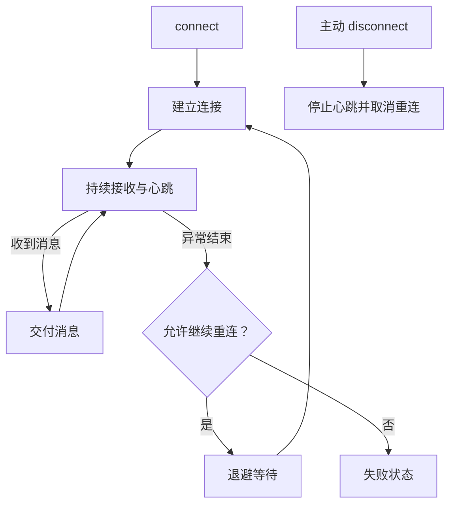

# `JobsSwiftWebSocket`


[toc]

> 中文架构入口：[架构脉络与关键设计](#jobs-architecture)。

---

## 🔥 <font id=前言>前言</font>

> `JobsSwiftWebSocket` 是基于 `URLSessionWebSocketTask` 的轻量 WebSocket Pod，只封装连接生命周期、收包循环、线程切换、心跳、退避重连和状态回调，不介入业务协议、鉴权或消息模型。

## 一、默认策略 <a href="#前言" style="font-size:17px; color:green;"><b>🔼</b></a> <a href="#🔚" style="font-size:17px; color:green;"><b>🔽</b></a>

- 心跳间隔：30 秒。
- 自动重连：默认开启。
- 退避序列：1、2、4、8、16 秒。
- 最大重连次数：5 次。
- 状态、消息和发送完成回调统一切回主线程。

## 二、接入示例 <a href="#前言" style="font-size:17px; color:green;"><b>🔼</b></a> <a href="#🔚" style="font-size:17px; color:green;"><b>🔽</b></a>

```swift
import JobsSwiftWebSocket

private let webSocketClient = JobsSwiftWebSocketClient()

webSocketClient.onStateChange = { state in
    print(state)
}
webSocketClient.onTextMessage = { text in
    print("← \(text)")
}
webSocketClient.connect(
    to: URL(string: "wss://ws.postman-echo.com/raw")!
)
webSocketClient.send(text: "Hello WebSocket") { result in
    print(result)
}
```

主动退出页面时调用 `disconnect()`，它会停止心跳并取消待执行的自动重连。

<a id="jobs-architecture"></a>

## 三、架构脉络与关键设计

本节用于用中文快速理解组件，并为按框架重建提供入口；关注职责、运行关系和关键边界，不要求逐行复刻。

### 3.1、设计目的与职责划分

基于 URLSessionWebSocketTask 封装连接、持续接收、心跳、退避重连与状态回调。业务消息模型、认证和协议解释留给宿主，客户端只管理传输生命周期。

### 3.2、运行脉络

发起连接 → 握手成功 → 接收消息并继续下一次接收 → 心跳检查 → 失败退避重连或主动断开

下图用于说明主要关系；异常、退出与线程边界结合下一节阅读。



### 3.3、关键设计与边界

- 接收 API 每次返回一条消息，需要继续安排下一轮，不能收到一条后就停止监听。
- 主动 disconnect 会停止心跳并取消待重连任务，与异常断线后的自动恢复不同。
- 默认心跳 30 秒、重连最多 5 次，退避为 1、2、4、8、16 秒；这些是库的默认策略。
- 状态、消息与发送完成回调统一回到主线程，业务不应在这些回调里执行耗时解析。
- 旧 task 的回调与新连接要区分，避免旧连接失败误触发新连接重连。

### 3.4、阅读与重建顺序

先读 State 和 connect/disconnect，再看 receiveNextMessage、心跳、scheduleReconnect 与 delegate。

源码定位（路径以本 README 所在目录为基准；只带走 README 时，可把文件名作为职责定位线索）：

- [Core/JobsSwiftWebSocketClient/JobsSwiftWebSocketClient.swift](<./Core/JobsSwiftWebSocketClient/JobsSwiftWebSocketClient.swift>)

依赖与编译入口：[JobsSwiftWebSocket.podspec](<./JobsSwiftWebSocket.podspec>)。源码范围、资源及可选 subspec 以这里的声明为准；辅助脚本动态补充的依赖不在上述摘录中展开。

<a id="🔚" href="#前言" style="font-size:17px; color:green; font-weight:bold;">我是有底线的➤点我回到首页</a>
