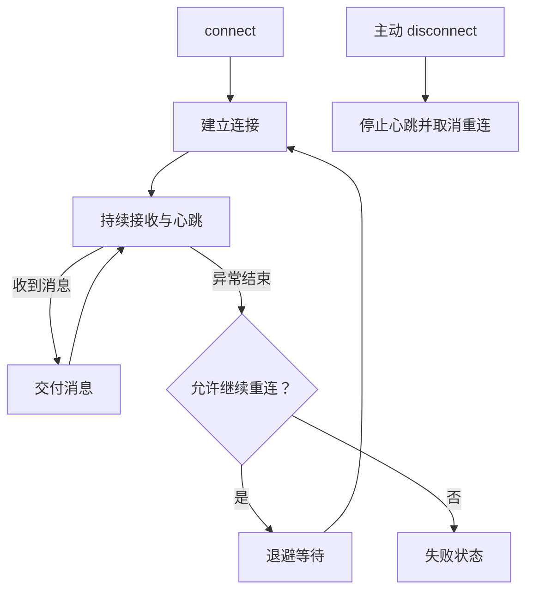

# `JobsSwiftWebSocket`


[toc]

> 中文架构入口：[架构脉络与关键设计](#jobs-architecture)。

---

## 🔥 <font id=前言>前言</font>

> `JobsSwiftWebSocket` 是基于 [**URLSessionWebSocketTask**](https://developer.apple.com/documentation/foundation/urlsessionwebsockettask) 的轻量 WebSocket Pod，只封装连接生命周期、收包循环、线程切换、心跳、退避重连和状态回调，不介入业务协议、鉴权或消息模型。

## 一、默认策略 <a href="#前言" style="font-size:17px; color:green;"><b>🔼</b></a> <a href="#🔚" style="font-size:17px; color:green;"><b>🔽</b></a>

- 心跳间隔：30 秒；`pongTimeout` 默认 10 秒，超时进入断线恢复。
- 自动重连：默认开启。
- 退避序列：1、2、4、8、16 秒。
- 最大重连次数：5 次。
- 状态、消息和发送完成回调统一切回主线程。

## 二、接入示例 <a href="#前言" style="font-size:17px; color:green;"><b>🔼</b></a> <a href="#🔚" style="font-size:17px; color:green;"><b>🔽</b></a>

```swift
import JobsSwiftWebSocket

private let webSocketClient = JobsSwiftWebSocketClient()

webSocketClient.onStateChange = { state in
    print(state)
}
webSocketClient.onTextMessage = { text in
    print("← \(text)")
}
webSocketClient.connect(
    to: URL(string: "wss://ws.postman-echo.com/raw")!
)
webSocketClient.send(text: "Hello WebSocket") { result in
    print(result)
}
```

主动退出页面时调用 `disconnect()`，它会停止心跳并取消待执行的自动重连。

<a id="jobs-architecture"></a>

## 三、架构脉络与关键设计 <a href="#前言" style="font-size:17px; color:green;"><b>🔼</b></a> <a href="#🔚" style="font-size:17px; color:green;"><b>🔽</b></a>

本节用于用中文快速理解组件，并为按框架重建提供入口；关注职责、运行关系和关键边界，不要求逐行复刻。

### 3.1、设计目的与职责划分 <a href="#前言" style="font-size:17px; color:green;"><b>🔼</b></a> <a href="#🔚" style="font-size:17px; color:green;"><b>🔽</b></a>

基于 URLSessionWebSocketTask 封装连接、持续接收、心跳、退避重连与状态回调。业务消息模型、认证和协议解释留给宿主，客户端只管理传输生命周期。

### 3.2、运行脉络 <a href="#前言" style="font-size:17px; color:green;"><b>🔼</b></a> <a href="#🔚" style="font-size:17px; color:green;"><b>🔽</b></a>

发起连接 → 握手成功 → 接收消息并继续下一次接收 → 心跳检查 → 失败退避重连或主动断开

下图用于说明主要关系；异常、退出与线程边界结合下一节阅读。


```mermaid
flowchart TD
    A["connect"] --> B["建立连接"]
    B --> C["持续接收与心跳"]
    C -->|收到消息| D["交付消息"]
    D --> C
    C -->|异常结束| E{"允许继续重连？"}
    E -->|是| F["退避等待"]
    F --> B
    E -->|否| G["失败状态"]
    H["主动 disconnect"] --> I["停止心跳并取消重连"]
```

### 3.3、关键设计与边界 <a href="#前言" style="font-size:17px; color:green;"><b>🔼</b></a> <a href="#🔚" style="font-size:17px; color:green;"><b>🔽</b></a>

- 接收 API 每次返回一条消息，需要继续安排下一轮，不能收到一条后就停止监听。
- 主动 disconnect 会停止心跳并取消待重连任务，与异常断线后的自动恢复不同。
- 默认心跳 30 秒、重连最多 5 次，退避为 1、2、4、8、16 秒；这些是库的默认策略。
- 状态、消息与发送完成回调统一回到主线程，业务不应在这些回调里执行耗时解析。
- 旧 task 的回调与新连接要区分，避免旧连接失败误触发新连接重连。

### 3.4、阅读与重建顺序 <a href="#前言" style="font-size:17px; color:green;"><b>🔼</b></a> <a href="#🔚" style="font-size:17px; color:green;"><b>🔽</b></a>

先读 State 和 connect/disconnect，再看 receiveNextMessage、心跳、scheduleReconnect 与 delegate。

源码定位（路径以本 README 所在目录为基准；只带走 README 时，可把文件名作为职责定位线索）：

- [Core/JobsSwiftWebSocketClient/JobsSwiftWebSocketClient.swift](<./Core/JobsSwiftWebSocketClient/JobsSwiftWebSocketClient.swift>)

依赖与编译入口：[JobsSwiftWebSocket.podspec](<./JobsSwiftWebSocket.podspec>)。源码范围、资源及可选 subspec 以这里的声明为准；辅助脚本动态补充的依赖不在上述摘录中展开。

## 四、线程、资源与参数合同 <a href="#前言" style="font-size:17px; color:green;"><b>🔼</b></a> <a href="#🔚" style="font-size:17px; color:green;"><b>🔽</b></a>

连接、接收、重连和心跳状态在私有串行队列管理，公开配置/回调/state 读写由锁保护，所有业务回调在主队列。heartbeatInterval 在下一次建立连接时生效，pongTimeout 在下一轮 ping 生效；重连参数在下一次重连计算生效。URL 只接受含主机的 ws/wss。每个回调比对当前 task，旧连接不能关闭新连接。

URLSession 使用弱 owner 代理，释放客户端会取消连接/心跳/待重连，不要求靠 disconnect 才能释放；页面退出仍推荐主动 disconnect。每轮只允许一个待 pong 的 ping，pong 截止时间到达后取消连接。heartbeatInterval 非有限或 <=0 停用心跳，正数最高一天；pongTimeout 非有限回退 10 秒，有限值收口 0.1...3600 秒。退避基数收口 0.1...3600 秒，最大延迟最高 3600 秒；非有限值使用默认；次数收口 0...100。

[弱代理](./Core/JobsSwiftWebSocketClient/JobsWebSocketDelegateProxy.swift) 与客户端共同管理资源。原生 Swift 编译和本机 WebSocket loopback 回归已通过：真实 URLSessionWebSocketTask 连接/回显/pong、活跃连接释放、无 pong 截止失败及重连等待中的 owner 释放。工程根执行 `ruby .github/tests/JobsPodsUpgrade/Network/run_regressions.rb --output-dir /tmp/JobsPodsUpgradeNetwork` 可复现；旧 task 迟到、复杂连续重连、TLS 与真机后台切换仍应按宿主场景验收。发送成功表示传输 API 接受消息，不保证应用层 ACK、消息重放、离线队列或登录鉴权。


## 五、生产交付与全量门禁 <a href="#前言" style="font-size:17px; color:green;"><b>🔼</b></a> <a href="#🔚" style="font-size:17px; color:green;"><b>🔽</b></a>

生产源码排除 Tests / Test、Demo / Example、build / DerivedData、测试入口及临时文件；回归脚本位于宿主 `.github/tests/JobsPodsUpgrade`，不被 Pod 生产 target 编入。

本次没有为未使用所需理由 API 的模块机械添加空隐私清单；业务用途变化后再按实际调用核对。

从宿主根目录执行当前 Pod 单元验证：

```shell
ruby .github/tests/JobsPodsUpgrade/validate_builds.rb --pods JobsSwiftWebSocket --skip-host
```

全量命令为 `ruby .github/tests/JobsPodsUpgrade/validate_builds.rb`：逐个自建 Pod 编译成功后才构建宿主 workspace。当前集成验证使用最低部署目标 iOS 15.6 / arm64 Simulator / Swift 5 语言模式；独立 Pod 更低部署目标、动态集成和真机行为需相应消费配置验证。编译日志、JSON 结果及行为回归边界见宿主根目录《JobsByPods升级与编译验收报告.md》，不能用 Parse 或 fixture 的成功替代真实模块 / App 编译。

<a id="🔚" href="#前言" style="font-size:17px; color:green; font-weight:bold;">我是有底线的➤点我回到首页</a>
