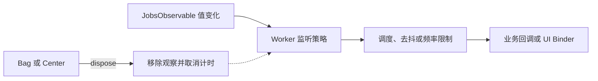

# JobsSwiftWorker

> 中文架构入口：[架构脉络与关键设计](#jobs-architecture)。

`JobsSwiftWorker` 不是单点的 debounce 封装，而是站在 `JobsSwiftTaskCenter` / `JobsSwiftTimer` 之上，补一层平行 Flutter GetX Worker 的本地响应式能力。

## 当前能力

### Worker
- `ever`
- `once`
- `debounce`
- `interval`
- `everAll`
- `skip`
- `take`

### Observable 变换
- `map`
- `filter`
- `distinctUntilChanged`
- `combineLatest`

### UI Binder
- `UILabel` 文本绑定
- `UITextField` 输入绑定
- UI 写入与事件绑定统一经由 `JobsByUIKit` / `JobsSwiftDSL`，不在 Binder 中裸调系统 API。

## 设计目标

1. **不只封 debounce**：直接提供 Worker 抽象层。
2. **兼容 Jobs 架构**：延时与窗口控制统一落到 `JobsSwiftTaskCenter`。
3. **页面级可治理**：通过 `JobsWorkerBag` / `JobsWorkerCenter` 统一释放。
4. **后续可继续长大**：可以继续补 `throttleLatest`、`zip`、`merge`、`flatMapLatest`、UI State Binder。

## 快速使用

```swift
let count = JobsObservable<Int>(0, name: "count")
let bag = JobsWorkerBag()

count
    .ever { change in
        print(change.newValue)
    }
    .store(in: bag)

count.accept(1)
```

## 推荐发展方向

下一步建议补：

- `throttleLatest`
- `merge`
- `zip`
- `removeDuplicates(by:)`
- `bindHidden / bindEnabled / bindImage`
- `JobsWorkerController`（页面控制器层）

<a id="jobs-architecture"></a>

## 一、架构脉络与关键设计

本节用于用中文快速理解组件，并为按框架重建提供入口；关注职责、运行关系和关键边界，不要求逐行复刻。

### 1.1、设计目的与职责划分

建立轻量可观察值和可释放监听。JobsObservable 保存值并通知变化，WorkerFactory 生成 ever、once、debounce、interval、skip、take 等监听策略，Bag/Center 管理释放，Binder 对接文本控件。

### 1.2、运行脉络

建立可观察值 → 选择监听策略并登记 Worker → 值变化 → 经调度与过滤触发回调 → dispose 解除观察和计时

下图用于说明主要关系；异常、退出与线程边界结合下一节阅读。



### 1.3、关键设计与边界

- accept、acceptSilently 和 notifyCurrentValue 的通知语义不同，静默更新不能被重建为普通更新。
- debounce 等待稳定输入，interval 限制触发频率，两者不能用同一个延时逻辑替代。
- map、filter、distinctUntilChanged、combineLatest 形成派生可观察值，需处理上游订阅的持有和释放。
- Worker 的 dispose 应幂等，页面退出时 Bag/Center 统一解除；仅停止 UI 更新而保留定时观察会泄漏。
- 原文中列作未来计划的 merge、zip 等不能直接当成当前已完成能力。

### 1.4、阅读与重建顺序

先读 Observable 和 Worker，再看 Factory 的各策略与 Scheduler，最后看 Bag/Center、Transform、Combine 和 Binder。

源码定位（路径以本 README 所在目录为基准；只带走 README 时，可把文件名作为职责定位线索）：

- [JobsObservable+Combine.swift](<./JobsObservable+Combine.swift>)
- [JobsObservable+Transform.swift](<./JobsObservable+Transform.swift>)
- [JobsObservable+Workers.swift](<./JobsObservable+Workers.swift>)
- [JobsObservable.swift](<./JobsObservable.swift>)
- [JobsPeriod+Worker.swift](<./JobsPeriod+Worker.swift>)

依赖与编译入口：[JobsSwiftWorker.podspec](<./JobsSwiftWorker.podspec>)。其中显式依赖声明包括 `SnapKit`、`Jobsl10n`、`JobsByUIKit`、`JobsSwiftRefresher`、`JobsSwiftTimer`、`JobsSwiftTaskCenter`、`JobsSwiftBaseDefines`。源码范围、资源及可选 subspec 以这里的声明为准；辅助脚本动态补充的依赖不在上述摘录中展开。
