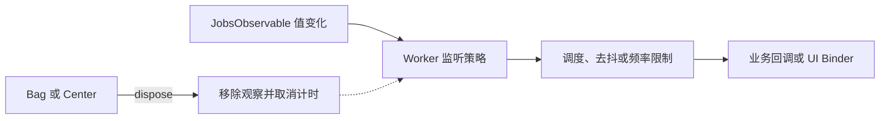

# <span id="前言">JobsSwiftWorker</span>


> 中文架构入口：[架构脉络与关键设计](#jobs-architecture)。

`JobsSwiftWorker` 不是单点的 debounce 封装，而是站在 `JobsSwiftTaskCenter` / `JobsSwiftTimer` 之上，补一层平行 Flutter GetX Worker 的本地响应式能力。

## 当前能力 <a href="#前言" style="font-size:17px; color:green;"><b>🔼</b></a> <a href="#🔚" style="font-size:17px; color:green;"><b>🔽</b></a>

### Worker <a href="#前言" style="font-size:17px; color:green;"><b>🔼</b></a> <a href="#🔚" style="font-size:17px; color:green;"><b>🔽</b></a>
- `ever`
- `once`
- `debounce`
- `interval`
- `everAll`
- `skip`
- `take`

### Observable 变换 <a href="#前言" style="font-size:17px; color:green;"><b>🔼</b></a> <a href="#🔚" style="font-size:17px; color:green;"><b>🔽</b></a>
- `map`
- `filter`
- `distinctUntilChanged`
- `combineLatest`

### UI Binder <a href="#前言" style="font-size:17px; color:green;"><b>🔼</b></a> <a href="#🔚" style="font-size:17px; color:green;"><b>🔽</b></a>
- `UILabel` 文本绑定
- `UITextField` 输入绑定
- UI 写入与事件绑定统一经由 `JobsByUIKit` / `JobsSwiftDSL`，不在 Binder 中裸调系统 API。

## 设计目标 <a href="#前言" style="font-size:17px; color:green;"><b>🔼</b></a> <a href="#🔚" style="font-size:17px; color:green;"><b>🔽</b></a>

1. **不只封 debounce**：直接提供 Worker 抽象层。
2. **兼容 Jobs 架构**：延时与窗口控制统一落到 `JobsSwiftTaskCenter`。
3. **页面级可治理**：通过 `JobsWorkerBag` / `JobsWorkerCenter` 统一释放。
4. **后续可继续长大**：可以继续补 `throttleLatest`、`zip`、`merge`、`flatMapLatest`、UI State Binder。

## 快速使用 <a href="#前言" style="font-size:17px; color:green;"><b>🔼</b></a> <a href="#🔚" style="font-size:17px; color:green;"><b>🔽</b></a>

```swift
let count = JobsObservable<Int>(0, name: "count")
let bag = JobsWorkerBag()

count
    .ever { change in
        print(change.newValue)
    }
    .store(in: bag)

count.accept(1)
```

## 推荐发展方向 <a href="#前言" style="font-size:17px; color:green;"><b>🔼</b></a> <a href="#🔚" style="font-size:17px; color:green;"><b>🔽</b></a>

下一步建议补：

- `throttleLatest`
- `merge`
- `zip`
- `removeDuplicates(by:)`
- `bindHidden / bindEnabled / bindImage`
- `JobsWorkerController`（页面控制器层）

<a id="jobs-architecture"></a>

## 一、架构脉络与关键设计 <a href="#前言" style="font-size:17px; color:green;"><b>🔼</b></a> <a href="#🔚" style="font-size:17px; color:green;"><b>🔽</b></a>

本节用于用中文快速理解组件，并为按框架重建提供入口；关注职责、运行关系和关键边界，不要求逐行复刻。

### 1.1、设计目的与职责划分 <a href="#前言" style="font-size:17px; color:green;"><b>🔼</b></a> <a href="#🔚" style="font-size:17px; color:green;"><b>🔽</b></a>

建立轻量可观察值和可释放监听。JobsObservable 保存值并通知变化，WorkerFactory 生成 ever、once、debounce、interval、skip、take 等监听策略，Bag/Center 管理释放，Binder 对接文本控件。

### 1.2、运行脉络 <a href="#前言" style="font-size:17px; color:green;"><b>🔼</b></a> <a href="#🔚" style="font-size:17px; color:green;"><b>🔽</b></a>

建立可观察值 → 选择监听策略并登记 Worker → 值变化 → 经调度与过滤触发回调 → dispose 解除观察和计时

下图用于说明主要关系；异常、退出与线程边界结合下一节阅读。


```mermaid
flowchart LR
    A["JobsObservable 值变化"] --> B["Worker 监听策略"]
    B --> C["调度、去抖或频率限制"]
    C --> D["业务回调或 UI Binder"]
    E["Bag 或 Center"] -->|dispose| F["移除观察并取消计时"]
    F -.-> B
```

### 1.3、关键设计与边界 <a href="#前言" style="font-size:17px; color:green;"><b>🔼</b></a> <a href="#🔚" style="font-size:17px; color:green;"><b>🔽</b></a>

- accept、acceptSilently 和 notifyCurrentValue 的通知语义不同，静默更新不能被重建为普通更新。
- debounce 等待稳定输入，interval 限制触发频率，两者不能用同一个延时逻辑替代。
- map、filter、distinctUntilChanged、combineLatest 形成派生可观察值，需处理上游订阅的持有和释放。
- Worker 的 dispose 应幂等，页面退出时 Bag/Center 统一解除；仅停止 UI 更新而保留定时观察会泄漏。
- 原文中列作未来计划的 merge、zip 等不能直接当成当前已完成能力。

### 1.4、阅读与重建顺序 <a href="#前言" style="font-size:17px; color:green;"><b>🔼</b></a> <a href="#🔚" style="font-size:17px; color:green;"><b>🔽</b></a>

先读 Observable 和 Worker，再看 Factory 的各策略与 Scheduler，最后看 Bag/Center、Transform、Combine 和 Binder。

源码定位（路径以本 README 所在目录为基准；只带走 README 时，可把文件名作为职责定位线索）：

- [JobsObservable+Combine.swift](<./JobsObservable+Combine.swift>)
- [JobsObservable+Transform.swift](<./JobsObservable+Transform.swift>)
- [JobsObservable+Workers.swift](<./JobsObservable+Workers.swift>)
- [JobsObservable.swift](<./JobsObservable.swift>)
- [JobsPeriod+Worker.swift](<./JobsPeriod+Worker.swift>)

依赖与编译入口：[JobsSwiftWorker.podspec](<./JobsSwiftWorker.podspec>)。其中显式依赖声明包括 `SnapKit`、`Jobsl10n`、`JobsByUIKit`、`JobsSwiftRefresher`、`JobsSwiftTimer`、`JobsSwiftTaskCenter`、`JobsSwiftBaseDefines`。源码范围、资源及可选 subspec 以这里的声明为准；辅助脚本动态补充的依赖不在上述摘录中展开。

## 二、使用合同与边界 <a href="#前言" style="font-size:17px; color:green;"><b>🔼</b></a> <a href="#🔚" style="font-size:17px; color:green;"><b>🔽</b></a>

- Observable 的值、订阅和策略内部状态使用锁管理；回调在触发线程执行，业务捕获对象仍须由调用方隔离。UI Binder 的界面更新在主线程。
- 观察回调在锁外执行；`mutate` 的 transform 则在同步事务锁内修改值，应仅计算新值，不重入同一 Observable 或等待其它需要该实例的操作。
- `once` / `take` 在进入业务回调前原子领取次数，重入及并发输入不会重复领取同一额度。`dispose` 幂等；disposer 的执行与替换旧捕获对象的释放均在锁外，已经进入的业务回调可能继续执行。
- `map`、`filter`、`distinctUntilChanged`、`combineLatest` 的输出拥有上游订阅，输出释放时解除订阅，上游不会强持有输出。回调不要再强捕获输出或页面自身。
- 同键调度会取消旧任务，以代次识别当前任务；完成和取消自动移除 Scheduler / TaskCenter 记录。
- `AnySendableBox` 只接受符合 `Sendable` 的值；任意 `Any` 不能借助类型擦除成为并发安全数据。


## 三、生产交付与全量门禁 <a href="#前言" style="font-size:17px; color:green;"><b>🔼</b></a> <a href="#🔚" style="font-size:17px; color:green;"><b>🔽</b></a>

生产源码排除 Tests / Test、Demo / Example、build / DerivedData、测试入口及临时文件；回归脚本位于宿主 `.github/tests/JobsPodsUpgrade`，不被 Pod 生产 target 编入。

本次没有为未使用所需理由 API 的模块机械添加空隐私清单；业务用途变化后再按实际调用核对。

从宿主根目录执行当前 Pod 单元验证：

```shell
ruby .github/tests/JobsPodsUpgrade/validate_builds.rb --pods JobsSwiftWorker --skip-host
```

全量命令为 `ruby .github/tests/JobsPodsUpgrade/validate_builds.rb`：逐个自建 Pod 编译成功后才构建宿主 workspace。当前集成验证使用最低部署目标 iOS 15.6 / arm64 Simulator / Swift 5 语言模式；独立 Pod 更低部署目标、动态集成和真机行为需相应消费配置验证。编译日志、JSON 结果及行为回归边界见宿主根目录《JobsByPods升级与编译验收报告.md》，不能用 Parse 或 fixture 的成功替代真实模块 / App 编译。

<a id="🔚" href="#前言" style="font-size:17px; color:green; font-weight:bold;">我是有底线的➤点我回到首页</a>
