# Podspec 依赖分析报告

[toc]

## 🔥 前言 <a href="#前言" style="font-size:17px; color:green;"><b>🔼</b></a> <a href="#🔚" style="font-size:17px; color:green;"><b>🔽</b></a>

- 此文件由脚本自动运行分析得出
- 分析目录：`/Users/jobs/Documents/Github/JobsBaseConfig/JobsBaseConfig@JobsSwiftBaseConfigDemo`
- 生成时间：`2026-07-21 08:03:08`
- Podspec 数量：`59`
- 0 下游依赖 Pod 数量：`9`
- 全部依赖边数量：`226`
- 仓库内 Pod 依赖边数量：`159`
- Pod 间循环依赖数量：`0`
- 已过滤同 Pod 内部 subspec 依赖数量：`15`
- 外部依赖来源注释文件数量：`79`
- 已识别外部依赖来源链接数量：`65`
- DSL 执行式解析 Podspec 数量：`58`
- 静态兜底解析 Podspec 数量：`1`

> 更易读的动态关系图见：`PodspecDependencies_interactive.html`，其中默认保留 2D 关系图，并新增可拖动旋转的 3D 空间图。

#### 使用静态兜底解析的文件

这些文件无法通过 DSL 执行式解析完整展开，已自动回退到正则静态解析；若其中使用数组、lambda、helper 方法声明依赖，仍可能需要人工确认。

| Pod | Podspec | DSL 解析失败原因 |
|---|---|---|
| [**JobsOCDSL**](#JobsOCDSL) | `JobsByPods/JobsOCDSL@Pods/JobsOCDSL.podspec` | cannot load such file -- /Users/jobs/Documents/Github/JobsBaseConfig/JobsBaseConfig@JobsSwiftBaseConfigDemo/JobsByPods/JobsOCDSL@Pods/JobsPodspecKit |

## 一、总览 <a href="#前言" style="font-size:17px; color:green;"><b>🔼</b></a> <a href="#🔚" style="font-size:17px; color:green;"><b>🔽</b></a>

| Pod | Podspec | 下游依赖数量 | 下游依赖 | 上游依赖数量 | 上游依赖方 |
|---|---|---:|---|---:|---|
| [**BRPickerViewSwift**](#BRPickerViewSwift) | `JobsByPods/BRPickerViewSwift@Pods/BRPickerViewSwift.podspec` | 3 | [JobsByUIKit](#JobsByUIKit), [JobsSwiftDSL](#JobsSwiftDSL), [SnapKit](https://github.com/SnapKit/SnapKit) | 0 |  |
| [**Flutter**](#Flutter) | `my_flutter/.ios/Flutter/Flutter.podspec` | 0 |  | 2 | [**FlutterPluginRegistrant**](#FlutterPluginRegistrant), [**JobsSwiftTools**](#JobsSwiftTools) |
| [**FlutterPluginRegistrant**](#FlutterPluginRegistrant) | `my_flutter/.ios/Flutter/FlutterPluginRegistrant/FlutterPluginRegistrant.podspec` | 1 | [Flutter](#Flutter) | 1 | [**JobsSwiftTools**](#JobsSwiftTools) |
| [**JobsAppIconRibbon**](#JobsAppIconRibbon) | `JobsByPods/JobsAppIconRibbon@Pods/JobsAppIconRibbon.podspec` | 0 |  | 0 |  |
| [**JobsAudioRecorder**](#JobsAudioRecorder) | `JobsByPods/JobsAudioRecorder@Pods/JobsAudioRecorder.podspec` | 1 | [JobsSwiftTimer](#JobsSwiftTimer) | 0 |  |
| [**JobsBluetooth**](#JobsBluetooth) | `JobsByPods/JobsBluetooth@Pods/JobsBluetooth.podspec` | 0 |  | 0 |  |
| [**JobsBy3rdTools**](#JobsBy3rdTools) | `JobsByPods/JobsBy3rdTools@Pods/JobsBy3rdTools.podspec` | 19 | [BMPlayer](https://github.com/BrikerMan/BMPlayer), [GKNavigationBarSwift](https://github.com/QuintGao/GKNavigationBarSwift), [JXSegmentedView](https://github.com/pujiaxin33/JXSegmentedView), [JobsByUIKit](#JobsByUIKit), [JobsInheritance](#JobsInheritance), [JobsScale](#JobsScale), [JobsSwiftBaseDefines](#JobsSwiftBaseDefines), [JobsSwiftBaseTools](#JobsSwiftBaseTools), [JobsSwiftDSL](#JobsSwiftDSL), [JobsSwiftMetalKit](#JobsSwiftMetalKit), [JobsSwiftStandardLibrary](#JobsSwiftStandardLibrary), [JobsSwiftTools](#JobsSwiftTools), [JobsTextTools](#JobsTextTools), [Kingfisher](https://github.com/onevcat/Kingfisher), [MJRefresh](https://github.com/CoderMJLee/MJRefresh), [SDWebImage](https://github.com/SDWebImage/SDWebImage), [SnapKit](https://github.com/SnapKit/SnapKit), [SwiftEntryKit](https://github.com/huri000/SwiftEntryKit), [YTKNetwork](https://github.com/kanyun-inc/YTKNetwork) | 1 | [**JobsSwiftAppTools**](#JobsSwiftAppTools) |
| [**JobsByPDFKit**](#JobsByPDFKit) | `JobsByPods/JobsByPDFKit@Pods/JobsByPDFKit.podspec` | 1 | [JobsSwiftDSL](#JobsSwiftDSL) | 0 |  |
| [**JobsByPhotosUI**](#JobsByPhotosUI) | `JobsByPods/JobsByPhotosUI@Pods/JobsByPhotosUI.podspec` | 1 | [JobsSwiftDSL](#JobsSwiftDSL) | 1 | [**JobsSwiftTools**](#JobsSwiftTools) |
| [**JobsByQuartzCore**](#JobsByQuartzCore) | `JobsByPods/JobsByQuartzCore@Pods/JobsByQuartzCore.podspec` | 3 | [JobsSwiftBaseDefines](#JobsSwiftBaseDefines), [JobsSwiftBlock](#JobsSwiftBlock), [JobsSwiftDSL](#JobsSwiftDSL) | 1 | [**JobsByUIKit**](#JobsByUIKit) |
| [**JobsByUIKit**](#JobsByUIKit) | `JobsByPods/JobsByUIKit@Pods/JobsByUIKit.podspec` | 22 | [ESPullToRefresh](https://github.com/eggswift/pull-to-refresh), [GKNavigationBarSwift](https://github.com/QuintGao/GKNavigationBarSwift), [JobsByQuartzCore](#JobsByQuartzCore), [JobsImageTools](#JobsImageTools), [JobsNavBar](#JobsNavBar), [JobsScale](#JobsScale), [JobsSwiftBaseDefines](#JobsSwiftBaseDefines), [JobsSwiftBlock](#JobsSwiftBlock), [JobsSwiftDSL](#JobsSwiftDSL), [JobsSwiftTimer](#JobsSwiftTimer), [JobsTextTools](#JobsTextTools), [JobsViewPush](#JobsViewPush), [Jobsl10n](#Jobsl10n), [Kingfisher](https://github.com/onevcat/Kingfisher), [NSObject+Rx](https://github.com/RxSwiftCommunity/NSObject-Rx), [RxCocoa](https://github.com/ReactiveX/RxSwift), [RxRelay](https://cocoapods.org/pods/RxRelay), [RxSwift](https://github.com/ReactiveX/RxSwift), [SVGKit](https://github.com/SVGKit/SVGKit), [SkeletonView](https://github.com/Juanpe/SkeletonView), [SnapKit](https://github.com/SnapKit/SnapKit), [lottie-ios](https://github.com/airbnb/lottie-ios) | 25 | [**BRPickerViewSwift**](#BRPickerViewSwift), [**JobsBy3rdTools**](#JobsBy3rdTools), [**JobsByWebKit**](#JobsByWebKit), [**JobsCountdownButton**](#JobsCountdownButton), [**JobsEmptyView**](#JobsEmptyView), [**JobsFuseAnimation**](#JobsFuseAnimation), [**JobsGestureUnlock**](#JobsGestureUnlock), [**JobsInheritance**](#JobsInheritance), [**JobsLocalNotification**](#JobsLocalNotification), [**JobsLuckyEnvelopeRain**](#JobsLuckyEnvelopeRain), [**JobsMarqueeView**](#JobsMarqueeView), [**JobsProgressBar**](#JobsProgressBar), [**JobsSwiftAppTools**](#JobsSwiftAppTools), [**JobsSwiftBaseTools**](#JobsSwiftBaseTools), [**JobsSwiftComment**](#JobsSwiftComment), [**JobsSwiftCountryCodeCtrl**](#JobsSwiftCountryCodeCtrl), [**JobsSwiftDebugTools**](#JobsSwiftDebugTools), [**JobsSwiftFoundation**](#JobsSwiftFoundation), [**JobsSwiftOpen**](#JobsSwiftOpen), [**JobsSwiftRefresher**](#JobsSwiftRefresher), [**JobsSwiftSearcher**](#JobsSwiftSearcher), [**JobsSwiftSplash**](#JobsSwiftSplash), [**JobsSwiftTools**](#JobsSwiftTools), [**JobsSwiftWorker**](#JobsSwiftWorker), [**JobsToast**](#JobsToast) |
| [**JobsByWebKit**](#JobsByWebKit) | `JobsByPods/JobsByWebKit@Pods/JobsByWebKit.podspec` | 2 | [JobsByUIKit](#JobsByUIKit), [JobsSwiftDSL](#JobsSwiftDSL) | 1 | [**JobsInheritance**](#JobsInheritance) |
| [**JobsCountdownButton**](#JobsCountdownButton) | `JobsByPods/JobsCountdownButton@Pods/JobsCountdownButton.podspec` | 4 | [JobsByUIKit](#JobsByUIKit), [JobsSwiftBaseDefines](#JobsSwiftBaseDefines), [JobsSwiftDSL](#JobsSwiftDSL), [JobsSwiftTimer](#JobsSwiftTimer) | 1 | [**JobsSwiftSplash**](#JobsSwiftSplash) |
| [**JobsCryptoKit**](#JobsCryptoKit) | `JobsByPods/JobsCryptoKit@Pods/JobsCryptoKit.podspec` | 0 |  | 0 |  |
| [**JobsEmptyView**](#JobsEmptyView) | `JobsByPods/JobsEmptyView@Pods/JobsEmptyView.podspec` | 5 | [JobsByUIKit](#JobsByUIKit), [JobsSwiftBaseDefines](#JobsSwiftBaseDefines), [JobsSwiftBlock](#JobsSwiftBlock), [JobsSwiftDSL](#JobsSwiftDSL), [SnapKit](https://github.com/SnapKit/SnapKit) | 0 |  |
| [**JobsFuseAnimation**](#JobsFuseAnimation) | `JobsByPods/JobsFuseAnimation@Pods/JobsFuseAnimation.podspec` | 4 | [JobsByUIKit](#JobsByUIKit), [JobsSwiftBaseDefines](#JobsSwiftBaseDefines), [JobsSwiftDSL](#JobsSwiftDSL), [JobsSwiftTimer](#JobsSwiftTimer) | 0 |  |
| [**JobsGestureUnlock**](#JobsGestureUnlock) | `JobsByPods/JobsGestureUnlock@Pods/JobsGestureUnlock.podspec` | 5 | [JobsByUIKit](#JobsByUIKit), [JobsSwiftBaseDefines](#JobsSwiftBaseDefines), [JobsSwiftBlock](#JobsSwiftBlock), [JobsSwiftDSL](#JobsSwiftDSL), [SnapKit](https://github.com/SnapKit/SnapKit) | 0 |  |
| [**JobsGetWindow**](#JobsGetWindow) | `JobsByPods/JobsGetWindow@Pods/JobsGetWindow.podspec` | 0 |  | 1 | [**JobsScale**](#JobsScale) |
| [**JobsImageTools**](#JobsImageTools) | `JobsByPods/JobsImageTools@Pods/JobsImageTools.podspec` | 5 | [JobsSwiftBaseDefines](#JobsSwiftBaseDefines), [JobsSwiftBlock](#JobsSwiftBlock), [JobsSwiftDSL](#JobsSwiftDSL), [Kingfisher](https://github.com/onevcat/Kingfisher), [SDWebImage](https://github.com/SDWebImage/SDWebImage) | 1 | [**JobsByUIKit**](#JobsByUIKit) |
| [**JobsInheritance**](#JobsInheritance) | `JobsByPods/JobsInheritance@Pods/JobsInheritance.podspec` | 12 | [GKNavigationBarSwift](https://github.com/QuintGao/GKNavigationBarSwift), [JobsByUIKit](#JobsByUIKit), [JobsByWebKit](#JobsByWebKit), [JobsNavBar](#JobsNavBar), [JobsSwiftBaseDefines](#JobsSwiftBaseDefines), [JobsSwiftBlock](#JobsSwiftBlock), [JobsSwiftDSL](#JobsSwiftDSL), [JobsSwiftDebugTools](#JobsSwiftDebugTools), [JobsSwiftFoundation](#JobsSwiftFoundation), [JobsSwiftStandardLibrary](#JobsSwiftStandardLibrary), [JobsToast](#JobsToast), [SnapKit](https://github.com/SnapKit/SnapKit) | 4 | [**JobsBy3rdTools**](#JobsBy3rdTools), [**JobsSwiftAppTools**](#JobsSwiftAppTools), [**JobsSwiftOpen**](#JobsSwiftOpen), [**JobsSwiftSplash**](#JobsSwiftSplash) |
| [**JobsLocalNotification**](#JobsLocalNotification) | `JobsByPods/JobsLocalNotification@Pods/JobsLocalNotification.podspec` | 2 | [JobsByUIKit](#JobsByUIKit), [JobsSwiftTools](#JobsSwiftTools) | 0 |  |
| [**JobsLuckyEnvelopeRain**](#JobsLuckyEnvelopeRain) | `JobsByPods/JobsLuckyEnvelopeRain@Pods/JobsLuckyEnvelopeRain.podspec` | 5 | [JobsByUIKit](#JobsByUIKit), [JobsSwiftBaseDefines](#JobsSwiftBaseDefines), [JobsSwiftDSL](#JobsSwiftDSL), [JobsSwiftTimer](#JobsSwiftTimer), [SnapKit](https://github.com/SnapKit/SnapKit) | 0 |  |
| [**JobsMarqueeView**](#JobsMarqueeView) | `JobsByPods/JobsMarqueeView@Pods/JobsMarqueeView.podspec` | 4 | [JobsByUIKit](#JobsByUIKit), [JobsSwiftBaseDefines](#JobsSwiftBaseDefines), [JobsSwiftDSL](#JobsSwiftDSL), [JobsSwiftTimer](#JobsSwiftTimer) | 0 |  |
| [**JobsNavBar**](#JobsNavBar) | `JobsByPods/JobsNavBar@Pods/JobsNavBar.podspec` | 5 | [JobsSwiftBaseDefines](#JobsSwiftBaseDefines), [JobsSwiftBlock](#JobsSwiftBlock), [JobsSwiftDSL](#JobsSwiftDSL), [SnapKit](https://github.com/SnapKit/SnapKit), [SwiftMessages](https://github.com/SwiftKickMobile/SwiftMessages) | 2 | [**JobsByUIKit**](#JobsByUIKit), [**JobsInheritance**](#JobsInheritance) |
| [**JobsNetworking**](#JobsNetworking) | `JobsByPods/JobsNetworking@Pods/JobsNetworking.podspec` | 2 | [Alamofire](https://github.com/Alamofire/Alamofire), [PromiseKit](https://github.com/mxcl/PromiseKit) | 0 |  |
| [**JobsOCDSL**](#JobsOCDSL) | `JobsByPods/JobsOCDSL@Pods/JobsOCDSL.podspec` | 5 | JobsBlock, JobsOCDefs, JobsOCProtocols, [MJRefresh](https://github.com/CoderMJLee/MJRefresh), [Texture](#Texture) | 0 |  |
| [**JobsProgressBar**](#JobsProgressBar) | `JobsByPods/JobsProgressBar@Pods/JobsProgressBar.podspec` | 5 | [JobsByUIKit](#JobsByUIKit), [JobsSwiftBaseDefines](#JobsSwiftBaseDefines), [JobsSwiftDSL](#JobsSwiftDSL), [JobsSwiftTimer](#JobsSwiftTimer), [SnapKit](https://github.com/SnapKit/SnapKit) | 0 |  |
| [**JobsScale**](#JobsScale) | `JobsByPods/JobsScale@Pods/JobsScale.podspec` | 1 | [JobsGetWindow](#JobsGetWindow) | 3 | [**JobsBy3rdTools**](#JobsBy3rdTools), [**JobsByUIKit**](#JobsByUIKit), [**JobsSwiftAppTools**](#JobsSwiftAppTools) |
| [**JobsScrollingLabel**](#JobsScrollingLabel) | `JobsByPods/JobsScrollingLabel@Pods/JobsScrollingLabel.podspec` | 1 | [JobsSwiftTimer](#JobsSwiftTimer) | 0 |  |
| [**JobsSwiftAppTools**](#JobsSwiftAppTools) | `JobsByPods/JobsSwiftAppTools@Pods/JobsSwiftAppTools.podspec` | 12 | [JobsBy3rdTools](#JobsBy3rdTools), [JobsByUIKit](#JobsByUIKit), [JobsInheritance](#JobsInheritance), [JobsScale](#JobsScale), [JobsSwiftBaseDefines](#JobsSwiftBaseDefines), [JobsSwiftBaseTools](#JobsSwiftBaseTools), [JobsSwiftBlock](#JobsSwiftBlock), [JobsSwiftDSL](#JobsSwiftDSL), [JobsSwiftTools](#JobsSwiftTools), [JobsTextTools](#JobsTextTools), [SnapKit](https://github.com/SnapKit/SnapKit), [SwiftEntryKit](https://github.com/huri000/SwiftEntryKit) | 0 |  |
| [**JobsSwiftBaseDefines**](#JobsSwiftBaseDefines) | `JobsByPods/JobsSwiftBaseDefines@Pods/JobsSwiftBaseDefines.podspec` | 2 | [JobsSwiftBlock](#JobsSwiftBlock), [JobsTextTools](#JobsTextTools) | 30 | [**JobsBy3rdTools**](#JobsBy3rdTools), [**JobsByQuartzCore**](#JobsByQuartzCore), [**JobsByUIKit**](#JobsByUIKit), [**JobsCountdownButton**](#JobsCountdownButton), [**JobsEmptyView**](#JobsEmptyView), [**JobsFuseAnimation**](#JobsFuseAnimation), [**JobsGestureUnlock**](#JobsGestureUnlock), [**JobsImageTools**](#JobsImageTools), [**JobsInheritance**](#JobsInheritance), [**JobsLuckyEnvelopeRain**](#JobsLuckyEnvelopeRain), [**JobsMarqueeView**](#JobsMarqueeView), [**JobsNavBar**](#JobsNavBar), [**JobsProgressBar**](#JobsProgressBar), [**JobsSwiftAppTools**](#JobsSwiftAppTools), [**JobsSwiftBaseTools**](#JobsSwiftBaseTools), [**JobsSwiftCalendar**](#JobsSwiftCalendar), [**JobsSwiftComment**](#JobsSwiftComment), [**JobsSwiftCountryCodeCtrl**](#JobsSwiftCountryCodeCtrl), [**JobsSwiftDSL**](#JobsSwiftDSL), [**JobsSwiftDebugTools**](#JobsSwiftDebugTools), [**JobsSwiftGraphicCaptcha**](#JobsSwiftGraphicCaptcha), [**JobsSwiftLinkageMenuView**](#JobsSwiftLinkageMenuView), [**JobsSwiftRefresher**](#JobsSwiftRefresher), [**JobsSwiftSearcher**](#JobsSwiftSearcher), [**JobsSwiftSplash**](#JobsSwiftSplash), [**JobsSwiftStandardLibrary**](#JobsSwiftStandardLibrary), [**JobsSwiftTools**](#JobsSwiftTools), [**JobsSwiftWorker**](#JobsSwiftWorker), [**JobsToast**](#JobsToast), [**JobsViewPush**](#JobsViewPush) |
| [**JobsSwiftBaseTools**](#JobsSwiftBaseTools) | `JobsByPods/JobsSwiftBaseTools@Pods/JobsSwiftBaseTools.podspec` | 9 | [Alamofire](https://github.com/Alamofire/Alamofire), [JobsByUIKit](#JobsByUIKit), [JobsSwiftBaseDefines](#JobsSwiftBaseDefines), [JobsSwiftBlock](#JobsSwiftBlock), [JobsSwiftDSL](#JobsSwiftDSL), [NSObject+Rx](https://github.com/RxSwiftCommunity/NSObject-Rx), [RxCocoa](https://github.com/ReactiveX/RxSwift), [RxSwift](https://github.com/ReactiveX/RxSwift), [SnapKit](https://github.com/SnapKit/SnapKit) | 2 | [**JobsBy3rdTools**](#JobsBy3rdTools), [**JobsSwiftAppTools**](#JobsSwiftAppTools) |
| [**JobsSwiftBlock**](#JobsSwiftBlock) | `JobsByPods/JobsSwiftBlock@Pods/JobsSwiftBlock.podspec` | 4 | [Kingfisher](https://github.com/onevcat/Kingfisher), [Moya](https://github.com/Moya/Moya), [SnapKit](https://github.com/SnapKit/SnapKit), [YTKNetwork](https://github.com/kanyun-inc/YTKNetwork) | 14 | [**JobsByQuartzCore**](#JobsByQuartzCore), [**JobsByUIKit**](#JobsByUIKit), [**JobsEmptyView**](#JobsEmptyView), [**JobsGestureUnlock**](#JobsGestureUnlock), [**JobsImageTools**](#JobsImageTools), [**JobsInheritance**](#JobsInheritance), [**JobsNavBar**](#JobsNavBar), [**JobsSwiftAppTools**](#JobsSwiftAppTools), [**JobsSwiftBaseDefines**](#JobsSwiftBaseDefines), [**JobsSwiftBaseTools**](#JobsSwiftBaseTools), [**JobsSwiftDSL**](#JobsSwiftDSL), [**JobsSwiftRefresher**](#JobsSwiftRefresher), [**JobsSwiftTools**](#JobsSwiftTools), [**JobsToast**](#JobsToast) |
| [**JobsSwiftCalendar**](#JobsSwiftCalendar) | `JobsByPods/JobsSwiftCalendar@Pods/JobsSwiftCalendar.podspec` | 2 | [JobsSwiftBaseDefines](#JobsSwiftBaseDefines), [JobsSwiftDSL](#JobsSwiftDSL) | 0 |  |
| [**JobsSwiftComment**](#JobsSwiftComment) | `JobsByPods/JobsSwiftComment@Pods/JobsSwiftComment.podspec` | 3 | [JobsByUIKit](#JobsByUIKit), [JobsSwiftBaseDefines](#JobsSwiftBaseDefines), [JobsSwiftDSL](#JobsSwiftDSL) | 0 |  |
| [**JobsSwiftCountryCodeCtrl**](#JobsSwiftCountryCodeCtrl) | `JobsByPods/JobsSwiftCountryCodeCtrl@Pods/JobsSwiftCountryCodeCtrl.podspec` | 5 | [JobsByUIKit](#JobsByUIKit), [JobsSwiftBaseDefines](#JobsSwiftBaseDefines), [JobsSwiftDSL](#JobsSwiftDSL), [Jobsl10n](#Jobsl10n), [SnapKit](https://github.com/SnapKit/SnapKit) | 0 |  |
| [**JobsSwiftDSL**](#JobsSwiftDSL) | `JobsByPods/JobsSwiftDSL@Pods/JobsSwiftDSL.podspec` | 10 | AFNetworking, [BMPlayer](https://github.com/BrikerMan/BMPlayer), [GKNavigationBarSwift](https://github.com/QuintGao/GKNavigationBarSwift), [JobsSwiftBaseDefines](#JobsSwiftBaseDefines), [JobsSwiftBlock](#JobsSwiftBlock), [JobsTextTools](#JobsTextTools), [RxCocoa](https://github.com/ReactiveX/RxSwift), [RxSwift](https://github.com/ReactiveX/RxSwift), [SnapKit](https://github.com/SnapKit/SnapKit), [YTKNetwork](https://github.com/kanyun-inc/YTKNetwork) | 32 | [**BRPickerViewSwift**](#BRPickerViewSwift), [**JobsBy3rdTools**](#JobsBy3rdTools), [**JobsByPDFKit**](#JobsByPDFKit), [**JobsByPhotosUI**](#JobsByPhotosUI), [**JobsByQuartzCore**](#JobsByQuartzCore), [**JobsByUIKit**](#JobsByUIKit), [**JobsByWebKit**](#JobsByWebKit), [**JobsCountdownButton**](#JobsCountdownButton), [**JobsEmptyView**](#JobsEmptyView), [**JobsFuseAnimation**](#JobsFuseAnimation), [**JobsGestureUnlock**](#JobsGestureUnlock), [**JobsImageTools**](#JobsImageTools), [**JobsInheritance**](#JobsInheritance), [**JobsLuckyEnvelopeRain**](#JobsLuckyEnvelopeRain), [**JobsMarqueeView**](#JobsMarqueeView), [**JobsNavBar**](#JobsNavBar), [**JobsProgressBar**](#JobsProgressBar), [**JobsSwiftAppTools**](#JobsSwiftAppTools), [**JobsSwiftBaseTools**](#JobsSwiftBaseTools), [**JobsSwiftCalendar**](#JobsSwiftCalendar), [**JobsSwiftComment**](#JobsSwiftComment), [**JobsSwiftCountryCodeCtrl**](#JobsSwiftCountryCodeCtrl), [**JobsSwiftFoundation**](#JobsSwiftFoundation), [**JobsSwiftGraphicCaptcha**](#JobsSwiftGraphicCaptcha), [**JobsSwiftLinkageMenuView**](#JobsSwiftLinkageMenuView), [**JobsSwiftMetalKit**](#JobsSwiftMetalKit), [**JobsSwiftRefresher**](#JobsSwiftRefresher), [**JobsSwiftSearcher**](#JobsSwiftSearcher), [**JobsSwiftSplash**](#JobsSwiftSplash), [**JobsSwiftTools**](#JobsSwiftTools), [**JobsToast**](#JobsToast), [**JobsViewPush**](#JobsViewPush) |
| [**JobsSwiftDebugTools**](#JobsSwiftDebugTools) | `JobsByPods/JobsSwiftDebugTools@Pods/JobsSwiftDebugTools.podspec` | 3 | [JobsByUIKit](#JobsByUIKit), [JobsSwiftBaseDefines](#JobsSwiftBaseDefines), [JobsToast](#JobsToast) | 1 | [**JobsInheritance**](#JobsInheritance) |
| [**JobsSwiftFoundation**](#JobsSwiftFoundation) | `JobsByPods/JobsSwiftFoundation@Pods/JobsSwiftFoundation.podspec` | 2 | [JobsByUIKit](#JobsByUIKit), [JobsSwiftDSL](#JobsSwiftDSL) | 1 | [**JobsInheritance**](#JobsInheritance) |
| [**JobsSwiftGraphicCaptcha**](#JobsSwiftGraphicCaptcha) | `JobsByPods/JobsSwiftGraphicCaptcha@Pods/JobsSwiftGraphicCaptcha.podspec` | 2 | [JobsSwiftBaseDefines](#JobsSwiftBaseDefines), [JobsSwiftDSL](#JobsSwiftDSL) | 0 |  |
| [**JobsSwiftLinkageMenuView**](#JobsSwiftLinkageMenuView) | `JobsByPods/JobsSwiftLinkageMenuView@Pods/JobsSwiftLinkageMenuView.podspec` | 2 | [JobsSwiftBaseDefines](#JobsSwiftBaseDefines), [JobsSwiftDSL](#JobsSwiftDSL) | 0 |  |
| [**JobsSwiftMetalKit**](#JobsSwiftMetalKit) | `JobsByPods/MetalKit@Pods/JobsSwiftMetalKit.podspec` | 1 | [JobsSwiftDSL](#JobsSwiftDSL) | 1 | [**JobsBy3rdTools**](#JobsBy3rdTools) |
| [**JobsSwiftOpen**](#JobsSwiftOpen) | `JobsByPods/JobsSwiftOpen@Pods/JobsSwiftOpen.podspec` | 3 | [GKNavigationBarSwift](https://github.com/QuintGao/GKNavigationBarSwift), [JobsByUIKit](#JobsByUIKit), [JobsInheritance](#JobsInheritance) | 1 | [**JobsSwiftSplash**](#JobsSwiftSplash) |
| [**JobsSwiftPatch**](#JobsSwiftPatch) | `JobsByPods/JobsSwiftPatch@Pods/JobsSwiftPatch.podspec` | 0 |  | 0 |  |
| [**JobsSwiftRefresher**](#JobsSwiftRefresher) | `JobsByPods/JobsSwiftRefresher@Pods/JobsSwiftRefresher.podspec` | 7 | [JobsByUIKit](#JobsByUIKit), [JobsSwiftBaseDefines](#JobsSwiftBaseDefines), [JobsSwiftBlock](#JobsSwiftBlock), [JobsSwiftDSL](#JobsSwiftDSL), [SDWebImage](https://github.com/SDWebImage/SDWebImage), [SnapKit](https://github.com/SnapKit/SnapKit), [lottie-ios](https://github.com/airbnb/lottie-ios) | 1 | [**JobsSwiftWorker**](#JobsSwiftWorker) |
| [**JobsSwiftSearcher**](#JobsSwiftSearcher) | `JobsByPods/JobsSwiftSearcher@Pods/JobsSwiftSearcher.podspec` | 4 | [JobsByUIKit](#JobsByUIKit), [JobsSwiftBaseDefines](#JobsSwiftBaseDefines), [JobsSwiftDSL](#JobsSwiftDSL), [Jobsl10n](#Jobsl10n) | 0 |  |
| [**JobsSwiftSplash**](#JobsSwiftSplash) | `JobsByPods/JobsSwiftSplash@Pods/JobsSwiftSplash.podspec` | 6 | [JobsByUIKit](#JobsByUIKit), [JobsCountdownButton](#JobsCountdownButton), [JobsInheritance](#JobsInheritance), [JobsSwiftBaseDefines](#JobsSwiftBaseDefines), [JobsSwiftDSL](#JobsSwiftDSL), [JobsSwiftOpen](#JobsSwiftOpen) | 0 |  |
| [**JobsSwiftStandardLibrary**](#JobsSwiftStandardLibrary) | `JobsByPods/JobsSwiftStandardLibrary@Pods/JobsSwiftStandardLibrary.podspec` | 1 | [JobsSwiftBaseDefines](#JobsSwiftBaseDefines) | 2 | [**JobsBy3rdTools**](#JobsBy3rdTools), [**JobsInheritance**](#JobsInheritance) |
| [**JobsSwiftTaskCenter**](#JobsSwiftTaskCenter) | `JobsByPods/JobsSwiftTaskCenter@Pods/JobsSwiftTaskCenter.podspec` | 1 | [JobsSwiftTimer](#JobsSwiftTimer) | 1 | [**JobsSwiftWorker**](#JobsSwiftWorker) |
| [**JobsSwiftTimer**](#JobsSwiftTimer) | `JobsByPods/JobsSwiftTimer@Pods/JobsSwiftTimer.podspec` | 0 |  | 11 | [**JobsAudioRecorder**](#JobsAudioRecorder), [**JobsByUIKit**](#JobsByUIKit), [**JobsCountdownButton**](#JobsCountdownButton), [**JobsFuseAnimation**](#JobsFuseAnimation), [**JobsLuckyEnvelopeRain**](#JobsLuckyEnvelopeRain), [**JobsMarqueeView**](#JobsMarqueeView), [**JobsProgressBar**](#JobsProgressBar), [**JobsScrollingLabel**](#JobsScrollingLabel), [**JobsSwiftTaskCenter**](#JobsSwiftTaskCenter), [**JobsSwiftTimerMgr**](#JobsSwiftTimerMgr), [**JobsSwiftWorker**](#JobsSwiftWorker) |
| [**JobsSwiftTimerMgr**](#JobsSwiftTimerMgr) | `JobsByPods/JobsSwiftTimerMgr@Pods/JobsSwiftTimerMgr.podspec` | 1 | [JobsSwiftTimer](#JobsSwiftTimer) | 0 |  |
| [**JobsSwiftTools**](#JobsSwiftTools) | `JobsByPods/JobsSwiftTools@Pods/JobsSwiftTools.podspec` | 8 | [Flutter](#Flutter), [FlutterPluginRegistrant](#FlutterPluginRegistrant), [JobsByPhotosUI](#JobsByPhotosUI), [JobsByUIKit](#JobsByUIKit), [JobsSwiftBaseDefines](#JobsSwiftBaseDefines), [JobsSwiftBlock](#JobsSwiftBlock), [JobsSwiftDSL](#JobsSwiftDSL), [JobsToast](#JobsToast) | 3 | [**JobsBy3rdTools**](#JobsBy3rdTools), [**JobsLocalNotification**](#JobsLocalNotification), [**JobsSwiftAppTools**](#JobsSwiftAppTools) |
| [**JobsSwiftWorker**](#JobsSwiftWorker) | `JobsByPods/JobsSwiftWorker@Pods/JobsSwiftWorker.podspec` | 7 | [JobsByUIKit](#JobsByUIKit), [JobsSwiftBaseDefines](#JobsSwiftBaseDefines), [JobsSwiftRefresher](#JobsSwiftRefresher), [JobsSwiftTaskCenter](#JobsSwiftTaskCenter), [JobsSwiftTimer](#JobsSwiftTimer), [Jobsl10n](#Jobsl10n), [SnapKit](https://github.com/SnapKit/SnapKit) | 0 |  |
| [**JobsTextTools**](#JobsTextTools) | `JobsByPods/JobsTextTools@Pods/JobsTextTools.podspec` | 0 |  | 5 | [**JobsBy3rdTools**](#JobsBy3rdTools), [**JobsByUIKit**](#JobsByUIKit), [**JobsSwiftAppTools**](#JobsSwiftAppTools), [**JobsSwiftBaseDefines**](#JobsSwiftBaseDefines), [**JobsSwiftDSL**](#JobsSwiftDSL) |
| [**JobsToast**](#JobsToast) | `JobsByPods/JobsToast@Pods/JobsToast.podspec` | 5 | [JobsByUIKit](#JobsByUIKit), [JobsSwiftBaseDefines](#JobsSwiftBaseDefines), [JobsSwiftBlock](#JobsSwiftBlock), [JobsSwiftDSL](#JobsSwiftDSL), [SnapKit](https://github.com/SnapKit/SnapKit) | 3 | [**JobsInheritance**](#JobsInheritance), [**JobsSwiftDebugTools**](#JobsSwiftDebugTools), [**JobsSwiftTools**](#JobsSwiftTools) |
| [**JobsViewPush**](#JobsViewPush) | `JobsByPods/JobsViewPush@Pods/JobsViewPush.podspec` | 2 | [JobsSwiftBaseDefines](#JobsSwiftBaseDefines), [JobsSwiftDSL](#JobsSwiftDSL) | 1 | [**JobsByUIKit**](#JobsByUIKit) |
| [**Jobsl10n**](#Jobsl10n) | `JobsByPods/Jobsl10n@Pods/Jobsl10n.podspec` | 0 |  | 4 | [**JobsByUIKit**](#JobsByUIKit), [**JobsSwiftCountryCodeCtrl**](#JobsSwiftCountryCodeCtrl), [**JobsSwiftSearcher**](#JobsSwiftSearcher), [**JobsSwiftWorker**](#JobsSwiftWorker) |
| [**Texture**](#Texture) | `JobsByPods/ManualBySwiftPods@Pods/Texture/Texture.podspec` | 4 | IGListDiffKit, IGListKit, PINRemoteImage, Yoga | 2 | [**JobsOCDSL**](#JobsOCDSL), [**TextureSwiftSupport**](#TextureSwiftSupport) |
| [**TextureSwiftSupport**](#TextureSwiftSupport) | `JobsByPods/ManualBySwiftPods@Pods/TextureSwiftSupport/TextureSwiftSupport.podspec` | 2 | Descriptors, [Texture](#Texture) | 0 |  |

## 二、0 下游依赖 Pod <a href="#前言" style="font-size:17px; color:green;"><b>🔼</b></a> <a href="#🔚" style="font-size:17px; color:green;"><b>🔽</b></a>

| Pod | Podspec |
|---|---|
| [**Flutter**](#Flutter) | `my_flutter/.ios/Flutter/Flutter.podspec` |
| [**JobsAppIconRibbon**](#JobsAppIconRibbon) | `JobsByPods/JobsAppIconRibbon@Pods/JobsAppIconRibbon.podspec` |
| [**JobsBluetooth**](#JobsBluetooth) | `JobsByPods/JobsBluetooth@Pods/JobsBluetooth.podspec` |
| [**JobsCryptoKit**](#JobsCryptoKit) | `JobsByPods/JobsCryptoKit@Pods/JobsCryptoKit.podspec` |
| [**JobsGetWindow**](#JobsGetWindow) | `JobsByPods/JobsGetWindow@Pods/JobsGetWindow.podspec` |
| [**JobsSwiftPatch**](#JobsSwiftPatch) | `JobsByPods/JobsSwiftPatch@Pods/JobsSwiftPatch.podspec` |
| [**JobsSwiftTimer**](#JobsSwiftTimer) | `JobsByPods/JobsSwiftTimer@Pods/JobsSwiftTimer.podspec` |
| [**JobsTextTools**](#JobsTextTools) | `JobsByPods/JobsTextTools@Pods/JobsTextTools.podspec` |
| [**Jobsl10n**](#Jobsl10n) | `JobsByPods/Jobsl10n@Pods/Jobsl10n.podspec` |

## 三、已过滤的同 Pod 内部 subspec 依赖 <a href="#前言" style="font-size:17px; color:green;"><b>🔼</b></a> <a href="#🔚" style="font-size:17px; color:green;"><b>🔽</b></a>

这些依赖只表达同一个 Pod 内部 subspec 的包含关系，不参与 Pod 与 Pod 之间的循环依赖判断。

| Pod | 声明位置 | 内部依赖 | 行号 |
|---|---|---|---:|
| [**JobsNetworking**](#JobsNetworking) | `JobsNetworking/AF4` | `JobsNetworking/Core` | `58` |
| [**JobsNetworking**](#JobsNetworking) | `JobsNetworking/AF5` | `JobsNetworking/Core` | `51` |
| [**JobsNetworking**](#JobsNetworking) | `JobsNetworking/Async` | `JobsNetworking/Core` | `64` |
| [**JobsNetworking**](#JobsNetworking) | `JobsNetworking/PromiseKit` | `JobsNetworking/Core` | `70` |
| [**JobsSwiftRefresher**](#JobsSwiftRefresher) | `JobsSwiftRefresher/Lottie` | `JobsSwiftRefresher/Core` | `45` |
| [**JobsSwiftRefresher**](#JobsSwiftRefresher) | `JobsSwiftRefresher/SDWebImage` | `JobsSwiftRefresher/Core` | `53` |
| [**Texture**](#Texture) | `Texture/AssetsLibrary` | `Texture/Core` | `109` |
| [**Texture**](#Texture) | `Texture/IGListKit` | `Texture/Core` | `62` |
| [**Texture**](#Texture) | `Texture/MapKit` | `Texture/Core` | `93` |
| [**Texture**](#Texture) | `Texture/PINRemoteImage` | `Texture/Core` | `54` |
| [**Texture**](#Texture) | `Texture/Photos` | `Texture/Core` | `101` |
| [**Texture**](#Texture) | `Texture/TextNode2` | `Texture/Core` | `77` |
| [**Texture**](#Texture) | `Texture/Video` | `Texture/Core` | `85` |
| [**Texture**](#Texture) | `Texture/Yoga` | `Texture/Core` | `69` |
| [**TextureSwiftSupport**](#TextureSwiftSupport) | `TextureSwiftSupport/Components` | `TextureSwiftSupport/LayoutSpecBuilders` | `23` |

## 四、Pod 间循环依赖检测 <a href="#前言" style="font-size:17px; color:green;"><b>🔼</b></a> <a href="#🔚" style="font-size:17px; color:green;"><b>🔽</b></a>

> 未发现仓库内 Pod 间循环依赖。

## 五、仓库内 Pod 相互依赖图 Mermaid <a href="#前言" style="font-size:17px; color:green;"><b>🔼</b></a> <a href="#🔚" style="font-size:17px; color:green;"><b>🔽</b></a>

只展示依赖目标也在本次扫描到的 `.podspec` 里存在的关系；同 Pod 内部 subspec 依赖已过滤，不计入 Pod 级依赖/循环分析；跨 Pod subspec 依赖显示为主 Pod 名；仓库内 Pod 匹配只采用精确名称，避免把 MJRefresh 误判为 MJRefreshExtra。

```mermaid
flowchart LR
  Nd4b3dbc3878b["BRPickerViewSwift"] --> N32038075ad22["JobsByUIKit"]
  Nd4b3dbc3878b["BRPickerViewSwift"] --> Nbd4d8031c54b["JobsSwiftDSL"]
  N14747c15d95a["FlutterPluginRegistrant"] --> Nc047b10eee76["Flutter"]
  N15f4e1ea4c23["JobsAudioRecorder"] --> Nfd94adb51598["JobsSwiftTimer"]
  Nfe1ff997a5d3["JobsBy3rdTools"] --> N32038075ad22["JobsByUIKit"]
  Nfe1ff997a5d3["JobsBy3rdTools"] --> N7a9c7bee01af["JobsInheritance"]
  Nfe1ff997a5d3["JobsBy3rdTools"] --> Nc605e6b5421d["JobsScale"]
  Nfe1ff997a5d3["JobsBy3rdTools"] --> N8dbe54185e82["JobsSwiftBaseDefines"]
  Nfe1ff997a5d3["JobsBy3rdTools"] --> N5c1ec45910c6["JobsSwiftBaseTools"]
  Nfe1ff997a5d3["JobsBy3rdTools"] --> Nbd4d8031c54b["JobsSwiftDSL"]
  Nfe1ff997a5d3["JobsBy3rdTools"] --> N9ab5a04190d8["JobsSwiftMetalKit"]
  Nfe1ff997a5d3["JobsBy3rdTools"] --> N8f1bbfe879cc["JobsSwiftStandardLibrary"]
  Nfe1ff997a5d3["JobsBy3rdTools"] --> Na568a595b2c6["JobsSwiftTools"]
  Nfe1ff997a5d3["JobsBy3rdTools"] --> Nfc90a51d0828["JobsTextTools"]
  Nf7efbfe37151["JobsByPDFKit"] --> Nbd4d8031c54b["JobsSwiftDSL"]
  Nca216f1c5269["JobsByPhotosUI"] --> Nbd4d8031c54b["JobsSwiftDSL"]
  Nc743e46b146a["JobsByQuartzCore"] --> N8dbe54185e82["JobsSwiftBaseDefines"]
  Nc743e46b146a["JobsByQuartzCore"] --> Nc7567108c45a["JobsSwiftBlock"]
  Nc743e46b146a["JobsByQuartzCore"] --> Nbd4d8031c54b["JobsSwiftDSL"]
  N32038075ad22["JobsByUIKit"] --> Nc743e46b146a["JobsByQuartzCore"]
  N32038075ad22["JobsByUIKit"] --> N6dbcbd6c076c["JobsImageTools"]
  N32038075ad22["JobsByUIKit"] --> Nd9dbfc611984["JobsNavBar"]
  N32038075ad22["JobsByUIKit"] --> Nc605e6b5421d["JobsScale"]
  N32038075ad22["JobsByUIKit"] --> N8dbe54185e82["JobsSwiftBaseDefines"]
  N32038075ad22["JobsByUIKit"] --> Nc7567108c45a["JobsSwiftBlock"]
  N32038075ad22["JobsByUIKit"] --> Nbd4d8031c54b["JobsSwiftDSL"]
  N32038075ad22["JobsByUIKit"] --> Nfd94adb51598["JobsSwiftTimer"]
  N32038075ad22["JobsByUIKit"] --> Nfc90a51d0828["JobsTextTools"]
  N32038075ad22["JobsByUIKit"] --> Nc82869dc3347["JobsViewPush"]
  N32038075ad22["JobsByUIKit"] --> N9dff37c8d77e["Jobsl10n"]
  N1f955db97679["JobsByWebKit"] --> N32038075ad22["JobsByUIKit"]
  N1f955db97679["JobsByWebKit"] --> Nbd4d8031c54b["JobsSwiftDSL"]
  N8a2865d24b8e["JobsCountdownButton"] --> N32038075ad22["JobsByUIKit"]
  N8a2865d24b8e["JobsCountdownButton"] --> N8dbe54185e82["JobsSwiftBaseDefines"]
  N8a2865d24b8e["JobsCountdownButton"] --> Nbd4d8031c54b["JobsSwiftDSL"]
  N8a2865d24b8e["JobsCountdownButton"] --> Nfd94adb51598["JobsSwiftTimer"]
  Nb2853a7530c8["JobsEmptyView"] --> N32038075ad22["JobsByUIKit"]
  Nb2853a7530c8["JobsEmptyView"] --> N8dbe54185e82["JobsSwiftBaseDefines"]
  Nb2853a7530c8["JobsEmptyView"] --> Nc7567108c45a["JobsSwiftBlock"]
  Nb2853a7530c8["JobsEmptyView"] --> Nbd4d8031c54b["JobsSwiftDSL"]
  N7ddf250cfc68["JobsFuseAnimation"] --> N32038075ad22["JobsByUIKit"]
  N7ddf250cfc68["JobsFuseAnimation"] --> N8dbe54185e82["JobsSwiftBaseDefines"]
  N7ddf250cfc68["JobsFuseAnimation"] --> Nbd4d8031c54b["JobsSwiftDSL"]
  N7ddf250cfc68["JobsFuseAnimation"] --> Nfd94adb51598["JobsSwiftTimer"]
  N8ce46417a954["JobsGestureUnlock"] --> N32038075ad22["JobsByUIKit"]
  N8ce46417a954["JobsGestureUnlock"] --> N8dbe54185e82["JobsSwiftBaseDefines"]
  N8ce46417a954["JobsGestureUnlock"] --> Nc7567108c45a["JobsSwiftBlock"]
  N8ce46417a954["JobsGestureUnlock"] --> Nbd4d8031c54b["JobsSwiftDSL"]
  N6dbcbd6c076c["JobsImageTools"] --> N8dbe54185e82["JobsSwiftBaseDefines"]
  N6dbcbd6c076c["JobsImageTools"] --> Nc7567108c45a["JobsSwiftBlock"]
  N6dbcbd6c076c["JobsImageTools"] --> Nbd4d8031c54b["JobsSwiftDSL"]
  N7a9c7bee01af["JobsInheritance"] --> N32038075ad22["JobsByUIKit"]
  N7a9c7bee01af["JobsInheritance"] --> N1f955db97679["JobsByWebKit"]
  N7a9c7bee01af["JobsInheritance"] --> Nd9dbfc611984["JobsNavBar"]
  N7a9c7bee01af["JobsInheritance"] --> N8dbe54185e82["JobsSwiftBaseDefines"]
  N7a9c7bee01af["JobsInheritance"] --> Nc7567108c45a["JobsSwiftBlock"]
  N7a9c7bee01af["JobsInheritance"] --> Nbd4d8031c54b["JobsSwiftDSL"]
  N7a9c7bee01af["JobsInheritance"] --> N807eaeffe5a4["JobsSwiftDebugTools"]
  N7a9c7bee01af["JobsInheritance"] --> N37fa4b9e4579["JobsSwiftFoundation"]
  N7a9c7bee01af["JobsInheritance"] --> N8f1bbfe879cc["JobsSwiftStandardLibrary"]
  N7a9c7bee01af["JobsInheritance"] --> N9817f6c3f4e6["JobsToast"]
  N21756f8f29e8["JobsLocalNotification"] --> N32038075ad22["JobsByUIKit"]
  N21756f8f29e8["JobsLocalNotification"] --> Na568a595b2c6["JobsSwiftTools"]
  N899875e07d1b["JobsLuckyEnvelopeRain"] --> N32038075ad22["JobsByUIKit"]
  N899875e07d1b["JobsLuckyEnvelopeRain"] --> N8dbe54185e82["JobsSwiftBaseDefines"]
  N899875e07d1b["JobsLuckyEnvelopeRain"] --> Nbd4d8031c54b["JobsSwiftDSL"]
  N899875e07d1b["JobsLuckyEnvelopeRain"] --> Nfd94adb51598["JobsSwiftTimer"]
  N9e7dc84491e8["JobsMarqueeView"] --> N32038075ad22["JobsByUIKit"]
  N9e7dc84491e8["JobsMarqueeView"] --> N8dbe54185e82["JobsSwiftBaseDefines"]
  N9e7dc84491e8["JobsMarqueeView"] --> Nbd4d8031c54b["JobsSwiftDSL"]
  N9e7dc84491e8["JobsMarqueeView"] --> Nfd94adb51598["JobsSwiftTimer"]
  Nd9dbfc611984["JobsNavBar"] --> N8dbe54185e82["JobsSwiftBaseDefines"]
  Nd9dbfc611984["JobsNavBar"] --> Nc7567108c45a["JobsSwiftBlock"]
  Nd9dbfc611984["JobsNavBar"] --> Nbd4d8031c54b["JobsSwiftDSL"]
  N018c2243ba9d["JobsOCDSL"] --> Na3e8ae43188a["Texture"]
  Na62a2c62f899["JobsProgressBar"] --> N32038075ad22["JobsByUIKit"]
  Na62a2c62f899["JobsProgressBar"] --> N8dbe54185e82["JobsSwiftBaseDefines"]
  Na62a2c62f899["JobsProgressBar"] --> Nbd4d8031c54b["JobsSwiftDSL"]
  Na62a2c62f899["JobsProgressBar"] --> Nfd94adb51598["JobsSwiftTimer"]
  Nc605e6b5421d["JobsScale"] --> N10ee0e68a559["JobsGetWindow"]
  N067e7bc9b2aa["JobsScrollingLabel"] --> Nfd94adb51598["JobsSwiftTimer"]
  N7203a303dc13["JobsSwiftAppTools"] --> Nfe1ff997a5d3["JobsBy3rdTools"]
  N7203a303dc13["JobsSwiftAppTools"] --> N32038075ad22["JobsByUIKit"]
  N7203a303dc13["JobsSwiftAppTools"] --> N7a9c7bee01af["JobsInheritance"]
  N7203a303dc13["JobsSwiftAppTools"] --> Nc605e6b5421d["JobsScale"]
  N7203a303dc13["JobsSwiftAppTools"] --> N8dbe54185e82["JobsSwiftBaseDefines"]
  N7203a303dc13["JobsSwiftAppTools"] --> N5c1ec45910c6["JobsSwiftBaseTools"]
  N7203a303dc13["JobsSwiftAppTools"] --> Nc7567108c45a["JobsSwiftBlock"]
  N7203a303dc13["JobsSwiftAppTools"] --> Nbd4d8031c54b["JobsSwiftDSL"]
  N7203a303dc13["JobsSwiftAppTools"] --> Na568a595b2c6["JobsSwiftTools"]
  N7203a303dc13["JobsSwiftAppTools"] --> Nfc90a51d0828["JobsTextTools"]
  N8dbe54185e82["JobsSwiftBaseDefines"] --> Nc7567108c45a["JobsSwiftBlock"]
  N8dbe54185e82["JobsSwiftBaseDefines"] --> Nfc90a51d0828["JobsTextTools"]
  N5c1ec45910c6["JobsSwiftBaseTools"] --> N32038075ad22["JobsByUIKit"]
  N5c1ec45910c6["JobsSwiftBaseTools"] --> N8dbe54185e82["JobsSwiftBaseDefines"]
  N5c1ec45910c6["JobsSwiftBaseTools"] --> Nc7567108c45a["JobsSwiftBlock"]
  N5c1ec45910c6["JobsSwiftBaseTools"] --> Nbd4d8031c54b["JobsSwiftDSL"]
  N36e97db88904["JobsSwiftCalendar"] --> N8dbe54185e82["JobsSwiftBaseDefines"]
  N36e97db88904["JobsSwiftCalendar"] --> Nbd4d8031c54b["JobsSwiftDSL"]
  Na86a709bdc2a["JobsSwiftComment"] --> N32038075ad22["JobsByUIKit"]
  Na86a709bdc2a["JobsSwiftComment"] --> N8dbe54185e82["JobsSwiftBaseDefines"]
  Na86a709bdc2a["JobsSwiftComment"] --> Nbd4d8031c54b["JobsSwiftDSL"]
  N864e1073160b["JobsSwiftCountryCodeCtrl"] --> N32038075ad22["JobsByUIKit"]
  N864e1073160b["JobsSwiftCountryCodeCtrl"] --> N8dbe54185e82["JobsSwiftBaseDefines"]
  N864e1073160b["JobsSwiftCountryCodeCtrl"] --> Nbd4d8031c54b["JobsSwiftDSL"]
  N864e1073160b["JobsSwiftCountryCodeCtrl"] --> N9dff37c8d77e["Jobsl10n"]
  Nbd4d8031c54b["JobsSwiftDSL"] --> N8dbe54185e82["JobsSwiftBaseDefines"]
  Nbd4d8031c54b["JobsSwiftDSL"] --> Nc7567108c45a["JobsSwiftBlock"]
  Nbd4d8031c54b["JobsSwiftDSL"] --> Nfc90a51d0828["JobsTextTools"]
  N807eaeffe5a4["JobsSwiftDebugTools"] --> N32038075ad22["JobsByUIKit"]
  N807eaeffe5a4["JobsSwiftDebugTools"] --> N8dbe54185e82["JobsSwiftBaseDefines"]
  N807eaeffe5a4["JobsSwiftDebugTools"] --> N9817f6c3f4e6["JobsToast"]
  N37fa4b9e4579["JobsSwiftFoundation"] --> N32038075ad22["JobsByUIKit"]
  N37fa4b9e4579["JobsSwiftFoundation"] --> Nbd4d8031c54b["JobsSwiftDSL"]
  N4766a6f4cf01["JobsSwiftGraphicCaptcha"] --> N8dbe54185e82["JobsSwiftBaseDefines"]
  N4766a6f4cf01["JobsSwiftGraphicCaptcha"] --> Nbd4d8031c54b["JobsSwiftDSL"]
  Ncf7cf96d5c5b["JobsSwiftLinkageMenuView"] --> N8dbe54185e82["JobsSwiftBaseDefines"]
  Ncf7cf96d5c5b["JobsSwiftLinkageMenuView"] --> Nbd4d8031c54b["JobsSwiftDSL"]
  N9ab5a04190d8["JobsSwiftMetalKit"] --> Nbd4d8031c54b["JobsSwiftDSL"]
  Ndeefa3bde62f["JobsSwiftOpen"] --> N32038075ad22["JobsByUIKit"]
  Ndeefa3bde62f["JobsSwiftOpen"] --> N7a9c7bee01af["JobsInheritance"]
  N46b63f6b4fdf["JobsSwiftRefresher"] --> N32038075ad22["JobsByUIKit"]
  N46b63f6b4fdf["JobsSwiftRefresher"] --> N8dbe54185e82["JobsSwiftBaseDefines"]
  N46b63f6b4fdf["JobsSwiftRefresher"] --> Nc7567108c45a["JobsSwiftBlock"]
  N46b63f6b4fdf["JobsSwiftRefresher"] --> Nbd4d8031c54b["JobsSwiftDSL"]
  Na7c17ffc696d["JobsSwiftSearcher"] --> N32038075ad22["JobsByUIKit"]
  Na7c17ffc696d["JobsSwiftSearcher"] --> N8dbe54185e82["JobsSwiftBaseDefines"]
  Na7c17ffc696d["JobsSwiftSearcher"] --> Nbd4d8031c54b["JobsSwiftDSL"]
  Na7c17ffc696d["JobsSwiftSearcher"] --> N9dff37c8d77e["Jobsl10n"]
  Naca16b0b1541["JobsSwiftSplash"] --> N32038075ad22["JobsByUIKit"]
  Naca16b0b1541["JobsSwiftSplash"] --> N8a2865d24b8e["JobsCountdownButton"]
  Naca16b0b1541["JobsSwiftSplash"] --> N7a9c7bee01af["JobsInheritance"]
  Naca16b0b1541["JobsSwiftSplash"] --> N8dbe54185e82["JobsSwiftBaseDefines"]
  Naca16b0b1541["JobsSwiftSplash"] --> Nbd4d8031c54b["JobsSwiftDSL"]
  Naca16b0b1541["JobsSwiftSplash"] --> Ndeefa3bde62f["JobsSwiftOpen"]
  N8f1bbfe879cc["JobsSwiftStandardLibrary"] --> N8dbe54185e82["JobsSwiftBaseDefines"]
  Naf3906ede4aa["JobsSwiftTaskCenter"] --> Nfd94adb51598["JobsSwiftTimer"]
  N8c210a17ad9f["JobsSwiftTimerMgr"] --> Nfd94adb51598["JobsSwiftTimer"]
  Na568a595b2c6["JobsSwiftTools"] --> Nc047b10eee76["Flutter"]
  Na568a595b2c6["JobsSwiftTools"] --> N14747c15d95a["FlutterPluginRegistrant"]
  Na568a595b2c6["JobsSwiftTools"] --> Nca216f1c5269["JobsByPhotosUI"]
  Na568a595b2c6["JobsSwiftTools"] --> N32038075ad22["JobsByUIKit"]
  Na568a595b2c6["JobsSwiftTools"] --> N8dbe54185e82["JobsSwiftBaseDefines"]
  Na568a595b2c6["JobsSwiftTools"] --> Nc7567108c45a["JobsSwiftBlock"]
  Na568a595b2c6["JobsSwiftTools"] --> Nbd4d8031c54b["JobsSwiftDSL"]
  Na568a595b2c6["JobsSwiftTools"] --> N9817f6c3f4e6["JobsToast"]
  N2f0325b518dd["JobsSwiftWorker"] --> N32038075ad22["JobsByUIKit"]
  N2f0325b518dd["JobsSwiftWorker"] --> N8dbe54185e82["JobsSwiftBaseDefines"]
  N2f0325b518dd["JobsSwiftWorker"] --> N46b63f6b4fdf["JobsSwiftRefresher"]
  N2f0325b518dd["JobsSwiftWorker"] --> Naf3906ede4aa["JobsSwiftTaskCenter"]
  N2f0325b518dd["JobsSwiftWorker"] --> Nfd94adb51598["JobsSwiftTimer"]
  N2f0325b518dd["JobsSwiftWorker"] --> N9dff37c8d77e["Jobsl10n"]
  N9817f6c3f4e6["JobsToast"] --> N32038075ad22["JobsByUIKit"]
  N9817f6c3f4e6["JobsToast"] --> N8dbe54185e82["JobsSwiftBaseDefines"]
  N9817f6c3f4e6["JobsToast"] --> Nc7567108c45a["JobsSwiftBlock"]
  N9817f6c3f4e6["JobsToast"] --> Nbd4d8031c54b["JobsSwiftDSL"]
  Nc82869dc3347["JobsViewPush"] --> N8dbe54185e82["JobsSwiftBaseDefines"]
  Nc82869dc3347["JobsViewPush"] --> Nbd4d8031c54b["JobsSwiftDSL"]
  N4b8597aa9c62["TextureSwiftSupport"] --> Na3e8ae43188a["Texture"]
```

## 六、全部依赖图 Mermaid <a href="#前言" style="font-size:17px; color:green;"><b>🔼</b></a> <a href="#🔚" style="font-size:17px; color:green;"><b>🔽</b></a>

## 七、外部依赖引用关系 <a href="#前言" style="font-size:17px; color:green;"><b>🔼</b></a> <a href="#🔚" style="font-size:17px; color:green;"><b>🔽</b></a>

```mermaid
flowchart LR
  Nd4b3dbc3878b["BRPickerViewSwift"] --> N32038075ad22["JobsByUIKit"]
  Nd4b3dbc3878b["BRPickerViewSwift"] --> Nbd4d8031c54b["JobsSwiftDSL"]
  Nd4b3dbc3878b["BRPickerViewSwift"] --> N1f6f7544eaea["SnapKit"]
  N14747c15d95a["FlutterPluginRegistrant"] --> Nc047b10eee76["Flutter"]
  N15f4e1ea4c23["JobsAudioRecorder"] --> Nfd94adb51598["JobsSwiftTimer"]
  Nfe1ff997a5d3["JobsBy3rdTools"] --> N4600deacaa5d["BMPlayer"]
  Nfe1ff997a5d3["JobsBy3rdTools"] --> N83033e9c4a40["GKNavigationBarSwift"]
  Nfe1ff997a5d3["JobsBy3rdTools"] --> Ncdd860399dd5["JXSegmentedView"]
  Nfe1ff997a5d3["JobsBy3rdTools"] --> N32038075ad22["JobsByUIKit"]
  Nfe1ff997a5d3["JobsBy3rdTools"] --> N7a9c7bee01af["JobsInheritance"]
  Nfe1ff997a5d3["JobsBy3rdTools"] --> Nc605e6b5421d["JobsScale"]
  Nfe1ff997a5d3["JobsBy3rdTools"] --> N8dbe54185e82["JobsSwiftBaseDefines"]
  Nfe1ff997a5d3["JobsBy3rdTools"] --> N5c1ec45910c6["JobsSwiftBaseTools"]
  Nfe1ff997a5d3["JobsBy3rdTools"] --> Nbd4d8031c54b["JobsSwiftDSL"]
  Nfe1ff997a5d3["JobsBy3rdTools"] --> N9ab5a04190d8["JobsSwiftMetalKit"]
  Nfe1ff997a5d3["JobsBy3rdTools"] --> N8f1bbfe879cc["JobsSwiftStandardLibrary"]
  Nfe1ff997a5d3["JobsBy3rdTools"] --> Na568a595b2c6["JobsSwiftTools"]
  Nfe1ff997a5d3["JobsBy3rdTools"] --> Nfc90a51d0828["JobsTextTools"]
  Nfe1ff997a5d3["JobsBy3rdTools"] --> Naa66d7428d73["Kingfisher"]
  Nfe1ff997a5d3["JobsBy3rdTools"] --> N0fbdcc518572["MJRefresh"]
  Nfe1ff997a5d3["JobsBy3rdTools"] --> N1173b6117a2c["SDWebImage"]
  Nfe1ff997a5d3["JobsBy3rdTools"] --> N1f6f7544eaea["SnapKit"]
  Nfe1ff997a5d3["JobsBy3rdTools"] --> N3d7752c6a15e["SwiftEntryKit"]
  Nfe1ff997a5d3["JobsBy3rdTools"] --> N14727719233d["YTKNetwork"]
  Nf7efbfe37151["JobsByPDFKit"] --> Nbd4d8031c54b["JobsSwiftDSL"]
  Nca216f1c5269["JobsByPhotosUI"] --> Nbd4d8031c54b["JobsSwiftDSL"]
  Nc743e46b146a["JobsByQuartzCore"] --> N8dbe54185e82["JobsSwiftBaseDefines"]
  Nc743e46b146a["JobsByQuartzCore"] --> Nc7567108c45a["JobsSwiftBlock"]
  Nc743e46b146a["JobsByQuartzCore"] --> Nbd4d8031c54b["JobsSwiftDSL"]
  N32038075ad22["JobsByUIKit"] --> N7f51a56e8eb4["ESPullToRefresh"]
  N32038075ad22["JobsByUIKit"] --> N83033e9c4a40["GKNavigationBarSwift"]
  N32038075ad22["JobsByUIKit"] --> Nc743e46b146a["JobsByQuartzCore"]
  N32038075ad22["JobsByUIKit"] --> N6dbcbd6c076c["JobsImageTools"]
  N32038075ad22["JobsByUIKit"] --> Nd9dbfc611984["JobsNavBar"]
  N32038075ad22["JobsByUIKit"] --> Nc605e6b5421d["JobsScale"]
  N32038075ad22["JobsByUIKit"] --> N8dbe54185e82["JobsSwiftBaseDefines"]
  N32038075ad22["JobsByUIKit"] --> Nc7567108c45a["JobsSwiftBlock"]
  N32038075ad22["JobsByUIKit"] --> Nbd4d8031c54b["JobsSwiftDSL"]
  N32038075ad22["JobsByUIKit"] --> Nfd94adb51598["JobsSwiftTimer"]
  N32038075ad22["JobsByUIKit"] --> Nfc90a51d0828["JobsTextTools"]
  N32038075ad22["JobsByUIKit"] --> Nc82869dc3347["JobsViewPush"]
  N32038075ad22["JobsByUIKit"] --> N9dff37c8d77e["Jobsl10n"]
  N32038075ad22["JobsByUIKit"] --> Naa66d7428d73["Kingfisher"]
  N32038075ad22["JobsByUIKit"] --> N5a1ee480a7b5["NSObject+Rx"]
  N32038075ad22["JobsByUIKit"] --> N3c1fed1bce1e["RxCocoa"]
  N32038075ad22["JobsByUIKit"] --> N924072f9470a["RxRelay"]
  N32038075ad22["JobsByUIKit"] --> N2ece58ac4857["RxSwift"]
  N32038075ad22["JobsByUIKit"] --> Nd490c163f52c["SVGKit"]
  N32038075ad22["JobsByUIKit"] --> Nccf54c6c215b["SkeletonView"]
  N32038075ad22["JobsByUIKit"] --> N1f6f7544eaea["SnapKit"]
  N32038075ad22["JobsByUIKit"] --> N71d0944e102a["lottie-ios"]
  N1f955db97679["JobsByWebKit"] --> N32038075ad22["JobsByUIKit"]
  N1f955db97679["JobsByWebKit"] --> Nbd4d8031c54b["JobsSwiftDSL"]
  N8a2865d24b8e["JobsCountdownButton"] --> N32038075ad22["JobsByUIKit"]
  N8a2865d24b8e["JobsCountdownButton"] --> N8dbe54185e82["JobsSwiftBaseDefines"]
  N8a2865d24b8e["JobsCountdownButton"] --> Nbd4d8031c54b["JobsSwiftDSL"]
  N8a2865d24b8e["JobsCountdownButton"] --> Nfd94adb51598["JobsSwiftTimer"]
  Nb2853a7530c8["JobsEmptyView"] --> N32038075ad22["JobsByUIKit"]
  Nb2853a7530c8["JobsEmptyView"] --> N8dbe54185e82["JobsSwiftBaseDefines"]
  Nb2853a7530c8["JobsEmptyView"] --> Nc7567108c45a["JobsSwiftBlock"]
  Nb2853a7530c8["JobsEmptyView"] --> Nbd4d8031c54b["JobsSwiftDSL"]
  Nb2853a7530c8["JobsEmptyView"] --> N1f6f7544eaea["SnapKit"]
  N7ddf250cfc68["JobsFuseAnimation"] --> N32038075ad22["JobsByUIKit"]
  N7ddf250cfc68["JobsFuseAnimation"] --> N8dbe54185e82["JobsSwiftBaseDefines"]
  N7ddf250cfc68["JobsFuseAnimation"] --> Nbd4d8031c54b["JobsSwiftDSL"]
  N7ddf250cfc68["JobsFuseAnimation"] --> Nfd94adb51598["JobsSwiftTimer"]
  N8ce46417a954["JobsGestureUnlock"] --> N32038075ad22["JobsByUIKit"]
  N8ce46417a954["JobsGestureUnlock"] --> N8dbe54185e82["JobsSwiftBaseDefines"]
  N8ce46417a954["JobsGestureUnlock"] --> Nc7567108c45a["JobsSwiftBlock"]
  N8ce46417a954["JobsGestureUnlock"] --> Nbd4d8031c54b["JobsSwiftDSL"]
  N8ce46417a954["JobsGestureUnlock"] --> N1f6f7544eaea["SnapKit"]
  N6dbcbd6c076c["JobsImageTools"] --> N8dbe54185e82["JobsSwiftBaseDefines"]
  N6dbcbd6c076c["JobsImageTools"] --> Nc7567108c45a["JobsSwiftBlock"]
  N6dbcbd6c076c["JobsImageTools"] --> Nbd4d8031c54b["JobsSwiftDSL"]
  N6dbcbd6c076c["JobsImageTools"] --> Naa66d7428d73["Kingfisher"]
  N6dbcbd6c076c["JobsImageTools"] --> N1173b6117a2c["SDWebImage"]
  N7a9c7bee01af["JobsInheritance"] --> N83033e9c4a40["GKNavigationBarSwift"]
  N7a9c7bee01af["JobsInheritance"] --> N32038075ad22["JobsByUIKit"]
  N7a9c7bee01af["JobsInheritance"] --> N1f955db97679["JobsByWebKit"]
  N7a9c7bee01af["JobsInheritance"] --> Nd9dbfc611984["JobsNavBar"]
  N7a9c7bee01af["JobsInheritance"] --> N8dbe54185e82["JobsSwiftBaseDefines"]
  N7a9c7bee01af["JobsInheritance"] --> Nc7567108c45a["JobsSwiftBlock"]
  N7a9c7bee01af["JobsInheritance"] --> Nbd4d8031c54b["JobsSwiftDSL"]
  N7a9c7bee01af["JobsInheritance"] --> N807eaeffe5a4["JobsSwiftDebugTools"]
  N7a9c7bee01af["JobsInheritance"] --> N37fa4b9e4579["JobsSwiftFoundation"]
  N7a9c7bee01af["JobsInheritance"] --> N8f1bbfe879cc["JobsSwiftStandardLibrary"]
  N7a9c7bee01af["JobsInheritance"] --> N9817f6c3f4e6["JobsToast"]
  N7a9c7bee01af["JobsInheritance"] --> N1f6f7544eaea["SnapKit"]
  N21756f8f29e8["JobsLocalNotification"] --> N32038075ad22["JobsByUIKit"]
  N21756f8f29e8["JobsLocalNotification"] --> Na568a595b2c6["JobsSwiftTools"]
  N899875e07d1b["JobsLuckyEnvelopeRain"] --> N32038075ad22["JobsByUIKit"]
  N899875e07d1b["JobsLuckyEnvelopeRain"] --> N8dbe54185e82["JobsSwiftBaseDefines"]
  N899875e07d1b["JobsLuckyEnvelopeRain"] --> Nbd4d8031c54b["JobsSwiftDSL"]
  N899875e07d1b["JobsLuckyEnvelopeRain"] --> Nfd94adb51598["JobsSwiftTimer"]
  N899875e07d1b["JobsLuckyEnvelopeRain"] --> N1f6f7544eaea["SnapKit"]
  N9e7dc84491e8["JobsMarqueeView"] --> N32038075ad22["JobsByUIKit"]
  N9e7dc84491e8["JobsMarqueeView"] --> N8dbe54185e82["JobsSwiftBaseDefines"]
  N9e7dc84491e8["JobsMarqueeView"] --> Nbd4d8031c54b["JobsSwiftDSL"]
  N9e7dc84491e8["JobsMarqueeView"] --> Nfd94adb51598["JobsSwiftTimer"]
  Nd9dbfc611984["JobsNavBar"] --> N8dbe54185e82["JobsSwiftBaseDefines"]
  Nd9dbfc611984["JobsNavBar"] --> Nc7567108c45a["JobsSwiftBlock"]
  Nd9dbfc611984["JobsNavBar"] --> Nbd4d8031c54b["JobsSwiftDSL"]
  Nd9dbfc611984["JobsNavBar"] --> N1f6f7544eaea["SnapKit"]
  Nd9dbfc611984["JobsNavBar"] --> N3ee0366c374e["SwiftMessages"]
  Nf3793743ec40["JobsNetworking"] --> Nda208d9cbd49["Alamofire"]
  Nf3793743ec40["JobsNetworking"] --> Naf18e27d86f8["PromiseKit"]
  N018c2243ba9d["JobsOCDSL"] --> N1df8cd4ff855["JobsBlock"]
  N018c2243ba9d["JobsOCDSL"] --> N0394efe9fe42["JobsOCDefs"]
  N018c2243ba9d["JobsOCDSL"] --> Ncb2d118b07ea["JobsOCProtocols"]
  N018c2243ba9d["JobsOCDSL"] --> N0fbdcc518572["MJRefresh"]
  N018c2243ba9d["JobsOCDSL"] --> Na3e8ae43188a["Texture"]
  Na62a2c62f899["JobsProgressBar"] --> N32038075ad22["JobsByUIKit"]
  Na62a2c62f899["JobsProgressBar"] --> N8dbe54185e82["JobsSwiftBaseDefines"]
  Na62a2c62f899["JobsProgressBar"] --> Nbd4d8031c54b["JobsSwiftDSL"]
  Na62a2c62f899["JobsProgressBar"] --> Nfd94adb51598["JobsSwiftTimer"]
  Na62a2c62f899["JobsProgressBar"] --> N1f6f7544eaea["SnapKit"]
  Nc605e6b5421d["JobsScale"] --> N10ee0e68a559["JobsGetWindow"]
  N067e7bc9b2aa["JobsScrollingLabel"] --> Nfd94adb51598["JobsSwiftTimer"]
  N7203a303dc13["JobsSwiftAppTools"] --> Nfe1ff997a5d3["JobsBy3rdTools"]
  N7203a303dc13["JobsSwiftAppTools"] --> N32038075ad22["JobsByUIKit"]
  N7203a303dc13["JobsSwiftAppTools"] --> N7a9c7bee01af["JobsInheritance"]
  N7203a303dc13["JobsSwiftAppTools"] --> Nc605e6b5421d["JobsScale"]
  N7203a303dc13["JobsSwiftAppTools"] --> N8dbe54185e82["JobsSwiftBaseDefines"]
  N7203a303dc13["JobsSwiftAppTools"] --> N5c1ec45910c6["JobsSwiftBaseTools"]
  N7203a303dc13["JobsSwiftAppTools"] --> Nc7567108c45a["JobsSwiftBlock"]
  N7203a303dc13["JobsSwiftAppTools"] --> Nbd4d8031c54b["JobsSwiftDSL"]
  N7203a303dc13["JobsSwiftAppTools"] --> Na568a595b2c6["JobsSwiftTools"]
  N7203a303dc13["JobsSwiftAppTools"] --> Nfc90a51d0828["JobsTextTools"]
  N7203a303dc13["JobsSwiftAppTools"] --> N1f6f7544eaea["SnapKit"]
  N7203a303dc13["JobsSwiftAppTools"] --> N3d7752c6a15e["SwiftEntryKit"]
  N8dbe54185e82["JobsSwiftBaseDefines"] --> Nc7567108c45a["JobsSwiftBlock"]
  N8dbe54185e82["JobsSwiftBaseDefines"] --> Nfc90a51d0828["JobsTextTools"]
  N5c1ec45910c6["JobsSwiftBaseTools"] --> Nda208d9cbd49["Alamofire"]
  N5c1ec45910c6["JobsSwiftBaseTools"] --> N32038075ad22["JobsByUIKit"]
  N5c1ec45910c6["JobsSwiftBaseTools"] --> N8dbe54185e82["JobsSwiftBaseDefines"]
  N5c1ec45910c6["JobsSwiftBaseTools"] --> Nc7567108c45a["JobsSwiftBlock"]
  N5c1ec45910c6["JobsSwiftBaseTools"] --> Nbd4d8031c54b["JobsSwiftDSL"]
  N5c1ec45910c6["JobsSwiftBaseTools"] --> N5a1ee480a7b5["NSObject+Rx"]
  N5c1ec45910c6["JobsSwiftBaseTools"] --> N3c1fed1bce1e["RxCocoa"]
  N5c1ec45910c6["JobsSwiftBaseTools"] --> N2ece58ac4857["RxSwift"]
  N5c1ec45910c6["JobsSwiftBaseTools"] --> N1f6f7544eaea["SnapKit"]
  Nc7567108c45a["JobsSwiftBlock"] --> Naa66d7428d73["Kingfisher"]
  Nc7567108c45a["JobsSwiftBlock"] --> N8a7fbfbb0330["Moya"]
  Nc7567108c45a["JobsSwiftBlock"] --> N1f6f7544eaea["SnapKit"]
  Nc7567108c45a["JobsSwiftBlock"] --> N14727719233d["YTKNetwork"]
  N36e97db88904["JobsSwiftCalendar"] --> N8dbe54185e82["JobsSwiftBaseDefines"]
  N36e97db88904["JobsSwiftCalendar"] --> Nbd4d8031c54b["JobsSwiftDSL"]
  Na86a709bdc2a["JobsSwiftComment"] --> N32038075ad22["JobsByUIKit"]
  Na86a709bdc2a["JobsSwiftComment"] --> N8dbe54185e82["JobsSwiftBaseDefines"]
  Na86a709bdc2a["JobsSwiftComment"] --> Nbd4d8031c54b["JobsSwiftDSL"]
  N864e1073160b["JobsSwiftCountryCodeCtrl"] --> N32038075ad22["JobsByUIKit"]
  N864e1073160b["JobsSwiftCountryCodeCtrl"] --> N8dbe54185e82["JobsSwiftBaseDefines"]
  N864e1073160b["JobsSwiftCountryCodeCtrl"] --> Nbd4d8031c54b["JobsSwiftDSL"]
  N864e1073160b["JobsSwiftCountryCodeCtrl"] --> N9dff37c8d77e["Jobsl10n"]
  N864e1073160b["JobsSwiftCountryCodeCtrl"] --> N1f6f7544eaea["SnapKit"]
  Nbd4d8031c54b["JobsSwiftDSL"] --> Na75d452377f3["AFNetworking"]
  Nbd4d8031c54b["JobsSwiftDSL"] --> N4600deacaa5d["BMPlayer"]
  Nbd4d8031c54b["JobsSwiftDSL"] --> N83033e9c4a40["GKNavigationBarSwift"]
  Nbd4d8031c54b["JobsSwiftDSL"] --> N8dbe54185e82["JobsSwiftBaseDefines"]
  Nbd4d8031c54b["JobsSwiftDSL"] --> Nc7567108c45a["JobsSwiftBlock"]
  Nbd4d8031c54b["JobsSwiftDSL"] --> Nfc90a51d0828["JobsTextTools"]
  Nbd4d8031c54b["JobsSwiftDSL"] --> N3c1fed1bce1e["RxCocoa"]
  Nbd4d8031c54b["JobsSwiftDSL"] --> N2ece58ac4857["RxSwift"]
  Nbd4d8031c54b["JobsSwiftDSL"] --> N1f6f7544eaea["SnapKit"]
  Nbd4d8031c54b["JobsSwiftDSL"] --> N14727719233d["YTKNetwork"]
  N807eaeffe5a4["JobsSwiftDebugTools"] --> N32038075ad22["JobsByUIKit"]
  N807eaeffe5a4["JobsSwiftDebugTools"] --> N8dbe54185e82["JobsSwiftBaseDefines"]
  N807eaeffe5a4["JobsSwiftDebugTools"] --> N9817f6c3f4e6["JobsToast"]
  N37fa4b9e4579["JobsSwiftFoundation"] --> N32038075ad22["JobsByUIKit"]
  N37fa4b9e4579["JobsSwiftFoundation"] --> Nbd4d8031c54b["JobsSwiftDSL"]
  N4766a6f4cf01["JobsSwiftGraphicCaptcha"] --> N8dbe54185e82["JobsSwiftBaseDefines"]
  N4766a6f4cf01["JobsSwiftGraphicCaptcha"] --> Nbd4d8031c54b["JobsSwiftDSL"]
  Ncf7cf96d5c5b["JobsSwiftLinkageMenuView"] --> N8dbe54185e82["JobsSwiftBaseDefines"]
  Ncf7cf96d5c5b["JobsSwiftLinkageMenuView"] --> Nbd4d8031c54b["JobsSwiftDSL"]
  N9ab5a04190d8["JobsSwiftMetalKit"] --> Nbd4d8031c54b["JobsSwiftDSL"]
  Ndeefa3bde62f["JobsSwiftOpen"] --> N83033e9c4a40["GKNavigationBarSwift"]
  Ndeefa3bde62f["JobsSwiftOpen"] --> N32038075ad22["JobsByUIKit"]
  Ndeefa3bde62f["JobsSwiftOpen"] --> N7a9c7bee01af["JobsInheritance"]
  N46b63f6b4fdf["JobsSwiftRefresher"] --> N32038075ad22["JobsByUIKit"]
  N46b63f6b4fdf["JobsSwiftRefresher"] --> N8dbe54185e82["JobsSwiftBaseDefines"]
  N46b63f6b4fdf["JobsSwiftRefresher"] --> Nc7567108c45a["JobsSwiftBlock"]
  N46b63f6b4fdf["JobsSwiftRefresher"] --> Nbd4d8031c54b["JobsSwiftDSL"]
  N46b63f6b4fdf["JobsSwiftRefresher"] --> N1173b6117a2c["SDWebImage"]
  N46b63f6b4fdf["JobsSwiftRefresher"] --> N1f6f7544eaea["SnapKit"]
  N46b63f6b4fdf["JobsSwiftRefresher"] --> N71d0944e102a["lottie-ios"]
  Na7c17ffc696d["JobsSwiftSearcher"] --> N32038075ad22["JobsByUIKit"]
  Na7c17ffc696d["JobsSwiftSearcher"] --> N8dbe54185e82["JobsSwiftBaseDefines"]
  Na7c17ffc696d["JobsSwiftSearcher"] --> Nbd4d8031c54b["JobsSwiftDSL"]
  Na7c17ffc696d["JobsSwiftSearcher"] --> N9dff37c8d77e["Jobsl10n"]
  Naca16b0b1541["JobsSwiftSplash"] --> N32038075ad22["JobsByUIKit"]
  Naca16b0b1541["JobsSwiftSplash"] --> N8a2865d24b8e["JobsCountdownButton"]
  Naca16b0b1541["JobsSwiftSplash"] --> N7a9c7bee01af["JobsInheritance"]
  Naca16b0b1541["JobsSwiftSplash"] --> N8dbe54185e82["JobsSwiftBaseDefines"]
  Naca16b0b1541["JobsSwiftSplash"] --> Nbd4d8031c54b["JobsSwiftDSL"]
  Naca16b0b1541["JobsSwiftSplash"] --> Ndeefa3bde62f["JobsSwiftOpen"]
  N8f1bbfe879cc["JobsSwiftStandardLibrary"] --> N8dbe54185e82["JobsSwiftBaseDefines"]
  Naf3906ede4aa["JobsSwiftTaskCenter"] --> Nfd94adb51598["JobsSwiftTimer"]
  N8c210a17ad9f["JobsSwiftTimerMgr"] --> Nfd94adb51598["JobsSwiftTimer"]
  Na568a595b2c6["JobsSwiftTools"] --> Nc047b10eee76["Flutter"]
  Na568a595b2c6["JobsSwiftTools"] --> N14747c15d95a["FlutterPluginRegistrant"]
  Na568a595b2c6["JobsSwiftTools"] --> Nca216f1c5269["JobsByPhotosUI"]
  Na568a595b2c6["JobsSwiftTools"] --> N32038075ad22["JobsByUIKit"]
  Na568a595b2c6["JobsSwiftTools"] --> N8dbe54185e82["JobsSwiftBaseDefines"]
  Na568a595b2c6["JobsSwiftTools"] --> Nc7567108c45a["JobsSwiftBlock"]
  Na568a595b2c6["JobsSwiftTools"] --> Nbd4d8031c54b["JobsSwiftDSL"]
  Na568a595b2c6["JobsSwiftTools"] --> N9817f6c3f4e6["JobsToast"]
  N2f0325b518dd["JobsSwiftWorker"] --> N32038075ad22["JobsByUIKit"]
  N2f0325b518dd["JobsSwiftWorker"] --> N8dbe54185e82["JobsSwiftBaseDefines"]
  N2f0325b518dd["JobsSwiftWorker"] --> N46b63f6b4fdf["JobsSwiftRefresher"]
  N2f0325b518dd["JobsSwiftWorker"] --> Naf3906ede4aa["JobsSwiftTaskCenter"]
  N2f0325b518dd["JobsSwiftWorker"] --> Nfd94adb51598["JobsSwiftTimer"]
  N2f0325b518dd["JobsSwiftWorker"] --> N9dff37c8d77e["Jobsl10n"]
  N2f0325b518dd["JobsSwiftWorker"] --> N1f6f7544eaea["SnapKit"]
  N9817f6c3f4e6["JobsToast"] --> N32038075ad22["JobsByUIKit"]
  N9817f6c3f4e6["JobsToast"] --> N8dbe54185e82["JobsSwiftBaseDefines"]
  N9817f6c3f4e6["JobsToast"] --> Nc7567108c45a["JobsSwiftBlock"]
  N9817f6c3f4e6["JobsToast"] --> Nbd4d8031c54b["JobsSwiftDSL"]
  N9817f6c3f4e6["JobsToast"] --> N1f6f7544eaea["SnapKit"]
  Nc82869dc3347["JobsViewPush"] --> N8dbe54185e82["JobsSwiftBaseDefines"]
  Nc82869dc3347["JobsViewPush"] --> Nbd4d8031c54b["JobsSwiftDSL"]
  Na3e8ae43188a["Texture"] --> N001d8e9e7a99["IGListDiffKit"]
  Na3e8ae43188a["Texture"] --> N678cc0cad0b3["IGListKit"]
  Na3e8ae43188a["Texture"] --> N356eef9f9fab["PINRemoteImage"]
  Na3e8ae43188a["Texture"] --> N8be1c94fdc10["Yoga"]
  N4b8597aa9c62["TextureSwiftSupport"] --> N4c9c79e39b53["Descriptors"]
  N4b8597aa9c62["TextureSwiftSupport"] --> Na3e8ae43188a["Texture"]
```

这里统计本次扫描到的 `.podspec` 对外部 Pod 的引用；同 Pod 内部 subspec 依赖已过滤；跨 Pod subspec 依赖显示为主 Pod 名；仓库内 Pod 匹配只采用精确名称，避免把 MJRefresh 误判为 MJRefreshExtra。外部来源链接匹配规则已放宽为：完全匹配 → base 名匹配 → 字符串包含匹配。

| 外部依赖 | 被引用数量 | 引用方 | 引用声明 |
|---|---:|---|---|
| AFNetworking | 1 | [**JobsSwiftDSL**](#JobsSwiftDSL) | AFNetworking |
| [Alamofire](https://github.com/Alamofire/Alamofire) | 2 | [**JobsNetworking**](#JobsNetworking), [**JobsSwiftBaseTools**](#JobsSwiftBaseTools) | [Alamofire](https://github.com/Alamofire/Alamofire) |
| [BMPlayer](https://github.com/BrikerMan/BMPlayer) | 2 | [**JobsBy3rdTools**](#JobsBy3rdTools), [**JobsSwiftDSL**](#JobsSwiftDSL) | [BMPlayer](https://github.com/BrikerMan/BMPlayer) |
| Descriptors | 1 | [**TextureSwiftSupport**](#TextureSwiftSupport) | Descriptors |
| [ESPullToRefresh](https://github.com/eggswift/pull-to-refresh) | 1 | [**JobsByUIKit**](#JobsByUIKit) | [ESPullToRefresh](https://github.com/eggswift/pull-to-refresh) |
| [GKNavigationBarSwift](https://github.com/QuintGao/GKNavigationBarSwift) | 5 | [**JobsBy3rdTools**](#JobsBy3rdTools), [**JobsByUIKit**](#JobsByUIKit), [**JobsInheritance**](#JobsInheritance), [**JobsSwiftDSL**](#JobsSwiftDSL), [**JobsSwiftOpen**](#JobsSwiftOpen) | [GKNavigationBarSwift](https://github.com/QuintGao/GKNavigationBarSwift) |
| IGListDiffKit | 1 | [**Texture**](#Texture) | IGListDiffKit |
| IGListKit | 1 | [**Texture**](#Texture) | IGListKit |
| [JXSegmentedView](https://github.com/pujiaxin33/JXSegmentedView) | 1 | [**JobsBy3rdTools**](#JobsBy3rdTools) | [JXSegmentedView](https://github.com/pujiaxin33/JXSegmentedView) |
| JobsBlock | 1 | [**JobsOCDSL**](#JobsOCDSL) | JobsBlock |
| JobsOCDefs | 1 | [**JobsOCDSL**](#JobsOCDSL) | JobsOCDefs |
| JobsOCProtocols | 1 | [**JobsOCDSL**](#JobsOCDSL) | JobsOCProtocols |
| [Kingfisher](https://github.com/onevcat/Kingfisher) | 4 | [**JobsBy3rdTools**](#JobsBy3rdTools), [**JobsByUIKit**](#JobsByUIKit), [**JobsImageTools**](#JobsImageTools), [**JobsSwiftBlock**](#JobsSwiftBlock) | [Kingfisher](https://github.com/onevcat/Kingfisher) |
| [MJRefresh](https://github.com/CoderMJLee/MJRefresh) | 2 | [**JobsBy3rdTools**](#JobsBy3rdTools), [**JobsOCDSL**](#JobsOCDSL) | [MJRefresh](https://github.com/CoderMJLee/MJRefresh) |
| [Moya](https://github.com/Moya/Moya) | 1 | [**JobsSwiftBlock**](#JobsSwiftBlock) | [Moya](https://github.com/Moya/Moya) |
| [NSObject+Rx](https://github.com/RxSwiftCommunity/NSObject-Rx) | 2 | [**JobsByUIKit**](#JobsByUIKit), [**JobsSwiftBaseTools**](#JobsSwiftBaseTools) | [NSObject+Rx](https://github.com/RxSwiftCommunity/NSObject-Rx) |
| PINRemoteImage | 1 | [**Texture**](#Texture) | PINRemoteImage |
| [PromiseKit](https://github.com/mxcl/PromiseKit) | 1 | [**JobsNetworking**](#JobsNetworking) | [PromiseKit](https://github.com/mxcl/PromiseKit) |
| [RxCocoa](https://github.com/ReactiveX/RxSwift) | 3 | [**JobsByUIKit**](#JobsByUIKit), [**JobsSwiftBaseTools**](#JobsSwiftBaseTools), [**JobsSwiftDSL**](#JobsSwiftDSL) | [RxCocoa](https://github.com/ReactiveX/RxSwift) |
| [RxRelay](https://cocoapods.org/pods/RxRelay) | 1 | [**JobsByUIKit**](#JobsByUIKit) | [RxRelay](https://cocoapods.org/pods/RxRelay) |
| [RxSwift](https://github.com/ReactiveX/RxSwift) | 3 | [**JobsByUIKit**](#JobsByUIKit), [**JobsSwiftBaseTools**](#JobsSwiftBaseTools), [**JobsSwiftDSL**](#JobsSwiftDSL) | [RxSwift](https://github.com/ReactiveX/RxSwift) |
| [SDWebImage](https://github.com/SDWebImage/SDWebImage) | 3 | [**JobsBy3rdTools**](#JobsBy3rdTools), [**JobsImageTools**](#JobsImageTools), [**JobsSwiftRefresher**](#JobsSwiftRefresher) | [SDWebImage](https://github.com/SDWebImage/SDWebImage) |
| [SVGKit](https://github.com/SVGKit/SVGKit) | 1 | [**JobsByUIKit**](#JobsByUIKit) | [SVGKit](https://github.com/SVGKit/SVGKit) |
| [SkeletonView](https://github.com/Juanpe/SkeletonView) | 1 | [**JobsByUIKit**](#JobsByUIKit) | [SkeletonView](https://github.com/Juanpe/SkeletonView) |
| [SnapKit](https://github.com/SnapKit/SnapKit) | 17 | [**BRPickerViewSwift**](#BRPickerViewSwift), [**JobsBy3rdTools**](#JobsBy3rdTools), [**JobsByUIKit**](#JobsByUIKit), [**JobsEmptyView**](#JobsEmptyView), [**JobsGestureUnlock**](#JobsGestureUnlock), [**JobsInheritance**](#JobsInheritance), [**JobsLuckyEnvelopeRain**](#JobsLuckyEnvelopeRain), [**JobsNavBar**](#JobsNavBar), [**JobsProgressBar**](#JobsProgressBar), [**JobsSwiftAppTools**](#JobsSwiftAppTools), [**JobsSwiftBaseTools**](#JobsSwiftBaseTools), [**JobsSwiftBlock**](#JobsSwiftBlock), [**JobsSwiftCountryCodeCtrl**](#JobsSwiftCountryCodeCtrl), [**JobsSwiftDSL**](#JobsSwiftDSL), [**JobsSwiftRefresher**](#JobsSwiftRefresher), [**JobsSwiftWorker**](#JobsSwiftWorker), [**JobsToast**](#JobsToast) | [SnapKit](https://github.com/SnapKit/SnapKit) |
| [SwiftEntryKit](https://github.com/huri000/SwiftEntryKit) | 2 | [**JobsBy3rdTools**](#JobsBy3rdTools), [**JobsSwiftAppTools**](#JobsSwiftAppTools) | [SwiftEntryKit](https://github.com/huri000/SwiftEntryKit) |
| [SwiftMessages](https://github.com/SwiftKickMobile/SwiftMessages) | 1 | [**JobsNavBar**](#JobsNavBar) | [SwiftMessages](https://github.com/SwiftKickMobile/SwiftMessages) |
| [YTKNetwork](https://github.com/kanyun-inc/YTKNetwork) | 3 | [**JobsBy3rdTools**](#JobsBy3rdTools), [**JobsSwiftBlock**](#JobsSwiftBlock), [**JobsSwiftDSL**](#JobsSwiftDSL) | [YTKNetwork](https://github.com/kanyun-inc/YTKNetwork) |
| Yoga | 1 | [**Texture**](#Texture) | Yoga |
| [lottie-ios](https://github.com/airbnb/lottie-ios) | 2 | [**JobsByUIKit**](#JobsByUIKit), [**JobsSwiftRefresher**](#JobsSwiftRefresher) | [lottie-ios](https://github.com/airbnb/lottie-ios) |

## 八、明细 <a href="#前言" style="font-size:17px; color:green;"><b>🔼</b></a> <a href="#🔚" style="font-size:17px; color:green;"><b>🔽</b></a>

### 1、BRPickerViewSwift <a href="#前言" style="font-size:17px; color:green;"><b>🔼</b></a> <a href="#🔚" style="font-size:17px; color:green;"><b>🔽</b></a>

Podspec：`JobsByPods/BRPickerViewSwift@Pods/BRPickerViewSwift.podspec`

- **下游依赖**

  - [**JobsByUIKit**](#JobsByUIKit)
  - [**JobsSwiftDSL**](#JobsSwiftDSL)
  - [**SnapKit**](https://github.com/SnapKit/SnapKit)

### 2、Flutter <a href="#前言" style="font-size:17px; color:green;"><b>🔼</b></a> <a href="#🔚" style="font-size:17px; color:green;"><b>🔽</b></a>

Podspec：`my_flutter/.ios/Flutter/Flutter.podspec`

- **上游依赖**

  - [**FlutterPluginRegistrant**](#FlutterPluginRegistrant)
  - [**JobsSwiftTools**](#JobsSwiftTools)

### 3、FlutterPluginRegistrant <a href="#前言" style="font-size:17px; color:green;"><b>🔼</b></a> <a href="#🔚" style="font-size:17px; color:green;"><b>🔽</b></a>

Podspec：`my_flutter/.ios/Flutter/FlutterPluginRegistrant/FlutterPluginRegistrant.podspec`

- **上游依赖**

  - [**JobsSwiftTools**](#JobsSwiftTools)

- **下游依赖**

  - [**Flutter**](#Flutter)

### 4、JobsAppIconRibbon <a href="#前言" style="font-size:17px; color:green;"><b>🔼</b></a> <a href="#🔚" style="font-size:17px; color:green;"><b>🔽</b></a>

Podspec：`JobsByPods/JobsAppIconRibbon@Pods/JobsAppIconRibbon.podspec`

### 5、JobsAudioRecorder <a href="#前言" style="font-size:17px; color:green;"><b>🔼</b></a> <a href="#🔚" style="font-size:17px; color:green;"><b>🔽</b></a>

Podspec：`JobsByPods/JobsAudioRecorder@Pods/JobsAudioRecorder.podspec`

- **下游依赖**

  - [**JobsSwiftTimer**](#JobsSwiftTimer)

### 6、JobsBluetooth <a href="#前言" style="font-size:17px; color:green;"><b>🔼</b></a> <a href="#🔚" style="font-size:17px; color:green;"><b>🔽</b></a>

Podspec：`JobsByPods/JobsBluetooth@Pods/JobsBluetooth.podspec`

### 7、JobsBy3rdTools <a href="#前言" style="font-size:17px; color:green;"><b>🔼</b></a> <a href="#🔚" style="font-size:17px; color:green;"><b>🔽</b></a>

Podspec：`JobsByPods/JobsBy3rdTools@Pods/JobsBy3rdTools.podspec`

- **上游依赖**

  - [**JobsSwiftAppTools**](#JobsSwiftAppTools)

- **下游依赖**

  - [**BMPlayer**](https://github.com/BrikerMan/BMPlayer)
  - [**GKNavigationBarSwift**](https://github.com/QuintGao/GKNavigationBarSwift)
  - [**JXSegmentedView**](https://github.com/pujiaxin33/JXSegmentedView)
  - [**JobsByUIKit**](#JobsByUIKit)
  - [**JobsInheritance**](#JobsInheritance)
  - [**JobsScale**](#JobsScale)
  - [**JobsSwiftBaseDefines**](#JobsSwiftBaseDefines)
  - [**JobsSwiftBaseTools**](#JobsSwiftBaseTools)
  - [**JobsSwiftDSL**](#JobsSwiftDSL)
  - [**JobsSwiftMetalKit**](#JobsSwiftMetalKit)
  - [**JobsSwiftStandardLibrary**](#JobsSwiftStandardLibrary)
  - [**JobsSwiftTools**](#JobsSwiftTools)
  - [**JobsTextTools**](#JobsTextTools)
  - [**Kingfisher**](https://github.com/onevcat/Kingfisher)
  - [**MJRefresh**](https://github.com/CoderMJLee/MJRefresh)
  - [**SDWebImage**](https://github.com/SDWebImage/SDWebImage)
  - [**SnapKit**](https://github.com/SnapKit/SnapKit)
  - [**SwiftEntryKit**](https://github.com/huri000/SwiftEntryKit)
  - [**YTKNetwork**](https://github.com/kanyun-inc/YTKNetwork)

### 8、JobsByPDFKit <a href="#前言" style="font-size:17px; color:green;"><b>🔼</b></a> <a href="#🔚" style="font-size:17px; color:green;"><b>🔽</b></a>

Podspec：`JobsByPods/JobsByPDFKit@Pods/JobsByPDFKit.podspec`

- **下游依赖**

  - [**JobsSwiftDSL**](#JobsSwiftDSL)

### 9、JobsByPhotosUI <a href="#前言" style="font-size:17px; color:green;"><b>🔼</b></a> <a href="#🔚" style="font-size:17px; color:green;"><b>🔽</b></a>

Podspec：`JobsByPods/JobsByPhotosUI@Pods/JobsByPhotosUI.podspec`

- **上游依赖**

  - [**JobsSwiftTools**](#JobsSwiftTools)

- **下游依赖**

  - [**JobsSwiftDSL**](#JobsSwiftDSL)

### 10、JobsByQuartzCore <a href="#前言" style="font-size:17px; color:green;"><b>🔼</b></a> <a href="#🔚" style="font-size:17px; color:green;"><b>🔽</b></a>

Podspec：`JobsByPods/JobsByQuartzCore@Pods/JobsByQuartzCore.podspec`

- **上游依赖**

  - [**JobsByUIKit**](#JobsByUIKit)

- **下游依赖**

  - [**JobsSwiftBaseDefines**](#JobsSwiftBaseDefines)
  - [**JobsSwiftBlock**](#JobsSwiftBlock)
  - [**JobsSwiftDSL**](#JobsSwiftDSL)

### 11、JobsByUIKit <a href="#前言" style="font-size:17px; color:green;"><b>🔼</b></a> <a href="#🔚" style="font-size:17px; color:green;"><b>🔽</b></a>

Podspec：`JobsByPods/JobsByUIKit@Pods/JobsByUIKit.podspec`

- **上游依赖**

  - [**BRPickerViewSwift**](#BRPickerViewSwift)
  - [**JobsBy3rdTools**](#JobsBy3rdTools)
  - [**JobsByWebKit**](#JobsByWebKit)
  - [**JobsCountdownButton**](#JobsCountdownButton)
  - [**JobsEmptyView**](#JobsEmptyView)
  - [**JobsFuseAnimation**](#JobsFuseAnimation)
  - [**JobsGestureUnlock**](#JobsGestureUnlock)
  - [**JobsInheritance**](#JobsInheritance)
  - [**JobsLocalNotification**](#JobsLocalNotification)
  - [**JobsLuckyEnvelopeRain**](#JobsLuckyEnvelopeRain)
  - [**JobsMarqueeView**](#JobsMarqueeView)
  - [**JobsProgressBar**](#JobsProgressBar)
  - [**JobsSwiftAppTools**](#JobsSwiftAppTools)
  - [**JobsSwiftBaseTools**](#JobsSwiftBaseTools)
  - [**JobsSwiftComment**](#JobsSwiftComment)
  - [**JobsSwiftCountryCodeCtrl**](#JobsSwiftCountryCodeCtrl)
  - [**JobsSwiftDebugTools**](#JobsSwiftDebugTools)
  - [**JobsSwiftFoundation**](#JobsSwiftFoundation)
  - [**JobsSwiftOpen**](#JobsSwiftOpen)
  - [**JobsSwiftRefresher**](#JobsSwiftRefresher)
  - [**JobsSwiftSearcher**](#JobsSwiftSearcher)
  - [**JobsSwiftSplash**](#JobsSwiftSplash)
  - [**JobsSwiftTools**](#JobsSwiftTools)
  - [**JobsSwiftWorker**](#JobsSwiftWorker)
  - [**JobsToast**](#JobsToast)

- **下游依赖**

  - [**ESPullToRefresh**](https://github.com/eggswift/pull-to-refresh)
  - [**GKNavigationBarSwift**](https://github.com/QuintGao/GKNavigationBarSwift)
  - [**JobsByQuartzCore**](#JobsByQuartzCore)
  - [**JobsImageTools**](#JobsImageTools)
  - [**JobsNavBar**](#JobsNavBar)
  - [**JobsScale**](#JobsScale)
  - [**JobsSwiftBaseDefines**](#JobsSwiftBaseDefines)
  - [**JobsSwiftBlock**](#JobsSwiftBlock)
  - [**JobsSwiftDSL**](#JobsSwiftDSL)
  - [**JobsSwiftTimer**](#JobsSwiftTimer)
  - [**JobsTextTools**](#JobsTextTools)
  - [**JobsViewPush**](#JobsViewPush)
  - [**Jobsl10n**](#Jobsl10n)
  - [**Kingfisher**](https://github.com/onevcat/Kingfisher)
  - [**NSObject+Rx**](https://github.com/RxSwiftCommunity/NSObject-Rx)
  - [**RxCocoa**](https://github.com/ReactiveX/RxSwift)
  - [**RxRelay**](https://cocoapods.org/pods/RxRelay)
  - [**RxSwift**](https://github.com/ReactiveX/RxSwift)
  - [**SVGKit**](https://github.com/SVGKit/SVGKit)
  - [**SkeletonView**](https://github.com/Juanpe/SkeletonView)
  - [**SnapKit**](https://github.com/SnapKit/SnapKit)
  - [**lottie-ios**](https://github.com/airbnb/lottie-ios)

### 12、JobsByWebKit <a href="#前言" style="font-size:17px; color:green;"><b>🔼</b></a> <a href="#🔚" style="font-size:17px; color:green;"><b>🔽</b></a>

Podspec：`JobsByPods/JobsByWebKit@Pods/JobsByWebKit.podspec`

- **上游依赖**

  - [**JobsInheritance**](#JobsInheritance)

- **下游依赖**

  - [**JobsByUIKit**](#JobsByUIKit)
  - [**JobsSwiftDSL**](#JobsSwiftDSL)

### 13、JobsCountdownButton <a href="#前言" style="font-size:17px; color:green;"><b>🔼</b></a> <a href="#🔚" style="font-size:17px; color:green;"><b>🔽</b></a>

Podspec：`JobsByPods/JobsCountdownButton@Pods/JobsCountdownButton.podspec`

- **上游依赖**

  - [**JobsSwiftSplash**](#JobsSwiftSplash)

- **下游依赖**

  - [**JobsByUIKit**](#JobsByUIKit)
  - [**JobsSwiftBaseDefines**](#JobsSwiftBaseDefines)
  - [**JobsSwiftDSL**](#JobsSwiftDSL)
  - [**JobsSwiftTimer**](#JobsSwiftTimer)

### 14、JobsCryptoKit <a href="#前言" style="font-size:17px; color:green;"><b>🔼</b></a> <a href="#🔚" style="font-size:17px; color:green;"><b>🔽</b></a>

Podspec：`JobsByPods/JobsCryptoKit@Pods/JobsCryptoKit.podspec`

### 15、JobsEmptyView <a href="#前言" style="font-size:17px; color:green;"><b>🔼</b></a> <a href="#🔚" style="font-size:17px; color:green;"><b>🔽</b></a>

Podspec：`JobsByPods/JobsEmptyView@Pods/JobsEmptyView.podspec`

- **下游依赖**

  - [**JobsByUIKit**](#JobsByUIKit)
  - [**JobsSwiftBaseDefines**](#JobsSwiftBaseDefines)
  - [**JobsSwiftBlock**](#JobsSwiftBlock)
  - [**JobsSwiftDSL**](#JobsSwiftDSL)
  - [**SnapKit**](https://github.com/SnapKit/SnapKit)

### 16、JobsFuseAnimation <a href="#前言" style="font-size:17px; color:green;"><b>🔼</b></a> <a href="#🔚" style="font-size:17px; color:green;"><b>🔽</b></a>

Podspec：`JobsByPods/JobsFuseAnimation@Pods/JobsFuseAnimation.podspec`

- **下游依赖**

  - [**JobsByUIKit**](#JobsByUIKit)
  - [**JobsSwiftBaseDefines**](#JobsSwiftBaseDefines)
  - [**JobsSwiftDSL**](#JobsSwiftDSL)
  - [**JobsSwiftTimer**](#JobsSwiftTimer)

### 17、JobsGestureUnlock <a href="#前言" style="font-size:17px; color:green;"><b>🔼</b></a> <a href="#🔚" style="font-size:17px; color:green;"><b>🔽</b></a>

Podspec：`JobsByPods/JobsGestureUnlock@Pods/JobsGestureUnlock.podspec`

- **下游依赖**

  - [**JobsByUIKit**](#JobsByUIKit)
  - [**JobsSwiftBaseDefines**](#JobsSwiftBaseDefines)
  - [**JobsSwiftBlock**](#JobsSwiftBlock)
  - [**JobsSwiftDSL**](#JobsSwiftDSL)
  - [**SnapKit**](https://github.com/SnapKit/SnapKit)

### 18、JobsGetWindow <a href="#前言" style="font-size:17px; color:green;"><b>🔼</b></a> <a href="#🔚" style="font-size:17px; color:green;"><b>🔽</b></a>

Podspec：`JobsByPods/JobsGetWindow@Pods/JobsGetWindow.podspec`

- **上游依赖**

  - [**JobsScale**](#JobsScale)

### 19、JobsImageTools <a href="#前言" style="font-size:17px; color:green;"><b>🔼</b></a> <a href="#🔚" style="font-size:17px; color:green;"><b>🔽</b></a>

Podspec：`JobsByPods/JobsImageTools@Pods/JobsImageTools.podspec`

- **上游依赖**

  - [**JobsByUIKit**](#JobsByUIKit)

- **下游依赖**

  - [**JobsSwiftBaseDefines**](#JobsSwiftBaseDefines)
  - [**JobsSwiftBlock**](#JobsSwiftBlock)
  - [**JobsSwiftDSL**](#JobsSwiftDSL)
  - [**Kingfisher**](https://github.com/onevcat/Kingfisher)
  - [**SDWebImage**](https://github.com/SDWebImage/SDWebImage)

### 20、JobsInheritance <a href="#前言" style="font-size:17px; color:green;"><b>🔼</b></a> <a href="#🔚" style="font-size:17px; color:green;"><b>🔽</b></a>

Podspec：`JobsByPods/JobsInheritance@Pods/JobsInheritance.podspec`

- **上游依赖**

  - [**JobsBy3rdTools**](#JobsBy3rdTools)
  - [**JobsSwiftAppTools**](#JobsSwiftAppTools)
  - [**JobsSwiftOpen**](#JobsSwiftOpen)
  - [**JobsSwiftSplash**](#JobsSwiftSplash)

- **下游依赖**

  - [**GKNavigationBarSwift**](https://github.com/QuintGao/GKNavigationBarSwift)
  - [**JobsByUIKit**](#JobsByUIKit)
  - [**JobsByWebKit**](#JobsByWebKit)
  - [**JobsNavBar**](#JobsNavBar)
  - [**JobsSwiftBaseDefines**](#JobsSwiftBaseDefines)
  - [**JobsSwiftBlock**](#JobsSwiftBlock)
  - [**JobsSwiftDSL**](#JobsSwiftDSL)
  - [**JobsSwiftDebugTools**](#JobsSwiftDebugTools)
  - [**JobsSwiftFoundation**](#JobsSwiftFoundation)
  - [**JobsSwiftStandardLibrary**](#JobsSwiftStandardLibrary)
  - [**JobsToast**](#JobsToast)
  - [**SnapKit**](https://github.com/SnapKit/SnapKit)

### 21、JobsLocalNotification <a href="#前言" style="font-size:17px; color:green;"><b>🔼</b></a> <a href="#🔚" style="font-size:17px; color:green;"><b>🔽</b></a>

Podspec：`JobsByPods/JobsLocalNotification@Pods/JobsLocalNotification.podspec`

- **下游依赖**

  - [**JobsByUIKit**](#JobsByUIKit)
  - [**JobsSwiftTools**](#JobsSwiftTools)

### 22、JobsLuckyEnvelopeRain <a href="#前言" style="font-size:17px; color:green;"><b>🔼</b></a> <a href="#🔚" style="font-size:17px; color:green;"><b>🔽</b></a>

Podspec：`JobsByPods/JobsLuckyEnvelopeRain@Pods/JobsLuckyEnvelopeRain.podspec`

- **下游依赖**

  - [**JobsByUIKit**](#JobsByUIKit)
  - [**JobsSwiftBaseDefines**](#JobsSwiftBaseDefines)
  - [**JobsSwiftDSL**](#JobsSwiftDSL)
  - [**JobsSwiftTimer**](#JobsSwiftTimer)
  - [**SnapKit**](https://github.com/SnapKit/SnapKit)

### 23、JobsMarqueeView <a href="#前言" style="font-size:17px; color:green;"><b>🔼</b></a> <a href="#🔚" style="font-size:17px; color:green;"><b>🔽</b></a>

Podspec：`JobsByPods/JobsMarqueeView@Pods/JobsMarqueeView.podspec`

- **下游依赖**

  - [**JobsByUIKit**](#JobsByUIKit)
  - [**JobsSwiftBaseDefines**](#JobsSwiftBaseDefines)
  - [**JobsSwiftDSL**](#JobsSwiftDSL)
  - [**JobsSwiftTimer**](#JobsSwiftTimer)

### 24、JobsNavBar <a href="#前言" style="font-size:17px; color:green;"><b>🔼</b></a> <a href="#🔚" style="font-size:17px; color:green;"><b>🔽</b></a>

Podspec：`JobsByPods/JobsNavBar@Pods/JobsNavBar.podspec`

- **上游依赖**

  - [**JobsByUIKit**](#JobsByUIKit)
  - [**JobsInheritance**](#JobsInheritance)

- **下游依赖**

  - [**JobsSwiftBaseDefines**](#JobsSwiftBaseDefines)
  - [**JobsSwiftBlock**](#JobsSwiftBlock)
  - [**JobsSwiftDSL**](#JobsSwiftDSL)
  - [**SnapKit**](https://github.com/SnapKit/SnapKit)
  - [**SwiftMessages**](https://github.com/SwiftKickMobile/SwiftMessages)

### 25、JobsNetworking <a href="#前言" style="font-size:17px; color:green;"><b>🔼</b></a> <a href="#🔚" style="font-size:17px; color:green;"><b>🔽</b></a>

Podspec：`JobsByPods/JobsNetworking@Pods/JobsNetworking.podspec`

- **下游依赖**

  - [**Alamofire**](https://github.com/Alamofire/Alamofire)
  - [**PromiseKit**](https://github.com/mxcl/PromiseKit)

### 26、JobsOCDSL <a href="#前言" style="font-size:17px; color:green;"><b>🔼</b></a> <a href="#🔚" style="font-size:17px; color:green;"><b>🔽</b></a>

Podspec：`JobsByPods/JobsOCDSL@Pods/JobsOCDSL.podspec`

- **下游依赖**

  - **JobsBlock**
  - **JobsOCDefs**
  - **JobsOCProtocols**
  - [**MJRefresh**](https://github.com/CoderMJLee/MJRefresh)
  - [**Texture**](#Texture)

### 27、JobsProgressBar <a href="#前言" style="font-size:17px; color:green;"><b>🔼</b></a> <a href="#🔚" style="font-size:17px; color:green;"><b>🔽</b></a>

Podspec：`JobsByPods/JobsProgressBar@Pods/JobsProgressBar.podspec`

- **下游依赖**

  - [**JobsByUIKit**](#JobsByUIKit)
  - [**JobsSwiftBaseDefines**](#JobsSwiftBaseDefines)
  - [**JobsSwiftDSL**](#JobsSwiftDSL)
  - [**JobsSwiftTimer**](#JobsSwiftTimer)
  - [**SnapKit**](https://github.com/SnapKit/SnapKit)

### 28、JobsScale <a href="#前言" style="font-size:17px; color:green;"><b>🔼</b></a> <a href="#🔚" style="font-size:17px; color:green;"><b>🔽</b></a>

Podspec：`JobsByPods/JobsScale@Pods/JobsScale.podspec`

- **上游依赖**

  - [**JobsBy3rdTools**](#JobsBy3rdTools)
  - [**JobsByUIKit**](#JobsByUIKit)
  - [**JobsSwiftAppTools**](#JobsSwiftAppTools)

- **下游依赖**

  - [**JobsGetWindow**](#JobsGetWindow)

### 29、JobsScrollingLabel <a href="#前言" style="font-size:17px; color:green;"><b>🔼</b></a> <a href="#🔚" style="font-size:17px; color:green;"><b>🔽</b></a>

Podspec：`JobsByPods/JobsScrollingLabel@Pods/JobsScrollingLabel.podspec`

- **下游依赖**

  - [**JobsSwiftTimer**](#JobsSwiftTimer)

### 30、JobsSwiftAppTools <a href="#前言" style="font-size:17px; color:green;"><b>🔼</b></a> <a href="#🔚" style="font-size:17px; color:green;"><b>🔽</b></a>

Podspec：`JobsByPods/JobsSwiftAppTools@Pods/JobsSwiftAppTools.podspec`

- **下游依赖**

  - [**JobsBy3rdTools**](#JobsBy3rdTools)
  - [**JobsByUIKit**](#JobsByUIKit)
  - [**JobsInheritance**](#JobsInheritance)
  - [**JobsScale**](#JobsScale)
  - [**JobsSwiftBaseDefines**](#JobsSwiftBaseDefines)
  - [**JobsSwiftBaseTools**](#JobsSwiftBaseTools)
  - [**JobsSwiftBlock**](#JobsSwiftBlock)
  - [**JobsSwiftDSL**](#JobsSwiftDSL)
  - [**JobsSwiftTools**](#JobsSwiftTools)
  - [**JobsTextTools**](#JobsTextTools)
  - [**SnapKit**](https://github.com/SnapKit/SnapKit)
  - [**SwiftEntryKit**](https://github.com/huri000/SwiftEntryKit)

### 31、JobsSwiftBaseDefines <a href="#前言" style="font-size:17px; color:green;"><b>🔼</b></a> <a href="#🔚" style="font-size:17px; color:green;"><b>🔽</b></a>

Podspec：`JobsByPods/JobsSwiftBaseDefines@Pods/JobsSwiftBaseDefines.podspec`

- **上游依赖**

  - [**JobsBy3rdTools**](#JobsBy3rdTools)
  - [**JobsByQuartzCore**](#JobsByQuartzCore)
  - [**JobsByUIKit**](#JobsByUIKit)
  - [**JobsCountdownButton**](#JobsCountdownButton)
  - [**JobsEmptyView**](#JobsEmptyView)
  - [**JobsFuseAnimation**](#JobsFuseAnimation)
  - [**JobsGestureUnlock**](#JobsGestureUnlock)
  - [**JobsImageTools**](#JobsImageTools)
  - [**JobsInheritance**](#JobsInheritance)
  - [**JobsLuckyEnvelopeRain**](#JobsLuckyEnvelopeRain)
  - [**JobsMarqueeView**](#JobsMarqueeView)
  - [**JobsNavBar**](#JobsNavBar)
  - [**JobsProgressBar**](#JobsProgressBar)
  - [**JobsSwiftAppTools**](#JobsSwiftAppTools)
  - [**JobsSwiftBaseTools**](#JobsSwiftBaseTools)
  - [**JobsSwiftCalendar**](#JobsSwiftCalendar)
  - [**JobsSwiftComment**](#JobsSwiftComment)
  - [**JobsSwiftCountryCodeCtrl**](#JobsSwiftCountryCodeCtrl)
  - [**JobsSwiftDSL**](#JobsSwiftDSL)
  - [**JobsSwiftDebugTools**](#JobsSwiftDebugTools)
  - [**JobsSwiftGraphicCaptcha**](#JobsSwiftGraphicCaptcha)
  - [**JobsSwiftLinkageMenuView**](#JobsSwiftLinkageMenuView)
  - [**JobsSwiftRefresher**](#JobsSwiftRefresher)
  - [**JobsSwiftSearcher**](#JobsSwiftSearcher)
  - [**JobsSwiftSplash**](#JobsSwiftSplash)
  - [**JobsSwiftStandardLibrary**](#JobsSwiftStandardLibrary)
  - [**JobsSwiftTools**](#JobsSwiftTools)
  - [**JobsSwiftWorker**](#JobsSwiftWorker)
  - [**JobsToast**](#JobsToast)
  - [**JobsViewPush**](#JobsViewPush)

- **下游依赖**

  - [**JobsSwiftBlock**](#JobsSwiftBlock)
  - [**JobsTextTools**](#JobsTextTools)

### 32、JobsSwiftBaseTools <a href="#前言" style="font-size:17px; color:green;"><b>🔼</b></a> <a href="#🔚" style="font-size:17px; color:green;"><b>🔽</b></a>

Podspec：`JobsByPods/JobsSwiftBaseTools@Pods/JobsSwiftBaseTools.podspec`

- **上游依赖**

  - [**JobsBy3rdTools**](#JobsBy3rdTools)
  - [**JobsSwiftAppTools**](#JobsSwiftAppTools)

- **下游依赖**

  - [**Alamofire**](https://github.com/Alamofire/Alamofire)
  - [**JobsByUIKit**](#JobsByUIKit)
  - [**JobsSwiftBaseDefines**](#JobsSwiftBaseDefines)
  - [**JobsSwiftBlock**](#JobsSwiftBlock)
  - [**JobsSwiftDSL**](#JobsSwiftDSL)
  - [**NSObject+Rx**](https://github.com/RxSwiftCommunity/NSObject-Rx)
  - [**RxCocoa**](https://github.com/ReactiveX/RxSwift)
  - [**RxSwift**](https://github.com/ReactiveX/RxSwift)
  - [**SnapKit**](https://github.com/SnapKit/SnapKit)

### 33、JobsSwiftBlock <a href="#前言" style="font-size:17px; color:green;"><b>🔼</b></a> <a href="#🔚" style="font-size:17px; color:green;"><b>🔽</b></a>

Podspec：`JobsByPods/JobsSwiftBlock@Pods/JobsSwiftBlock.podspec`

- **上游依赖**

  - [**JobsByQuartzCore**](#JobsByQuartzCore)
  - [**JobsByUIKit**](#JobsByUIKit)
  - [**JobsEmptyView**](#JobsEmptyView)
  - [**JobsGestureUnlock**](#JobsGestureUnlock)
  - [**JobsImageTools**](#JobsImageTools)
  - [**JobsInheritance**](#JobsInheritance)
  - [**JobsNavBar**](#JobsNavBar)
  - [**JobsSwiftAppTools**](#JobsSwiftAppTools)
  - [**JobsSwiftBaseDefines**](#JobsSwiftBaseDefines)
  - [**JobsSwiftBaseTools**](#JobsSwiftBaseTools)
  - [**JobsSwiftDSL**](#JobsSwiftDSL)
  - [**JobsSwiftRefresher**](#JobsSwiftRefresher)
  - [**JobsSwiftTools**](#JobsSwiftTools)
  - [**JobsToast**](#JobsToast)

- **下游依赖**

  - [**Kingfisher**](https://github.com/onevcat/Kingfisher)
  - [**Moya**](https://github.com/Moya/Moya)
  - [**SnapKit**](https://github.com/SnapKit/SnapKit)
  - [**YTKNetwork**](https://github.com/kanyun-inc/YTKNetwork)

### 34、JobsSwiftCalendar <a href="#前言" style="font-size:17px; color:green;"><b>🔼</b></a> <a href="#🔚" style="font-size:17px; color:green;"><b>🔽</b></a>

Podspec：`JobsByPods/JobsSwiftCalendar@Pods/JobsSwiftCalendar.podspec`

- **下游依赖**

  - [**JobsSwiftBaseDefines**](#JobsSwiftBaseDefines)
  - [**JobsSwiftDSL**](#JobsSwiftDSL)

### 35、JobsSwiftComment <a href="#前言" style="font-size:17px; color:green;"><b>🔼</b></a> <a href="#🔚" style="font-size:17px; color:green;"><b>🔽</b></a>

Podspec：`JobsByPods/JobsSwiftComment@Pods/JobsSwiftComment.podspec`

- **下游依赖**

  - [**JobsByUIKit**](#JobsByUIKit)
  - [**JobsSwiftBaseDefines**](#JobsSwiftBaseDefines)
  - [**JobsSwiftDSL**](#JobsSwiftDSL)

### 36、JobsSwiftCountryCodeCtrl <a href="#前言" style="font-size:17px; color:green;"><b>🔼</b></a> <a href="#🔚" style="font-size:17px; color:green;"><b>🔽</b></a>

Podspec：`JobsByPods/JobsSwiftCountryCodeCtrl@Pods/JobsSwiftCountryCodeCtrl.podspec`

- **下游依赖**

  - [**JobsByUIKit**](#JobsByUIKit)
  - [**JobsSwiftBaseDefines**](#JobsSwiftBaseDefines)
  - [**JobsSwiftDSL**](#JobsSwiftDSL)
  - [**Jobsl10n**](#Jobsl10n)
  - [**SnapKit**](https://github.com/SnapKit/SnapKit)

### 37、JobsSwiftDSL <a href="#前言" style="font-size:17px; color:green;"><b>🔼</b></a> <a href="#🔚" style="font-size:17px; color:green;"><b>🔽</b></a>

Podspec：`JobsByPods/JobsSwiftDSL@Pods/JobsSwiftDSL.podspec`

- **上游依赖**

  - [**BRPickerViewSwift**](#BRPickerViewSwift)
  - [**JobsBy3rdTools**](#JobsBy3rdTools)
  - [**JobsByPDFKit**](#JobsByPDFKit)
  - [**JobsByPhotosUI**](#JobsByPhotosUI)
  - [**JobsByQuartzCore**](#JobsByQuartzCore)
  - [**JobsByUIKit**](#JobsByUIKit)
  - [**JobsByWebKit**](#JobsByWebKit)
  - [**JobsCountdownButton**](#JobsCountdownButton)
  - [**JobsEmptyView**](#JobsEmptyView)
  - [**JobsFuseAnimation**](#JobsFuseAnimation)
  - [**JobsGestureUnlock**](#JobsGestureUnlock)
  - [**JobsImageTools**](#JobsImageTools)
  - [**JobsInheritance**](#JobsInheritance)
  - [**JobsLuckyEnvelopeRain**](#JobsLuckyEnvelopeRain)
  - [**JobsMarqueeView**](#JobsMarqueeView)
  - [**JobsNavBar**](#JobsNavBar)
  - [**JobsProgressBar**](#JobsProgressBar)
  - [**JobsSwiftAppTools**](#JobsSwiftAppTools)
  - [**JobsSwiftBaseTools**](#JobsSwiftBaseTools)
  - [**JobsSwiftCalendar**](#JobsSwiftCalendar)
  - [**JobsSwiftComment**](#JobsSwiftComment)
  - [**JobsSwiftCountryCodeCtrl**](#JobsSwiftCountryCodeCtrl)
  - [**JobsSwiftFoundation**](#JobsSwiftFoundation)
  - [**JobsSwiftGraphicCaptcha**](#JobsSwiftGraphicCaptcha)
  - [**JobsSwiftLinkageMenuView**](#JobsSwiftLinkageMenuView)
  - [**JobsSwiftMetalKit**](#JobsSwiftMetalKit)
  - [**JobsSwiftRefresher**](#JobsSwiftRefresher)
  - [**JobsSwiftSearcher**](#JobsSwiftSearcher)
  - [**JobsSwiftSplash**](#JobsSwiftSplash)
  - [**JobsSwiftTools**](#JobsSwiftTools)
  - [**JobsToast**](#JobsToast)
  - [**JobsViewPush**](#JobsViewPush)

- **下游依赖**

  - **AFNetworking**
  - [**BMPlayer**](https://github.com/BrikerMan/BMPlayer)
  - [**GKNavigationBarSwift**](https://github.com/QuintGao/GKNavigationBarSwift)
  - [**JobsSwiftBaseDefines**](#JobsSwiftBaseDefines)
  - [**JobsSwiftBlock**](#JobsSwiftBlock)
  - [**JobsTextTools**](#JobsTextTools)
  - [**RxCocoa**](https://github.com/ReactiveX/RxSwift)
  - [**RxSwift**](https://github.com/ReactiveX/RxSwift)
  - [**SnapKit**](https://github.com/SnapKit/SnapKit)
  - [**YTKNetwork**](https://github.com/kanyun-inc/YTKNetwork)

### 38、JobsSwiftDebugTools <a href="#前言" style="font-size:17px; color:green;"><b>🔼</b></a> <a href="#🔚" style="font-size:17px; color:green;"><b>🔽</b></a>

Podspec：`JobsByPods/JobsSwiftDebugTools@Pods/JobsSwiftDebugTools.podspec`

- **上游依赖**

  - [**JobsInheritance**](#JobsInheritance)

- **下游依赖**

  - [**JobsByUIKit**](#JobsByUIKit)
  - [**JobsSwiftBaseDefines**](#JobsSwiftBaseDefines)
  - [**JobsToast**](#JobsToast)

### 39、JobsSwiftFoundation <a href="#前言" style="font-size:17px; color:green;"><b>🔼</b></a> <a href="#🔚" style="font-size:17px; color:green;"><b>🔽</b></a>

Podspec：`JobsByPods/JobsSwiftFoundation@Pods/JobsSwiftFoundation.podspec`

- **上游依赖**

  - [**JobsInheritance**](#JobsInheritance)

- **下游依赖**

  - [**JobsByUIKit**](#JobsByUIKit)
  - [**JobsSwiftDSL**](#JobsSwiftDSL)

### 40、JobsSwiftGraphicCaptcha <a href="#前言" style="font-size:17px; color:green;"><b>🔼</b></a> <a href="#🔚" style="font-size:17px; color:green;"><b>🔽</b></a>

Podspec：`JobsByPods/JobsSwiftGraphicCaptcha@Pods/JobsSwiftGraphicCaptcha.podspec`

- **下游依赖**

  - [**JobsSwiftBaseDefines**](#JobsSwiftBaseDefines)
  - [**JobsSwiftDSL**](#JobsSwiftDSL)

### 41、JobsSwiftLinkageMenuView <a href="#前言" style="font-size:17px; color:green;"><b>🔼</b></a> <a href="#🔚" style="font-size:17px; color:green;"><b>🔽</b></a>

Podspec：`JobsByPods/JobsSwiftLinkageMenuView@Pods/JobsSwiftLinkageMenuView.podspec`

- **下游依赖**

  - [**JobsSwiftBaseDefines**](#JobsSwiftBaseDefines)
  - [**JobsSwiftDSL**](#JobsSwiftDSL)

### 42、JobsSwiftMetalKit <a href="#前言" style="font-size:17px; color:green;"><b>🔼</b></a> <a href="#🔚" style="font-size:17px; color:green;"><b>🔽</b></a>

Podspec：`JobsByPods/MetalKit@Pods/JobsSwiftMetalKit.podspec`

- **上游依赖**

  - [**JobsBy3rdTools**](#JobsBy3rdTools)

- **下游依赖**

  - [**JobsSwiftDSL**](#JobsSwiftDSL)

### 43、JobsSwiftOpen <a href="#前言" style="font-size:17px; color:green;"><b>🔼</b></a> <a href="#🔚" style="font-size:17px; color:green;"><b>🔽</b></a>

Podspec：`JobsByPods/JobsSwiftOpen@Pods/JobsSwiftOpen.podspec`

- **上游依赖**

  - [**JobsSwiftSplash**](#JobsSwiftSplash)

- **下游依赖**

  - [**GKNavigationBarSwift**](https://github.com/QuintGao/GKNavigationBarSwift)
  - [**JobsByUIKit**](#JobsByUIKit)
  - [**JobsInheritance**](#JobsInheritance)

### 44、JobsSwiftPatch <a href="#前言" style="font-size:17px; color:green;"><b>🔼</b></a> <a href="#🔚" style="font-size:17px; color:green;"><b>🔽</b></a>

Podspec：`JobsByPods/JobsSwiftPatch@Pods/JobsSwiftPatch.podspec`

### 45、JobsSwiftRefresher <a href="#前言" style="font-size:17px; color:green;"><b>🔼</b></a> <a href="#🔚" style="font-size:17px; color:green;"><b>🔽</b></a>

Podspec：`JobsByPods/JobsSwiftRefresher@Pods/JobsSwiftRefresher.podspec`

- **上游依赖**

  - [**JobsSwiftWorker**](#JobsSwiftWorker)

- **下游依赖**

  - [**JobsByUIKit**](#JobsByUIKit)
  - [**JobsSwiftBaseDefines**](#JobsSwiftBaseDefines)
  - [**JobsSwiftBlock**](#JobsSwiftBlock)
  - [**JobsSwiftDSL**](#JobsSwiftDSL)
  - [**SDWebImage**](https://github.com/SDWebImage/SDWebImage)
  - [**SnapKit**](https://github.com/SnapKit/SnapKit)
  - [**lottie-ios**](https://github.com/airbnb/lottie-ios)

### 46、JobsSwiftSearcher <a href="#前言" style="font-size:17px; color:green;"><b>🔼</b></a> <a href="#🔚" style="font-size:17px; color:green;"><b>🔽</b></a>

Podspec：`JobsByPods/JobsSwiftSearcher@Pods/JobsSwiftSearcher.podspec`

- **下游依赖**

  - [**JobsByUIKit**](#JobsByUIKit)
  - [**JobsSwiftBaseDefines**](#JobsSwiftBaseDefines)
  - [**JobsSwiftDSL**](#JobsSwiftDSL)
  - [**Jobsl10n**](#Jobsl10n)

### 47、JobsSwiftSplash <a href="#前言" style="font-size:17px; color:green;"><b>🔼</b></a> <a href="#🔚" style="font-size:17px; color:green;"><b>🔽</b></a>

Podspec：`JobsByPods/JobsSwiftSplash@Pods/JobsSwiftSplash.podspec`

- **下游依赖**

  - [**JobsByUIKit**](#JobsByUIKit)
  - [**JobsCountdownButton**](#JobsCountdownButton)
  - [**JobsInheritance**](#JobsInheritance)
  - [**JobsSwiftBaseDefines**](#JobsSwiftBaseDefines)
  - [**JobsSwiftDSL**](#JobsSwiftDSL)
  - [**JobsSwiftOpen**](#JobsSwiftOpen)

### 48、JobsSwiftStandardLibrary <a href="#前言" style="font-size:17px; color:green;"><b>🔼</b></a> <a href="#🔚" style="font-size:17px; color:green;"><b>🔽</b></a>

Podspec：`JobsByPods/JobsSwiftStandardLibrary@Pods/JobsSwiftStandardLibrary.podspec`

- **上游依赖**

  - [**JobsBy3rdTools**](#JobsBy3rdTools)
  - [**JobsInheritance**](#JobsInheritance)

- **下游依赖**

  - [**JobsSwiftBaseDefines**](#JobsSwiftBaseDefines)

### 49、JobsSwiftTaskCenter <a href="#前言" style="font-size:17px; color:green;"><b>🔼</b></a> <a href="#🔚" style="font-size:17px; color:green;"><b>🔽</b></a>

Podspec：`JobsByPods/JobsSwiftTaskCenter@Pods/JobsSwiftTaskCenter.podspec`

- **上游依赖**

  - [**JobsSwiftWorker**](#JobsSwiftWorker)

- **下游依赖**

  - [**JobsSwiftTimer**](#JobsSwiftTimer)

### 50、JobsSwiftTimer <a href="#前言" style="font-size:17px; color:green;"><b>🔼</b></a> <a href="#🔚" style="font-size:17px; color:green;"><b>🔽</b></a>

Podspec：`JobsByPods/JobsSwiftTimer@Pods/JobsSwiftTimer.podspec`

- **上游依赖**

  - [**JobsAudioRecorder**](#JobsAudioRecorder)
  - [**JobsByUIKit**](#JobsByUIKit)
  - [**JobsCountdownButton**](#JobsCountdownButton)
  - [**JobsFuseAnimation**](#JobsFuseAnimation)
  - [**JobsLuckyEnvelopeRain**](#JobsLuckyEnvelopeRain)
  - [**JobsMarqueeView**](#JobsMarqueeView)
  - [**JobsProgressBar**](#JobsProgressBar)
  - [**JobsScrollingLabel**](#JobsScrollingLabel)
  - [**JobsSwiftTaskCenter**](#JobsSwiftTaskCenter)
  - [**JobsSwiftTimerMgr**](#JobsSwiftTimerMgr)
  - [**JobsSwiftWorker**](#JobsSwiftWorker)

### 51、JobsSwiftTimerMgr <a href="#前言" style="font-size:17px; color:green;"><b>🔼</b></a> <a href="#🔚" style="font-size:17px; color:green;"><b>🔽</b></a>

Podspec：`JobsByPods/JobsSwiftTimerMgr@Pods/JobsSwiftTimerMgr.podspec`

- **下游依赖**

  - [**JobsSwiftTimer**](#JobsSwiftTimer)

### 52、JobsSwiftTools <a href="#前言" style="font-size:17px; color:green;"><b>🔼</b></a> <a href="#🔚" style="font-size:17px; color:green;"><b>🔽</b></a>

Podspec：`JobsByPods/JobsSwiftTools@Pods/JobsSwiftTools.podspec`

- **上游依赖**

  - [**JobsBy3rdTools**](#JobsBy3rdTools)
  - [**JobsLocalNotification**](#JobsLocalNotification)
  - [**JobsSwiftAppTools**](#JobsSwiftAppTools)

- **下游依赖**

  - [**Flutter**](#Flutter)
  - [**FlutterPluginRegistrant**](#FlutterPluginRegistrant)
  - [**JobsByPhotosUI**](#JobsByPhotosUI)
  - [**JobsByUIKit**](#JobsByUIKit)
  - [**JobsSwiftBaseDefines**](#JobsSwiftBaseDefines)
  - [**JobsSwiftBlock**](#JobsSwiftBlock)
  - [**JobsSwiftDSL**](#JobsSwiftDSL)
  - [**JobsToast**](#JobsToast)

### 53、JobsSwiftWorker <a href="#前言" style="font-size:17px; color:green;"><b>🔼</b></a> <a href="#🔚" style="font-size:17px; color:green;"><b>🔽</b></a>

Podspec：`JobsByPods/JobsSwiftWorker@Pods/JobsSwiftWorker.podspec`

- **下游依赖**

  - [**JobsByUIKit**](#JobsByUIKit)
  - [**JobsSwiftBaseDefines**](#JobsSwiftBaseDefines)
  - [**JobsSwiftRefresher**](#JobsSwiftRefresher)
  - [**JobsSwiftTaskCenter**](#JobsSwiftTaskCenter)
  - [**JobsSwiftTimer**](#JobsSwiftTimer)
  - [**Jobsl10n**](#Jobsl10n)
  - [**SnapKit**](https://github.com/SnapKit/SnapKit)

### 54、JobsTextTools <a href="#前言" style="font-size:17px; color:green;"><b>🔼</b></a> <a href="#🔚" style="font-size:17px; color:green;"><b>🔽</b></a>

Podspec：`JobsByPods/JobsTextTools@Pods/JobsTextTools.podspec`

- **上游依赖**

  - [**JobsBy3rdTools**](#JobsBy3rdTools)
  - [**JobsByUIKit**](#JobsByUIKit)
  - [**JobsSwiftAppTools**](#JobsSwiftAppTools)
  - [**JobsSwiftBaseDefines**](#JobsSwiftBaseDefines)
  - [**JobsSwiftDSL**](#JobsSwiftDSL)

### 55、JobsToast <a href="#前言" style="font-size:17px; color:green;"><b>🔼</b></a> <a href="#🔚" style="font-size:17px; color:green;"><b>🔽</b></a>

Podspec：`JobsByPods/JobsToast@Pods/JobsToast.podspec`

- **上游依赖**

  - [**JobsInheritance**](#JobsInheritance)
  - [**JobsSwiftDebugTools**](#JobsSwiftDebugTools)
  - [**JobsSwiftTools**](#JobsSwiftTools)

- **下游依赖**

  - [**JobsByUIKit**](#JobsByUIKit)
  - [**JobsSwiftBaseDefines**](#JobsSwiftBaseDefines)
  - [**JobsSwiftBlock**](#JobsSwiftBlock)
  - [**JobsSwiftDSL**](#JobsSwiftDSL)
  - [**SnapKit**](https://github.com/SnapKit/SnapKit)

### 56、JobsViewPush <a href="#前言" style="font-size:17px; color:green;"><b>🔼</b></a> <a href="#🔚" style="font-size:17px; color:green;"><b>🔽</b></a>

Podspec：`JobsByPods/JobsViewPush@Pods/JobsViewPush.podspec`

- **上游依赖**

  - [**JobsByUIKit**](#JobsByUIKit)

- **下游依赖**

  - [**JobsSwiftBaseDefines**](#JobsSwiftBaseDefines)
  - [**JobsSwiftDSL**](#JobsSwiftDSL)

### 57、Jobsl10n <a href="#前言" style="font-size:17px; color:green;"><b>🔼</b></a> <a href="#🔚" style="font-size:17px; color:green;"><b>🔽</b></a>

Podspec：`JobsByPods/Jobsl10n@Pods/Jobsl10n.podspec`

- **上游依赖**

  - [**JobsByUIKit**](#JobsByUIKit)
  - [**JobsSwiftCountryCodeCtrl**](#JobsSwiftCountryCodeCtrl)
  - [**JobsSwiftSearcher**](#JobsSwiftSearcher)
  - [**JobsSwiftWorker**](#JobsSwiftWorker)

### 58、Texture <a href="#前言" style="font-size:17px; color:green;"><b>🔼</b></a> <a href="#🔚" style="font-size:17px; color:green;"><b>🔽</b></a>

Podspec：`JobsByPods/ManualBySwiftPods@Pods/Texture/Texture.podspec`

- **上游依赖**

  - [**JobsOCDSL**](#JobsOCDSL)
  - [**TextureSwiftSupport**](#TextureSwiftSupport)

- **下游依赖**

  - **IGListDiffKit**
  - **IGListKit**
  - **PINRemoteImage**
  - **Yoga**

### 59、TextureSwiftSupport <a href="#前言" style="font-size:17px; color:green;"><b>🔼</b></a> <a href="#🔚" style="font-size:17px; color:green;"><b>🔽</b></a>

Podspec：`JobsByPods/ManualBySwiftPods@Pods/TextureSwiftSupport/TextureSwiftSupport.podspec`

- **下游依赖**

  - **Descriptors**
  - [**Texture**](#Texture)

## 九、生成的文件 <a href="#前言" style="font-size:17px; color:green;"><b>🔼</b></a> <a href="#🔚" style="font-size:17px; color:green;"><b>🔽</b></a>

- `PodspecDependencies_interactive.html`：可搜索、可拖拽、可缩放动态图，内置 `2D 关系图` / `3D 空间图` 切换
- `PodspecDependencies.md`：本报告
- `PodspecDependencies_all.mmd`：全部依赖 Mermaid 图源码
- `PodspecDependencies_internal.mmd`：仓库内 Pod 相互依赖 Mermaid 图源码
- `PodspecDependencies_all.dot`：全部依赖 Graphviz DOT 源码
- `PodspecDependencies_internal.dot`：仓库内 Pod 相互依赖 Graphviz DOT 源码

<a id="🔚" href="#前言" style="font-size:17px; color:green; font-weight:bold;">我是有底线的➤点我回到首页</a>
