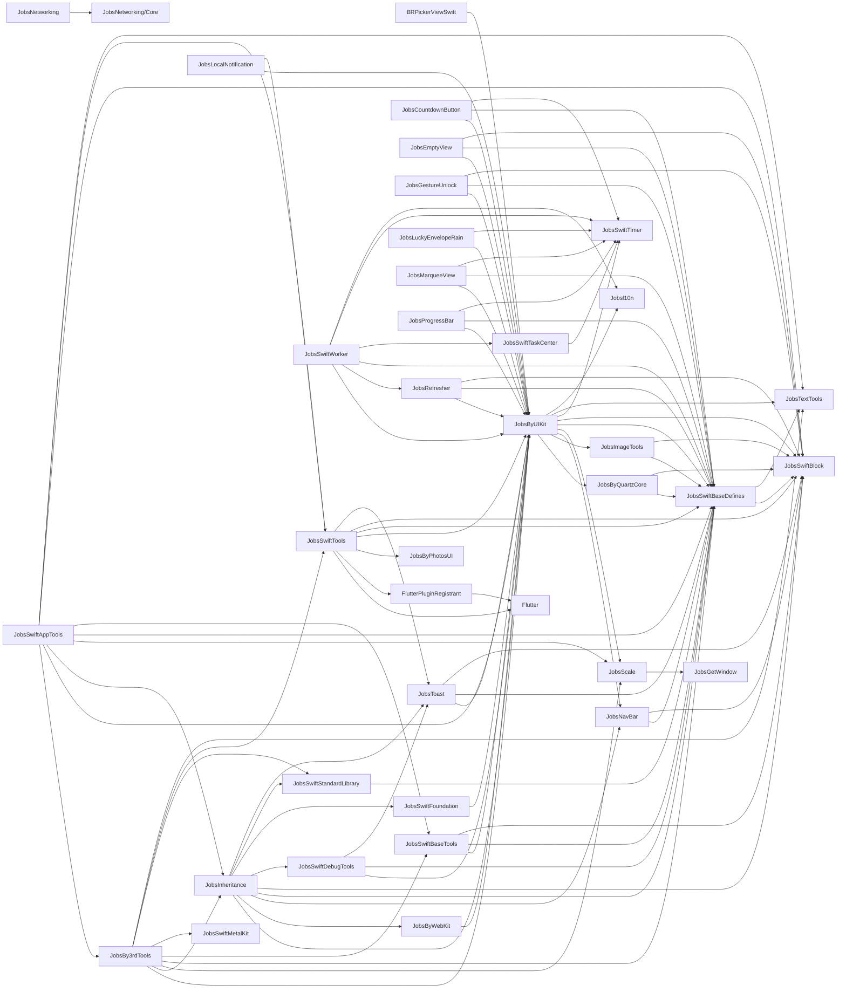

# Podspec 依赖分析报告

[toc]

## 🔥 前言 <a href="#前言" style="font-size:17px; color:green;"><b>🔼</b></a> <a href="#🔚" style="font-size:17px; color:green;"><b>🔽</b></a>

- 分析目录：`/Users/jobs/Documents/Github/JobsBaseConfig/JobsBaseConfig@JobsSwiftBaseConfigDemo`
- 生成时间：`2026-05-02 20:00:40`
- Podspec 数量：`39`
- 0 依赖 Pod 数量：`9`
- 全部依赖边数量：`144`
- 仓库内 Pod 依赖边数量：`96`
- 外部依赖来源注释文件数量：`3`
- 已识别外部依赖来源链接数量：`64`

> 更易读的动态关系图见：`PodspecDependencies_interactive.html`。

## 一、总览 <a href="#前言" style="font-size:17px; color:green;"><b>🔼</b></a> <a href="#🔚" style="font-size:17px; color:green;"><b>🔽</b></a>

| Pod | Podspec | 依赖数量 | 依赖 |
|---|---|---:|---|
| [**BRPickerViewSwift**](#BRPickerViewSwift) | `JobsByPods/BRPickerViewSwift@Pods/BRPickerViewSwift.podspec` | 2 | [JobsByUIKit](#JobsByUIKit), [SnapKit](https://github.com/SnapKit/SnapKit) |
| [**Flutter**](#Flutter) | `my_flutter/.ios/Flutter/Flutter.podspec` | 0 |  |
| [**FlutterPluginRegistrant**](#FlutterPluginRegistrant) | `my_flutter/.ios/Flutter/FlutterPluginRegistrant/FlutterPluginRegistrant.podspec` | 1 | [Flutter](#Flutter) |
| [**JobsBy3rdTools**](#JobsBy3rdTools) | `JobsByPods/JobsBy3rdTools@Pods/JobsBy3rdTools.podspec` | 18 | [BMPlayer](https://github.com/BrikerMan/BMPlayer), [GKNavigationBarSwift](https://github.com/QuintGao/GKNavigationBarSwift), [JXSegmentedView](https://github.com/pujiaxin33/JXSegmentedView), [JobsByUIKit](#JobsByUIKit), [JobsInheritance](#JobsInheritance), [JobsScale](#JobsScale), [JobsSwiftBaseDefines](#JobsSwiftBaseDefines), [JobsSwiftBaseTools](#JobsSwiftBaseTools), [JobsSwiftMetalKit](#JobsSwiftMetalKit), [JobsSwiftStandardLibrary](#JobsSwiftStandardLibrary), [JobsSwiftTools](#JobsSwiftTools), [JobsTextTools](#JobsTextTools), [Kingfisher](https://github.com/onevcat/Kingfisher), [MJRefresh](https://github.com/CoderMJLee/MJRefresh), [SDWebImage](https://github.com/SDWebImage/SDWebImage), [SnapKit](https://github.com/SnapKit/SnapKit), [SwiftEntryKit](https://github.com/huri000/SwiftEntryKit), [YTKNetwork](https://github.com/kanyun-inc/YTKNetwork) |
| [**JobsByPDFKit**](#JobsByPDFKit) | `JobsByPods/JobsByPDFKit@Pods/JobsByPDFKit.podspec` | 0 |  |
| [**JobsByPhotosUI**](#JobsByPhotosUI) | `JobsByPods/JobsByPhotosUI@Pods/JobsByPhotosUI.podspec` | 0 |  |
| [**JobsByQuartzCore**](#JobsByQuartzCore) | `JobsByPods/JobsByQuartzCore@Pods/JobsByQuartzCore.podspec` | 2 | [JobsSwiftBaseDefines](#JobsSwiftBaseDefines), [JobsSwiftBlock](#JobsSwiftBlock) |
| [**JobsByUIKit**](#JobsByUIKit) | `JobsByPods/JobsByUIKit@Pods/JobsByUIKit.podspec` | 20 | [ESPullToRefresh](https://github.com/eggswift/pull-to-refresh), [GKNavigationBarSwift](https://github.com/QuintGao/GKNavigationBarSwift), [JobsByQuartzCore](#JobsByQuartzCore), [JobsImageTools](#JobsImageTools), [JobsNavBar](#JobsNavBar), [JobsScale](#JobsScale), [JobsSwiftBaseDefines](#JobsSwiftBaseDefines), [JobsSwiftBlock](#JobsSwiftBlock), [JobsSwiftTimer](#JobsSwiftTimer), [JobsTextTools](#JobsTextTools), [Jobsl10n](#Jobsl10n), [Kingfisher](https://github.com/onevcat/Kingfisher), [NSObject+Rx](https://github.com/RxSwiftCommunity/NSObject-Rx), [RxCocoa](https://github.com/ReactiveX/RxSwift), [RxRelay](https://cocoapods.org/pods/RxRelay), [RxSwift](https://github.com/ReactiveX/RxSwift), [SVGKit](https://github.com/SVGKit/SVGKit), [SkeletonView](https://github.com/Juanpe/SkeletonView), [SnapKit](https://github.com/SnapKit/SnapKit), [lottie-ios](https://github.com/airbnb/lottie-ios) |
| [**JobsByWebKit**](#JobsByWebKit) | `JobsByPods/JobsByWebKit@Pods/JobsByWebKit.podspec` | 1 | [JobsByUIKit](#JobsByUIKit) |
| [**JobsCountdownButton**](#JobsCountdownButton) | `JobsByPods/JobsCountdownButton@Pods/JobsCountdownButton.podspec` | 3 | [JobsByUIKit](#JobsByUIKit), [JobsSwiftBaseDefines](#JobsSwiftBaseDefines), [JobsSwiftTimer](#JobsSwiftTimer) |
| [**JobsCryptoKit**](#JobsCryptoKit) | `JobsByPods/JobsCryptoKit@Pods/JobsCryptoKit.podspec` | 0 |  |
| [**JobsEmptyView**](#JobsEmptyView) | `JobsByPods/JobsEmptyView@Pods/JobsEmptyView.podspec` | 4 | [JobsByUIKit](#JobsByUIKit), [JobsSwiftBaseDefines](#JobsSwiftBaseDefines), [JobsSwiftBlock](#JobsSwiftBlock), [SnapKit](https://github.com/SnapKit/SnapKit) |
| [**JobsGestureUnlock**](#JobsGestureUnlock) | `JobsByPods/JobsGestureUnlock@Pods/JobsGestureUnlock.podspec` | 4 | [JobsByUIKit](#JobsByUIKit), [JobsSwiftBaseDefines](#JobsSwiftBaseDefines), [JobsSwiftBlock](#JobsSwiftBlock), [SnapKit](https://github.com/SnapKit/SnapKit) |
| [**JobsGetWindow**](#JobsGetWindow) | `JobsByPods/JobsGetWindow@Pods/JobsGetWindow.podspec` | 0 |  |
| [**JobsImageTools**](#JobsImageTools) | `JobsByPods/JobsImageTools@Pods/JobsImageTools.podspec` | 4 | [JobsSwiftBaseDefines](#JobsSwiftBaseDefines), [JobsSwiftBlock](#JobsSwiftBlock), [Kingfisher](https://github.com/onevcat/Kingfisher), [SDWebImage](https://github.com/SDWebImage/SDWebImage) |
| [**JobsInheritance**](#JobsInheritance) | `JobsByPods/JobsInheritance@Pods/JobsInheritance.podspec` | 11 | [GKNavigationBarSwift](https://github.com/QuintGao/GKNavigationBarSwift), [JobsByUIKit](#JobsByUIKit), [JobsByWebKit](#JobsByWebKit), [JobsNavBar](#JobsNavBar), [JobsSwiftBaseDefines](#JobsSwiftBaseDefines), [JobsSwiftBlock](#JobsSwiftBlock), [JobsSwiftDebugTools](#JobsSwiftDebugTools), [JobsSwiftFoundation](#JobsSwiftFoundation), [JobsSwiftStandardLibrary](#JobsSwiftStandardLibrary), [JobsToast](#JobsToast), [SnapKit](https://github.com/SnapKit/SnapKit) |
| [**JobsLocalNotification**](#JobsLocalNotification) | `JobsByPods/JobsLocalNotification@Pods/JobsLocalNotification.podspec` | 2 | [JobsByUIKit](#JobsByUIKit), [JobsSwiftTools](#JobsSwiftTools) |
| [**JobsLuckyEnvelopeRain**](#JobsLuckyEnvelopeRain) | `JobsByPods/JobsLuckyEnvelopeRain@Pods/JobsLuckyEnvelopeRain.podspec` | 3 | [JobsByUIKit](#JobsByUIKit), [JobsSwiftTimer](#JobsSwiftTimer), [SnapKit](https://github.com/SnapKit/SnapKit) |
| [**JobsMarqueeView**](#JobsMarqueeView) | `JobsByPods/JobsMarqueeView@Pods/JobsMarqueeView.podspec` | 3 | [JobsByUIKit](#JobsByUIKit), [JobsSwiftBaseDefines](#JobsSwiftBaseDefines), [JobsSwiftTimer](#JobsSwiftTimer) |
| [**JobsNavBar**](#JobsNavBar) | `JobsByPods/JobsNavBar@Pods/JobsNavBar.podspec` | 4 | [JobsSwiftBaseDefines](#JobsSwiftBaseDefines), [JobsSwiftBlock](#JobsSwiftBlock), [SnapKit](https://github.com/SnapKit/SnapKit), [SwiftMessages](https://github.com/SwiftKickMobile/SwiftMessages) |
| [**JobsNetworking**](#JobsNetworking) | `JobsByPods/JobsNetworking@Pods/JobsNetworking.podspec` | 3 | [Alamofire](https://github.com/Alamofire/Alamofire), [JobsNetworking/Core](#JobsNetworking), [PromiseKit](https://github.com/mxcl/PromiseKit) |
| [**JobsProgressBar**](#JobsProgressBar) | `JobsByPods/JobsProgressBar@Pods/JobsProgressBar.podspec` | 4 | [JobsByUIKit](#JobsByUIKit), [JobsSwiftBaseDefines](#JobsSwiftBaseDefines), [JobsSwiftTimer](#JobsSwiftTimer), [SnapKit](https://github.com/SnapKit/SnapKit) |
| [**JobsRefresher**](#JobsRefresher) | `JobsByPods/JobsRefresher@Pods/JobsRefresher.podspec` | 5 | [JobsByUIKit](#JobsByUIKit), [JobsSwiftBaseDefines](#JobsSwiftBaseDefines), [JobsSwiftBlock](#JobsSwiftBlock), [SnapKit](https://github.com/SnapKit/SnapKit), [lottie-ios](https://github.com/airbnb/lottie-ios) |
| [**JobsScale**](#JobsScale) | `JobsByPods/JobsScale@Pods/JobsScale.podspec` | 1 | [JobsGetWindow](#JobsGetWindow) |
| [**JobsSwiftAppTools**](#JobsSwiftAppTools) | `JobsByPods/JobsSwiftAppTools@Pods/JobsSwiftAppTools.podspec` | 11 | [JobsBy3rdTools](#JobsBy3rdTools), [JobsByUIKit](#JobsByUIKit), [JobsInheritance](#JobsInheritance), [JobsScale](#JobsScale), [JobsSwiftBaseDefines](#JobsSwiftBaseDefines), [JobsSwiftBaseTools](#JobsSwiftBaseTools), [JobsSwiftBlock](#JobsSwiftBlock), [JobsSwiftTools](#JobsSwiftTools), [JobsTextTools](#JobsTextTools), [SnapKit](https://github.com/SnapKit/SnapKit), [SwiftEntryKit](https://github.com/huri000/SwiftEntryKit) |
| [**JobsSwiftBaseDefines**](#JobsSwiftBaseDefines) | `JobsByPods/JobsSwiftBaseDefines@Pods/JobsSwiftBaseDefines.podspec` | 2 | [JobsSwiftBlock](#JobsSwiftBlock), [JobsTextTools](#JobsTextTools) |
| [**JobsSwiftBaseTools**](#JobsSwiftBaseTools) | `JobsByPods/JobsSwiftBaseTools@Pods/JobsSwiftBaseTools.podspec` | 8 | [Alamofire](https://github.com/Alamofire/Alamofire), [JobsByUIKit](#JobsByUIKit), [JobsSwiftBaseDefines](#JobsSwiftBaseDefines), [JobsSwiftBlock](#JobsSwiftBlock), [NSObject+Rx](https://github.com/RxSwiftCommunity/NSObject-Rx), [RxCocoa](https://github.com/ReactiveX/RxSwift), [RxSwift](https://github.com/ReactiveX/RxSwift), [SnapKit](https://github.com/SnapKit/SnapKit) |
| [**JobsSwiftBlock**](#JobsSwiftBlock) | `JobsByPods/JobsSwiftBlock@Pods/JobsSwiftBlock.podspec` | 4 | [Kingfisher](https://github.com/onevcat/Kingfisher), [Moya](https://github.com/Moya/Moya), [SnapKit](https://github.com/SnapKit/SnapKit), [YTKNetwork](https://github.com/kanyun-inc/YTKNetwork) |
| [**JobsSwiftDebugTools**](#JobsSwiftDebugTools) | `JobsByPods/JobsSwiftDebugTools@Pods/JobsSwiftDebugTools.podspec` | 3 | [JobsByUIKit](#JobsByUIKit), [JobsSwiftBaseDefines](#JobsSwiftBaseDefines), [JobsToast](#JobsToast) |
| [**JobsSwiftFoundation**](#JobsSwiftFoundation) | `JobsByPods/JobsSwiftFoundation@Pods/JobsSwiftFoundation.podspec` | 1 | [JobsByUIKit](#JobsByUIKit) |
| [**JobsSwiftMetalKit**](#JobsSwiftMetalKit) | `JobsByPods/MetalKit@Pods/JobsSwiftMetalKit.podspec` | 0 |  |
| [**JobsSwiftStandardLibrary**](#JobsSwiftStandardLibrary) | `JobsByPods/JobsSwiftStandardLibrary@Pods/JobsSwiftStandardLibrary.podspec` | 1 | [JobsSwiftBaseDefines](#JobsSwiftBaseDefines) |
| [**JobsSwiftTaskCenter**](#JobsSwiftTaskCenter) | `JobsByPods/JobsSwiftTaskCenter@Pods/JobsSwiftTaskCenter.podspec` | 1 | [JobsSwiftTimer](#JobsSwiftTimer) |
| [**JobsSwiftTimer**](#JobsSwiftTimer) | `JobsByPods/JobsSwiftTimer@Pods/JobsSwiftTimer.podspec` | 0 |  |
| [**JobsSwiftTools**](#JobsSwiftTools) | `JobsByPods/JobsSwiftTools@Pods/JobsSwiftTools.podspec` | 7 | [Flutter](#Flutter), [FlutterPluginRegistrant](#FlutterPluginRegistrant), [JobsByPhotosUI](#JobsByPhotosUI), [JobsByUIKit](#JobsByUIKit), [JobsSwiftBaseDefines](#JobsSwiftBaseDefines), [JobsSwiftBlock](#JobsSwiftBlock), [JobsToast](#JobsToast) |
| [**JobsSwiftWorker**](#JobsSwiftWorker) | `JobsByPods/JobsSwiftWorker@Pods/JobsSwiftWorker.podspec` | 7 | [JobsByUIKit](#JobsByUIKit), [JobsRefresher](#JobsRefresher), [JobsSwiftBaseDefines](#JobsSwiftBaseDefines), [JobsSwiftTaskCenter](#JobsSwiftTaskCenter), [JobsSwiftTimer](#JobsSwiftTimer), [Jobsl10n](#Jobsl10n), [SnapKit](https://github.com/SnapKit/SnapKit) |
| [**JobsTextTools**](#JobsTextTools) | `JobsByPods/JobsTextTools@Pods/JobsTextTools.podspec` | 0 |  |
| [**JobsToast**](#JobsToast) | `JobsByPods/JobsToast@Pods/JobsToast.podspec` | 4 | [JobsByUIKit](#JobsByUIKit), [JobsSwiftBaseDefines](#JobsSwiftBaseDefines), [JobsSwiftBlock](#JobsSwiftBlock), [SnapKit](https://github.com/SnapKit/SnapKit) |
| [**Jobsl10n**](#Jobsl10n) | `JobsByPods/Jobsl10n@Pods/Jobsl10n.podspec` | 0 |  |

## 二、0 依赖 Pod <a href="#前言" style="font-size:17px; color:green;"><b>🔼</b></a> <a href="#🔚" style="font-size:17px; color:green;"><b>🔽</b></a>

| Pod | Podspec |
|---|---|
| [**Flutter**](#Flutter) | `my_flutter/.ios/Flutter/Flutter.podspec` |
| [**JobsByPDFKit**](#JobsByPDFKit) | `JobsByPods/JobsByPDFKit@Pods/JobsByPDFKit.podspec` |
| [**JobsByPhotosUI**](#JobsByPhotosUI) | `JobsByPods/JobsByPhotosUI@Pods/JobsByPhotosUI.podspec` |
| [**JobsCryptoKit**](#JobsCryptoKit) | `JobsByPods/JobsCryptoKit@Pods/JobsCryptoKit.podspec` |
| [**JobsGetWindow**](#JobsGetWindow) | `JobsByPods/JobsGetWindow@Pods/JobsGetWindow.podspec` |
| [**JobsSwiftMetalKit**](#JobsSwiftMetalKit) | `JobsByPods/MetalKit@Pods/JobsSwiftMetalKit.podspec` |
| [**JobsSwiftTimer**](#JobsSwiftTimer) | `JobsByPods/JobsSwiftTimer@Pods/JobsSwiftTimer.podspec` |
| [**JobsTextTools**](#JobsTextTools) | `JobsByPods/JobsTextTools@Pods/JobsTextTools.podspec` |
| [**Jobsl10n**](#Jobsl10n) | `JobsByPods/Jobsl10n@Pods/Jobsl10n.podspec` |

## 三、仓库内 Pod 相互依赖图 Mermaid <a href="#前言" style="font-size:17px; color:green;"><b>🔼</b></a> <a href="#🔚" style="font-size:17px; color:green;"><b>🔽</b></a>

只展示依赖目标也在本次扫描到的 `.podspec` 里存在的关系。

## 四、全部依赖图 Mermaid <a href="#前言" style="font-size:17px; color:green;"><b>🔼</b></a> <a href="#🔚" style="font-size:17px; color:green;"><b>🔽</b></a>

## 五、明细 <a href="#前言" style="font-size:17px; color:green;"><b>🔼</b></a> <a href="#🔚" style="font-size:17px; color:green;"><b>🔽</b></a>

### 1、BRPickerViewSwift <a href="#前言" style="font-size:17px; color:green;"><b>🔼</b></a> <a href="#🔚" style="font-size:17px; color:green;"><b>🔽</b></a>

```mermaid
flowchart LR
  Nd4b3dbc3878b["BRPickerViewSwift"] --> N32038075ad22["JobsByUIKit"]
  Nd4b3dbc3878b["BRPickerViewSwift"] --> N1f6f7544eaea["SnapKit"]
  N14747c15d95a["FlutterPluginRegistrant"] --> Nc047b10eee76["Flutter"]
  Nfe1ff997a5d3["JobsBy3rdTools"] --> N4600deacaa5d["BMPlayer"]
  Nfe1ff997a5d3["JobsBy3rdTools"] --> N83033e9c4a40["GKNavigationBarSwift"]
  Nfe1ff997a5d3["JobsBy3rdTools"] --> Ncdd860399dd5["JXSegmentedView"]
  Nfe1ff997a5d3["JobsBy3rdTools"] --> N32038075ad22["JobsByUIKit"]
  Nfe1ff997a5d3["JobsBy3rdTools"] --> N7a9c7bee01af["JobsInheritance"]
  Nfe1ff997a5d3["JobsBy3rdTools"] --> Nc605e6b5421d["JobsScale"]
  Nfe1ff997a5d3["JobsBy3rdTools"] --> N8dbe54185e82["JobsSwiftBaseDefines"]
  Nfe1ff997a5d3["JobsBy3rdTools"] --> N5c1ec45910c6["JobsSwiftBaseTools"]
  Nfe1ff997a5d3["JobsBy3rdTools"] --> N9ab5a04190d8["JobsSwiftMetalKit"]
  Nfe1ff997a5d3["JobsBy3rdTools"] --> N8f1bbfe879cc["JobsSwiftStandardLibrary"]
  Nfe1ff997a5d3["JobsBy3rdTools"] --> Na568a595b2c6["JobsSwiftTools"]
  Nfe1ff997a5d3["JobsBy3rdTools"] --> Nfc90a51d0828["JobsTextTools"]
  Nfe1ff997a5d3["JobsBy3rdTools"] --> Naa66d7428d73["Kingfisher"]
  Nfe1ff997a5d3["JobsBy3rdTools"] --> N0fbdcc518572["MJRefresh"]
  Nfe1ff997a5d3["JobsBy3rdTools"] --> N1173b6117a2c["SDWebImage"]
  Nfe1ff997a5d3["JobsBy3rdTools"] --> N1f6f7544eaea["SnapKit"]
  Nfe1ff997a5d3["JobsBy3rdTools"] --> N3d7752c6a15e["SwiftEntryKit"]
  Nfe1ff997a5d3["JobsBy3rdTools"] --> N14727719233d["YTKNetwork"]
  Nc743e46b146a["JobsByQuartzCore"] --> N8dbe54185e82["JobsSwiftBaseDefines"]
  Nc743e46b146a["JobsByQuartzCore"] --> Nc7567108c45a["JobsSwiftBlock"]
  N32038075ad22["JobsByUIKit"] --> N7f51a56e8eb4["ESPullToRefresh"]
  N32038075ad22["JobsByUIKit"] --> N83033e9c4a40["GKNavigationBarSwift"]
  N32038075ad22["JobsByUIKit"] --> Nc743e46b146a["JobsByQuartzCore"]
  N32038075ad22["JobsByUIKit"] --> N6dbcbd6c076c["JobsImageTools"]
  N32038075ad22["JobsByUIKit"] --> Nd9dbfc611984["JobsNavBar"]
  N32038075ad22["JobsByUIKit"] --> Nc605e6b5421d["JobsScale"]
  N32038075ad22["JobsByUIKit"] --> N8dbe54185e82["JobsSwiftBaseDefines"]
  N32038075ad22["JobsByUIKit"] --> Nc7567108c45a["JobsSwiftBlock"]
  N32038075ad22["JobsByUIKit"] --> Nfd94adb51598["JobsSwiftTimer"]
  N32038075ad22["JobsByUIKit"] --> Nfc90a51d0828["JobsTextTools"]
  N32038075ad22["JobsByUIKit"] --> N9dff37c8d77e["Jobsl10n"]
  N32038075ad22["JobsByUIKit"] --> Naa66d7428d73["Kingfisher"]
  N32038075ad22["JobsByUIKit"] --> N5a1ee480a7b5["NSObject+Rx"]
  N32038075ad22["JobsByUIKit"] --> N3c1fed1bce1e["RxCocoa"]
  N32038075ad22["JobsByUIKit"] --> N924072f9470a["RxRelay"]
  N32038075ad22["JobsByUIKit"] --> N2ece58ac4857["RxSwift"]
  N32038075ad22["JobsByUIKit"] --> Nd490c163f52c["SVGKit"]
  N32038075ad22["JobsByUIKit"] --> Nccf54c6c215b["SkeletonView"]
  N32038075ad22["JobsByUIKit"] --> N1f6f7544eaea["SnapKit"]
  N32038075ad22["JobsByUIKit"] --> N71d0944e102a["lottie-ios"]
  N1f955db97679["JobsByWebKit"] --> N32038075ad22["JobsByUIKit"]
  N8a2865d24b8e["JobsCountdownButton"] --> N32038075ad22["JobsByUIKit"]
  N8a2865d24b8e["JobsCountdownButton"] --> N8dbe54185e82["JobsSwiftBaseDefines"]
  N8a2865d24b8e["JobsCountdownButton"] --> Nfd94adb51598["JobsSwiftTimer"]
  Nb2853a7530c8["JobsEmptyView"] --> N32038075ad22["JobsByUIKit"]
  Nb2853a7530c8["JobsEmptyView"] --> N8dbe54185e82["JobsSwiftBaseDefines"]
  Nb2853a7530c8["JobsEmptyView"] --> Nc7567108c45a["JobsSwiftBlock"]
  Nb2853a7530c8["JobsEmptyView"] --> N1f6f7544eaea["SnapKit"]
  N8ce46417a954["JobsGestureUnlock"] --> N32038075ad22["JobsByUIKit"]
  N8ce46417a954["JobsGestureUnlock"] --> N8dbe54185e82["JobsSwiftBaseDefines"]
  N8ce46417a954["JobsGestureUnlock"] --> Nc7567108c45a["JobsSwiftBlock"]
  N8ce46417a954["JobsGestureUnlock"] --> N1f6f7544eaea["SnapKit"]
  N6dbcbd6c076c["JobsImageTools"] --> N8dbe54185e82["JobsSwiftBaseDefines"]
  N6dbcbd6c076c["JobsImageTools"] --> Nc7567108c45a["JobsSwiftBlock"]
  N6dbcbd6c076c["JobsImageTools"] --> Naa66d7428d73["Kingfisher"]
  N6dbcbd6c076c["JobsImageTools"] --> N1173b6117a2c["SDWebImage"]
  N7a9c7bee01af["JobsInheritance"] --> N83033e9c4a40["GKNavigationBarSwift"]
  N7a9c7bee01af["JobsInheritance"] --> N32038075ad22["JobsByUIKit"]
  N7a9c7bee01af["JobsInheritance"] --> N1f955db97679["JobsByWebKit"]
  N7a9c7bee01af["JobsInheritance"] --> Nd9dbfc611984["JobsNavBar"]
  N7a9c7bee01af["JobsInheritance"] --> N8dbe54185e82["JobsSwiftBaseDefines"]
  N7a9c7bee01af["JobsInheritance"] --> Nc7567108c45a["JobsSwiftBlock"]
  N7a9c7bee01af["JobsInheritance"] --> N807eaeffe5a4["JobsSwiftDebugTools"]
  N7a9c7bee01af["JobsInheritance"] --> N37fa4b9e4579["JobsSwiftFoundation"]
  N7a9c7bee01af["JobsInheritance"] --> N8f1bbfe879cc["JobsSwiftStandardLibrary"]
  N7a9c7bee01af["JobsInheritance"] --> N9817f6c3f4e6["JobsToast"]
  N7a9c7bee01af["JobsInheritance"] --> N1f6f7544eaea["SnapKit"]
  N21756f8f29e8["JobsLocalNotification"] --> N32038075ad22["JobsByUIKit"]
  N21756f8f29e8["JobsLocalNotification"] --> Na568a595b2c6["JobsSwiftTools"]
  N899875e07d1b["JobsLuckyEnvelopeRain"] --> N32038075ad22["JobsByUIKit"]
  N899875e07d1b["JobsLuckyEnvelopeRain"] --> Nfd94adb51598["JobsSwiftTimer"]
  N899875e07d1b["JobsLuckyEnvelopeRain"] --> N1f6f7544eaea["SnapKit"]
  N9e7dc84491e8["JobsMarqueeView"] --> N32038075ad22["JobsByUIKit"]
  N9e7dc84491e8["JobsMarqueeView"] --> N8dbe54185e82["JobsSwiftBaseDefines"]
  N9e7dc84491e8["JobsMarqueeView"] --> Nfd94adb51598["JobsSwiftTimer"]
  Nd9dbfc611984["JobsNavBar"] --> N8dbe54185e82["JobsSwiftBaseDefines"]
  Nd9dbfc611984["JobsNavBar"] --> Nc7567108c45a["JobsSwiftBlock"]
  Nd9dbfc611984["JobsNavBar"] --> N1f6f7544eaea["SnapKit"]
  Nd9dbfc611984["JobsNavBar"] --> N3ee0366c374e["SwiftMessages"]
  Nf3793743ec40["JobsNetworking"] --> Nda208d9cbd49["Alamofire"]
  Nf3793743ec40["JobsNetworking"] --> N29fac73ec90a["JobsNetworking/Core"]
  Nf3793743ec40["JobsNetworking"] --> Naf18e27d86f8["PromiseKit"]
  Na62a2c62f899["JobsProgressBar"] --> N32038075ad22["JobsByUIKit"]
  Na62a2c62f899["JobsProgressBar"] --> N8dbe54185e82["JobsSwiftBaseDefines"]
  Na62a2c62f899["JobsProgressBar"] --> Nfd94adb51598["JobsSwiftTimer"]
  Na62a2c62f899["JobsProgressBar"] --> N1f6f7544eaea["SnapKit"]
  N4f19e371e55e["JobsRefresher"] --> N32038075ad22["JobsByUIKit"]
  N4f19e371e55e["JobsRefresher"] --> N8dbe54185e82["JobsSwiftBaseDefines"]
  N4f19e371e55e["JobsRefresher"] --> Nc7567108c45a["JobsSwiftBlock"]
  N4f19e371e55e["JobsRefresher"] --> N1f6f7544eaea["SnapKit"]
  N4f19e371e55e["JobsRefresher"] --> N71d0944e102a["lottie-ios"]
  Nc605e6b5421d["JobsScale"] --> N10ee0e68a559["JobsGetWindow"]
  N7203a303dc13["JobsSwiftAppTools"] --> Nfe1ff997a5d3["JobsBy3rdTools"]
  N7203a303dc13["JobsSwiftAppTools"] --> N32038075ad22["JobsByUIKit"]
  N7203a303dc13["JobsSwiftAppTools"] --> N7a9c7bee01af["JobsInheritance"]
  N7203a303dc13["JobsSwiftAppTools"] --> Nc605e6b5421d["JobsScale"]
  N7203a303dc13["JobsSwiftAppTools"] --> N8dbe54185e82["JobsSwiftBaseDefines"]
  N7203a303dc13["JobsSwiftAppTools"] --> N5c1ec45910c6["JobsSwiftBaseTools"]
  N7203a303dc13["JobsSwiftAppTools"] --> Nc7567108c45a["JobsSwiftBlock"]
  N7203a303dc13["JobsSwiftAppTools"] --> Na568a595b2c6["JobsSwiftTools"]
  N7203a303dc13["JobsSwiftAppTools"] --> Nfc90a51d0828["JobsTextTools"]
  N7203a303dc13["JobsSwiftAppTools"] --> N1f6f7544eaea["SnapKit"]
  N7203a303dc13["JobsSwiftAppTools"] --> N3d7752c6a15e["SwiftEntryKit"]
  N8dbe54185e82["JobsSwiftBaseDefines"] --> Nc7567108c45a["JobsSwiftBlock"]
  N8dbe54185e82["JobsSwiftBaseDefines"] --> Nfc90a51d0828["JobsTextTools"]
  N5c1ec45910c6["JobsSwiftBaseTools"] --> Nda208d9cbd49["Alamofire"]
  N5c1ec45910c6["JobsSwiftBaseTools"] --> N32038075ad22["JobsByUIKit"]
  N5c1ec45910c6["JobsSwiftBaseTools"] --> N8dbe54185e82["JobsSwiftBaseDefines"]
  N5c1ec45910c6["JobsSwiftBaseTools"] --> Nc7567108c45a["JobsSwiftBlock"]
  N5c1ec45910c6["JobsSwiftBaseTools"] --> N5a1ee480a7b5["NSObject+Rx"]
  N5c1ec45910c6["JobsSwiftBaseTools"] --> N3c1fed1bce1e["RxCocoa"]
  N5c1ec45910c6["JobsSwiftBaseTools"] --> N2ece58ac4857["RxSwift"]
  N5c1ec45910c6["JobsSwiftBaseTools"] --> N1f6f7544eaea["SnapKit"]
  Nc7567108c45a["JobsSwiftBlock"] --> Naa66d7428d73["Kingfisher"]
  Nc7567108c45a["JobsSwiftBlock"] --> N8a7fbfbb0330["Moya"]
  Nc7567108c45a["JobsSwiftBlock"] --> N1f6f7544eaea["SnapKit"]
  Nc7567108c45a["JobsSwiftBlock"] --> N14727719233d["YTKNetwork"]
  N807eaeffe5a4["JobsSwiftDebugTools"] --> N32038075ad22["JobsByUIKit"]
  N807eaeffe5a4["JobsSwiftDebugTools"] --> N8dbe54185e82["JobsSwiftBaseDefines"]
  N807eaeffe5a4["JobsSwiftDebugTools"] --> N9817f6c3f4e6["JobsToast"]
  N37fa4b9e4579["JobsSwiftFoundation"] --> N32038075ad22["JobsByUIKit"]
  N8f1bbfe879cc["JobsSwiftStandardLibrary"] --> N8dbe54185e82["JobsSwiftBaseDefines"]
  Naf3906ede4aa["JobsSwiftTaskCenter"] --> Nfd94adb51598["JobsSwiftTimer"]
  Na568a595b2c6["JobsSwiftTools"] --> Nc047b10eee76["Flutter"]
  Na568a595b2c6["JobsSwiftTools"] --> N14747c15d95a["FlutterPluginRegistrant"]
  Na568a595b2c6["JobsSwiftTools"] --> Nca216f1c5269["JobsByPhotosUI"]
  Na568a595b2c6["JobsSwiftTools"] --> N32038075ad22["JobsByUIKit"]
  Na568a595b2c6["JobsSwiftTools"] --> N8dbe54185e82["JobsSwiftBaseDefines"]
  Na568a595b2c6["JobsSwiftTools"] --> Nc7567108c45a["JobsSwiftBlock"]
  Na568a595b2c6["JobsSwiftTools"] --> N9817f6c3f4e6["JobsToast"]
  N2f0325b518dd["JobsSwiftWorker"] --> N32038075ad22["JobsByUIKit"]
  N2f0325b518dd["JobsSwiftWorker"] --> N4f19e371e55e["JobsRefresher"]
  N2f0325b518dd["JobsSwiftWorker"] --> N8dbe54185e82["JobsSwiftBaseDefines"]
  N2f0325b518dd["JobsSwiftWorker"] --> Naf3906ede4aa["JobsSwiftTaskCenter"]
  N2f0325b518dd["JobsSwiftWorker"] --> Nfd94adb51598["JobsSwiftTimer"]
  N2f0325b518dd["JobsSwiftWorker"] --> N9dff37c8d77e["Jobsl10n"]
  N2f0325b518dd["JobsSwiftWorker"] --> N1f6f7544eaea["SnapKit"]
  N9817f6c3f4e6["JobsToast"] --> N32038075ad22["JobsByUIKit"]
  N9817f6c3f4e6["JobsToast"] --> N8dbe54185e82["JobsSwiftBaseDefines"]
  N9817f6c3f4e6["JobsToast"] --> Nc7567108c45a["JobsSwiftBlock"]
  N9817f6c3f4e6["JobsToast"] --> N1f6f7544eaea["SnapKit"]
```

Podspec：`JobsByPods/BRPickerViewSwift@Pods/BRPickerViewSwift.podspec`

| 声明位置 | 依赖 | 版本/参数 |
|---|---|---|
| [**BRPickerViewSwift**](#BRPickerViewSwift) | [JobsByUIKit](#JobsByUIKit) | `` |
| [**BRPickerViewSwift**](#BRPickerViewSwift) | [SnapKit](https://github.com/SnapKit/SnapKit) | `` |

### 2、Flutter <a href="#前言" style="font-size:17px; color:green;"><b>🔼</b></a> <a href="#🔚" style="font-size:17px; color:green;"><b>🔽</b></a>

Podspec：`my_flutter/.ios/Flutter/Flutter.podspec`

未发现依赖。

### 3、FlutterPluginRegistrant <a href="#前言" style="font-size:17px; color:green;"><b>🔼</b></a> <a href="#🔚" style="font-size:17px; color:green;"><b>🔽</b></a>

Podspec：`my_flutter/.ios/Flutter/FlutterPluginRegistrant/FlutterPluginRegistrant.podspec`

| 声明位置 | 依赖 | 版本/参数 |
|---|---|---|
| [**FlutterPluginRegistrant**](#FlutterPluginRegistrant) | [Flutter](#Flutter) | `` |

### 4、JobsBy3rdTools <a href="#前言" style="font-size:17px; color:green;"><b>🔼</b></a> <a href="#🔚" style="font-size:17px; color:green;"><b>🔽</b></a>

Podspec：`JobsByPods/JobsBy3rdTools@Pods/JobsBy3rdTools.podspec`

| 声明位置 | 依赖 | 版本/参数 |
|---|---|---|
| [**JobsBy3rdTools**](#JobsBy3rdTools) | [BMPlayer](https://github.com/BrikerMan/BMPlayer) | `` |
| [**JobsBy3rdTools**](#JobsBy3rdTools) | [GKNavigationBarSwift](https://github.com/QuintGao/GKNavigationBarSwift) | `` |
| [**JobsBy3rdTools**](#JobsBy3rdTools) | [JXSegmentedView](https://github.com/pujiaxin33/JXSegmentedView) | `` |
| [**JobsBy3rdTools**](#JobsBy3rdTools) | [JobsByUIKit](#JobsByUIKit) | `` |
| [**JobsBy3rdTools**](#JobsBy3rdTools) | [JobsInheritance](#JobsInheritance) | `` |
| [**JobsBy3rdTools**](#JobsBy3rdTools) | [JobsScale](#JobsScale) | `` |
| [**JobsBy3rdTools**](#JobsBy3rdTools) | [JobsSwiftBaseDefines](#JobsSwiftBaseDefines) | `` |
| [**JobsBy3rdTools**](#JobsBy3rdTools) | [JobsSwiftBaseTools](#JobsSwiftBaseTools) | `` |
| [**JobsBy3rdTools**](#JobsBy3rdTools) | [JobsSwiftMetalKit](#JobsSwiftMetalKit) | `` |
| [**JobsBy3rdTools**](#JobsBy3rdTools) | [JobsSwiftStandardLibrary](#JobsSwiftStandardLibrary) | `` |
| [**JobsBy3rdTools**](#JobsBy3rdTools) | [JobsSwiftTools](#JobsSwiftTools) | `` |
| [**JobsBy3rdTools**](#JobsBy3rdTools) | [JobsTextTools](#JobsTextTools) | `` |
| [**JobsBy3rdTools**](#JobsBy3rdTools) | [Kingfisher](https://github.com/onevcat/Kingfisher) | `` |
| [**JobsBy3rdTools**](#JobsBy3rdTools) | [MJRefresh](https://github.com/CoderMJLee/MJRefresh) | `` |
| [**JobsBy3rdTools**](#JobsBy3rdTools) | [SDWebImage](https://github.com/SDWebImage/SDWebImage) | `` |
| [**JobsBy3rdTools**](#JobsBy3rdTools) | [SDWebImage](https://github.com/SDWebImage/SDWebImage) | `` |
| [**JobsBy3rdTools**](#JobsBy3rdTools) | [SnapKit](https://github.com/SnapKit/SnapKit) | `` |
| [**JobsBy3rdTools**](#JobsBy3rdTools) | [SwiftEntryKit](https://github.com/huri000/SwiftEntryKit) | `` |
| [**JobsBy3rdTools**](#JobsBy3rdTools) | [YTKNetwork](https://github.com/kanyun-inc/YTKNetwork) | `` |

### 5、JobsByPDFKit <a href="#前言" style="font-size:17px; color:green;"><b>🔼</b></a> <a href="#🔚" style="font-size:17px; color:green;"><b>🔽</b></a>

Podspec：`JobsByPods/JobsByPDFKit@Pods/JobsByPDFKit.podspec`

未发现依赖。

### 6、JobsByPhotosUI <a href="#前言" style="font-size:17px; color:green;"><b>🔼</b></a> <a href="#🔚" style="font-size:17px; color:green;"><b>🔽</b></a>

Podspec：`JobsByPods/JobsByPhotosUI@Pods/JobsByPhotosUI.podspec`

未发现依赖。

### 7、JobsByQuartzCore <a href="#前言" style="font-size:17px; color:green;"><b>🔼</b></a> <a href="#🔚" style="font-size:17px; color:green;"><b>🔽</b></a>

Podspec：`JobsByPods/JobsByQuartzCore@Pods/JobsByQuartzCore.podspec`

| 声明位置 | 依赖 | 版本/参数 |
|---|---|---|
| [**JobsByQuartzCore**](#JobsByQuartzCore) | [JobsSwiftBaseDefines](#JobsSwiftBaseDefines) | `` |
| [**JobsByQuartzCore**](#JobsByQuartzCore) | [JobsSwiftBlock](#JobsSwiftBlock) | `` |

### 8、JobsByUIKit <a href="#前言" style="font-size:17px; color:green;"><b>🔼</b></a> <a href="#🔚" style="font-size:17px; color:green;"><b>🔽</b></a>

Podspec：`JobsByPods/JobsByUIKit@Pods/JobsByUIKit.podspec`

| 声明位置 | 依赖 | 版本/参数 |
|---|---|---|
| [**JobsByUIKit**](#JobsByUIKit) | [ESPullToRefresh](https://github.com/eggswift/pull-to-refresh) | `` |
| [**JobsByUIKit**](#JobsByUIKit) | [GKNavigationBarSwift](https://github.com/QuintGao/GKNavigationBarSwift) | `` |
| [**JobsByUIKit**](#JobsByUIKit) | [JobsByQuartzCore](#JobsByQuartzCore) | `` |
| [**JobsByUIKit**](#JobsByUIKit) | [JobsImageTools](#JobsImageTools) | `` |
| [**JobsByUIKit**](#JobsByUIKit) | [JobsNavBar](#JobsNavBar) | `` |
| [**JobsByUIKit**](#JobsByUIKit) | [JobsScale](#JobsScale) | `` |
| [**JobsByUIKit**](#JobsByUIKit) | [JobsSwiftBaseDefines](#JobsSwiftBaseDefines) | `` |
| [**JobsByUIKit**](#JobsByUIKit) | [JobsSwiftBlock](#JobsSwiftBlock) | `` |
| [**JobsByUIKit**](#JobsByUIKit) | [JobsSwiftTimer](#JobsSwiftTimer) | `` |
| [**JobsByUIKit**](#JobsByUIKit) | [JobsTextTools](#JobsTextTools) | `` |
| [**JobsByUIKit**](#JobsByUIKit) | [Jobsl10n](#Jobsl10n) | `` |
| [**JobsByUIKit**](#JobsByUIKit) | [Kingfisher](https://github.com/onevcat/Kingfisher) | `` |
| [**JobsByUIKit**](#JobsByUIKit) | [NSObject+Rx](https://github.com/RxSwiftCommunity/NSObject-Rx) | `` |
| [**JobsByUIKit**](#JobsByUIKit) | [RxCocoa](https://github.com/ReactiveX/RxSwift) | `` |
| [**JobsByUIKit**](#JobsByUIKit) | [RxRelay](https://cocoapods.org/pods/RxRelay) | `` |
| [**JobsByUIKit**](#JobsByUIKit) | [RxSwift](https://github.com/ReactiveX/RxSwift) | `` |
| [**JobsByUIKit**](#JobsByUIKit) | [SVGKit](https://github.com/SVGKit/SVGKit) | `` |
| [**JobsByUIKit**](#JobsByUIKit) | [SkeletonView](https://github.com/Juanpe/SkeletonView) | `` |
| [**JobsByUIKit**](#JobsByUIKit) | [SnapKit](https://github.com/SnapKit/SnapKit) | `` |
| [**JobsByUIKit**](#JobsByUIKit) | [lottie-ios](https://github.com/airbnb/lottie-ios) | `` |

### 9、JobsByWebKit <a href="#前言" style="font-size:17px; color:green;"><b>🔼</b></a> <a href="#🔚" style="font-size:17px; color:green;"><b>🔽</b></a>

Podspec：`JobsByPods/JobsByWebKit@Pods/JobsByWebKit.podspec`

| 声明位置 | 依赖 | 版本/参数 |
|---|---|---|
| [**JobsByWebKit**](#JobsByWebKit) | [JobsByUIKit](#JobsByUIKit) | `` |

### 10、JobsCountdownButton <a href="#前言" style="font-size:17px; color:green;"><b>🔼</b></a> <a href="#🔚" style="font-size:17px; color:green;"><b>🔽</b></a>

Podspec：`JobsByPods/JobsCountdownButton@Pods/JobsCountdownButton.podspec`

| 声明位置 | 依赖 | 版本/参数 |
|---|---|---|
| [**JobsCountdownButton**](#JobsCountdownButton) | [JobsByUIKit](#JobsByUIKit) | `` |
| [**JobsCountdownButton**](#JobsCountdownButton) | [JobsSwiftBaseDefines](#JobsSwiftBaseDefines) | `` |
| [**JobsCountdownButton**](#JobsCountdownButton) | [JobsSwiftTimer](#JobsSwiftTimer) | `` |

### 11、JobsCryptoKit <a href="#前言" style="font-size:17px; color:green;"><b>🔼</b></a> <a href="#🔚" style="font-size:17px; color:green;"><b>🔽</b></a>

Podspec：`JobsByPods/JobsCryptoKit@Pods/JobsCryptoKit.podspec`

未发现依赖。

### 12、JobsEmptyView <a href="#前言" style="font-size:17px; color:green;"><b>🔼</b></a> <a href="#🔚" style="font-size:17px; color:green;"><b>🔽</b></a>

Podspec：`JobsByPods/JobsEmptyView@Pods/JobsEmptyView.podspec`

| 声明位置 | 依赖 | 版本/参数 |
|---|---|---|
| [**JobsEmptyView**](#JobsEmptyView) | [JobsByUIKit](#JobsByUIKit) | `` |
| [**JobsEmptyView**](#JobsEmptyView) | [JobsSwiftBaseDefines](#JobsSwiftBaseDefines) | `` |
| [**JobsEmptyView**](#JobsEmptyView) | [JobsSwiftBlock](#JobsSwiftBlock) | `` |
| [**JobsEmptyView**](#JobsEmptyView) | [SnapKit](https://github.com/SnapKit/SnapKit) | `` |

### 13、JobsGestureUnlock <a href="#前言" style="font-size:17px; color:green;"><b>🔼</b></a> <a href="#🔚" style="font-size:17px; color:green;"><b>🔽</b></a>

Podspec：`JobsByPods/JobsGestureUnlock@Pods/JobsGestureUnlock.podspec`

| 声明位置 | 依赖 | 版本/参数 |
|---|---|---|
| [**JobsGestureUnlock**](#JobsGestureUnlock) | [JobsByUIKit](#JobsByUIKit) | `` |
| [**JobsGestureUnlock**](#JobsGestureUnlock) | [JobsSwiftBaseDefines](#JobsSwiftBaseDefines) | `` |
| [**JobsGestureUnlock**](#JobsGestureUnlock) | [JobsSwiftBlock](#JobsSwiftBlock) | `` |
| [**JobsGestureUnlock**](#JobsGestureUnlock) | [SnapKit](https://github.com/SnapKit/SnapKit) | `` |

### 14、JobsGetWindow <a href="#前言" style="font-size:17px; color:green;"><b>🔼</b></a> <a href="#🔚" style="font-size:17px; color:green;"><b>🔽</b></a>

Podspec：`JobsByPods/JobsGetWindow@Pods/JobsGetWindow.podspec`

未发现依赖。

### 15、JobsImageTools <a href="#前言" style="font-size:17px; color:green;"><b>🔼</b></a> <a href="#🔚" style="font-size:17px; color:green;"><b>🔽</b></a>

Podspec：`JobsByPods/JobsImageTools@Pods/JobsImageTools.podspec`

| 声明位置 | 依赖 | 版本/参数 |
|---|---|---|
| [**JobsImageTools**](#JobsImageTools) | [JobsSwiftBaseDefines](#JobsSwiftBaseDefines) | `` |
| [**JobsImageTools**](#JobsImageTools) | [JobsSwiftBlock](#JobsSwiftBlock) | `` |
| [**JobsImageTools**](#JobsImageTools) | [Kingfisher](https://github.com/onevcat/Kingfisher) | `` |
| [**JobsImageTools**](#JobsImageTools) | [SDWebImage](https://github.com/SDWebImage/SDWebImage) | `` |

### 16、JobsInheritance <a href="#前言" style="font-size:17px; color:green;"><b>🔼</b></a> <a href="#🔚" style="font-size:17px; color:green;"><b>🔽</b></a>

Podspec：`JobsByPods/JobsInheritance@Pods/JobsInheritance.podspec`

| 声明位置 | 依赖 | 版本/参数 |
|---|---|---|
| [**JobsInheritance**](#JobsInheritance) | [GKNavigationBarSwift](https://github.com/QuintGao/GKNavigationBarSwift) | `` |
| [**JobsInheritance**](#JobsInheritance) | [JobsByUIKit](#JobsByUIKit) | `` |
| [**JobsInheritance**](#JobsInheritance) | [JobsByWebKit](#JobsByWebKit) | `` |
| [**JobsInheritance**](#JobsInheritance) | [JobsNavBar](#JobsNavBar) | `` |
| [**JobsInheritance**](#JobsInheritance) | [JobsSwiftBaseDefines](#JobsSwiftBaseDefines) | `` |
| [**JobsInheritance**](#JobsInheritance) | [JobsSwiftBlock](#JobsSwiftBlock) | `` |
| [**JobsInheritance**](#JobsInheritance) | [JobsSwiftDebugTools](#JobsSwiftDebugTools) | `` |
| [**JobsInheritance**](#JobsInheritance) | [JobsSwiftFoundation](#JobsSwiftFoundation) | `` |
| [**JobsInheritance**](#JobsInheritance) | [JobsSwiftStandardLibrary](#JobsSwiftStandardLibrary) | `` |
| [**JobsInheritance**](#JobsInheritance) | [JobsToast](#JobsToast) | `` |
| [**JobsInheritance**](#JobsInheritance) | [SnapKit](https://github.com/SnapKit/SnapKit) | `` |

### 17、JobsLocalNotification <a href="#前言" style="font-size:17px; color:green;"><b>🔼</b></a> <a href="#🔚" style="font-size:17px; color:green;"><b>🔽</b></a>

Podspec：`JobsByPods/JobsLocalNotification@Pods/JobsLocalNotification.podspec`

| 声明位置 | 依赖 | 版本/参数 |
|---|---|---|
| [**JobsLocalNotification**](#JobsLocalNotification) | [JobsByUIKit](#JobsByUIKit) | `` |
| [**JobsLocalNotification**](#JobsLocalNotification) | [JobsSwiftTools](#JobsSwiftTools) | `` |

### 18、JobsLuckyEnvelopeRain <a href="#前言" style="font-size:17px; color:green;"><b>🔼</b></a> <a href="#🔚" style="font-size:17px; color:green;"><b>🔽</b></a>

Podspec：`JobsByPods/JobsLuckyEnvelopeRain@Pods/JobsLuckyEnvelopeRain.podspec`

| 声明位置 | 依赖 | 版本/参数 |
|---|---|---|
| [**JobsLuckyEnvelopeRain**](#JobsLuckyEnvelopeRain) | [JobsByUIKit](#JobsByUIKit) | `` |
| [**JobsLuckyEnvelopeRain**](#JobsLuckyEnvelopeRain) | [JobsSwiftTimer](#JobsSwiftTimer) | `` |
| [**JobsLuckyEnvelopeRain**](#JobsLuckyEnvelopeRain) | [SnapKit](https://github.com/SnapKit/SnapKit) | `` |

### 19、JobsMarqueeView <a href="#前言" style="font-size:17px; color:green;"><b>🔼</b></a> <a href="#🔚" style="font-size:17px; color:green;"><b>🔽</b></a>

Podspec：`JobsByPods/JobsMarqueeView@Pods/JobsMarqueeView.podspec`

| 声明位置 | 依赖 | 版本/参数 |
|---|---|---|
| [**JobsMarqueeView**](#JobsMarqueeView) | [JobsByUIKit](#JobsByUIKit) | `` |
| [**JobsMarqueeView**](#JobsMarqueeView) | [JobsSwiftBaseDefines](#JobsSwiftBaseDefines) | `` |
| [**JobsMarqueeView**](#JobsMarqueeView) | [JobsSwiftTimer](#JobsSwiftTimer) | `` |

### 20、JobsNavBar <a href="#前言" style="font-size:17px; color:green;"><b>🔼</b></a> <a href="#🔚" style="font-size:17px; color:green;"><b>🔽</b></a>

Podspec：`JobsByPods/JobsNavBar@Pods/JobsNavBar.podspec`

| 声明位置 | 依赖 | 版本/参数 |
|---|---|---|
| [**JobsNavBar**](#JobsNavBar) | [JobsSwiftBaseDefines](#JobsSwiftBaseDefines) | `` |
| [**JobsNavBar**](#JobsNavBar) | [JobsSwiftBlock](#JobsSwiftBlock) | `` |
| [**JobsNavBar**](#JobsNavBar) | [SnapKit](https://github.com/SnapKit/SnapKit) | `` |
| [**JobsNavBar**](#JobsNavBar) | [SwiftMessages](https://github.com/SwiftKickMobile/SwiftMessages) | `` |

### 21、JobsNetworking <a href="#前言" style="font-size:17px; color:green;"><b>🔼</b></a> <a href="#🔚" style="font-size:17px; color:green;"><b>🔽</b></a>

Podspec：`JobsByPods/JobsNetworking@Pods/JobsNetworking.podspec`

| 声明位置 | 依赖 | 版本/参数 |
|---|---|---|
| [**JobsNetworking/AF4**](#JobsNetworking) | [JobsNetworking/Core](#JobsNetworking) | `` |
| [**JobsNetworking/AF5**](#JobsNetworking) | [JobsNetworking/Core](#JobsNetworking) | `` |
| [**JobsNetworking/Async**](#JobsNetworking) | [JobsNetworking/Core](#JobsNetworking) | `` |
| [**JobsNetworking/Core**](#JobsNetworking) | [Alamofire](https://github.com/Alamofire/Alamofire) | `'~> 5.9'` |
| [**JobsNetworking/PromiseKit**](#JobsNetworking) | [JobsNetworking/Core](#JobsNetworking) | `` |
| [**JobsNetworking/PromiseKit**](#JobsNetworking) | [PromiseKit](https://github.com/mxcl/PromiseKit) | `'~> 8.2'` |

### 22、JobsProgressBar <a href="#前言" style="font-size:17px; color:green;"><b>🔼</b></a> <a href="#🔚" style="font-size:17px; color:green;"><b>🔽</b></a>

Podspec：`JobsByPods/JobsProgressBar@Pods/JobsProgressBar.podspec`

| 声明位置 | 依赖 | 版本/参数 |
|---|---|---|
| [**JobsProgressBar**](#JobsProgressBar) | [JobsByUIKit](#JobsByUIKit) | `` |
| [**JobsProgressBar**](#JobsProgressBar) | [JobsSwiftBaseDefines](#JobsSwiftBaseDefines) | `` |
| [**JobsProgressBar**](#JobsProgressBar) | [JobsSwiftTimer](#JobsSwiftTimer) | `` |
| [**JobsProgressBar**](#JobsProgressBar) | [SnapKit](https://github.com/SnapKit/SnapKit) | `` |

### 23、JobsRefresher <a href="#前言" style="font-size:17px; color:green;"><b>🔼</b></a> <a href="#🔚" style="font-size:17px; color:green;"><b>🔽</b></a>

Podspec：`JobsByPods/JobsRefresher@Pods/JobsRefresher.podspec`

| 声明位置 | 依赖 | 版本/参数 |
|---|---|---|
| [**JobsRefresher**](#JobsRefresher) | [JobsByUIKit](#JobsByUIKit) | `` |
| [**JobsRefresher**](#JobsRefresher) | [JobsSwiftBaseDefines](#JobsSwiftBaseDefines) | `` |
| [**JobsRefresher**](#JobsRefresher) | [JobsSwiftBlock](#JobsSwiftBlock) | `` |
| [**JobsRefresher**](#JobsRefresher) | [SnapKit](https://github.com/SnapKit/SnapKit) | `` |
| [**JobsRefresher**](#JobsRefresher) | [lottie-ios](https://github.com/airbnb/lottie-ios) | `` |

### 24、JobsScale <a href="#前言" style="font-size:17px; color:green;"><b>🔼</b></a> <a href="#🔚" style="font-size:17px; color:green;"><b>🔽</b></a>

Podspec：`JobsByPods/JobsScale@Pods/JobsScale.podspec`

| 声明位置 | 依赖 | 版本/参数 |
|---|---|---|
| [**JobsScale**](#JobsScale) | [JobsGetWindow](#JobsGetWindow) | `` |

### 25、JobsSwiftAppTools <a href="#前言" style="font-size:17px; color:green;"><b>🔼</b></a> <a href="#🔚" style="font-size:17px; color:green;"><b>🔽</b></a>

Podspec：`JobsByPods/JobsSwiftAppTools@Pods/JobsSwiftAppTools.podspec`

| 声明位置 | 依赖 | 版本/参数 |
|---|---|---|
| [**JobsSwiftAppTools**](#JobsSwiftAppTools) | [JobsBy3rdTools](#JobsBy3rdTools) | `` |
| [**JobsSwiftAppTools**](#JobsSwiftAppTools) | [JobsByUIKit](#JobsByUIKit) | `` |
| [**JobsSwiftAppTools**](#JobsSwiftAppTools) | [JobsInheritance](#JobsInheritance) | `` |
| [**JobsSwiftAppTools**](#JobsSwiftAppTools) | [JobsScale](#JobsScale) | `` |
| [**JobsSwiftAppTools**](#JobsSwiftAppTools) | [JobsSwiftBaseDefines](#JobsSwiftBaseDefines) | `` |
| [**JobsSwiftAppTools**](#JobsSwiftAppTools) | [JobsSwiftBaseTools](#JobsSwiftBaseTools) | `` |
| [**JobsSwiftAppTools**](#JobsSwiftAppTools) | [JobsSwiftBlock](#JobsSwiftBlock) | `` |
| [**JobsSwiftAppTools**](#JobsSwiftAppTools) | [JobsSwiftTools](#JobsSwiftTools) | `` |
| [**JobsSwiftAppTools**](#JobsSwiftAppTools) | [JobsTextTools](#JobsTextTools) | `` |
| [**JobsSwiftAppTools**](#JobsSwiftAppTools) | [SnapKit](https://github.com/SnapKit/SnapKit) | `` |
| [**JobsSwiftAppTools**](#JobsSwiftAppTools) | [SwiftEntryKit](https://github.com/huri000/SwiftEntryKit) | `` |

### 26、JobsSwiftBaseDefines <a href="#前言" style="font-size:17px; color:green;"><b>🔼</b></a> <a href="#🔚" style="font-size:17px; color:green;"><b>🔽</b></a>

Podspec：`JobsByPods/JobsSwiftBaseDefines@Pods/JobsSwiftBaseDefines.podspec`

| 声明位置 | 依赖 | 版本/参数 |
|---|---|---|
| [**JobsSwiftBaseDefines**](#JobsSwiftBaseDefines) | [JobsSwiftBlock](#JobsSwiftBlock) | `` |
| [**JobsSwiftBaseDefines**](#JobsSwiftBaseDefines) | [JobsTextTools](#JobsTextTools) | `` |

### 27、JobsSwiftBaseTools <a href="#前言" style="font-size:17px; color:green;"><b>🔼</b></a> <a href="#🔚" style="font-size:17px; color:green;"><b>🔽</b></a>

Podspec：`JobsByPods/JobsSwiftBaseTools@Pods/JobsSwiftBaseTools.podspec`

| 声明位置 | 依赖 | 版本/参数 |
|---|---|---|
| [**JobsSwiftBaseTools**](#JobsSwiftBaseTools) | [Alamofire](https://github.com/Alamofire/Alamofire) | `` |
| [**JobsSwiftBaseTools**](#JobsSwiftBaseTools) | [JobsByUIKit](#JobsByUIKit) | `` |
| [**JobsSwiftBaseTools**](#JobsSwiftBaseTools) | [JobsSwiftBaseDefines](#JobsSwiftBaseDefines) | `` |
| [**JobsSwiftBaseTools**](#JobsSwiftBaseTools) | [JobsSwiftBlock](#JobsSwiftBlock) | `` |
| [**JobsSwiftBaseTools**](#JobsSwiftBaseTools) | [NSObject+Rx](https://github.com/RxSwiftCommunity/NSObject-Rx) | `` |
| [**JobsSwiftBaseTools**](#JobsSwiftBaseTools) | [RxCocoa](https://github.com/ReactiveX/RxSwift) | `` |
| [**JobsSwiftBaseTools**](#JobsSwiftBaseTools) | [RxSwift](https://github.com/ReactiveX/RxSwift) | `` |
| [**JobsSwiftBaseTools**](#JobsSwiftBaseTools) | [SnapKit](https://github.com/SnapKit/SnapKit) | `` |

### 28、JobsSwiftBlock <a href="#前言" style="font-size:17px; color:green;"><b>🔼</b></a> <a href="#🔚" style="font-size:17px; color:green;"><b>🔽</b></a>

Podspec：`JobsByPods/JobsSwiftBlock@Pods/JobsSwiftBlock.podspec`

| 声明位置 | 依赖 | 版本/参数 |
|---|---|---|
| [**JobsSwiftBlock**](#JobsSwiftBlock) | [Kingfisher](https://github.com/onevcat/Kingfisher) | `` |
| [**JobsSwiftBlock**](#JobsSwiftBlock) | [Moya](https://github.com/Moya/Moya) | `` |
| [**JobsSwiftBlock**](#JobsSwiftBlock) | [SnapKit](https://github.com/SnapKit/SnapKit) | `` |
| [**JobsSwiftBlock**](#JobsSwiftBlock) | [YTKNetwork](https://github.com/kanyun-inc/YTKNetwork) | `` |

### 29、JobsSwiftDebugTools <a href="#前言" style="font-size:17px; color:green;"><b>🔼</b></a> <a href="#🔚" style="font-size:17px; color:green;"><b>🔽</b></a>

Podspec：`JobsByPods/JobsSwiftDebugTools@Pods/JobsSwiftDebugTools.podspec`

| 声明位置 | 依赖 | 版本/参数 |
|---|---|---|
| [**JobsSwiftDebugTools**](#JobsSwiftDebugTools) | [JobsByUIKit](#JobsByUIKit) | `` |
| [**JobsSwiftDebugTools**](#JobsSwiftDebugTools) | [JobsSwiftBaseDefines](#JobsSwiftBaseDefines) | `` |
| [**JobsSwiftDebugTools**](#JobsSwiftDebugTools) | [JobsToast](#JobsToast) | `` |

### 30、JobsSwiftFoundation <a href="#前言" style="font-size:17px; color:green;"><b>🔼</b></a> <a href="#🔚" style="font-size:17px; color:green;"><b>🔽</b></a>

Podspec：`JobsByPods/JobsSwiftFoundation@Pods/JobsSwiftFoundation.podspec`

| 声明位置 | 依赖 | 版本/参数 |
|---|---|---|
| [**JobsSwiftFoundation**](#JobsSwiftFoundation) | [JobsByUIKit](#JobsByUIKit) | `` |

### 31、JobsSwiftMetalKit <a href="#前言" style="font-size:17px; color:green;"><b>🔼</b></a> <a href="#🔚" style="font-size:17px; color:green;"><b>🔽</b></a>

Podspec：`JobsByPods/MetalKit@Pods/JobsSwiftMetalKit.podspec`

未发现依赖。

### 32、JobsSwiftStandardLibrary <a href="#前言" style="font-size:17px; color:green;"><b>🔼</b></a> <a href="#🔚" style="font-size:17px; color:green;"><b>🔽</b></a>

Podspec：`JobsByPods/JobsSwiftStandardLibrary@Pods/JobsSwiftStandardLibrary.podspec`

| 声明位置 | 依赖 | 版本/参数 |
|---|---|---|
| [**JobsSwiftStandardLibrary**](#JobsSwiftStandardLibrary) | [JobsSwiftBaseDefines](#JobsSwiftBaseDefines) | `` |

### 33、JobsSwiftTaskCenter <a href="#前言" style="font-size:17px; color:green;"><b>🔼</b></a> <a href="#🔚" style="font-size:17px; color:green;"><b>🔽</b></a>

Podspec：`JobsByPods/JobsSwiftTaskCenter@Pods/JobsSwiftTaskCenter.podspec`

| 声明位置 | 依赖 | 版本/参数 |
|---|---|---|
| [**JobsSwiftTaskCenter**](#JobsSwiftTaskCenter) | [JobsSwiftTimer](#JobsSwiftTimer) | `` |

### 34、JobsSwiftTimer <a href="#前言" style="font-size:17px; color:green;"><b>🔼</b></a> <a href="#🔚" style="font-size:17px; color:green;"><b>🔽</b></a>

Podspec：`JobsByPods/JobsSwiftTimer@Pods/JobsSwiftTimer.podspec`

未发现依赖。

### 35、JobsSwiftTools <a href="#前言" style="font-size:17px; color:green;"><b>🔼</b></a> <a href="#🔚" style="font-size:17px; color:green;"><b>🔽</b></a>

Podspec：`JobsByPods/JobsSwiftTools@Pods/JobsSwiftTools.podspec`

| 声明位置 | 依赖 | 版本/参数 |
|---|---|---|
| [**JobsSwiftTools**](#JobsSwiftTools) | [Flutter](#Flutter) | `` |
| [**JobsSwiftTools**](#JobsSwiftTools) | [FlutterPluginRegistrant](#FlutterPluginRegistrant) | `` |
| [**JobsSwiftTools**](#JobsSwiftTools) | [JobsByPhotosUI](#JobsByPhotosUI) | `` |
| [**JobsSwiftTools**](#JobsSwiftTools) | [JobsByUIKit](#JobsByUIKit) | `` |
| [**JobsSwiftTools**](#JobsSwiftTools) | [JobsSwiftBaseDefines](#JobsSwiftBaseDefines) | `` |
| [**JobsSwiftTools**](#JobsSwiftTools) | [JobsSwiftBlock](#JobsSwiftBlock) | `` |
| [**JobsSwiftTools**](#JobsSwiftTools) | [JobsToast](#JobsToast) | `` |

### 36、JobsSwiftWorker <a href="#前言" style="font-size:17px; color:green;"><b>🔼</b></a> <a href="#🔚" style="font-size:17px; color:green;"><b>🔽</b></a>

Podspec：`JobsByPods/JobsSwiftWorker@Pods/JobsSwiftWorker.podspec`

| 声明位置 | 依赖 | 版本/参数 |
|---|---|---|
| [**JobsSwiftWorker**](#JobsSwiftWorker) | [JobsByUIKit](#JobsByUIKit) | `` |
| [**JobsSwiftWorker**](#JobsSwiftWorker) | [JobsRefresher](#JobsRefresher) | `` |
| [**JobsSwiftWorker**](#JobsSwiftWorker) | [JobsSwiftBaseDefines](#JobsSwiftBaseDefines) | `` |
| [**JobsSwiftWorker**](#JobsSwiftWorker) | [JobsSwiftTaskCenter](#JobsSwiftTaskCenter) | `` |
| [**JobsSwiftWorker**](#JobsSwiftWorker) | [JobsSwiftTimer](#JobsSwiftTimer) | `` |
| [**JobsSwiftWorker**](#JobsSwiftWorker) | [Jobsl10n](#Jobsl10n) | `` |
| [**JobsSwiftWorker**](#JobsSwiftWorker) | [SnapKit](https://github.com/SnapKit/SnapKit) | `` |

### 37、JobsTextTools <a href="#前言" style="font-size:17px; color:green;"><b>🔼</b></a> <a href="#🔚" style="font-size:17px; color:green;"><b>🔽</b></a>

Podspec：`JobsByPods/JobsTextTools@Pods/JobsTextTools.podspec`

未发现依赖。

### 38、JobsToast <a href="#前言" style="font-size:17px; color:green;"><b>🔼</b></a> <a href="#🔚" style="font-size:17px; color:green;"><b>🔽</b></a>

Podspec：`JobsByPods/JobsToast@Pods/JobsToast.podspec`

| 声明位置 | 依赖 | 版本/参数 |
|---|---|---|
| [**JobsToast**](#JobsToast) | [JobsByUIKit](#JobsByUIKit) | `` |
| [**JobsToast**](#JobsToast) | [JobsSwiftBaseDefines](#JobsSwiftBaseDefines) | `` |
| [**JobsToast**](#JobsToast) | [JobsSwiftBlock](#JobsSwiftBlock) | `` |
| [**JobsToast**](#JobsToast) | [SnapKit](https://github.com/SnapKit/SnapKit) | `` |

### 39、Jobsl10n <a href="#前言" style="font-size:17px; color:green;"><b>🔼</b></a> <a href="#🔚" style="font-size:17px; color:green;"><b>🔽</b></a>

Podspec：`JobsByPods/Jobsl10n@Pods/Jobsl10n.podspec`

未发现依赖。

## 六、生成的文件 <a href="#前言" style="font-size:17px; color:green;"><b>🔼</b></a> <a href="#🔚" style="font-size:17px; color:green;"><b>🔽</b></a>

- `PodspecDependencies_interactive.html`：可搜索、可拖拽、可缩放动态图
- `PodspecDependencies.md`：本报告
- `PodspecDependencies_all.mmd`：全部依赖 Mermaid 图源码
- `PodspecDependencies_internal.mmd`：仓库内 Pod 相互依赖 Mermaid 图源码
- `PodspecDependencies_all.dot`：全部依赖 Graphviz DOT 源码
- `PodspecDependencies_internal.dot`：仓库内 Pod 相互依赖 Graphviz DOT 源码

<a id="🔚" href="#前言" style="font-size:17px; color:green; font-weight:bold;">我是有底线的➤点我回到首页</a>
