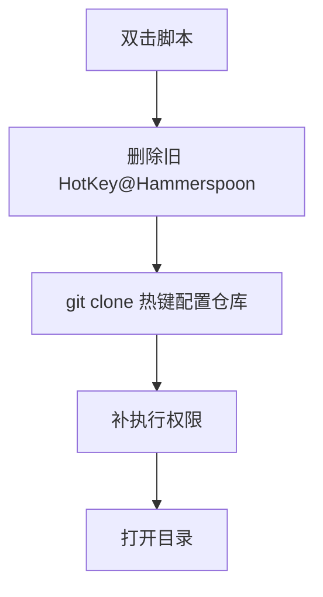

# `【MacOS】⏬双击下载Hammerspoon热键配置.command`


[toc]

---

## 🔥 <font id=前言>前言</font> <a href="#🔚" style="font-size:17px; color:green;"><b>🔽</b></a>

`【MacOS】⏬双击下载Hammerspoon热键配置.command` 是一个可双击运行的 macOS `.command` 脚本。

它会从 [**GitHub**](https://github.com) 上的 [**JobsKits**](https://github.com/JobsKits) 仓库拉取 [**Hammerspoon**](https://www.hammerspoon.org) 热键配置，下载到脚本同目录下的 `HotKey@Hammerspoon`。

这份 `README.md` 用于在双击前把脚本用途、执行流程、风险点和排查方式说清楚。Jobs出品，必属精品，但危险动作也必须摊开讲明白。

## 一、目录结构 <a href="#前言" style="font-size:17px; color:green;"><b>🔼</b></a> <a href="#🔚" style="font-size:17px; color:green;"><b>🔽</b></a>

```text
【MacOS】⏬双击下载Hammerspoon热键配置.command/
├── 【MacOS】⏬双击下载Hammerspoon热键配置.command
└── README.md
```

## 二、适用场景 <a href="#前言" style="font-size:17px; color:green;"><b>🔼</b></a> <a href="#🔚" style="font-size:17px; color:green;"><b>🔽</b></a>

- 新机器需要快速拉取 Jobs 的 Hammerspoon 热键配置。
- 本地热键配置目录损坏，需要重新覆盖下载。
- 希望下载完成后自动打开配置目录，继续检查或安装。

## 三、运行方式 <a href="#前言" style="font-size:17px; color:green;"><b>🔼</b></a> <a href="#🔚" style="font-size:17px; color:green;"><b>🔽</b></a>

- 方式一：在 [**Finder**](https://support.apple.com/guide/mac-help/welcome/mac) 里双击 `【MacOS】⏬双击下载Hammerspoon热键配置.command`。
- 方式二：在终端进入当前目录后执行：

  ```shell
  chmod +x "./【MacOS】⏬双击下载Hammerspoon热键配置.command"
  "./【MacOS】⏬双击下载Hammerspoon热键配置.command"
  ```


## 四、执行前检查 <a href="#前言" style="font-size:17px; color:green;"><b>🔼</b></a> <a href="#🔚" style="font-size:17px; color:green;"><b>🔽</b></a>

- 确认当前机器可以访问 `https://github.com/JobsKits/JobsConfigHotKeyByHammerspoon.git`。
- 确认已安装 `git`，并且网络代理、DNS、证书没有阻断 GitHub。
- 确认脚本同目录下的 `HotKey@Hammerspoon` 可以被删除并重建。

## 五、脚本执行流程 <a href="#前言" style="font-size:17px; color:green;"><b>🔼</b></a> <a href="#🔚" style="font-size:17px; color:green;"><b>🔽</b></a>



## 六、核心动作 <a href="#前言" style="font-size:17px; color:green;"><b>🔼</b></a> <a href="#🔚" style="font-size:17px; color:green;"><b>🔽</b></a>

1. 设置下载仓库地址 `REPO_URL`。
2. 把目标目录解析为脚本同目录下的 `HotKey@Hammerspoon`。
3. 执行 `rm -rf "$CLONE_DIR"` 删除旧目录。
4. 执行 `git clone --depth=1` 拉取仓库。
5. 为下载目录内的 `.sh` / `.command` 文件补执行权限。
6. 用 `open` 打开下载目录。

## 七、日志文件 <a href="#前言" style="font-size:17px; color:green;"><b>🔼</b></a> <a href="#🔚" style="font-size:17px; color:green;"><b>🔽</b></a>

脚本会写入 `$TMPDIR/【MacOS】⏬双击下载Hammerspoon热键配置.log`。

## 八、风险说明 <a href="#前言" style="font-size:17px; color:green;"><b>🔼</b></a> <a href="#🔚" style="font-size:17px; color:green;"><b>🔽</b></a>

- 会删除脚本同目录下已有的 `HotKey@Hammerspoon`，请先确认里面没有未备份改动。
- 不会使用 `sudo`，风险主要集中在同名目录覆盖。
- 下载依赖 GitHub 网络，失败时优先检查代理和 `git`。

## 九、常见问题 <a href="#前言" style="font-size:17px; color:green;"><b>🔼</b></a> <a href="#🔚" style="font-size:17px; color:green;"><b>🔽</b></a>

### 1. 运行后看不到配置怎么办？

先看终端输出和 `$TMPDIR/【MacOS】⏬双击下载Hammerspoon热键配置.log`，再确认 `HotKey@Hammerspoon` 是否生成。

### 2. 为什么 README 里写 SourceTree？

脚本内部提示文案复用了旧字符串，但真实仓库地址是 Hammerspoon 热键配置仓库。
## 十、未执行声明 <a href="#前言" style="font-size:17px; color:green;"><b>🔼</b></a> <a href="#🔚" style="font-size:17px; color:green;"><b>🔽</b></a>

- 本次整理只读取脚本源码并生成 `README.md`，没有在 macOS 真机环境执行脚本。
- 当前打包环境不提供 macOS 专属工具链，未执行 `【MacOS】⏬双击下载Hammerspoon热键配置.command` 的真实安装、下载、构建或系统修改动作。
- 脚本源码保持原样，仅新增同目录 `README.md` 并按同名文件夹重新打包。

<a id="🔚" href="#前言" style="font-size:17px; color:green; font-weight:bold;">我是有底线的➤点我回到首页</a>
