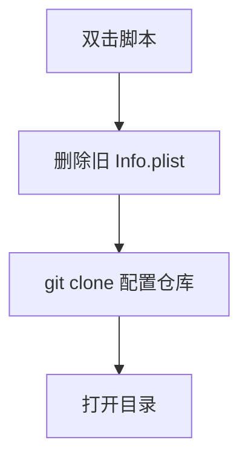

# `【MacOS】⏬双击下载Jobs@Info.plist.command`


[toc]

---

## 🔥 <font id=前言>前言</font> <a href="#🔚" style="font-size:17px; color:green;"><b>🔽</b></a>

`【MacOS】⏬双击下载Jobs@Info.plist.command` 是一个可双击运行的 macOS `.command` 脚本。

它会从 [**GitHub**](https://github.com) 的 [**JobsKits**](https://github.com/JobsKits) 拉取 `Info.plist` 配置仓库，下载到脚本同目录下的 `Info.plist`。

这份 `README.md` 用于在双击前把脚本用途、执行流程、风险点和排查方式说清楚。Jobs出品，必属精品，但危险动作也必须摊开讲明白。

## 一、目录结构 <a href="#前言" style="font-size:17px; color:green;"><b>🔼</b></a> <a href="#🔚" style="font-size:17px; color:green;"><b>🔽</b></a>

```text
【MacOS】⏬双击下载Jobs@Info.plist.command/
├── 【MacOS】⏬双击下载Jobs@Info.plist.command
└── README.md
```

## 二、适用场景 <a href="#前言" style="font-size:17px; color:green;"><b>🔼</b></a> <a href="#🔚" style="font-size:17px; color:green;"><b>🔽</b></a>

- 需要快速获得 Jobs 常用 `Info.plist` 配置模板。
- 本地 `Info.plist` 配置仓库需要重新拉取。
- 希望下载完成后自动打开目录检查文件。

## 三、运行方式 <a href="#前言" style="font-size:17px; color:green;"><b>🔼</b></a> <a href="#🔚" style="font-size:17px; color:green;"><b>🔽</b></a>

- 方式一：在 [**Finder**](https://support.apple.com/guide/mac-help/welcome/mac) 里双击 `【MacOS】⏬双击下载Jobs@Info.plist.command`。
- 方式二：在终端进入当前目录后执行：

  ```shell
  chmod +x "./【MacOS】⏬双击下载Jobs@Info.plist.command"
  "./【MacOS】⏬双击下载Jobs@Info.plist.command"
  ```


## 四、执行前检查 <a href="#前言" style="font-size:17px; color:green;"><b>🔼</b></a> <a href="#🔚" style="font-size:17px; color:green;"><b>🔽</b></a>

- 确认已安装 `git`。
- 确认可以访问 `https://github.com/JobsKits/Info.plist.git`。
- 确认脚本同目录下已有 `Info.plist` 目录可以删除。

## 五、脚本执行流程 <a href="#前言" style="font-size:17px; color:green;"><b>🔼</b></a> <a href="#🔚" style="font-size:17px; color:green;"><b>🔽</b></a>



## 六、核心动作 <a href="#前言" style="font-size:17px; color:green;"><b>🔼</b></a> <a href="#🔚" style="font-size:17px; color:green;"><b>🔽</b></a>

1. 设置 `REPO_URL` 为 `Info.plist` 仓库地址。
2. 设置 `CLONE_DIR` 为脚本同目录的 `Info.plist`。
3. 删除旧的 `Info.plist` 目录。
4. 执行浅克隆拉取最新内容。
5. 下载成功后打开目标目录。

## 七、日志文件 <a href="#前言" style="font-size:17px; color:green;"><b>🔼</b></a> <a href="#🔚" style="font-size:17px; color:green;"><b>🔽</b></a>

脚本会写入 `$TMPDIR/【MacOS】⏬双击下载Jobs@Info.plist.log`。

## 八、风险说明 <a href="#前言" style="font-size:17px; color:green;"><b>🔼</b></a> <a href="#🔚" style="font-size:17px; color:green;"><b>🔽</b></a>

- 会删除同目录已有 `Info.plist` 文件夹，未提交内容会丢失。
- 不会使用 `sudo`，不直接修改系统配置。
- 失败通常来自网络、GitHub 访问或 `git` 缺失。

## 九、常见问题 <a href="#前言" style="font-size:17px; color:green;"><b>🔼</b></a> <a href="#🔚" style="font-size:17px; color:green;"><b>🔽</b></a>

### 1. 为什么克隆提示里出现 SourceTree？

这是脚本内部提示文案复用旧字符串，不影响实际拉取的仓库地址。

### 2. 下载目录在哪里？

在该 `.command` 文件所在目录下的 `Info.plist` 文件夹。
## 十、未执行声明 <a href="#前言" style="font-size:17px; color:green;"><b>🔼</b></a> <a href="#🔚" style="font-size:17px; color:green;"><b>🔽</b></a>

- 本次整理只读取脚本源码并生成 `README.md`，没有在 macOS 真机环境执行脚本。
- 当前打包环境不提供 macOS 专属工具链，未执行 `【MacOS】⏬双击下载Jobs@Info.plist.command` 的真实安装、下载、构建或系统修改动作。
- 脚本源码保持原样，仅新增同目录 `README.md` 并按同名文件夹重新打包。

<a id="🔚" href="#前言" style="font-size:17px; color:green; font-weight:bold;">我是有底线的➤点我回到首页</a>
