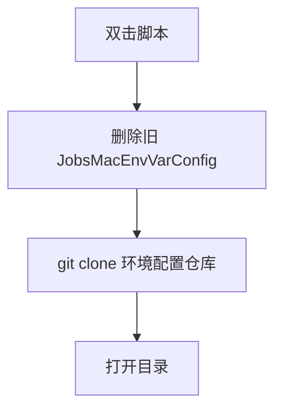

# `【MacOS】⏬双击下载Jobs系统环境配置.command`


[toc]

---

## 🔥 <font id=前言>前言</font> <a href="#🔚" style="font-size:17px; color:green;"><b>🔽</b></a>

`【MacOS】⏬双击下载Jobs系统环境配置.command` 是一个可双击运行的 macOS `.command` 脚本。

它会从 [**GitHub**](https://github.com) 的 [**JobsKits**](https://github.com/JobsKits) 拉取 Jobs macOS 系统环境配置仓库，下载到脚本同目录下的 `JobsMacEnvVarConfig`。

这份 `README.md` 用于在双击前把脚本用途、执行流程、风险点和排查方式说清楚。Jobs出品，必属精品，但危险动作也必须摊开讲明白。

## 一、目录结构 <a href="#前言" style="font-size:17px; color:green;"><b>🔼</b></a> <a href="#🔚" style="font-size:17px; color:green;"><b>🔽</b></a>

```text
【MacOS】⏬双击下载Jobs系统环境配置.command/
├── 【MacOS】⏬双击下载Jobs系统环境配置.command
└── README.md
```

## 二、适用场景 <a href="#前言" style="font-size:17px; color:green;"><b>🔼</b></a> <a href="#🔚" style="font-size:17px; color:green;"><b>🔽</b></a>

- 新机器需要拉取 Jobs 终端环境配置。
- 本地环境配置目录需要重新下载。
- 需要下载完成后打开目录继续执行安装或同步。

## 三、运行方式 <a href="#前言" style="font-size:17px; color:green;"><b>🔼</b></a> <a href="#🔚" style="font-size:17px; color:green;"><b>🔽</b></a>

- 方式一：在 [**Finder**](https://support.apple.com/guide/mac-help/welcome/mac) 里双击 `【MacOS】⏬双击下载Jobs系统环境配置.command`。
- 方式二：在终端进入当前目录后执行：

  ```shell
  chmod +x "./【MacOS】⏬双击下载Jobs系统环境配置.command"
  "./【MacOS】⏬双击下载Jobs系统环境配置.command"
  ```


## 四、执行前检查 <a href="#前言" style="font-size:17px; color:green;"><b>🔼</b></a> <a href="#🔚" style="font-size:17px; color:green;"><b>🔽</b></a>

- 确认已安装 `git`。
- 确认可以访问 `https://github.com/JobsKits/JobsMacEnvVarConfig.git`。
- 确认同目录已有 `JobsMacEnvVarConfig` 可以删除。

## 五、脚本执行流程 <a href="#前言" style="font-size:17px; color:green;"><b>🔼</b></a> <a href="#🔚" style="font-size:17px; color:green;"><b>🔽</b></a>



## 六、核心动作 <a href="#前言" style="font-size:17px; color:green;"><b>🔼</b></a> <a href="#🔚" style="font-size:17px; color:green;"><b>🔽</b></a>

1. 设置环境配置仓库地址。
2. 将下载目录解析到脚本同目录的 `JobsMacEnvVarConfig`。
3. 删除旧目录。
4. 浅克隆仓库。
5. 下载完成后打开目录。

## 七、日志文件 <a href="#前言" style="font-size:17px; color:green;"><b>🔼</b></a> <a href="#🔚" style="font-size:17px; color:green;"><b>🔽</b></a>

脚本会写入 `$TMPDIR/【MacOS】⏬双击下载Jobs系统环境配置.log`。

## 八、风险说明 <a href="#前言" style="font-size:17px; color:green;"><b>🔼</b></a> <a href="#🔚" style="font-size:17px; color:green;"><b>🔽</b></a>

- 会删除同目录下旧的 `JobsMacEnvVarConfig`。
- 当前脚本只下载，不直接写入 `.zshrc` 或系统环境变量。
- 后续如果进入下载仓库执行安装脚本，要重新阅读对应 README。

## 九、常见问题 <a href="#前言" style="font-size:17px; color:green;"><b>🔼</b></a> <a href="#🔚" style="font-size:17px; color:green;"><b>🔽</b></a>

### 1. 这个脚本和安装环境脚本是一回事吗？

不是。当前脚本负责下载配置仓库，真正安装或同步环境要看下载仓库里的入口脚本。

### 2. 失败先看哪里？

先看 `$TMPDIR/【MacOS】⏬双击下载Jobs系统环境配置.log` 和终端中的 `git clone` 错误。
## 十、未执行声明 <a href="#前言" style="font-size:17px; color:green;"><b>🔼</b></a> <a href="#🔚" style="font-size:17px; color:green;"><b>🔽</b></a>

- 本次整理只读取脚本源码并生成 `README.md`，没有在 macOS 真机环境执行脚本。
- 当前打包环境不提供 macOS 专属工具链，未执行 `【MacOS】⏬双击下载Jobs系统环境配置.command` 的真实安装、下载、构建或系统修改动作。
- 脚本源码保持原样，仅新增同目录 `README.md` 并按同名文件夹重新打包。

<a id="🔚" href="#前言" style="font-size:17px; color:green; font-weight:bold;">我是有底线的➤点我回到首页</a>
