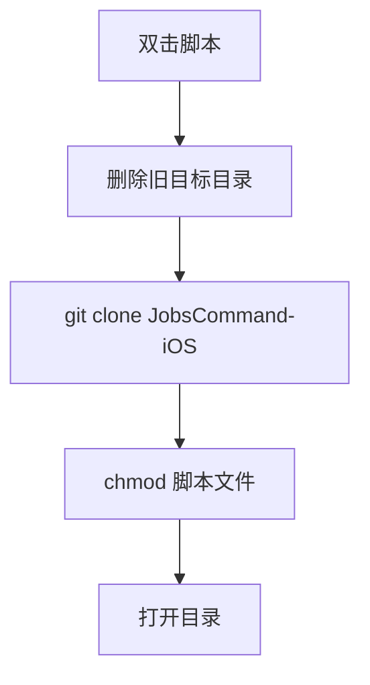

# `【MacOS】⏬双击下载iOS效率脚本.command`


[toc]

---

## 🔥 <font id=前言>前言</font> <a href="#🔚" style="font-size:17px; color:green;"><b>🔽</b></a>

`【MacOS】⏬双击下载iOS效率脚本.command` 是一个可双击运行的 macOS `.command` 脚本。

它会从 [**GitHub**](https://github.com) 的 [**JobsKits**](https://github.com/JobsKits) 拉取 `JobsCommand-iOS`，下载到脚本同目录下的 `将此文件夹管理的脚本拖到此iOS项目的根目录运行.command`。

这份 `README.md` 用于在双击前把脚本用途、执行流程、风险点和排查方式说清楚。Jobs出品，必属精品，但危险动作也必须摊开讲明白。

## 一、目录结构 <a href="#前言" style="font-size:17px; color:green;"><b>🔼</b></a> <a href="#🔚" style="font-size:17px; color:green;"><b>🔽</b></a>

```text
【MacOS】⏬双击下载iOS效率脚本.command/
├── 【MacOS】⏬双击下载iOS效率脚本.command
└── README.md
```

## 二、适用场景 <a href="#前言" style="font-size:17px; color:green;"><b>🔼</b></a> <a href="#🔚" style="font-size:17px; color:green;"><b>🔽</b></a>

- 需要拉取 iOS 工程常用效率脚本。
- 需要把脚本集合放到当前目录，后续拖入 iOS 项目根目录使用。
- 需要下载后自动为脚本补执行权限。

## 三、运行方式 <a href="#前言" style="font-size:17px; color:green;"><b>🔼</b></a> <a href="#🔚" style="font-size:17px; color:green;"><b>🔽</b></a>

- 方式一：在 [**Finder**](https://support.apple.com/guide/mac-help/welcome/mac) 里双击 `【MacOS】⏬双击下载iOS效率脚本.command`。
- 方式二：在终端进入当前目录后执行：

  ```shell
  chmod +x "./【MacOS】⏬双击下载iOS效率脚本.command"
  "./【MacOS】⏬双击下载iOS效率脚本.command"
  ```


## 四、执行前检查 <a href="#前言" style="font-size:17px; color:green;"><b>🔼</b></a> <a href="#🔚" style="font-size:17px; color:green;"><b>🔽</b></a>

- 确认已安装 `git`。
- 确认可以访问 `https://github.com/JobsKits/JobsCommand-iOS.git`。
- 确认同目录下的 `将此文件夹管理的脚本拖到此iOS项目的根目录运行.command` 可以被删除。

## 五、脚本执行流程 <a href="#前言" style="font-size:17px; color:green;"><b>🔼</b></a> <a href="#🔚" style="font-size:17px; color:green;"><b>🔽</b></a>



## 六、核心动作 <a href="#前言" style="font-size:17px; color:green;"><b>🔼</b></a> <a href="#🔚" style="font-size:17px; color:green;"><b>🔽</b></a>

1. 设置 iOS 效率脚本仓库地址。
2. 设置目标目录。
3. 删除旧目标目录。
4. 浅克隆仓库。
5. 为仓库内 `.sh` / `.command` 文件补执行权限。
6. 打开下载目录。

## 七、日志文件 <a href="#前言" style="font-size:17px; color:green;"><b>🔼</b></a> <a href="#🔚" style="font-size:17px; color:green;"><b>🔽</b></a>

脚本会写入 `/tmp/【MacOS】⏬双击下载iOS效率脚本.log`。

## 八、风险说明 <a href="#前言" style="font-size:17px; color:green;"><b>🔼</b></a> <a href="#🔚" style="font-size:17px; color:green;"><b>🔽</b></a>

- 目标目录名称虽然带 `.command`，但脚本里把它当作目录使用。
- 会删除同名目录，先确认没有未备份内容。
- 当前脚本只下载脚本集合，不会自动改动你的 iOS 项目。

## 九、常见问题 <a href="#前言" style="font-size:17px; color:green;"><b>🔼</b></a> <a href="#🔚" style="font-size:17px; color:green;"><b>🔽</b></a>

### 1. 下载后的目录为什么像一个 `.command`？

这是原脚本设置的目录名，用于提醒“把这个文件夹管理的脚本拖到 iOS 项目根目录运行”。

### 2. 会自动执行里面的 iOS 脚本吗？

不会，只会下载、授权并打开目录。
## 十、未执行声明 <a href="#前言" style="font-size:17px; color:green;"><b>🔼</b></a> <a href="#🔚" style="font-size:17px; color:green;"><b>🔽</b></a>

- 本次整理只读取脚本源码并生成 `README.md`，没有在 macOS 真机环境执行脚本。
- 当前打包环境不提供 macOS 专属工具链，未执行 `【MacOS】⏬双击下载iOS效率脚本.command` 的真实安装、下载、构建或系统修改动作。
- 脚本源码保持原样，仅新增同目录 `README.md` 并按同名文件夹重新打包。

<a id="🔚" href="#前言" style="font-size:17px; color:green; font-weight:bold;">我是有底线的➤点我回到首页</a>
