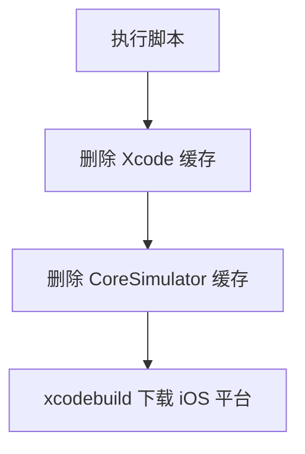

# `【MacOS】⏬命令行下载Xcode模拟器配件.command`


[toc]

---

## 🔥 <font id=前言>前言</font> <a href="#🔚" style="font-size:17px; color:green;"><b>🔽</b></a>

`【MacOS】⏬命令行下载Xcode模拟器配件.command` 是一个可双击运行的 macOS `.command` 脚本。

它会清理部分 [**Xcode**](https://developer.apple.com/xcode) 缓存，然后通过 `xcodebuild -downloadPlatform iOS -verbose` 下载 iOS 模拟器平台配件。

这份 `README.md` 用于在双击前把脚本用途、执行流程、风险点和排查方式说清楚。Jobs出品，必属精品，但危险动作也必须摊开讲明白。

## 一、目录结构 <a href="#前言" style="font-size:17px; color:green;"><b>🔼</b></a> <a href="#🔚" style="font-size:17px; color:green;"><b>🔽</b></a>

```text
【MacOS】⏬命令行下载Xcode模拟器配件.command/
├── 【MacOS】⏬命令行下载Xcode模拟器配件.command
└── README.md
```

## 二、适用场景 <a href="#前言" style="font-size:17px; color:green;"><b>🔼</b></a> <a href="#🔚" style="font-size:17px; color:green;"><b>🔽</b></a>

- Xcode 下载 iOS 模拟器平台失败，需要清理缓存后重试。
- 新装或升级 Xcode 后，需要命令行补齐 iOS 模拟器平台。
- 希望通过终端看到 verbose 下载过程。

## 三、运行方式 <a href="#前言" style="font-size:17px; color:green;"><b>🔼</b></a> <a href="#🔚" style="font-size:17px; color:green;"><b>🔽</b></a>

- 方式一：在 [**Finder**](https://support.apple.com/guide/mac-help/welcome/mac) 里双击 `【MacOS】⏬命令行下载Xcode模拟器配件.command`。
- 方式二：在终端进入当前目录后执行：

  ```shell
  chmod +x "./【MacOS】⏬命令行下载Xcode模拟器配件.command"
  "./【MacOS】⏬命令行下载Xcode模拟器配件.command"
  ```


## 四、执行前检查 <a href="#前言" style="font-size:17px; color:green;"><b>🔼</b></a> <a href="#🔚" style="font-size:17px; color:green;"><b>🔽</b></a>

- 确认已安装完整 Xcode，不只是 Command Line Tools。
- 确认 `xcode-select -p` 指向正确 Xcode。
- 确认网络可访问 Apple 开发者下载服务。
- 确认可以删除 `~/Library/Caches/com.apple.dt.Xcode` 和 `~/Library/Developer/CoreSimulator/Caches`。

## 五、脚本执行流程 <a href="#前言" style="font-size:17px; color:green;"><b>🔼</b></a> <a href="#🔚" style="font-size:17px; color:green;"><b>🔽</b></a>



## 六、核心动作 <a href="#前言" style="font-size:17px; color:green;"><b>🔼</b></a> <a href="#🔚" style="font-size:17px; color:green;"><b>🔽</b></a>

1. 开启 `set -euo pipefail`。
2. 删除 Xcode 下载缓存目录。
3. 删除 CoreSimulator 缓存目录。
4. 执行 `xcodebuild -downloadPlatform iOS -verbose`。

## 七、日志文件 <a href="#前言" style="font-size:17px; color:green;"><b>🔼</b></a> <a href="#🔚" style="font-size:17px; color:green;"><b>🔽</b></a>

当前脚本没有定义 `LOG_FILE`，不会主动写入 `$TMPDIR/脚本名.log`；请保留终端输出用于排查。

## 八、风险说明 <a href="#前言" style="font-size:17px; color:green;"><b>🔼</b></a> <a href="#🔚" style="font-size:17px; color:green;"><b>🔽</b></a>

- 会删除当前用户下的 Xcode / CoreSimulator 缓存，缓存会在后续使用中重建。
- 脚本没有二次确认，双击后会直接执行。
- 下载体积可能较大，受 Xcode 版本、网络和 Apple 服务状态影响。
- 脚本没有独立日志文件，终端输出是主要排查依据。

## 九、常见问题 <a href="#前言" style="font-size:17px; color:green;"><b>🔼</b></a> <a href="#🔚" style="font-size:17px; color:green;"><b>🔽</b></a>

### 1. 提示 xcodebuild 找不到怎么办？

先安装完整 Xcode，并确认 `xcode-select -p` 指向 `$APPLICATIONS_DIR/Xcode.app/Contents/Developer`。

### 2. 清理缓存会删项目吗？

不会直接删除你的工程源码，但会清理 Xcode 和模拟器缓存。
## 十、未执行声明 <a href="#前言" style="font-size:17px; color:green;"><b>🔼</b></a> <a href="#🔚" style="font-size:17px; color:green;"><b>🔽</b></a>

- 本次整理只读取脚本源码并生成 `README.md`，没有在 macOS 真机环境执行脚本。
- 当前打包环境不提供 macOS 专属工具链，未执行 `【MacOS】⏬命令行下载Xcode模拟器配件.command` 的真实安装、下载、构建或系统修改动作。
- 脚本源码保持原样，仅新增同目录 `README.md` 并按同名文件夹重新打包。

<a id="🔚" href="#前言" style="font-size:17px; color:green; font-weight:bold;">我是有底线的➤点我回到首页</a>
