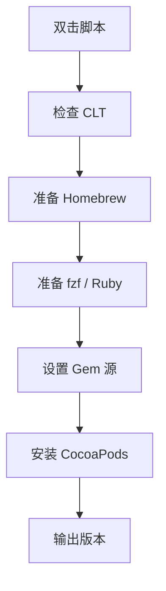

# `【MacOS】⚙️双击安装Cocoapods.command`


[toc]

---

## 🔥 <font id=前言>前言</font> <a href="#🔚" style="font-size:17px; color:green;"><b>🔽</b></a>

`【MacOS】⚙️双击安装Cocoapods.command` 是一个可双击运行的 macOS `.command` 脚本。

它是 [**CocoaPods**](https://cocoapods.org/) 安装助手：检查 Xcode Command Line Tools，准备 [**Homebrew**](https://brew.sh/)、[**fzf**](https://formulae.brew.sh/formula/fzf)、[**Ruby**](https://www.ruby-lang.org) / [**Gem**](https://rubygems.org/) 环境，并优先通过 Homebrew 安装 CocoaPods，失败时回退到 `gem install cocoapods -N`。

这份 `README.md` 用于在双击前把脚本用途、执行流程、风险点和排查方式说清楚。Jobs出品，必属精品，但危险动作也必须摊开讲明白。

## 一、目录结构 <a href="#前言" style="font-size:17px; color:green;"><b>🔼</b></a> <a href="#🔚" style="font-size:17px; color:green;"><b>🔽</b></a>

```text
【MacOS】⚙️双击安装Cocoapods.command/
├── 【MacOS】⚙️双击安装Cocoapods.command
└── README.md
```

## 二、适用场景 <a href="#前言" style="font-size:17px; color:green;"><b>🔼</b></a> <a href="#🔚" style="font-size:17px; color:green;"><b>🔽</b></a>

- 新机器需要安装 CocoaPods。
- 系统 Ruby 权限或版本不适合直接安装 CocoaPods，需要使用 Homebrew Ruby。
- 需要根据网络环境切换 RubyGems 源。
- 需要保留安装日志，便于排查。

## 三、运行方式 <a href="#前言" style="font-size:17px; color:green;"><b>🔼</b></a> <a href="#🔚" style="font-size:17px; color:green;"><b>🔽</b></a>

- 方式一：在 [**Finder**](https://support.apple.com/guide/mac-help/welcome/mac) 里双击 `【MacOS】⚙️双击安装Cocoapods.command`。
- 方式二：在终端进入当前目录后执行：

  ```shell
  chmod +x "./【MacOS】⚙️双击安装Cocoapods.command"
  "./【MacOS】⚙️双击安装Cocoapods.command"
  ```


## 四、执行前检查 <a href="#前言" style="font-size:17px; color:green;"><b>🔼</b></a> <a href="#🔚" style="font-size:17px; color:green;"><b>🔽</b></a>

- 确认当前用户可以安装 Homebrew 或已经安装 Homebrew。
- 确认 Xcode Command Line Tools 可用；脚本会检测并尝试触发安装。
- 确认网络可以访问 Homebrew、RubyGems 或 ruby-china。
- 确认接受脚本可能安装 `fzf`、`ruby`、`cocoapods`。

## 五、脚本执行流程 <a href="#前言" style="font-size:17px; color:green;"><b>🔼</b></a> <a href="#🔚" style="font-size:17px; color:green;"><b>🔽</b></a>



## 六、核心动作 <a href="#前言" style="font-size:17px; color:green;"><b>🔼</b></a> <a href="#🔚" style="font-size:17px; color:green;"><b>🔽</b></a>

1. 打印启动信息和日志路径。
2. 检查 Xcode Command Line Tools。
3. 检测或安装 Homebrew，并注入当前 shell 环境。
4. 安装或可选升级 `fzf`；回车跳过升级，输入任意字符执行升级。
5. 确保 Homebrew Ruby 可用。
6. 根据网络环境设置 RubyGems 源。
7. 优先使用 `brew install cocoapods` 安装 CocoaPods。
8. Homebrew 安装失败时，回退到 `gem install cocoapods -N`。
9. 备份常见配置文件为 `.bak`。
10. 输出 CocoaPods 版本和总耗时。

## 七、日志文件 <a href="#前言" style="font-size:17px; color:green;"><b>🔼</b></a> <a href="#🔚" style="font-size:17px; color:green;"><b>🔽</b></a>

脚本会写入 `$TMPDIR/【MacOS】⚙️双击安装Cocoapods.log`。

## 八、风险说明 <a href="#前言" style="font-size:17px; color:green;"><b>🔼</b></a> <a href="#🔚" style="font-size:17px; color:green;"><b>🔽</b></a>

- 会安装开发工具链组件，属于真实环境变更。
- 如果触发 Homebrew 安装，会执行官方安装脚本并写入 shell 环境相关配置。
- 会安装或升级 `fzf`；升级动作符合“回车跳过，输入任意字符执行”。
- 会切换 RubyGems 源，可能影响后续 `gem install` 默认源。
- 不会自动执行 `pod install`，只负责安装 CocoaPods 本身。

## 九、常见问题 <a href="#前言" style="font-size:17px; color:green;"><b>🔼</b></a> <a href="#🔚" style="font-size:17px; color:green;"><b>🔽</b></a>

### 1. 为什么优先 Homebrew 安装 CocoaPods？

脚本目标是避开系统 Ruby 权限和版本问题，优先使用 Homebrew 管理依赖。

### 2. 已经安装 CocoaPods 还会重装吗？

脚本检测到 `pod` 后会输出已安装版本并返回，不会继续安装。

### 3. 安装失败先看哪里？

先看 `$TMPDIR/【MacOS】⚙️双击安装Cocoapods.log`，再看 Homebrew / Gem 的具体错误。
## 十、未执行声明 <a href="#前言" style="font-size:17px; color:green;"><b>🔼</b></a> <a href="#🔚" style="font-size:17px; color:green;"><b>🔽</b></a>

- 本次整理只读取脚本源码并生成 `README.md`，没有在 macOS 真机环境执行脚本。
- 当前打包环境不提供 macOS 专属工具链，未执行 `【MacOS】⚙️双击安装Cocoapods.command` 的真实安装、下载、构建或系统修改动作。
- 脚本源码保持原样，仅新增同目录 `README.md` 并按同名文件夹重新打包。

<a id="🔚" href="#前言" style="font-size:17px; color:green; font-weight:bold;">我是有底线的➤点我回到首页</a>
