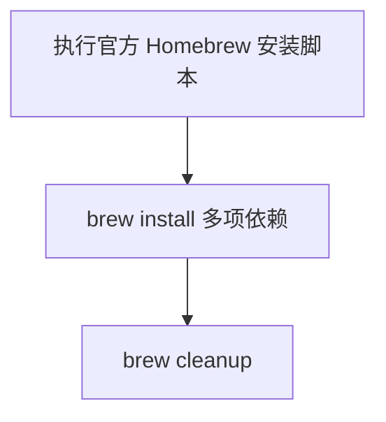

# `【MacOS】⚙️双击安装Homebrew.command`


[toc]

---

## 🔥 <font id=前言>前言</font> <a href="#🔚" style="font-size:17px; color:green;"><b>🔽</b></a>

`【MacOS】⚙️双击安装Homebrew.command` 是一个可双击运行的 macOS `.command` 脚本。

它会直接执行 [**Homebrew**](https://brew.sh/) 官方安装脚本，然后通过 `brew install` 安装一批常用开发依赖，包括 [**CocoaPods**](https://cocoapods.org/)、[**OpenJDK**](https://openjdk.org)、[**jenv**](https://www.jenv.be)、[**rbenv**](https://formulae.brew.sh/formula/rbenv)、[**Flutter**](https://flutter.dev/)、[**fvm**](https://fvm.app)、`git`、[**git-lfs**](https://git-lfs.com/)、`wget`、`jq`、`swiftlint`、`xcbeautify`。

这份 `README.md` 用于在双击前把脚本用途、执行流程、风险点和排查方式说清楚。Jobs出品，必属精品，但危险动作也必须摊开讲明白。

## 一、目录结构 <a href="#前言" style="font-size:17px; color:green;"><b>🔼</b></a> <a href="#🔚" style="font-size:17px; color:green;"><b>🔽</b></a>

```text
【MacOS】⚙️双击安装Homebrew.command/
├── 【MacOS】⚙️双击安装Homebrew.command
└── README.md
```

## 二、适用场景 <a href="#前言" style="font-size:17px; color:green;"><b>🔼</b></a> <a href="#🔚" style="font-size:17px; color:green;"><b>🔽</b></a>

- 新机器需要一次性安装 Homebrew 和常用开发工具。
- 可以接受脚本直接安装多项依赖。
- 希望安装完成后执行 `brew cleanup` 清理缓存。

## 三、运行方式 <a href="#前言" style="font-size:17px; color:green;"><b>🔼</b></a> <a href="#🔚" style="font-size:17px; color:green;"><b>🔽</b></a>

- 方式一：在 [**Finder**](https://support.apple.com/guide/mac-help/welcome/mac) 里双击 `【MacOS】⚙️双击安装Homebrew.command`。
- 方式二：在终端进入当前目录后执行：

  ```shell
  chmod +x "./【MacOS】⚙️双击安装Homebrew.command"
  "./【MacOS】⚙️双击安装Homebrew.command"
  ```


## 四、执行前检查 <a href="#前言" style="font-size:17px; color:green;"><b>🔼</b></a> <a href="#🔚" style="font-size:17px; color:green;"><b>🔽</b></a>

- 确认已安装或允许安装 Xcode Command Line Tools。
- 确认网络可以访问 Homebrew 官方安装脚本和 Homebrew 源。
- 确认可以接受一次性安装多项开发依赖。
- 确认当前脚本没有交互防误触，双击后会直接执行。

## 五、脚本执行流程 <a href="#前言" style="font-size:17px; color:green;"><b>🔼</b></a> <a href="#🔚" style="font-size:17px; color:green;"><b>🔽</b></a>



## 六、核心动作 <a href="#前言" style="font-size:17px; color:green;"><b>🔼</b></a> <a href="#🔚" style="font-size:17px; color:green;"><b>🔽</b></a>

1. 执行 Homebrew 官方安装脚本。
2. 安装 `cocoapods`。
3. 安装 `openjdk`、`jenv`、`rbenv`。
4. 安装 `flutter`、`fvm`。
5. 安装 `git`、`git-lfs`、`wget`、`jq`。
6. 安装 `swiftlint`、`xcbeautify`。
7. 执行 `brew cleanup`。

## 七、日志文件 <a href="#前言" style="font-size:17px; color:green;"><b>🔼</b></a> <a href="#🔚" style="font-size:17px; color:green;"><b>🔽</b></a>

当前脚本没有定义 `LOG_FILE`，不会主动写入 `/tmp/脚本名.log`；建议从终端执行并保留输出。

## 八、风险说明 <a href="#前言" style="font-size:17px; color:green;"><b>🔼</b></a> <a href="#🔚" style="font-size:17px; color:green;"><b>🔽</b></a>

- 这是强副作用安装脚本，会真实改变本机开发环境。
- 脚本没有安装前确认，也没有检测已安装状态。
- 如果 Homebrew 安装后当前 shell 未自动加载 `brew`，后续 `brew install` 可能失败。
- 没有独立日志文件，建议从终端运行并保存输出。

## 九、常见问题 <a href="#前言" style="font-size:17px; color:green;"><b>🔼</b></a> <a href="#🔚" style="font-size:17px; color:green;"><b>🔽</b></a>

### 1. 和 CocoaPods 安装脚本有什么区别？

当前脚本是粗粒度工具链安装；`【MacOS】⚙️双击安装Cocoapods.command` 更精细，带检测、日志和回退。

### 2. 适合直接双击吗？

不建议盲目双击。先确认你确实要安装整套依赖。
## 十、未执行声明 <a href="#前言" style="font-size:17px; color:green;"><b>🔼</b></a> <a href="#🔚" style="font-size:17px; color:green;"><b>🔽</b></a>

- 本次整理只读取脚本源码并生成 `README.md`，没有在 macOS 真机环境执行脚本。
- 当前打包环境不提供 macOS 专属工具链，未执行 `【MacOS】⚙️双击安装Homebrew.command` 的真实安装、下载、构建或系统修改动作。
- 脚本源码保持原样，仅新增同目录 `README.md` 并按同名文件夹重新打包。

<a id="🔚" href="#前言" style="font-size:17px; color:green; font-weight:bold;">我是有底线的➤点我回到首页</a>
