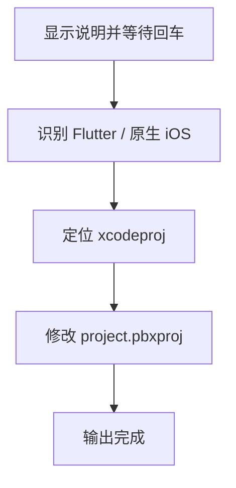

# `【MacOS】⚙️双击禁用沙盒保证Cocoapods构建流程.command`


[toc]

---

## 🔥 <font id=前言>前言</font> <a href="#🔚" style="font-size:17px; color:green;"><b>🔽</b></a>

`【MacOS】⚙️双击禁用沙盒保证Cocoapods构建流程.command` 是一个可双击运行的 macOS `.command` 脚本。

它用于修复 [**Xcode**](https://developer.apple.com/xcode) 工程里 User Script Sandboxing 影响 [**CocoaPods**](https://cocoapods.org/) 构建脚本的问题，会把 `project.pbxproj` 里的 `ENABLE_USER_SCRIPT_SANDBOXING` 设置为 `NO`。

这份 `README.md` 用于在双击前把脚本用途、执行流程、风险点和排查方式说清楚。Jobs出品，必属精品，但危险动作也必须摊开讲明白。

## 一、目录结构 <a href="#前言" style="font-size:17px; color:green;"><b>🔼</b></a> <a href="#🔚" style="font-size:17px; color:green;"><b>🔽</b></a>

```text
【MacOS】⚙️双击禁用沙盒保证Cocoapods构建流程.command/
├── 【MacOS】⚙️双击禁用沙盒保证Cocoapods构建流程.command
└── README.md
```

## 二、适用场景 <a href="#前言" style="font-size:17px; color:green;"><b>🔼</b></a> <a href="#🔚" style="font-size:17px; color:green;"><b>🔽</b></a>

- CocoaPods 构建阶段脚本被 Xcode 沙盒限制，导致构建失败。
- Flutter iOS 子工程或原生 iOS 工程需要批量关闭 User Script Sandboxing。
- 需要自动识别 `.xcodeproj` 并修改 `project.pbxproj`。

## 三、运行方式 <a href="#前言" style="font-size:17px; color:green;"><b>🔼</b></a> <a href="#🔚" style="font-size:17px; color:green;"><b>🔽</b></a>

- 方式一：在 [**Finder**](https://support.apple.com/guide/mac-help/welcome/mac) 里双击 `【MacOS】⚙️双击禁用沙盒保证Cocoapods构建流程.command`。
- 方式二：在终端进入当前目录后执行：

  ```shell
  chmod +x "./【MacOS】⚙️双击禁用沙盒保证Cocoapods构建流程.command"
  "./【MacOS】⚙️双击禁用沙盒保证Cocoapods构建流程.command"
  ```


## 四、执行前检查 <a href="#前言" style="font-size:17px; color:green;"><b>🔼</b></a> <a href="#🔚" style="font-size:17px; color:green;"><b>🔽</b></a>

- 确认脚本放在 iOS 工程根目录，或 Flutter 工程根目录。
- 确认工程已纳入 Git，修改前最好能用 `git diff` 回滚。
- 确认 `.xcodeproj/project.pbxproj` 当前没有未备份的重要手动改动。
- 如果自动找不到 `.xcodeproj`，准备手动拖入工程文件。

## 五、脚本执行流程 <a href="#前言" style="font-size:17px; color:green;"><b>🔼</b></a> <a href="#🔚" style="font-size:17px; color:green;"><b>🔽</b></a>



## 六、核心动作 <a href="#前言" style="font-size:17px; color:green;"><b>🔼</b></a> <a href="#🔚" style="font-size:17px; color:green;"><b>🔽</b></a>

1. 显示脚本说明并等待回车。
2. 如果当前目录有 `ios` 和 `lib`，按 Flutter 工程处理并进入 `ios`。
3. 否则按原生 iOS 工程处理。
4. 查找 `.xcodeproj`，找不到则要求手动拖入。
5. 定位 `project.pbxproj`。
6. 将已有 `ENABLE_USER_SCRIPT_SANDBOXING` 替换为 `NO`，或在所有 `buildSettings` 中追加该设置。

## 七、日志文件 <a href="#前言" style="font-size:17px; color:green;"><b>🔼</b></a> <a href="#🔚" style="font-size:17px; color:green;"><b>🔽</b></a>

脚本会写入 `/tmp/【MacOS】⚙️双击禁用沙盒保证Cocoapods构建流程.log`。

## 八、风险说明 <a href="#前言" style="font-size:17px; color:green;"><b>🔼</b></a> <a href="#🔚" style="font-size:17px; color:green;"><b>🔽</b></a>

- 会直接修改 `.xcodeproj/project.pbxproj`，这是工程配置文件。
- 脚本没有自动备份，执行前建议先提交 Git 或手动备份。
- 使用 macOS `sed -i ""` 语法，非 macOS 环境不要执行。
- 如果工程有多个 `.xcodeproj`，自动取第一个，可能不是你想改的那个。

## 九、常见问题 <a href="#前言" style="font-size:17px; color:green;"><b>🔼</b></a> <a href="#🔚" style="font-size:17px; color:green;"><b>🔽</b></a>

### 1. 执行后怎么确认？

运行 `git diff`，检查 `project.pbxproj` 里 `ENABLE_USER_SCRIPT_SANDBOXING = NO;` 是否符合预期。

### 2. Flutter 工程应该放哪里？

放在 Flutter 工程根目录，脚本会自动进入 `ios` 子目录。
## 十、未执行声明 <a href="#前言" style="font-size:17px; color:green;"><b>🔼</b></a> <a href="#🔚" style="font-size:17px; color:green;"><b>🔽</b></a>

- 本次整理只读取脚本源码并生成 `README.md`，没有在 macOS 真机环境执行脚本。
- 当前打包环境不提供 macOS 专属工具链，未执行 `【MacOS】⚙️双击禁用沙盒保证Cocoapods构建流程.command` 的真实安装、下载、构建或系统修改动作。
- 脚本源码保持原样，仅新增同目录 `README.md` 并按同名文件夹重新打包。

<a id="🔚" href="#前言" style="font-size:17px; color:green; font-weight:bold;">我是有底线的➤点我回到首页</a>
