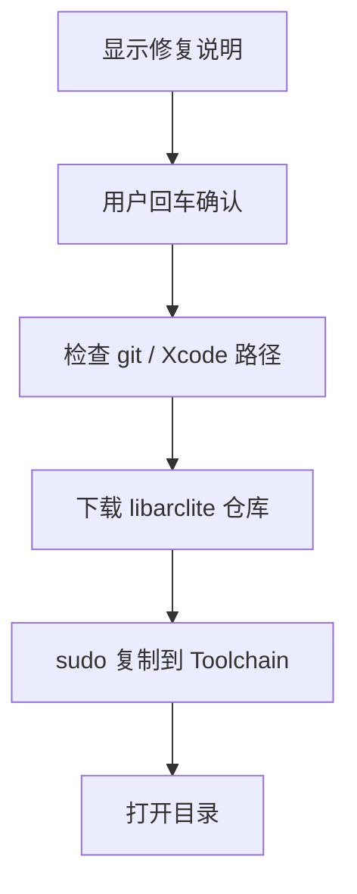

# `【MacOS】💉修复新版本Xcode缺失 libarclite.command`


[toc]

---

## 🔥 <font id=前言>前言</font> <a href="#🔚" style="font-size:17px; color:green;"><b>🔽</b></a>

`【MacOS】💉修复新版本Xcode缺失 libarclite.command` 是一个可双击运行的 macOS `.command` 脚本。

它用于修复新版本 [**Xcode**](https://developer.apple.com/xcode) 缺失 `libarclite_*.a` 导致旧项目链接失败的问题：从 [**GitHub**](https://github.com) 仓库下载库文件，并复制到 `$(xcode-select -p)/Toolchains/XcodeDefault.xctoolchain$SYSTEM_USR_DIR/lib/arc`。

这份 `README.md` 用于在双击前把脚本用途、执行流程、风险点和排查方式说清楚。Jobs出品，必属精品，但危险动作也必须摊开讲明白。

## 一、目录结构 <a href="#前言" style="font-size:17px; color:green;"><b>🔼</b></a> <a href="#🔚" style="font-size:17px; color:green;"><b>🔽</b></a>

```text
【MacOS】💉修复新版本Xcode缺失 libarclite.command/
├── 【MacOS】💉修复新版本Xcode缺失 libarclite.command
└── README.md
```

## 二、适用场景 <a href="#前言" style="font-size:17px; color:green;"><b>🔼</b></a> <a href="#🔚" style="font-size:17px; color:green;"><b>🔽</b></a>

- 旧 iOS 项目在新 Xcode 下报 `libarclite` 相关链接错误。
- 确认需要把 `libarclite_*.a` 补回 Xcode Toolchain。
- 愿意使用 `sudo` 修改 Xcode.app 内部目录。

## 三、运行方式 <a href="#前言" style="font-size:17px; color:green;"><b>🔼</b></a> <a href="#🔚" style="font-size:17px; color:green;"><b>🔽</b></a>

- 方式一：在 [**Finder**](https://support.apple.com/guide/mac-help/welcome/mac) 里双击 `【MacOS】💉修复新版本Xcode缺失 libarclite.command`。
- 方式二：在终端进入当前目录后执行：

  ```shell
  chmod +x "./【MacOS】💉修复新版本Xcode缺失 libarclite.command"
  "./【MacOS】💉修复新版本Xcode缺失 libarclite.command"
  ```


## 四、执行前检查 <a href="#前言" style="font-size:17px; color:green;"><b>🔼</b></a> <a href="#🔚" style="font-size:17px; color:green;"><b>🔽</b></a>

- 确认已安装完整 Xcode，并且 `xcode-select -p` 指向目标 Xcode。
- 确认已安装 `git`。
- 确认可以访问 `https://github.com/JobsKits/Xcode_Sys_lib.git`。
- 确认你接受修改 Xcode.app 内容，并准备输入管理员密码。

## 五、脚本执行流程 <a href="#前言" style="font-size:17px; color:green;"><b>🔼</b></a> <a href="#🔚" style="font-size:17px; color:green;"><b>🔽</b></a>



## 六、核心动作 <a href="#前言" style="font-size:17px; color:green;"><b>🔼</b></a> <a href="#🔚" style="font-size:17px; color:green;"><b>🔽</b></a>

1. 补齐基础 PATH，避免双击环境找不到常用命令。
2. 打印即将执行的说明和目标目录。
3. 等待用户按回车继续。
4. 检查 `git`。
5. 清理并创建 `$TMPDIR/xcode_sys_lib_fix`。
6. 浅克隆 `Xcode_Sys_lib` 仓库。
7. 查找 `libarclite_*.a`。
8. 使用 `sudo mkdir -p` 创建 Xcode Toolchain 目标目录。
9. 使用 `sudo install -m 0644` 复制库文件。
10. 打开下载目录和最终目标目录。

## 七、日志文件 <a href="#前言" style="font-size:17px; color:green;"><b>🔼</b></a> <a href="#🔚" style="font-size:17px; color:green;"><b>🔽</b></a>

当前脚本没有定义独立 `LOG_FILE`，输出主要打印在终端里；建议从终端运行并保留输出。

## 八、风险说明 <a href="#前言" style="font-size:17px; color:green;"><b>🔼</b></a> <a href="#🔚" style="font-size:17px; color:green;"><b>🔽</b></a>

- 会使用 `sudo` 修改 Xcode 安装目录，属于高风险系统级开发环境修改。
- 会删除 `$TMPDIR/xcode_sys_lib_fix` 临时目录。
- 如果 Xcode 后续升级或重装，补丁可能失效，需要重新确认。
- 脚本只要求回车继续，不要求输入 `YES`，执行前要自己确认风险。

## 九、常见问题 <a href="#前言" style="font-size:17px; color:green;"><b>🔼</b></a> <a href="#🔚" style="font-size:17px; color:green;"><b>🔽</b></a>

### 1. 什么时候需要它？

只有遇到 `libarclite` 缺失导致的链接错误时才需要，不建议无故执行。

### 2. 复制到哪里？

复制到 `$(xcode-select -p)/Toolchains/XcodeDefault.xctoolchain$SYSTEM_USR_DIR/lib/arc`。

### 3. 失败先看哪里？

看终端中 `git clone`、`xcode-select -p`、`sudo install` 的具体错误。
## 十、未执行声明 <a href="#前言" style="font-size:17px; color:green;"><b>🔼</b></a> <a href="#🔚" style="font-size:17px; color:green;"><b>🔽</b></a>

- 本次整理只读取脚本源码并生成 `README.md`，没有在 macOS 真机环境执行脚本。
- 当前打包环境不提供 macOS 专属工具链，未执行 `【MacOS】💉修复新版本Xcode缺失 libarclite.command` 的真实安装、下载、构建或系统修改动作。
- 脚本源码保持原样，仅新增同目录 `README.md` 并按同名文件夹重新打包。

<a id="🔚" href="#前言" style="font-size:17px; color:green; font-weight:bold;">我是有底线的➤点我回到首页</a>
