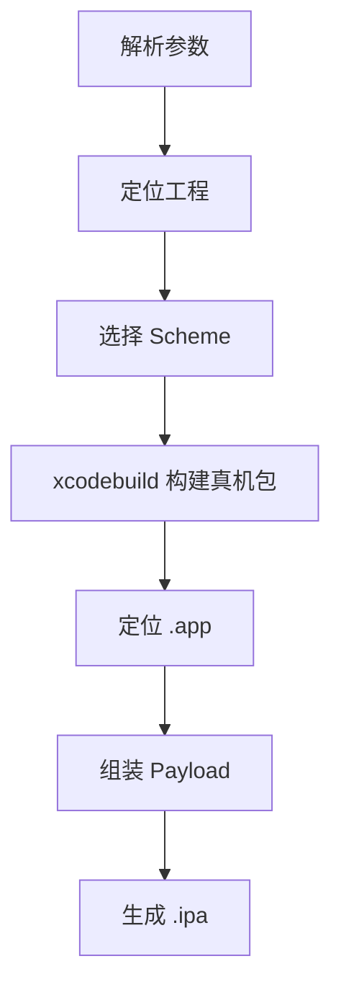

# `【MacOS】📦双击自动生成ipa文件.command`


[toc]

---

## 🔥 <font id=前言>前言</font> <a href="#🔚" style="font-size:17px; color:green;"><b>🔽</b></a>

`【MacOS】📦双击自动生成ipa文件.command` 是一个可双击运行的 macOS `.command` 脚本。

它是 iOS IPA 打包助手，会自动定位主 [**Xcode**](https://developer.apple.com/xcode) 工程、选择 Scheme、执行真机 `xcodebuild` 构建，并把生成的 `.app` 组装成 `.ipa` 输出到桌面或指定目录。

这份 `README.md` 用于在双击前把脚本用途、执行流程、风险点和排查方式说清楚。Jobs出品，必属精品，但危险动作也必须摊开讲明白。

## 一、目录结构 <a href="#前言" style="font-size:17px; color:green;"><b>🔼</b></a> <a href="#🔚" style="font-size:17px; color:green;"><b>🔽</b></a>

```text
【MacOS】📦双击自动生成ipa文件.command/
├── 【MacOS】📦双击自动生成ipa文件.command
└── README.md
```

## 二、适用场景 <a href="#前言" style="font-size:17px; color:green;"><b>🔼</b></a> <a href="#🔚" style="font-size:17px; color:green;"><b>🔽</b></a>

- iOS 原生工程需要快速生成 `.ipa`。
- 项目有多个 Scheme，需要自动筛选主 Scheme 或用 `fzf` 选择。
- 需要避开 Flutter Runner 壳工程，定位真实主工程。
- 希望失败时自动打开日志。

## 三、运行方式 <a href="#前言" style="font-size:17px; color:green;"><b>🔼</b></a> <a href="#🔚" style="font-size:17px; color:green;"><b>🔽</b></a>

- 方式一：在 [**Finder**](https://support.apple.com/guide/mac-help/welcome/mac) 里双击 `【MacOS】📦双击自动生成ipa文件.command`。
- 方式二：在终端进入当前目录后执行：

  ```shell
  chmod +x "./【MacOS】📦双击自动生成ipa文件.command"
  "./【MacOS】📦双击自动生成ipa文件.command"
  ```

- 常用参数示例：

  ```shell
  "./【MacOS】📦双击自动生成ipa文件.command" --config Release --out "$HOME/Desktop"
  "./【MacOS】📦双击自动生成ipa文件.command" --project "./MyApp.xcworkspace" --scheme "MyApp" --confirm
  "./【MacOS】📦双击自动生成ipa文件.command" --allow-updates
  ```


## 四、执行前检查 <a href="#前言" style="font-size:17px; color:green;"><b>🔼</b></a> <a href="#🔚" style="font-size:17px; color:green;"><b>🔽</b></a>

- 确认已安装完整 Xcode，并且签名、证书、描述文件可用于真机构建。
- 确认工程的 Scheme 是 shared，否则 `xcodebuild -list` 可能列不出来。
- 如果有多个 Scheme，建议安装 `fzf` 方便选择；未安装时脚本会自动兜底。
- 确认默认输出目录 `$HOME/Desktop` 或 `--out` 指定目录可写。

## 五、脚本执行流程 <a href="#前言" style="font-size:17px; color:green;"><b>🔼</b></a> <a href="#🔚" style="font-size:17px; color:green;"><b>🔽</b></a>



## 六、核心动作 <a href="#前言" style="font-size:17px; color:green;"><b>🔼</b></a> <a href="#🔚" style="font-size:17px; color:green;"><b>🔽</b></a>

1. 解析命令行参数。
2. 定位脚本目录和主工程 `.xcodeproj` / `.xcworkspace`。
3. 读取 `xcodebuild -list` 输出并筛选 Scheme。
4. 优先自动选择与工程同名的主 Scheme，必要时用 `fzf` 选择。
5. 通过 `xcodebuild -showBuildSettings` 定位 `.app` 输出路径。
6. 使用 `xcodebuild ... -destination generic/platform=iOS build` 构建。
7. 在临时目录创建 `Payload` 并复制 `.app`。
8. 使用 `/usr/bin/zip` 生成 `.ipa`。
9. 打开输出目录。

## 七、日志文件 <a href="#前言" style="font-size:17px; color:green;"><b>🔼</b></a> <a href="#🔚" style="font-size:17px; color:green;"><b>🔽</b></a>

脚本会写入 `/tmp/【MacOS】📦双击自动生成ipa文件.command.log`。注意这里的日志名保留了 `.command` 后缀。

## 八、风险说明 <a href="#前言" style="font-size:17px; color:green;"><b>🔼</b></a> <a href="#🔚" style="font-size:17px; color:green;"><b>🔽</b></a>

- 会删除并重建 `$HOME/Library/Developer/Xcode/DerivedData/JobsIpaBuild`。
- 执行 `xcodebuild` 会触发真实编译、签名和依赖构建。
- `--allow-updates` 会传入 `-allowProvisioningUpdates`，可能影响签名配置，默认关闭。
- 脚本不执行 App Store 导出流程，只把 `.app` 打包成 `.ipa`。

## 九、常见问题 <a href="#前言" style="font-size:17px; color:green;"><b>🔼</b></a> <a href="#🔚" style="font-size:17px; color:green;"><b>🔽</b></a>

### 1. 如何指定工程？

使用 `--project ./MyApp.xcworkspace` 或 `--project ./MyApp.xcodeproj`。

### 2. 如何指定输出目录？

使用 `--out ~/Desktop/ipa`。

### 3. 构建失败怎么查？

脚本会打开 `/tmp/【MacOS】📦双击自动生成ipa文件.command.log`，先看里面的 `xcodebuild` 错误。
## 十、未执行声明 <a href="#前言" style="font-size:17px; color:green;"><b>🔼</b></a> <a href="#🔚" style="font-size:17px; color:green;"><b>🔽</b></a>

- 本次整理只读取脚本源码并生成 `README.md`，没有在 macOS 真机环境执行脚本。
- 当前打包环境不提供 macOS 专属工具链，未执行 `【MacOS】📦双击自动生成ipa文件.command` 的真实安装、下载、构建或系统修改动作。
- 脚本源码保持原样，仅新增同目录 `README.md` 并按同名文件夹重新打包。

<a id="🔚" href="#前言" style="font-size:17px; color:green; font-weight:bold;">我是有底线的➤点我回到首页</a>
