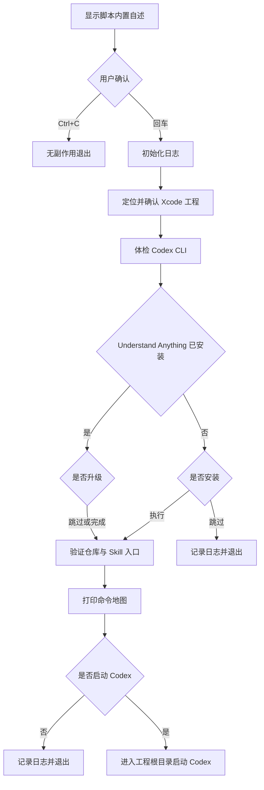

# `CodeX + Understand Anything`


[toc]

---

## 🔥 <font id=前言>前言</font>

> 本目录的 `.command` 用于体检 [**Codex**](https://openai.com/codex) 与 [**Understand Anything**](https://github.com/Lum1104/Understand-Anything)，定位一个 [**Xcode**](https://developer.apple.com/xcode/) / iOS 工程，并给出生成中文代码知识图谱的命令。脚本不会自动分析工程，也不会挂接 `pod install`；安装、升级和启动 Codex 都需要用户单独确认。

Understand Anything 会把源码关系整理为持久化知识图谱，适合查看模块、调用关系、变更影响、领域流程和新成员入门。它不是编译器、静态检查器或代码质量评分器，图谱结论仍需回到源码和真实构建验证。

## 一、目录内容 <a href="#前言" style="font-size:17px; color:green;"><b>🔼</b></a> <a href="#🔚" style="font-size:17px; color:green;"><b>🔽</b></a>

### 1.1、文件结构

```text
./
├── *.command
└── README.md
```

- `.command`：可双击运行的 macOS zsh 入口。
- `README.md`：运行前说明、交互、风险和排错手册。

### 1.2、脚本不会做什么

- 不自动执行 `/understand`，因此不会在用户不知情时消耗 AI 额度。
- 不自动安装 Codex CLI，只在缺失时给出 OpenAI 官方文档入口。
- 不把分析动作挂进 `pod install`、构建阶段或 Git Hook。
- 不递归扫描整台电脑，只在脚本向上有限层级寻找工程，或使用用户明确输入的路径。
- 不自动提交、推送或上传项目源码。

## 二、适用场景

### 2.1、适合使用

- 第一次接手大型 iOS 工程，需要快速建立模块地图。
- 代码仓库已经发生变化，需要用 `/understand-diff` 看影响面。
- 需要针对一个函数、文件或模块做深度解释。
- 想提取业务领域关系或生成新成员 Onboarding 文档。
- 本机 Understand Anything 已安装，需要可选升级和健康检查。

### 2.2、不适合使用

- 只想搜索一个确定的符号；此时 `rg`、Xcode Find 或 CodeGraph 更直接。
- 项目包含无权分析的第三方、客户或敏感源码。
- 当前网络、账号或 AI 额度不允许生成图谱。
- 想把图谱输出当作安全审计、编译结果或事实证明。

## 三、执行前检查

### 3.1、必需条件

| 条件 | 说明 |
| --- | --- |
| macOS + zsh | `.command` 使用 zsh 语法 |
| Codex CLI | 脚本通过 `codex` 命令启动会话 |
| Xcode 工程 | 根目录第一层包含 `.xcworkspace` 或 `.xcodeproj` |
| 网络 | 首次安装或升级 Understand Anything 时需要 |
| 授权 | 只分析 Jobs 自有、开源许可或明确授权源码 |

### 3.2、推荐检查

```shell
codex --version
git --version
curl --version
```

如果只使用现有安装且不升级，脚本不会主动下载内容。

## 四、运行方式

### 4.1、Finder 双击

双击当前目录中的 `.command`。脚本会先显示内置自述；只有按回车确认后，才初始化日志并进入工程定位。

### 4.2、Terminal 运行

```shell
./当前脚本.command
```

可以把工程根目录、`.xcworkspace` 或 `.xcodeproj` 作为第一个参数：

```shell
./当前脚本.command "/path/to/YourProject.xcworkspace"
```

`当前脚本.command` 只是文档占位名，实际执行时使用本目录真实文件名。

### 4.3、工程定位规则

脚本按以下顺序处理：

1、如果传入第一个参数，先验证该路径。

2、从脚本当前目录开始，最多向上检查八层。

3、每层只查看直属的 `.xcworkspace` 和 `.xcodeproj`，不递归进入 Pods 或子工程。

4、命中后列出工程包，由用户确认。

5、自动定位失败后，循环等待用户输入或把路径拖入终端。

这样可以覆盖脚本放在 `ScriptsByDevTools/脚本目录/` 时，项目根目录位于上面两层或三层的常见结构。

## 五、交互规则

### 5.1、内置自述

- 按回车：确认理解用途与影响，继续体检。
- 按 `Ctrl+C`：立即取消，不创建日志、不联网、不安装。

### 5.2、安装与升级

- 直接回车：跳过。
- 输入任意字符后回车：执行。

安装时脚本会把官方 `install.sh` 下载到独立临时目录，记录 SHA-256 后再执行；不会使用不可审计的 `curl | bash` 管道。升级调用已安装仓库中的：

```shell
bash ./install.sh --update
```

### 5.3、启动 Codex

- 直接回车：不启动，安全结束。
- 输入任意字符后回车：进入已确认工程根目录并执行 `codex`。

真正生成图谱仍需进入 Codex 后主动输入 `/understand`。

## 六、完整流程



## 七、Understand Anything 命令地图

### 7.1、生成与查看图谱

```text
/understand --language zh
/understand-dashboard
```

- `/understand`：首次生成知识图谱；已有图谱时默认按项目变化增量处理。
- `--language zh`：要求生成中文说明。
- `/understand-dashboard`：打开交互式 Dashboard。

图谱通常写入：

```text
.understand-anything/knowledge-graph.json
```

### 7.2、围绕图谱继续工作

| 命令 | 用途 |
| --- | --- |
| `/understand-chat` | 基于图谱询问代码关系 |
| `/understand-diff` | 分析 Git Diff、影响组件与风险 |
| `/understand-explain` | 深入解释指定文件、函数或模块 |
| `/understand-onboard` | 生成项目入门指南 |
| `/understand-domain` | 提取业务实体与领域流程 |
| `/understand-knowledge` | 分析知识库文档并构建关系图 |

命令能力以当前安装版本的官方 Skill 文档为准；升级后若命令发生变化，应先重启 Codex 再检查。

### 7.3、大型工程建议

- 首次只指定 Jobs 自有源码目录，排除 `Pods`、生成代码和无权分析内容。
- 先用 `/understand` 建立全景，再用 `/understand-explain` 深挖热点，不要反复全量生成。
- 图谱是辅助索引；涉及构建、运行和安全结论时，必须回到真实源码、测试与工具输出。

## 八、安装位置与加载关系

### 8.1、仓库与 Skill 入口

默认上游仓库位置：

```text
~/.understand-anything/repo
```

Codex 用户级 Skill 入口位于：

```text
~/.agents/skills/understand*
```

安装器通常通过符号链接把上游 Skill 暴露给 Codex。脚本会列出实际入口及其链接目标，便于确认当前加载来源。

### 8.2、为什么升级后要重启 Codex

Codex 在会话启动时发现 Skills。安装或升级发生在当前会话之后时，旧会话未必重新加载 Skill 描述，因此应退出并从工程根目录启动新会话。

## 九、日志文件

### 9.1、位置与内容

日志位于系统临时目录，文件名为：

```text
当前脚本完整文件名.log
```

脚本通过 `tee` 把确认后的终端输出同步写入日志，包括：

- 脚本和工程路径。
- Codex 版本。
- Understand Anything 分支与提交。
- 安装脚本 SHA-256。
- 用户选择、验证结果和退出码。

内置自述确认前不创建或清空日志。

## 十、风险说明

### 10.1、AI 额度与源码边界

- `/understand` 会读取目标源码并消耗 Codex/AI 额度。
- 不要分析第三方、供应商、客户或所有权不明确的代码。
- 图谱目录可能包含架构和业务关系，不应当作无敏感信息随意上传。

### 10.2、安装供应链

- 安装来源固定为 Understand Anything 官方 [**GitHub**](https://github.com) 仓库的 HTTPS 地址。
- 脚本记录下载内容哈希，但未内置官方发布签名或固定哈希；哈希记录用于审计，不等于上游身份的密码学证明。
- 高安全环境应先人工审阅下载的 `install.sh` 和固定提交，再执行安装。

### 10.3、自动升级

脚本不自动升级。用户每次都可以直接回车跳过；执行升级前应确保上游仓库没有需要保留的本地修改。

## 十一、常见问题

### 11.1、为什么找不到工程

- 根目录第一层没有 `.xcworkspace` 或 `.xcodeproj`。
- 传入的是源码子目录，不是工程根目录。
- 工程包尚未生成或被移动。
- 目标是纯 Package / 非 Xcode 工程，本脚本的定位策略不适用。

可直接把正确工程包拖进终端。

### 11.2、为什么安装后没有 `/understand`

1、退出当前 Codex 会话。

2、检查 `~/.agents/skills/understand*` 是否存在并指向上游仓库。

3、重新进入工程根目录执行 `codex`。

4、仍不可见时重新运行脚本，查看日志中的 Skill 入口验证。

### 11.3、为什么 Dashboard 没打开

- 先确认 `/understand` 已成功生成图谱。
- 检查 `.understand-anything/knowledge-graph.json` 是否存在。
- 查看 Codex 输出的端口、依赖或浏览器错误。
- 不要把旧仓库的 Dashboard 地址硬编码到当前项目。

### 11.4、为什么图谱和源码不一致

- 图谱可能基于旧提交或增量扫描范围不完整。
- 生成代码、Pods 或动态派发关系可能被刻意排除或无法完全推断。
- 更新图谱后仍要用源码搜索、CodeGraph、构建和运行验证关键结论。

## 十二、验证声明

### 12.1、可安全执行的验证

维护脚本后至少执行：

```shell
zsh -n ./当前脚本.command
```

语法检查不会安装、升级、启动 Codex 或生成图谱。完整交互验证应在测试工程中人工执行，并分别覆盖：自动命中、手动拖入、跳过安装、跳过升级和不启动 Codex。

### 12.2、未执行声明

仅进行 `zsh -n` 时，应明确记录：没有执行安装器、没有升级上游仓库、没有生成知识图谱、没有消耗分析额度。

## 十三、官方资料

- [**Understand Anything 仓库**](https://github.com/Lum1104/Understand-Anything)
- [**OpenAI Codex CLI**](https://developers.openai.com/codex/cli)
- [**Xcode**](https://developer.apple.com/xcode/)

<a id="🔚" href="#前言" style="font-size:17px; color:green; font-weight:bold;">我是有底线的➤点我回到首页</a>
