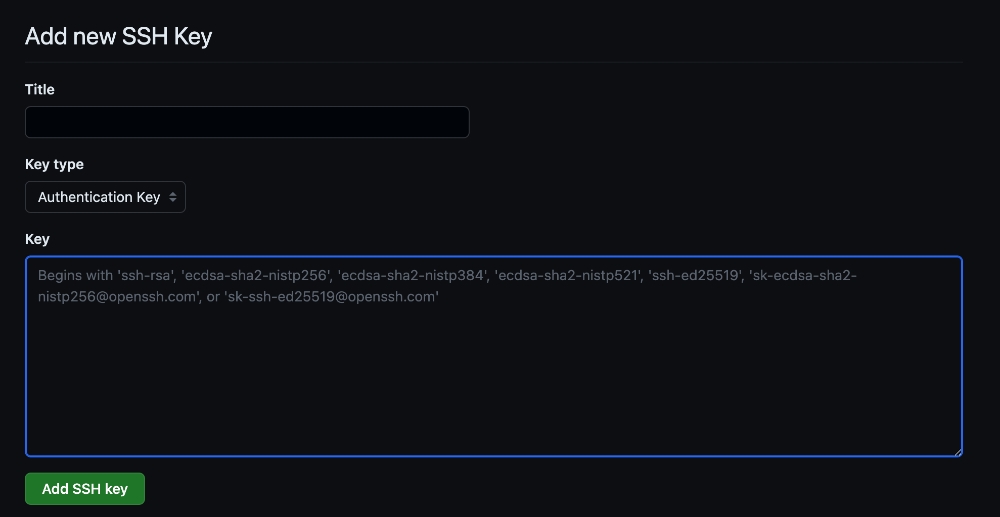
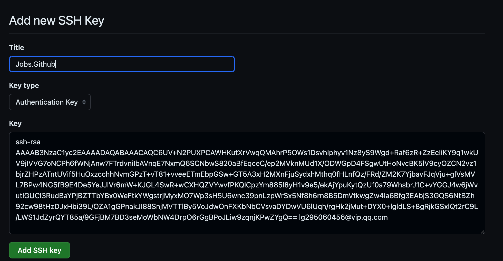
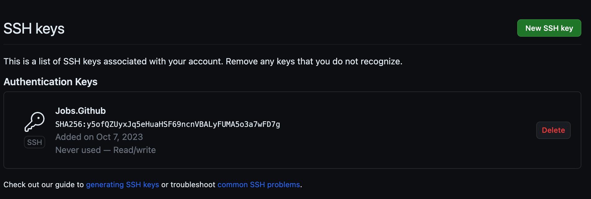
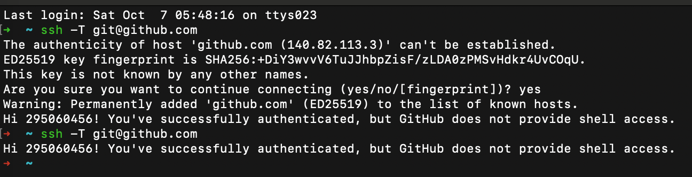

# `SSH` ➤ [Github](https://github.com)

[toc]

## 一、生成`SSH`密钥🔑

> 尚未在本地计算机上生成`SSH`密钥🔑对

```shell
ssh-keygen -t rsa -b 4096 -C "lg295060456@gmail.com"
```

```shell
Last login: Sat Jan 17 14:20:11 on ttys000
➜  Desktop ssh-keygen -t rsa -b 4096 -C "lg295060456@gmail.com"
Generating public/private rsa key pair.
Enter file in which to save the key (/Users/jobs/.ssh/id_rsa): 
Enter passphrase for "/Users/jobs/.ssh/id_rsa" (empty for no passphrase): 
Enter same passphrase again: 
Your identification has been saved in /Users/jobs/.ssh/id_rsa
Your public key has been saved in /Users/jobs/.ssh/id_rsa.pub
The key fingerprint is:
SHA256:Fdvu/MXEYvmoomwjooZvPoR3gX1FlvmYrmmubfZDs7A lg295060456@gmail.com
The key's randomart image is:
+---[RSA 4096]----+
|       .oo.      |
|       .+  +     |
|   o   . +o .    |
|  . o . o...   o |
| .   o .S   . + o|
|. o . . +  o . * |
| + .   * o  o . +|
|. + ..E.= .  o . |
| =+o.Bo+++ .. .  |
+----[SHA256]-----+
```

## 二、确认 `id_rsa` 真的存在 & 权限正确

```shell
ls -la ~/.ssh/id_rsa ~/.ssh/id_rsa.pub
chmod 600 ~/.ssh/id_rsa
chmod 644 ~/.ssh/id_rsa.pub
```

## 三、把 `github.com` 的 key 明确写进 `~/.ssh/config`

* 建立`~/.ssh/config`并赋权

  ```
  mkdir -p ~/.ssh
  touch ~/.ssh/config
  chmod 600 ~/.ssh/config
  ```

* 打开 `open ~/.ssh/config` 

  ```
  open ~/.ssh/config
  ```

* 编辑 `~/.ssh/config` 

  > `IdentitiesOnly yes` 很关键：强制只用你指定的 key，避免 Sourcetree/ssh 乱试其它 identity 导致失败或卡住。

  ```
  Host github.com
    HostName github.com
    User git
    IdentityFile ~/.ssh/id_rsa
    IdentitiesOnly yes
    AddKeysToAgent yes
    UseKeychain yes
  ```

## 四、`id_rsa` ➤ macOS Keychain + agent

> 让 GUI 程序也能用

```shell
ssh-add --apple-use-keychain ~/.ssh/id_rsa
ssh-add -l
```

## 五、添加`SSH`密钥🔑 ➤ `SSH`代理

* 运行以下命令来将生成的SSH密钥添加到SSH代理，以便您可以在不重复输入密码的情况下使用它：

```shell
eval "$(ssh-agent -s)"
ssh-add ~/.ssh/id_rsa
```

```shell
➜  Desktop eval "$(ssh-agent -s)"
ssh-add ~/.ssh/id_rsa
Agent pid 9880
Identity added: /Users/jobs/.ssh/id_rsa (lg295060456@gmail.com)
```

## 六、添加公钥🔑 ➤ [Github](https://github.com)

* 打开`~/.ssh/id_rsa.pub`文件并复制其中的内容

   ```shell
   pbcopy < ~/.ssh/id_rsa.pub
   ```

* 然后登录到 https://github.com/settings/ssh/new

  ```shell
  open https://github.com/settings/ssh/new
  ```

* 转到您的帐户设置，点击`SSH and GPG keys`

* 然后点击`New SSH key`

* 将复制的公钥内容粘贴到"Key"字段中，并为该密钥提供一个标题

  ```shell
  cat ~/.ssh/id_rsa.pub
  ```

  ```shell
  ➜  Desktop cat ~/.ssh/id_rsa.pub
  ssh-rsa AAAAB3NzaC1yc2EAAAADAQABAAACAQC09QFwwcZOnwX5qfiHdYqPNispoWiC72iOMdPk+xX30uvpgDZCUPCD9tWZi5UeoqN0htQLagYjW88EMDTl16pGHZDv9ohCrXyFM7Aer6UJNSWEYf5c2ghvK4zBeoja6X714vtBbI9Vj1L/NcJ61aKsKV/3cYGLFbynHwUrxMm/NbrWa4TV18UCQ0bZN3hwAonr5OWKBGmHIPMYwYoyqm8JQGVVhQWX4WqOjRClOImw/DmGia/NYnU3UeZO+iPCmq5zRLpHkhVm7LK/y/NqAJbZFPgk5E0PScZK8hkbye5UJqUyjHgRzvswT3IqeV2k2mc87icOxVqkqzqNN99nisI5eLV+jyfxVE2+80s8sVSuxRyMonMQBfWO+tO/s0oGDGXJuZ6K9swmk9pphOAOOamMNHqlqN2yN3hL8YtNviCoCTDaxTTswZyrHgXvrE03plAnszxkv2HbniDSldOYa+v9YzMmG6ZJtrlQJN/r7s8jRwhJBb6sBlwqL45B3y0+VOUXr4+Eoc+/A2xy4lOpVaD86B96ks3hm2l1oXMnsoCLJwzLQ25jLcM2rux69DOhGhTw1TvjaRGx22knjDIaTuEDLpuZ20yRCt/xgUaG8oygU3O955jS4Glw3P8wAfKoSf2PlW9tOQn+L/bCdcUho8lmJjueougNvW2keuM9nSoIHQ== lg295060456@gmail.com
  ```

  

  

  

## 七、命令测试`SSH`连接是否正常

```bash
ssh -T git@github.com
```



