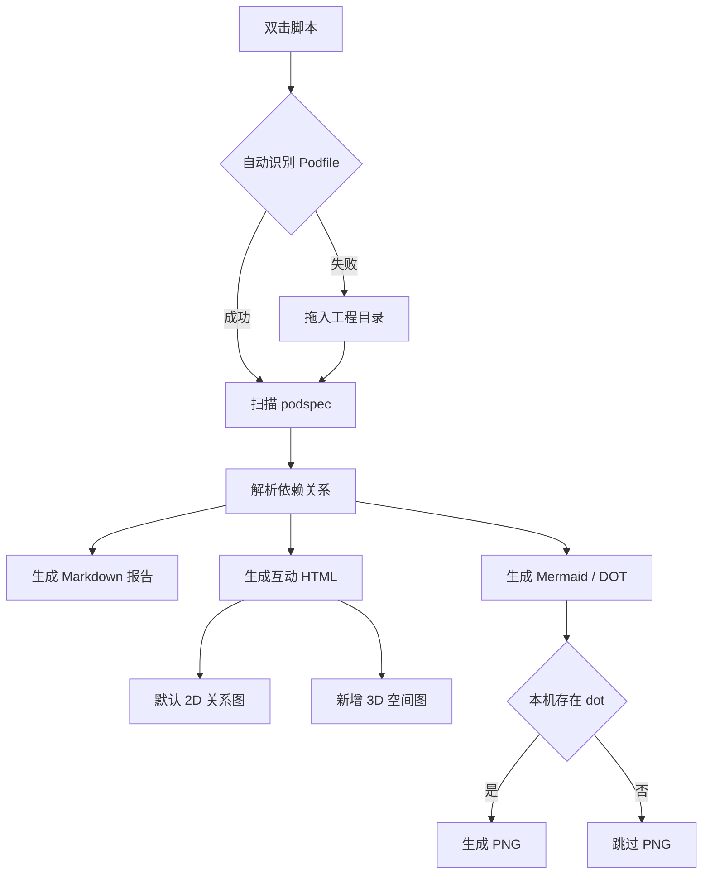

# `【MacOS】🔍查询Xcode工程依赖关系.command`


[toc]

---

## 🔥 <font id=前言>前言</font> <a href="#🔚" style="font-size:17px; color:green;"><b>🔽</b></a>

> 这个脚本用于扫描 [**Xcode**](https://developer.apple.com/xcode) / [**CocoaPods**](https://cocoapods.org/) 工程里的 `*.podspec`，输出依赖分析报告、[**Mermaid**](https://mermaid.js.org) 图源码、[**Graphviz**](https://graphviz.org/) 图源码和互动 HTML 图。

本次升级的重点是：**保留原有 2D 互动图不动，在同一个 HTML 产物里新增 `3D 空间图` 视图**。

## 一、适用场景 <a href="#前言" style="font-size:17px; color:green;"><b>🔼</b></a> <a href="#🔚" style="font-size:17px; color:green;"><b>🔽</b></a>

- 适合分析一个包含 `Podfile` 的 [**CocoaPods**](https://cocoapods.org/) 工程。
- 适合查看多个 `*.podspec` 之间的上下游依赖。
- 适合快速定位：
  - 哪些 Pod 没有下游依赖。
  - 哪些 Pod 被大量引用。
  - 哪些 Pod 存在仓库内循环依赖。
  - 哪些依赖来自外部 Pod。
- 适合做给人看的代码地图：原 2D 图用于稳定扫读，新 3D 图用于空间化理解依赖结构。

## 二、运行方式 <a href="#前言" style="font-size:17px; color:green;"><b>🔼</b></a> <a href="#🔚" style="font-size:17px; color:green;"><b>🔽</b></a>

### 2.1、双击运行

- 推荐把整个文件夹放到目标工程根目录，或放到目标工程的下一层目录。
- 双击运行：

  ```text
  【MacOS】🔍查询Xcode工程依赖关系.command
  ```

- 脚本会优先检测：
  - 脚本所在目录是否存在 `Podfile`。
  - 脚本所在目录的上一层是否存在 `Podfile`。
- 如果自动识别失败，会要求你拖入一个包含 `Podfile` 的工程目录。

### 2.2、终端运行

- 也可以在终端里执行：

  ```shell
  zsh './【MacOS】🔍查询Xcode工程依赖关系.command'
  ```

## 三、产物说明 <a href="#前言" style="font-size:17px; color:green;"><b>🔼</b></a> <a href="#🔚" style="font-size:17px; color:green;"><b>🔽</b></a>

- 脚本会在工程目录下生成固定输出目录：

  ```text
  PodspecDependencyReport/
  ```

- 主要文件如下：

  | 文件 | 说明 |
  | --- | --- |
  | `PodspecDependencies_interactive.html` | 互动 HTML 图，默认保留原 2D 视图，并新增可拖动旋转的 3D 视图。 |
  | `PodspecDependencies.md` | 依赖分析 Markdown 报告。 |
  | `PodspecDependencies_all.mmd` | 全部依赖 [**Mermaid**](https://mermaid.js.org) 图源码。 |
  | `PodspecDependencies_internal.mmd` | 仓库内 Pod 相互依赖 [**Mermaid**](https://mermaid.js.org) 图源码。 |
  | `PodspecDependencies_all.dot` | 全部依赖 [**Graphviz**](https://graphviz.org/) DOT 源码。 |
  | `PodspecDependencies_internal.dot` | 仓库内 Pod 相互依赖 [**Graphviz**](https://graphviz.org/) DOT 源码。 |
  | `PodspecDependencies_all.png` | 如果本机存在 `dot` 命令，则额外生成全部依赖 PNG。 |
  | `PodspecDependencies_internal.png` | 如果本机存在 `dot` 命令，则额外生成仓库内依赖 PNG。 |

## 四、3D 互动说明 <a href="#前言" style="font-size:17px; color:green;"><b>🔼</b></a> <a href="#🔚" style="font-size:17px; color:green;"><b>🔽</b></a>

- 打开 `PodspecDependencies_interactive.html` 后，顶部会看到两个视图按钮：
  - `2D 关系图`
  - `3D 空间图`
- 默认仍然是 `2D 关系图`，不会破坏原来的使用习惯。
- 点击 `3D 空间图` 后：
  - 鼠标拖动：旋转 3D 依赖空间。
  - 鼠标滚轮：缩放。
  - 点击节点：聚焦该 Pod，并显示上下游依赖。
  - 顶部搜索框、依赖模式、邻居层级仍然生效。

## 五、流程图 <a href="#前言" style="font-size:17px; color:green;"><b>🔼</b></a> <a href="#🔚" style="font-size:17px; color:green;"><b>🔽</b></a>



## 六、执行前检查 <a href="#前言" style="font-size:17px; color:green;"><b>🔼</b></a> <a href="#🔚" style="font-size:17px; color:green;"><b>🔽</b></a>

- 工程目录必须直接包含 `Podfile`。
- 工程内需要存在 `*.podspec` 文件，否则报告会提示未找到。
- 脚本会使用系统自带 [**Ruby**](https://www.ruby-lang.org/) 解析依赖。
- 如果需要 PNG 图，脚本会检查 [**Homebrew**](https://brew.sh/) 和 `graphviz`。
- 已安装 [**Homebrew**](https://brew.sh/) 时，脚本不会默认升级，只有你输入任意字符后回车才会执行更新和自检。

## 七、风险说明 <a href="#前言" style="font-size:17px; color:green;"><b>🔼</b></a> <a href="#🔚" style="font-size:17px; color:green;"><b>🔽</b></a>

- 脚本会删除并重新生成工程目录下的旧报告目录：

  ```text
  PodspecDependencyReport/
  ```

- 脚本不会主动修改你的 `Podfile`、`*.podspec` 或业务源码。
- [**Homebrew**](https://brew.sh/) / `graphviz` 相关操作会在终端中提示，不会静默执行升级。
- 如果 `dot` 不存在，只影响 PNG 生成；`Markdown` 报告和互动 HTML 仍会生成。

## 八、日志文件 <a href="#前言" style="font-size:17px; color:green;"><b>🔼</b></a> <a href="#🔚" style="font-size:17px; color:green;"><b>🔽</b></a>

- 运行日志位置：

  ```text
  /tmp/【MacOS】🔍查询Xcode工程依赖关系.log
  ```

## 九、验证记录 <a href="#前言" style="font-size:17px; color:green;"><b>🔼</b></a> <a href="#🔚" style="font-size:17px; color:green;"><b>🔽</b></a>

- 当前打包环境未安装 `zsh`，所以没有执行下面这条 MacOS 本机静态检查：

  ```shell
  zsh -n '【MacOS】🔍查询Xcode工程依赖关系.command'
  ```

- 已抽取脚本内置 [**Ruby**](https://www.ruby-lang.org/) 生成器并执行语法检查：

  ```shell
  ruby -c .generate_podspec_dependency_report.rb
  ```

- 已使用临时示例 `Podfile` / `*.podspec` 跑通生成器，确认 `PodspecDependencies_interactive.html` 中存在 `2D 关系图`、`3D 空间图` 和 `canvas3d`。
- 当前环境没有实际打开 [**Xcode**](https://developer.apple.com/xcode) 工程执行脚本，因此未做真实工程扫描。
- 3D 效果实现方式为原生 `canvas` + JavaScript 投影渲染，不依赖外部模型文件，也不依赖远程 JS CDN。

<a id="🔚" href="#前言" style="font-size:17px; color:green; font-weight:bold;">我是有底线的➤点我回到首页</a>
