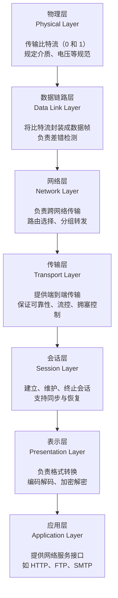
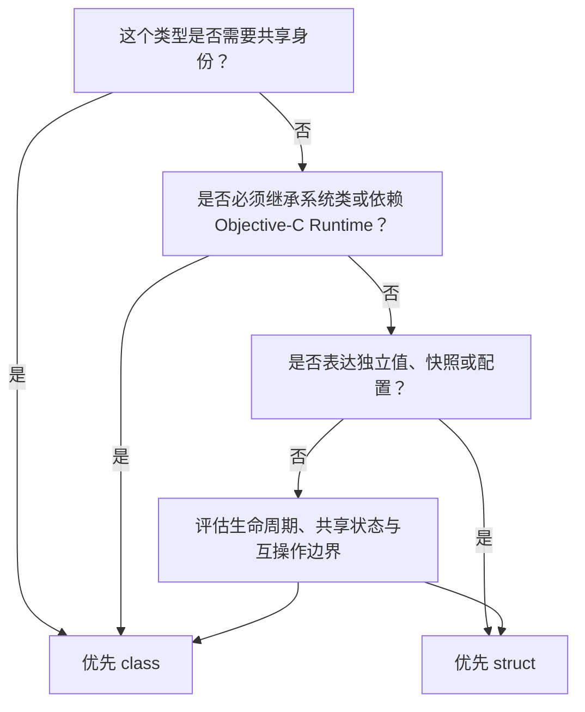

# [**Swift**](https://www.swift.org/) 相关经验


[toc]

---

## 🔥 <font id=前言>前言</font>

> 本文集中整理 Swift 基础语法、内存与数据结构、闭包、泛型、属性、协议、并发、网络及 SwiftUI 经验。语言规则以当前 [**The Swift Programming Language**](https://docs.swift.org/swift-book/documentation/the-swift-programming-language/) 为准；涉及 Apple 平台框架时，再以对应 SDK 文档和项目最低部署版本为准。

- 官方语言资料：

  - [**Swift Attributes**](https://docs.swift.org/swift-book/documentation/the-swift-programming-language/attributes/)
  - [**Swift Concurrency**](https://docs.swift.org/swift-book/documentation/the-swift-programming-language/concurrency/)
  - [**Swift Protocols**](https://docs.swift.org/swift-book/documentation/the-swift-programming-language/protocols/)
  - [**Swift Structures and Classes**](https://docs.swift.org/swift-book/documentation/the-swift-programming-language/classesandstructures/)
  - [**Choosing Between Structures and Classes**](https://developer.apple.com/documentation/swift/choosing-between-structures-and-classes)

- 延伸资料：

  - [**SnapKit**](https://github.com/SnapKit/SnapKit)
  - [**JXSegmentedView**](https://github.com/pujiaxin33/JXSegmentedView)
  - [**SwiftUI 与 UIKit 集成**](https://developer.apple.com/documentation/swiftui/uiviewrepresentable)

- 阅读约定：

  - 文中的 Swift / Objective-C 对比以“语言能力和工程使用边界”为主，不把实现细节误写成永远固定的 ABI 承诺。
  - `async`、Task 与线程不是同义词；结构体 / 类的选择也不以“栈或堆”作为第一判断标准。
  - 代码示例保持极简，生产项目仍需补齐错误分类、日志、取消、限流、测试和部署版本处理。

## 一、网络分层 <a href="#前言" style="font-size:17px; color:green;"><b>🔼</b></a> <a href="#🔚" style="font-size:17px; color:green;"><b>🔽</b></a>
最常见的网络分层是 **OSI**（***O**pen **S**ystems **I**nterconnection*）

### 1.1、OSI 参考模型



### 1.2、参考模型和 TCP/IP 协议族

- **应用层**：包含了 OSI 参考模型中的应用层、表示层和会话层
- **传输层**：类似于 OSI 参考模型的传输层，提供了端到端的数据传输，如 TCP 和 UDP 协议
- **网络层**：类似于 OSI 参考模型的网络层，负责数据包的传输和路由选择，如 IP 协议
- **链路层**：类似于 OSI 参考模型的数据链路层和物理层，负责数据帧的传输和物理介质的规范

## 二、内存区域分类 <a href="#前言" style="font-size:17px; color:green;"><b>🔼</b></a> <a href="#🔚" style="font-size:17px; color:green;"><b>🔽</b></a>

> 不同操作系统和编程语言的实现可能会有所不同，下面的分类只是一种常见的划分方式；
> **TCP/IP** 协议族中的层次结构并不是严格按照 OSI 参考模型来定义的，但它们都提供了类似的功能；
> 网络分层的好处在于可以提高系统的模块化、灵活性和可维护性，同时也促进了不同厂商之间的互操作性

```lua
低地址
+-----------------------------------------------------------------------------------------------------------+
| 代码段（Text）只读，固定大小        																							                        
| 		* 包括：程序代码、只读的常量（如 const 修饰的全局变量和字符串常量）。                                            
+-----------------------------------------------------------------------------------------------------------+
| 数据段 （Data）                                                             				                    
| 		* 包括：已初始化的全局变量和已初始化的静态变量（包括全局和局部的静态变量）。                                       
+-----------------------------------------------------------------------------------------------------------+
| BSS 段（Block Started by Symbol）：未初始化的全局变量、未初始化的静态变量。                                      
+-----------------------------------------------------------------------------------------------------------+
| 常量区：字符串常量（如字面量字符串）和编译期决定的只读变量（大多数实现将其归于代码段）。                               
| 		* 注：如果常量区与代码段分开，则可以单独列出。                                                                
+-----------------------------------------------------------------------------------------------------------+
| 堆（Heap） ◀️ 向高地址增长，动态分配内存（如 malloc 或 new 分配的内存）。   
|			* 堆是动态分配的内存区域，用于存储程序运行时动态分配的内存；
| 		* 堆上的内存可以通过函数如 `malloc()`、`calloc()` 或者 `new` 来分配，并通过 `free()` 或者 `delete` 函数来释放；
+-----------------------------------------------------------------------------------------------------------+
| 栈（Stack）◀️ 向低地址增长，用于局部变量、函数调用参数及返回地址等。   
|			* 栈（Stack）用于存储函数的局部变量、函数参数、函数的返回地址等；
|   	* 每次函数调用时，会在栈（Stack）上分配一块称为栈帧（Stack Frame）的内存，函数返回后，栈帧（Stack Frame）会被销毁；
|     * 栈（Stack）的大小是有限的，通常比堆的大小小得多 ；栈（Stack）<< 堆（Heap）
|     * 可以看作是一个容器；
|       * 其中元素的添加和移除都发生在同一端，通常称为栈顶；
|       * 向栈（Stack）中添加元素的操作称为“压栈”（Push），从栈中移除元素的操作称为“弹栈”（Pop）；
|       * 在栈（Stack）中，最后压入的元素首先被弹出，这就是先进后出的特性；
|     * 栈在计算机科学和软件工程中有广泛的应用，例如函数调用的过程、表达式求值、逆波兰表达式计算等场景都可以使用栈来实现。
+-----------------------------------------------------------------------------------------------------------+
高地址
```

- **全局区（*Global Segment*）**：
   - 全局区存储全局变量，但是和数据区的区别是，它包含了**未初始化的全局变量**
   - 在程序开始时，未初始化的全局变量会被初始化为默认值
   - 已初始化的全局变量属于数据段
   - 未初始化的全局变量属于 BSS 段
   - 全局区实际上已经被包含在 **数据段** 和 **BSS 段** 中
## 三、数据结构 <a href="#前言" style="font-size:17px; color:green;"><b>🔼</b></a> <a href="#🔚" style="font-size:17px; color:green;"><b>🔽</b></a>

- **单向链表**是一种常见的链表数据结构

  - 它由一系列节点组成，每个节点包含两部分：**数据部分**和**指向下一个节点的指针（或者称为链接或引用）**；
  - 在单向链表中，每个节点只有一个指向下一个节点的指针，**而没有指向前一个节点的指针**；
  - 单向链表的特点包括：

    - **节点结构**：每个节点包含一个数据元素以及一个指向下一个节点的指针。
    - **头节点**：链表的起始节点称为头节点。头节点不包含有效的数据元素，它的主要作用是指向链表的第一个节点。
    - **尾节点**：链表的最后一个节点称为尾节点。尾节点的指针指向 NULL（或者称为 Nil、None），表示链表的结束。
    - **动态内存分配**：单向链表中的节点是动态分配的，可以根据需要动态地添加或删除节点，因此单向链表具有灵活的内存管理特性。
    - **顺序访问**：单向链表只能从头节点开始顺序访问，因为每个节点只有指向下一个节点的指针，无法直接访问前一个节点。
  - **单向链表适用于需要频繁插入和删除操作的场景**，因为它们不需要像数组那样移动大量元素来进行插入和删除操作。然而，单向链表的缺点是访问任意位置的元素的效率较低，需要从头节点开始顺序遍历链表。
  - 单向链表的环
    - 链表中某个节点指向链表中的一个先前节点，从而形成了一个闭合的循环结构
    - 链表中某个节点的 next 指针指向了链表中已经遍历过的节点，则称该链表中存在环；
    - 如果链表中不存在环，则称其为单向链表；
    - 如果链表中存在环，则称其为带环链表；
    - 检测链表中是否存在环通常可以通过快慢指针的方法来实现：使用两个指针，一个快指针每次移动两步，一个慢指针每次移动一步。**如果链表中存在环，那么这两个指针最终会相遇**；**如果链表中不存在环，则快指针会先到达链表的末尾**。
  - 带环链表：指链表中某个节点指向了链表中已经遍历过的节点，形成了一个闭合的循环结构。
    - 可以通过快慢指针的方法进行检测：使用两个指针，一个快指针每次移动两步，一个慢指针每次移动一步，如果链表中存在环，那么这两个指针最终会相遇；如果链表中不存在环，则快指针会先到达链表的末尾。
    - 带环链表的存在可能会导致一些问题，比如在遍历链表时可能陷入死循环，或者在执行某些操作时可能无法正确地终止。因此，在实现链表操作时，**需要特别注意处理带环链表的情况**。
  - 无论是单向链表还是双向链表。带环链表是指链表中某个节点指向了链表中已经遍历过的节点，形成了一个闭合的循环结构
- **双向链表**是一种链表数据结构，每个节点包含两个指针，分别**指向前一个节点和后一个节点**，因此可以从任一方向遍历整个链表。
  - 双向链表的特点包括：
    - **节点结构**：每个节点包含数据元素以及两个指针，分别指向前一个节点和后一个节点；
    - **头节点和尾节点**：与单向链表类似，双向链表也可以有头节点和尾节点。头节点指向链表的第一个节点，尾节点指向链表的最后一个节点；
    - **双向遍历**：由于每个节点都有指向前一个节点和后一个节点的指针，因此可以从头节点开始向后遍历，也可以从尾节点开始向前遍历；
    - **动态内存分配**：双向链表中的节点也是动态分配的，可以根据需要动态地添加或删除节点；

  - 双向链表相比于单向链表，提供了更灵活的遍历方式，可以从任一方向快速访问链表的元素；

  - 然而，双向链表相对于单向链表，占用的空间更大，因为每个节点需要存储额外的指向前一个节点的指针；

  - 双向链表的实现会避免出现环的情况。在某些特殊情况下，**双向链表也可能出现环，这通常是由于程序错误导致的**；
- *堆(**Heap**)*

  - <font color="red">***堆内存的分配和释放是由程序员手动管理的***</font>，通常通过 `malloc`、`calloc`、`realloc` 等函数进行分配，通过 `free` 函数进行释放；
  - 堆区相对于栈区更靠内存高字节；（内存后部署堆区）
  - 堆内存的分配不是连续的，它的分配由系统的内存管理器根据需要从堆中的空闲内存块中分配合适大小的内存；
  - 堆内存是用于**存储动态分配的内存**，通常用于存储动态创建的对象、数据结构等；
  - 在堆上分配的内存由 **ARC**（***A**utomatic **R**eference **C**ounting*）管理；
  - 存储：<u>**类实例.方法**</u>、<u>**类实例.属性**</u>；
  - **存放引用类型**：*Class*类型、闭包和函数；
    - 浅拷贝；
    - **堆操作牵涉到合并、移位、重新链接等**；
- *栈(**Stack**)*

  - <font color="red">***栈上的内存分配和释放由编译器（或操作系统）自动管理***</font>，通常以页为单位进行分配和管理；
  - 数据先进后出（**L**ast-**I**n-**F**irst-**O**ut，**LIFO**）
  - 栈内存通常是一块**固定大小**的内存区域，用于存储函数调用的**局部变量**、**函数参数**、**函数调用的返回地址**等信息；
  - **栈内存是连续的**，即在栈中分配的内存地址是依次递增的；
  - 栈区相对于堆区更靠内存低字节；（内存先部署栈区）
  - 将*String*，*Array*，*Dictionary*设计成值类型，**大幅减少了堆上的内存分配和回收的次数**。同时[***C**opy-**O**n-**W**rite*](# Copy-On-Write)又将值传递和复制的开销降到了最低；
  - **存放值类型**：结构体（*struct*）、枚举（*enum*）、元祖（*tuple*）；
    - 深拷贝：可以确保在函数内部或者在其他变量中修改值类型的值时，不会影响到原始值；
    - 性能优势：**仅仅是单个指针的上下移动**；
    - 线程安全：直接存储于内存 ＋ 不需要引用（没有引用计数）和垃圾回收等操作 = 不会发生因为引用计数的增减而引起的竞态条件；
- **队列（Queue）**
  - 一种先进先出（**F**irst-**I**n-**F**irst-**O**ut，**FIFO**）的线性数据结构；
  - 支持在一端进行插入操作，在另一端进行删除操作；
  - 队列常用于实现任务调度、消息传递等场景；
- **数组（Array）**

  - 一种**线性数据结构**，由一组**连续的内存单元**组成，用于**存储相同类型的数据**元素；
  - 数组支持随机访问，但插入和删除操作的效率较低；
- 字符串 == 字符数组。可以使用下标索引来访问字符串中的字符。特别是在C语言中，字符串通常被存储为字符数组，**以 null 字符（'\0'）结尾**；
- **哈希表（Hash Table）**

  - 一种使用哈希函数来实现**键值对映射**的数据结构；
  - 支持快速的查找、插入和删除操作；
  - 哈希表常用于实现关联数组、集合等；
- **哈希映射（HashMap）**

  - 也称为关联数组、字典或映射，存储键值对的集合，通过键快速查找对应的值
- **哈希集合（HashSet）**

  - 类似于哈希表，但**只存储键而不存储值**，用于**存储不重复的元素集合**
- **树（Tree）**

  - 一种**非线性数据结构**；
  - 由节点和边组成，每个节点可以有零个或多个子节点；
  - 树常用于表示层次关系，如文件系统、组织结构等；
- **二叉树（Binary Tree）**：一种特殊的树形数据结构，**每个节点最多有两个子节点**，分为**左子树**和**右子树**

  - **红黑树（Red-Black Tree）**：一种自平衡的二叉查找树，保持良好的平衡性能，用于实现有序集合和映射；
  - **AVL树**：一种高度平衡的二叉查找树，通过旋转操作来保持平衡，用于实现有序集合和映射。
- **B树（B-Tree）**：一种多路搜索树，每个节点可以存储多个键值对，**用于实现数据库索引、文件系统**等。
- **Trie树（Trie Tree）**：也称为字典树或前缀树，用于**高效地存储和检索字符串集合**。
- **字典树（Suffix Tree）**：用于高效地存储和检索字符串集合的一种树形数据结构，通常**用于字符串匹配和搜索**。
- **图（Graph）**

  - 一种非线性数据结构；
  - 由节点（顶点）和边组成，用于表示各种实体之间的关系；
  - 图常用于网络分析、路由算法等场景。

## 四、锁🔒 <a href="#前言" style="font-size:17px; color:green;"><b>🔼</b></a> <a href="#🔚" style="font-size:17px; color:green;"><b>🔽</b></a>

在操作系统中，常见的锁包括：

- **互斥锁（Mutex Lock）：** 互斥锁是最基本的一种锁，用于保护临界区，确保在同一时刻只有一个线程可以访问共享资源。当一个线程持有互斥锁时，其他线程必须等待该线程释放锁才能访问共享资源。

- **自旋锁（Spin Lock）：** 自旋锁是一种忙等待的锁，当线程尝试获取锁时，如果锁已被其他线程持有，则该线程会循环等待直到锁被释放。自旋锁适用于对临界区的访问时间很短的情况。

- **读写锁（Read-Write Lock）：** 读写锁允许多个线程同时读取共享资源，但是在写操作时需要互斥访问。读写锁通过分离读操作和写操作来提高并发性能。

- **条件变量（Condition Variable）：** 条件变量通常与互斥锁一起使用，用于实现线程间的同步。它允许线程在特定条件下等待并在条件满足时被唤醒。条件变量提供了 `wait`、`signal` 和 `broadcast` 等操作。

- **信号量（Semaphore）：** 信号量是一种计数器，用于控制对共享资源的访问。它可以用于限制同时访问共享资源的线程数量，或者用于线程间的同步和通信。

- **屏障（Barrier）：** 屏障用于在多线程环境下同步多个线程的执行顺序。它可以保证在达到屏障之前的所有线程都执行完毕后，再执行屏障之后的操作。

这些锁和同步机制在操作系统中起着至关重要的作用，可以有效地控制对共享资源的访问，保证多个线程之间的协调和同步。不同的锁适用于不同的场景和需求，开发人员需要根据具体的应用场景选择合适的锁来实现线程安全和并发控制。

```swift
import Foundation

class CustomLock {
    private var lock = NSLock()
    
    func lock() {
        lock.lock()
    }
    
    func unlock() {
        lock.unlock()
    }
}

func testCustomLock() {
    let lock = CustomLock()
    
    DispatchQueue.global().async {
        lock.lock()
        print("Thread 1: Lock acquired")
        sleep(2) // 模拟一些工作
        lock.unlock()
        print("Thread 1: Lock released")
    }
    
    DispatchQueue.global().async {
        lock.lock()
        print("Thread 2: Lock acquired")
        sleep(2) // 模拟一些工作
        lock.unlock()
        print("Thread 2: Lock released")
    }
    
    // 防止主线程结束
    dispatchMain()
}

testCustomLock()
/**
在这个示例中，我们定义了一个名为 CustomLock 的类，它使用 NSLock 来实现互斥锁。
lock 方法通过调用 NSLock 的 lock 方法来获取锁，unlock 方法通过调用 NSLock 的 unlock 方法来释放锁。
在 testCustomLock 函数中，我们创建了一个 CustomLock 对象，并在两个后台线程中分别调用 lock 和 unlock 方法来模拟锁的获取和释放。
最后，我们调用 dispatchMain() 来防止主线程提前结束。
*/
```

## 五、[**Swift**](https://www.swift.org/) 多线程与并发 <a href="#前言" style="font-size:17px; color:green;"><b>🔼</b></a> <a href="#🔚" style="font-size:17px; color:green;"><b>🔽</b></a>

> [**Swift Concurrency**](https://docs.swift.org/swift-book/documentation/the-swift-programming-language/concurrency/) 构建在线程之上，但业务代码主要面对的是 Task、结构化并发和 Actor，而不是手工指定“这段代码永远跑在线程 X”。异步不等于并行，Task 也不等于线程；`await` 之后除 Actor 隔离等语义保证外，不应假设仍在原线程。

### 5.1、基本概念

| 概念 | 含义 |
| --- | --- |
| 同步 | 调用方等待当前工作完成后再继续 |
| 异步 | 工作允许挂起，调用方可以先做其它事情 |
| 并发 | 多个任务在时间上交错推进 |
| 并行 | 多个任务在多个执行核心上同时运行 |
| 线程 | 操作系统执行资源 |
| 队列 | 提交工作的调度抽象，例如 GCD Queue |
| Task | Swift 并发运行时管理的异步工作单元 |
| Actor | 串行保护自身可变状态的引用类型 |
| 隔离域 | 一组不能被其它并发域随意读写的状态与代码 |

### 5.2、核心能力速查

| Swift 能力 | 用途 | Objective-C 常见对应 |
| --- | --- | --- |
| `async` / `await` | 线性表达可挂起操作 | completion Block |
| `Task {}` | 从同步入口启动非结构化异步工作，并继承当前优先级、Actor 与 Task Local | `dispatch_async` |
| `Task.detached {}` | 创建不继承当前 Actor / 优先级 / Task Local 的独立任务；谨慎使用 | 全局并发队列上的独立工作 |
| `async let` | 并行启动数量已知的子任务 | `dispatch_group` + 多个 `dispatch_async` |
| `withTaskGroup` | 动态数量的结构化子任务 | `dispatch_group` / `NSOperationQueue` |
| `AsyncSequence` | 异步消费多次到达的值 | delegate / notification / stream callback |
| `actor` | 隔离共享可变状态 | 私有串行队列 + 手工封装 |
| `@MainActor` | 隔离 UI 与主执行域 | `dispatch_get_main_queue()` |
| `Sendable` / `@Sendable` | 编译期检查跨隔离域传值与闭包捕获 | OC 无语言级等价物 |
| Continuation | 把一次性 completion API 桥接成 `async` | 原 completion API |
| 协作式取消 | 父子任务传播取消，任务主动检查并退出 | `NSOperation.cancel` + `isCancelled` |

### 5.3、极简 `async` / `await` Demo

```swift
import Foundation

struct User: Decodable, Sendable {
    let id: Int
    let name: String
}

func fetchUser(from url: URL) async throws -> User {
    let (data, response) = try await URLSession.shared.data(from: url)
    guard let httpResponse = response as? HTTPURLResponse,
          200..<300 ~= httpResponse.statusCode else {
        throw URLError(.badServerResponse)
    };return try JSONDecoder().decode(User.self, from: data)
}

@MainActor
final class UserScreenModel {
    private(set) var user: User?
    private(set) var errorMessage: String?

    func refresh(from url: URL) {
        Task { [weak self] in
            guard let self else { return }
            do {
                self.user = try await fetchUser(from: url)
            } catch {
                self.errorMessage = error.localizedDescription
            }
        }
    }
}
```

- `URLSession.data(from:)` 挂起等待网络，不会用同步阻塞占住当前线程。
- `UserScreenModel` 被 `@MainActor` 隔离，所以状态更新具有主 Actor 语义。
- `Task` 继承创建点的 Actor；它不是“自动切到后台线程”的同义词。
- CPU 密集型解析、压缩、图像处理要单独设计并发边界，不能因为函数写了 `async` 就认为已经离开主 Actor。

### 5.4、固定数量并发：`async let`

```swift
struct Dashboard: Sendable {
    let profile: String
    let messages: [String]
}

func loadProfile() async throws -> String {
    "Jobs"
}

func loadMessages() async throws -> [String] {
    ["Hello", "Swift"]
}

func loadDashboard() async throws -> Dashboard {
    async let profile = loadProfile()
    async let messages = loadMessages()
    return try await Dashboard(
        profile: profile,
        messages: messages
    )
}
```

`async let` 创建结构化子任务：父任务离开作用域前必须等待或取消子任务，错误与取消也会沿父子关系传播。

### 5.5、动态数量并发：Task Group

```swift
func fetchTitle(id: Int) async -> String {
    "Title-\(id)"
}

func fetchTitles(ids: [Int]) async -> [String] {
    await withTaskGroup(of: String.self, returning: [String].self) { group in
        for id in ids {
            group.addTask {
                await fetchTitle(id: id)
            }
        };return await group.reduce(into: []) { result, title in
            result.append(title)
        }
    }
}
```

- Task Group 适合运行时才知道数量的同类任务。
- 子任务完成顺序不保证等于添加顺序；需要稳定顺序时携带索引并在结果阶段排序。
- 不要无限制添加数万任务；I/O、服务端限流与内存压力仍要控制。

### 5.6、Actor：替代“串行队列保护属性”

```swift
actor DownloadLedger {
    private var finishedIDs: Set<Int> = []

    func markFinished(_ id: Int) {
        finishedIDs.insert(id)
    }

    func contains(_ id: Int) -> Bool {
        finishedIDs.contains(id)
    }
}

func recordDownload(id: Int, ledger: DownloadLedger) async {
    await ledger.markFinished(id)
    let exists = await ledger.contains(id)
    print(exists)
}
```

- Actor 是引用类型，但其可变状态受 Actor 隔离保护。
- Actor 同一时刻只执行一段隔离代码；跨 Actor 访问通常需要 `await`。
- Actor 可重入：在 Actor 方法的 `await` 挂起期间，Actor 可能处理其它任务，因此不要假设挂起前后的状态绝对不变。

### 5.7、取消与超时意识

Swift Task 的取消是协作式的：`cancel()` 只是发出请求，任务必须在合适位置响应。

```swift
func buildIndex(values: [Int]) async throws -> [Int] {
    var result: [Int] = []
    result.reserveCapacity(values.count)

    for value in values {
        try Task.checkCancellation()
        result.append(value * value)
    };return result
}

let task = Task {
    try await buildIndex(values: Array(0..<100_000))
}

task.cancel()
```

- 会挂起的标准异步 API 通常能响应取消，但自写 CPU 循环要调用 `Task.checkCancellation()` 或检查 `Task.isCancelled`。
- 取消后可能返回部分结果、`nil` 或抛出 `CancellationError`，API 应明确约定。
- 不要用 `Thread.sleep` 阻塞并发线程池；异步上下文使用 `Task.sleep(...)`。

### 5.8、completion API 桥接到 `async`

```swift
enum LegacyError: Error {
    case missingData
}

func legacyLoad(
    completion: @escaping (Result<Data, Error>) -> Void
) {
    completion(.failure(LegacyError.missingData))
}

func loadData() async throws -> Data {
    try await withCheckedThrowingContinuation { continuation in
        legacyLoad { result in
            continuation.resume(with: result)
        }
    }
}
```

- Continuation 必须且只能恢复一次；漏恢复会让任务永久挂起，重复恢复会触发错误。
- 优先使用 `withCheckedContinuation` / `withCheckedThrowingContinuation`，确认性能瓶颈后才考虑 unsafe 版本。
- 一次性 completion 适合 Continuation；多次事件流应改成 `AsyncStream` / `AsyncThrowingStream`。

### 5.9、Swift 与 Objective-C 极简对比

- Objective-C + GCD：

  ```objc
  - (void)loadDataWithCompletion:(void (^)(NSData * _Nullable data,
                                            NSError * _Nullable error))completion {
      dispatch_async(dispatch_get_global_queue(QOS_CLASS_USER_INITIATED, 0), ^{
          NSData *data = [self readData];
          dispatch_async(dispatch_get_main_queue(), ^{
              completion(data, nil);
          });
      });
  }
  ```

- Swift Concurrency：

  ```swift
  func readData() async throws -> Data {
      try await storage.read()
  }

  @MainActor
  func reload() async {
      do {
          let data = try await readData()
          apply(data)
      } catch {
          show(error)
      }
  }
  ```

| 对比项 | Objective-C | Swift |
| --- | --- | --- |
| 语言模型 | 没有原生 `async` / `await`；主要使用 GCD、`NSOperation`、Block | 语言级 Task、结构化并发、Actor、隔离与 `Sendable` |
| 错误传播 | 常用 `NSError **` 或 completion 中的 error | `async throws` + `try await` |
| 返回值 | 通过 Block 回调 | 异步函数直接返回 |
| 任务关系 | GCD Block 通常没有显式父子结构 | `async let` / Task Group 明确父子生命周期 |
| 数据竞争 | 靠队列、锁、约定和测试 | 编译器能检查大量隔离与 `Sendable` 问题 |
| UI 回主线程 | 手动 `dispatch_async(dispatch_get_main_queue(), ...)` | `@MainActor` / `MainActor.run` |
| 取消 | GCD Block 难取消；`NSOperation` 是协作式取消 | Task 原生传播取消，但仍需任务协作 |
| 共享状态 | 串行队列、锁、原子操作 | 优先 Actor；底层同步原语仍可用 |
| 线程假设 | Queue 与线程也不是一一对应 | Task 更不承诺固定线程；围绕隔离域思考 |

### 5.10、GCD / `NSOperation` 到 Swift Concurrency 的迁移映射

| 旧写法 | 优先考虑 |
| --- | --- |
| 单次 completion | `async throws` |
| 多个固定并发请求 + `dispatch_group` | `async let` |
| 动态批量任务 + `dispatch_group` | `withTaskGroup` / `withThrowingTaskGroup` |
| 私有串行队列保护可变属性 | `actor` |
| 主队列刷新 UI | `@MainActor` |
| 一次性初始化 + `dispatch_once` | `static let` |
| delegate / Notification 多次回调 | `AsyncStream`，或保留 delegate |
| `NSOperation` 依赖图、KVO 状态、复杂暂停恢复 | 评估后保留 `NSOperation`；Swift Concurrency 不要求机械替换 |
| 信号量把异步强行改同步 | 删除阻塞桥接，沿调用链自上而下改为 `async` |

### 5.11、常见误区

- `async` 表示函数可以挂起，不保证自动并行，也不保证自动离开主 Actor。
- `await` 是潜在挂起点，不是“切线程”关键字。
- `@MainActor` 与主线程关系密切，但代码层应依赖 Actor 隔离语义，不依赖线程 ID。
- 不要在持有 `NSLock`、`pthread_mutex` 或信号量的临界区中跨越 `await`。
- `Task.detached` 不继承调用方 Actor、优先级和 Task Local，只有在确实需要断开上下文时使用。
- `@unchecked Sendable` 是安全承诺，不是关闭警告的捷径。
- Swift 仍可调用 GCD / `NSOperation`；迁移目标是让生命周期、错误、取消与共享状态更清晰，而不是追求语法替换率。

## 六、在[**Swift**](https://www.swift.org/)中，一个结构体（struct），占据多大的内存？ <a href="#前言" style="font-size:17px; color:green;"><b>🔼</b></a> <a href="#🔚" style="font-size:17px; color:green;"><b>🔽</b></a>

- 在[**Swift**](https://www.swift.org/)中，结构体（*struct*）的大小取决于其包含的成员变量的大小和对齐方式；

- [**Swift**](https://www.swift.org/)的内存布局是由编译器决定的，并且受到目标平台和编译器版本等因素的影响；

- [**Swift**](https://www.swift.org/) 中结构体是值类型，简单局部值可能被优化到栈或寄存器，也可能因为逃逸、泛型存在类型、闭包捕获、类持有或桥接而装箱；这些因素会影响实现，但任何单一条件都不能证明实例“一定在堆上”。

- 通常情况下，***结构体的内存布局是按照其成员变量的顺序依次排列的，并且可能会进行字节对齐***。这意味着如果结构体的成员包含不同类型的数据，编译器**可能会在其间插入一些填充字节以保持对齐**。
  你可以使用[**Swift**](https://www.swift.org/) 的`MemoryLayout`来获取结构体的大小。例如：

  ```swift
  struct MyStruct {
      var member1: Int
      var member2: Double
      var member3: Bool
  }
  
  let size = MemoryLayout<MyStruct>.size
  print("MyStruct 占用的内存大小为 \(size) 字节")
  ```

  > 这将输出结构体 `MyStruct` 占用的字节数。请注意，实际的大小可能因为对齐而有所不同。如果你需要详细的信息，你还可以使用 `MemoryLayout<MyStruct>.alignment` 和 `MemoryLayout<MyStruct>.stride` 来获取对齐和步幅的信息。

  ```swift
  let alignment = MemoryLayout<MyStruct>.alignment
  let stride = MemoryLayout<MyStruct>.stride
  
  print("MyStruct 对齐方式为 \(alignment) 字节")
  print("MyStruct 步幅为 \(stride) 字节")
  ```

  总之，要确定一个结构体占据多大的内存，最好使用 `MemoryLayout`
## 七、[**Swift**](https://www.swift.org/) 结构体、类与 Objective-C 结构体 <a href="#前言" style="font-size:17px; color:green;"><b>🔼</b></a> <a href="#🔚" style="font-size:17px; color:green;"><b>🔽</b></a>

> [**Swift Structures and Classes**](https://docs.swift.org/swift-book/documentation/the-swift-programming-language/classesandstructures/) 的核心分界不是“结构体一定在栈、类一定在堆”，而是值语义与引用语义。存储位置由编译器、逃逸分析、泛型装箱和运行时上下文共同决定，不能作为选型规则。

### 7.1、Swift 结构体与类的共同能力

Swift 的 `struct` 与 `class` 都可以：

- 定义存储属性、计算属性和类型属性。
- 定义实例方法、类型方法和下标。
- 自定义初始化方法。
- 通过 `extension` 扩展能力。
- 遵守协议并使用泛型。
- 使用访问控制、属性包装器和嵌套类型。

### 7.2、Swift 结构体与类的核心区别

| 对比项 | `struct` | `class` |
| --- | --- | --- |
| 语义 | 值类型 | 引用类型 |
| 赋值 / 传参 | 逻辑上产生独立值；编译器可用 Copy-on-Write 等方式延迟物理复制 | 多个变量可引用同一实例 |
| 身份判断 | 没有对象身份运算符 | 使用 `===` / `!==` 判断同一实例 |
| 继承 | 不支持类型继承 | 支持单继承、重写与 `super` |
| 反初始化 | 不提供 `deinit` | 支持 `deinit` |
| ARC | 结构体本身不通过对象引用计数管理 | 类实例由 ARC 管理 |
| 可变方法 | 修改自身的方法需要 `mutating` | 不需要 `mutating` |
| `let` 实例 | 整个值不可变，变量存储属性不能修改 | 引用不可改指向，但实例的 `var` 属性仍可修改 |
| 自动成员逐一初始化 | 未自定义冲突初始化器时可获得 | 不自动获得同等成员逐一初始化器 |
| Objective-C Runtime | 任意 Swift 结构体不能直接作为 `@objc` 对象暴露 | `NSObject` 子类及兼容成员可暴露给 Objective-C |
| 常见用途 | 纯数据、配置、值对象、不可变快照、SwiftUI View | 共享身份、UIKit 控件、控制器、继承体系、资源生命周期 |

### 7.3、值语义 Demo

```swift
struct Profile {
    var name: String
    var tags: [String]

    mutating func append(tag: String) {
        tags.append(tag)
    }
}

var first = Profile(name: "Jobs", tags: ["Swift"])
var second = first
second.name = "Codex"
second.append(tag: "Concurrency")

print(first.name)  // Jobs
print(first.tags)  // ["Swift"]
print(second.name) // Codex
```

这里的“复制”是语义保证，不等于每次赋值都立即逐字节深拷贝：

- `Array`、`Dictionary`、`String` 等标准库值类型通常使用 Copy-on-Write。
- 如果结构体属性本身是类引用，复制结构体后两个值仍可能引用同一个对象。
- 编译器可以消除无意义复制、把值装箱，或根据逃逸情况选择存储位置。

### 7.4、引用语义 Demo

```swift
final class ProfileBox {
    var name: String

    init(name: String) {
        self.name = name
    }
}

let first = ProfileBox(name: "Jobs")
let second = first
second.name = "Codex"

print(first.name)   // Codex
print(first === second) // true
```

`let first` 只保证引用不再指向另一个 `ProfileBox`，不保证对象内部属性不可变。

### 7.5、什么时候优先用结构体

- 类型表达的是“一个值”，两个实例是否相同只看内容，不看身份。
- 需要安全地复制快照、跨函数传递，避免无意共享可变状态。
- 数据规模可控，属性本身也尽量具有值语义。
- 需要自然遵守 `Equatable`、`Hashable`、`Codable`、`Sendable` 等协议。
- 模型、坐标、尺寸、配置、请求参数、不可变状态等场景。

### 7.6、什么时候必须或更适合用类

- 需要稳定对象身份或多个持有方共同观察同一实例。
- 需要继承、Objective-C Runtime、KVO 或 `NSObjectProtocol` 生态。
- 必须继承 `UIView`、`UIViewController`、`NSOperation` 等系统类。
- 需要 `deinit` 管理文件句柄、观察者、底层资源等生命周期。
- 对象很大且频繁传递，同时业务语义本来就是共享实例。

> “优先结构体”不是“禁止类”。先选正确语义，再用基准测试判断性能；不要用“结构体一定更快”替代测量。

### 7.7、Objective-C 的 `struct` 本质

[**Objective-C**](https://developer.apple.com/library/archive/documentation/Cocoa/Conceptual/ProgrammingWithObjectiveC/Introduction/Introduction.html) 的结构体本质上是 C 聚合值类型：

```objc
typedef struct {
    double x;
    double y;
} JobsPoint;

JobsPoint pointA = { .x = 10.0, .y = 20.0 };
JobsPoint pointB = pointA;
pointB.x = 99.0;
```

修改 `pointB.x` 不会改变 `pointA.x`，但 Objective-C `struct` 与 Swift `struct` 的表达能力完全不同。

### 7.8、Swift `struct` 与 Objective-C `struct` 重点对比

| 能力 | Swift `struct` | Objective-C / C `struct` |
| --- | --- | --- |
| 类型性质 | 完整命名类型、值语义 | C 聚合值类型 |
| 属性 | 存储属性、计算属性、观察器、属性包装器 | 字段；没有 Swift 属性模型 |
| 方法 | 实例方法、`mutating` 方法、类型方法 | 不能在结构体体内声明 Objective-C 方法 |
| 初始化 | 自定义 `init`、可失败初始化、泛型初始化 | 聚合初始化、函数辅助初始化 |
| 协议 | 可遵守任意适用 Swift 协议 | 不能遵守 Objective-C Protocol |
| 扩展 | 可通过 `extension` 增加方法、计算属性、协议遵循 | 不能用 Category 扩展 C 结构体 |
| 泛型 | 支持泛型结构体与条件遵循 | C `struct` 不支持 Swift 式泛型 |
| 访问控制 | `private` 到 `public` / `package` | 依赖头文件可见性，没有同等成员级访问模型 |
| 内存管理 | 字段可包含值或引用；引用字段仍由 ARC 管理 | 可包含对象指针，但所有权、复制和 C ABI 需要显式谨慎设计 |
| 运行时 | 不是 Objective-C 对象，没有 `isa` | 不是 Objective-C 对象，没有 `isa` |
| 消息发送 | 直接调用 Swift 方法 | 不能向结构体发送 Objective-C 消息 |
| 桥接 | 任意 Swift 结构体不能直接暴露为 `@objc` 对象 | C 兼容结构体可被 Swift 导入，例如 `CGPoint` |

### 7.9、Swift 结构体不等于“加强版 NSValue”

- `CGPoint`、`CGSize`、`CGRect` 是 C 结构体，经模块导入后在 Swift 中获得更自然的 API。
- 任意自定义 Swift `struct` 不能直接标记 `@objc` 并让 Objective-C 像对象一样使用。
- Swift / Objective-C 公共边界需要值类型时，可使用双方都理解的 C 结构体；需要方法、协议、泛型或复杂所有权时，通常使用 `NSObject` 包装类。
- `NSValue` 可装箱部分 C 结构体，但装箱后得到的是 Objective-C 对象语义，不会把 C 结构体变成 Swift 式结构体。

### 7.10、内存布局与桥接风险

- `MemoryLayout<T>.size`：实例实际字段占用的字节数，不含尾部补齐。
- `MemoryLayout<T>.alignment`：对齐要求。
- `MemoryLayout<T>.stride`：数组中相邻元素的步幅，通常大于等于 `size`。
- 不要把普通 Swift 结构体当前观察到的字段顺序和字节布局当成跨模块、跨编译器、跨语言 ABI 合同。
- `@frozen` 服务 Swift Library Evolution，也不等于自动获得任意 C ABI 兼容布局。
- 和 C / Objective-C 交互时，优先使用已导入的 C 结构体、明确的 C 接口或对象包装层。

### 7.11、选型决策



## 八、Copy-On-Write <a href="#前言" style="font-size:17px; color:green;"><b>🔼</b></a> <a href="#🔚" style="font-size:17px; color:green;"><b>🔽</b></a>

- **C**opy-**O**n-**W**rite（COW）是一种内存管理技术，通常**用于优化复杂数据结构的拷贝操作**。
- 它的基本思想是**延迟拷贝**，只有在**需要修改数据时才进行实际的拷贝操作**，这样可以节省内存和提高性能。
- 具体来说，**当多个变量共享同一块内存时，如果其中一个变量需要修改数据，那么就会进行拷贝操作，而不是直接修改原始数据**
  - 这样，在修改数据之前，所有的变量都指向同一块内存，称为*共享状态*；
  - 而在修改数据后，修改发生的变量会拷贝一份数据到新的内存空间，然后修改新的内存空间中的数据，这样其他变量不受影响，仍然指向原来的内存空间。
- **C**opy-**O**n-**W**rite 的优点是在**大部分情况下避免了不必要的数据拷贝**，节省了内存和运行时间。它通常用于处理复杂数据结构，如字符串、数组、字典等，这些数据结构在进行赋值操作时可能需要进行大量的数据拷贝，使用 **C**opy-**O**n-**W**rite技术可以显著提高性能。
- 在实际应用中，**C**opy-**O**n-**W**rite 技术常见于编程语言的标准库中，如 [**Swift**](https://www.swift.org/) 中的<font color="red">***字符串和数组类型***</font>就采用了 **C**opy-**O**n-**W**rite。

## 九、[**Swift**](https://www.swift.org/)、Java 与 C/C++ 中 `static` 和 `final` 的区别 <a href="#前言" style="font-size:17px; color:green;"><b>🔼</b></a> <a href="#🔚" style="font-size:17px; color:green;"><b>🔽</b></a>

- **`static`**

  - **C/C++**：函数内的 `static` 局部变量具有静态存储期；文件作用域的 `static` 名称具有内部链接，只在当前翻译单元可见。
  - **Java**：`static` 成员属于类本身，由该类的实例共享，通过类名访问。
  - **Swift**：`static` 声明类型属性或类型方法，适用于类、结构体和枚举；类成员若需要允许子类重写，应改用 `class`。

- **`final`**

  - **C++**：C++11 起可用 `final` 禁止类继续派生，或禁止虚函数继续重写；C 语言没有对应关键字。
  - **Java**：可禁止类被继承、方法被重写，或让变量只能完成一次赋值。
  - **Swift**：用于禁止类被继承，或禁止类中的方法、属性、下标继续重写。

> `static` / `final` 描述的是语言语义，不能据此直接断定成员位于栈、堆或某个固定“常量池”；实际存储与优化由编译器和运行时决定。

## 十、[**Swift**](https://www.swift.org/) 用变量保存函数 <a href="#前言" style="font-size:17px; color:green;"><b>🔼</b></a> <a href="#🔚" style="font-size:17px; color:green;"><b>🔽</b></a>

[**Swift**](https://www.swift.org/) 函数是一等值，可以赋给 `let` / `var`、作为参数传入，也可以作为返回值返回。用 `var` 保存函数后，还能重新赋入签名相同的函数或闭包。

```swift
func add(_ lhs: Int, _ rhs: Int) -> Int {
    lhs + rhs
}

var operation: (Int, Int) -> Int = add
print(operation(2, 3)) // 5

operation = { $0 * $1 }
print(operation(2, 3)) // 6
```

## 十一、为什么 [**SwiftUI**](https://developer.apple.com/xcode/swiftui/) 的 `View` 通常使用 `struct` <a href="#前言" style="font-size:17px; color:green;"><b>🔼</b></a> <a href="#🔚" style="font-size:17px; color:green;"><b>🔽</b></a>

> 在 [**SwiftUI**](https://developer.apple.com/xcode/swiftui/) 中，视图（View）被建议使用结构体（struct）而不是类（class）。
> 这是因为 [**SwiftUI**](https://developer.apple.com/xcode/swiftui/) 采用了声明式的编程范式，而结构体更符合声明式编程的特性。

*下面是一些原因：*

- 不可变性：结构体是值类型，而类是引用类型。值类型在传递和复制时会产生副本，这有助于保持不可变性；
  - [**SwiftUI**](https://developer.apple.com/xcode/swiftui/) 的设计倾向于使用不可变的数据模型，以确保状态的一致性和可预测性；

- 简单性和可预测性：结构体更简单，不涉及继承和引用计数等概念，使得代码更易于理解和维护。结构体通常更容易推导和预测其行为。
- 值语义：结构体提供了值语义，这意味着它们的比较是基于值而不是引用的；
  - 这有助于在 [**SwiftUI**](https://developer.apple.com/xcode/swiftui/) 中更容易管理视图层次结构和状态。

- 性能优势:结构体在一些情况下可能具有性能优势；
  - 由于值语义和不可变性，[**Swift**](https://www.swift.org/) 编译器可以进行更多的优化，例如避免不必要的副本操作；

*综上所述：*

- 在 [**SwiftUI**](https://developer.apple.com/xcode/swiftui/) 中，View 协议的实现通常要求是不可变的，因此使用结构体是一个自然的选择
- 在 [**SwiftUI**](https://developer.apple.com/xcode/swiftui/) 中创建的视图是根据数据模型的变化而自动更新的，这与结构体的值语义非常契合
- 尽管 [**SwiftUI**](https://developer.apple.com/xcode/swiftui/) 偏向结构体，但在其他上下文中，仍然可能使用类，特别是在需要引用语义和共享可变状态的情况下
- 在 [**SwiftUI**](https://developer.apple.com/xcode/swiftui/) 中，这样的情况相对较少，因为 [**SwiftUI**](https://developer.apple.com/xcode/swiftui/) 本身的设计目标是通过数据驱动界面

## 十二、元组（Tuples）和结构体（Struct） <a href="#前言" style="font-size:17px; color:green;"><b>🔼</b></a> <a href="#🔚" style="font-size:17px; color:green;"><b>🔽</b></a>

- 都可以包含不同的数据类型；
- 元组与普通 Swift 结构体的具体内存布局都由编译器决定；不能把某次 `MemoryLayout` 结果当成跨编译器、跨模块或跨语言的固定布局承诺；
- 结构体是一种自定义数据类型，你需要在代码中明确定义它的结构，并为其提供属性和方法。结构体的成员可以是不同类型的数据；
- 元组则是一种轻量级的数据结构，它不需要在代码中显式声明，而是通过在使用时直接定义。元组的主要用途是在**临时情况下组合**多个值，而不需要为其定义专门的结构；
- 元组的比较需要遵循的规则
  - 两个元组的元素个数必须相同
  - 对应位置的元素类型必须相同，并且支持比较操作
  - 元组的元素个数实际上是没有硬性限制的。可以创建包含任意数量元素的元组

## 十三、[**Swift**](https://www.swift.org/) 闭包（Closure） <a href="#前言" style="font-size:17px; color:green;"><b>🔼</b></a> <a href="#🔚" style="font-size:17px; color:green;"><b>🔽</b></a>

<font color="red">即，C语言中的***Block***</font>

| 类型       | Objective-C Block      | [**Swift**](https://www.swift.org/)  Closure |
| ---------- | ---------------------- | ---------------------------------------- |
| 无参无返回 | `void (^)(void)`       | `() -> Void`                             |
| 有参无返回 | `void (^)(NSString *)` | `(String) -> Void`                       |
| 有参有返回 | `int (^)(int, int)`    | `(Int, Int) -> Int`                      |
| 无参有返回 | `NSString * (^)(void)` | `() -> String`                           |

| 类型       | [**Swift**](https://www.swift.org/)  关键字 | [**Swift**](https://www.swift.org/)  示例      | Objective-C 示例                      |
| ---------- | --------------------------------------- | ------------------------------------------ | ------------------------------------- |
| 匿名闭包   | `{}`                                    | `{ name in ... }`                          | `^NSString *(NSString *name) { ... }` |
| 尾随闭包   | `func f { ... }`                        | `someFunc { ... }`                         | `someFunc:^{};`                       |
| 逃逸闭包   | `@escaping`                             | `func f(@escaping ...)`                    | `block 保存为属性`                    |
| 捕获值闭包 | `捕获变量`                              | `var x = 0; return { x += 1 }`             | `__block int x = 0;`                  |
| 自动闭包   | `@autoclosure`                          | `func log(_ m: @autoclosure () -> String)` | 模拟实现，不能简写                    |
| 泛型闭包   | `<T>`                                   | `func f<T>(_ x: T, using: (T) -> String)`  | `id + runtime 转换`                   |

- 匿名闭包（Anonymous Closure）：是指没有名字的闭包表达式，直接赋值或传参使用

  ```swift
  let isEvenNumber = { (number: Int) -> Bool in
      return number % 2 == 0
  }
  
  let result = isEvenNumber(4)
  print(result) // true
  ```

  ```objective-c
  BOOL (^isEvenNumber)(int) = ^BOOL(int number) {
      return number % 2 == 0;
  };
  
  BOOL result = isEvenNumber(4);
  NSLog(@"%d", result); // 输出 1（true）
  ```

- 尾随闭包（Trailing Closure）：是 [**Swift**](https://www.swift.org/) 语法糖，**适用于闭包是最后一个参数的情况**。

  ```swift
  func sendMessage(to name: String, completion: (String) -> Void) {
      let message = "Hi, \(name)"
      completion(message)
  }
  
  // ✅ 尾随闭包写法
  sendMessage(to: "Jobs") { message in
      print("发送内容：\(message)")
  }
  ```

  ```objective-c
  typedef void (^CompletionBlock)(NSString *message);
  
  - (void)sendMessageTo:(NSString *)name completion:(CompletionBlock)block {
      NSString *message = [NSString stringWithFormat:@"Hi, %@", name];
      block(message);
  }
  
  [self sendMessageTo:@"Jobs" completion:^(NSString *message) {
      NSLog(@"发送内容：%@", message);
  }];
  ```

- 逃逸闭包（Escaping Closure）：使用 `@escaping` 显示声明闭包可能在函数返回后才被调用，**类似于 OC 中将 block 保存为属性**。

  - `completion`传进来以后被赋值给了`savedClosure`
  - `savedClosure` 是函数外部的变量
  - 所以这个闭包会**逃逸出函数作用域**
  - 必须加 <font color=red>**`@escaping`**</font>，否则编译报错 ❌**Escaping closure captures non-escaping parameter 'completion'**（你不能把一个非逃逸闭包保存在函数外面！）
    - 因为 [**Swift**](https://www.swift.org/) 默认函数参数中的闭包是 **non-escaping（非逃逸）**，也就是说：它必须在函数体内被调用完，不能带出去！

  ```swift
  /// 逃逸闭包
  var savedClosure: (() -> Void)?
  
  func asyncTask(completion: @escaping () -> Void) {
      savedClosure = completion
  }
  
  asyncTask {
      print("任务完成（逃逸）")
  }
  ```

  ```swift
  /// 非逃逸闭包
  func runImmediately(completion: () -> Void) {
      // 非逃逸闭包：只在函数内部立即调用
      completion()
  }
  
  runImmediately {
      print("立即运行，无需 @escaping")
  }
  ```
  
  ```objective-c
  /// 逃逸闭包
  @property (nonatomic, copy) void (^savedBlock)(void);
  
  - (void)asyncTask:(void (^)(void))completion {
      self.savedBlock = completion;
  }
  
  [self asyncTask:^{
      NSLog(@"任务完成（逃逸）");
  }];
  ```

- 捕获值闭包（Captured Values） ：[**Swift**](https://www.swift.org/)   中没有 `__block` 修饰符（自动捕获）；***OC*** 则需要使用 `__block`（特有的）

  ```swift
  func makeCounter() -> () -> Int {
      var count = 0
      return {
          count += 1
          return count
      }
  }
  
  let counter = makeCounter()
  print(counter()) // 1
  print(counter()) // 2
  ```

  ```objective-c
  typedef int (^CounterBlock)(void);
  
  - (CounterBlock)makeCounter {
      __block int count = 0;
      return ^{
          count += 1;
          return count;
      };
  }
  
  CounterBlock counter = [self makeCounter];
  NSLog(@"%d", counter()); // 1
  NSLog(@"%d", counter()); // 2
  ```

  ```objective-c
  typedef int (^CounterBlock)(void);
  
  - (CounterBlock)makeCounter {
      int count = 0; // ❌ 没有 __block
      return ^{
          count += 1; // ✅ 编译通过（因为只在 block 内部）
          return count;
      };
  }
  
  CounterBlock counter = [self makeCounter];
  NSLog(@"%d", counter()); // 输出：1
  NSLog(@"%d", counter()); // 输出：1 ❗
  ```

- 自动闭包（Autoclosure）：<font color=red>**`@autoclosure`**</font> 可以让你传入表达式，[**Swift**](https://www.swift.org/) 自动包装成闭包。

  ```swift
  func log(_ message: @autoclosure () -> String) {
      print("日志：\(message())")
  }
  
  log("自动生成日志")
  ```

  `Objective-C `不支持自动闭包，但可以模拟调用时传 block：

  ```objective-c
  - (void)log:(NSString *(^)(void))block {
      NSLog(@"日志：%@", block());
  }
  
  [self log:^NSString *{
      return @"自动生成日志";
  }];
  ```

- 捕获值的逃逸闭包（Escaping + Capture）

  ```swift
  class Task {
      var count = 0
  
      func perform(completion: @escaping () -> Void) {
          DispatchQueue.main.asyncAfter(deadline: .now() + 1) {
              self.count += 1
              completion()
          }
      }
  }
  ```

  ```objective-c
  @interface Task : NSObject
  @property (nonatomic, assign) int count;
  @end
  
  @implementation Task
  
  - (void)perform:(void (^)(void))completion {
      dispatch_after(dispatch_time(DISPATCH_TIME_NOW, (int64_t)(1 * NSEC_PER_SEC)), dispatch_get_main_queue(), ^{
          self.count += 1;
          completion();
      });
  }
  
  @end
  ```

- 泛型闭包（Generic Closure）

  ```swift
  func transform<T>(_ input: T, using closure: (T) -> String) {
      print("结果：\(closure(input))")
  }
  
  transform(123) { "\($0)" } // "123"
  transform(true) { $0 ? "Yes" : "No" } // "Yes"
  ```

  `Objective-C ` 不支持泛型 block，但可以用 `id` 实现类似效果：

  ```objective-c
  - (void)transform:(id)input using:(NSString *(^)(id obj))closure {
      NSLog(@"结果：%@", closure(input));
  }
  
  [self transform:@123 using:^NSString *(id obj) {
      return [obj description];
  }];
  ```

## 十四、[**Swift**](https://www.swift.org/) 简写 <a href="#前言" style="font-size:17px; color:green;"><b>🔼</b></a> <a href="#🔚" style="font-size:17px; color:green;"><b>🔽</b></a>

- 小口诀：闭包简写三步走
  - 能推断，就省类型
  - 只有一个参数，可用 `$0`
  - 一行表达式，可以省 <font color=red>**return**</font>

| 情况                                                         | 原因                                                  |
| ------------------------------------------------------------ | ----------------------------------------------------- |
| 闭包有多行语句且需要 <font color=red>**return**</font>       | 必须显式写 <font color=red>**return**</font> 和参数名 |
| 参数类型不能推断（如泛型过深）                               | 必须显式写参数类型                                    |
| 使用 <font color=red>**`@escaping`**</font> 闭包参数传递复杂闭包 | 建议完整写法更清晰                                    |

- 最完整写法

  ```swift
  let closure = { (value: Int) -> String in
      return "\(value)"
  }
  ```

- 省略类型（类型由上下文推断）

  ```swift
  let closure: (Int) -> String = { value in
      "\(value)"
  }
  ```

- 使用 `$0` 匿名参数（更进一步省略）

  ```swift
  let closure: (Int) -> String = {
      "\($0)"
  }
  ```

## 十五、能看懂这个，[**Swift**](https://www.swift.org/) 闭包简写天下无敌 <a href="#前言" style="font-size:17px; color:green;"><b>🔼</b></a> <a href="#🔚" style="font-size:17px; color:green;"><b>🔽</b></a>

```swift
func transformAndSort<T>(_ input: [T], 
                         using transformer: (T) -> String,
                         sorter: (String, String) -> Bool) {
    let transformed = input.map(transformer)
    let sorted = transformed.sorted(by: sorter)
    print("结果：\(sorted)")
}

transformAndSort([true, false, true],
                 using: { "\($0 ? "是" : "否")" },
                 sorter: { $0 > $1 })
```

## 十六、[**Swift**](https://www.swift.org/) 初始化方法 <a href="#前言" style="font-size:17px; color:green;"><b>🔼</b></a> <a href="#🔚" style="font-size:17px; color:green;"><b>🔽</b></a>

初始化方法负责确保新创建的实例在使用之前完成所有必要的初始化工作。

- 类的初始化方法

  - 指定初始化方法（*Designated Initializers*）：用于初始化该类所定义的所有属性，并且调用父类的初始化方法确保整个类层次结构被正确初始化。
    - 指定初始化方法可以有一个或多个，但只能有一个指定初始化方法在类的继承链中最终被调用来完成初始化；
    - 其他的指定初始化方法可以提供额外的初始化路径，但它们***最终都要调用同一个指定初始化方法来保证对象完全初始化***；
    - 如果一个类有多个指定初始化方法，它们之间必须保证参数列表不同，这样编译器才能够正确地区分它们；

  ```swift
  class MyClass {
      var property: Int
      
      init(property: Int) {
          self.property = property
      }
  }
  ```

  - 便捷初始化方法（*Convenience Initializers*）：用于简化类的初始化过程，必须调用同一类中的另一个初始化方法（可以是指定初始化方法或其他便捷初始化方法）作为最终的初始化点。<font color="red">***convenience***</font>

    ```swift
    class MyClass {
        var property: Int
        
        init(property: Int) {
            self.property = property
        }
        
        convenience init() {
            self.init(property: 0)
        }
    }
    ```

  - 必要初始化方法（*Required Initializers*）<font color="red">***required***</font>

    ```swift
    class MyClass {
        var property: Int
        
        required init(property: Int) {
            self.property = property
        }
    }
    
    class MySubclass: MyClass {
        var additionalProperty: String
        
        init(property: Int, additionalProperty: String) {
            self.additionalProperty = additionalProperty
            super.init(property: property)
        }
        
        required init(property: Int) {
            self.additionalProperty = "default"
            super.init(property: property)
        }
    }
    ```

- 结构体和枚举的初始化方法：因为没有继承的概念，因此无需考虑指定初始化方法和便捷初始化方法

  ```swift
  struct MyStruct {
      var property: Int
      init(property: Int) {
          self.property = property
      }
  }
  
  enum MyEnum {
      case case1, case2
      init() {
          self = .case1
      }
  }
  ```

## 十七、[**Swift**](https://www.swift.org/) 数组 <a href="#前言" style="font-size:17px; color:green;"><b>🔼</b></a> <a href="#🔚" style="font-size:17px; color:green;"><b>🔽</b></a>

| 特性                 | Objective-C                  | [**Swift**](https://www.swift.org/)         |
| -------------------- | ---------------------------- | --------------------------------------- |
| 数组是否能包含 `nil` | ❌ **不可以**，会崩溃或 crash | ✅ **可以**，前提是元素类型是 `Optional` |
| 怎么解决             | 用 `NSNull` 占位（手动处理） | 用 `String?`、`Int?` 等可选类型直接放   |

## 十八、[**Swift**](https://www.swift.org/) `map` 和 [**Swift**](https://www.swift.org/) `joined` <a href="#前言" style="font-size:17px; color:green;"><b>🔼</b></a> <a href="#🔚" style="font-size:17px; color:green;"><b>🔽</b></a>

在[**Swift**](https://www.swift.org/)中，`map` 和 `joined` 是两个不同的方法。
- `map`方法： 它用于对集合中的每个元素应用一个转换，返回一个包含转换结果的新集合。例如：

  ```swift
  let numbers = [1, 2, 3, 4]
  let squaredNumbers = numbers.map { $0 * $0 }
  // squaredNumbers 现在是 [1, 4, 9, 16]
  ```
  
- `joined`方法： **把嵌套数组（二维）拍平成一维**

  <font color=red>**注意：`joined()` 返回的是 `FlattenSequence`，要 `Array(...)` 包一下才能用。**</font>

  ```swift
    let arr = [[1, 2], [3, 4], [5]]
    let flat = arr.joined()
    print(Array(flat)) // [1, 2, 3, 4, 5]
    ```

  - `joined` + `flatMap`

    ```swift
    /// 把二维数组扁平成一维
    let nested = [[1, 2], [3, 4], [5]]
    
    // 方法1：map + joined
    let mapped = nested.map { $0 }         // [[1, 2], [3, 4], [5]]
    let flattened1 = mapped.joined()       // FlattenSequence
    print(Array(flattened1))               // [1, 2, 3, 4, 5]
    // 方法2：flatMap（推荐）
    let flattened2 = nested.flatMap { $0 } // [1, 2, 3, 4, 5]
    print(flattened2)
    ```

    ```swift
    /// 字符串拆词 ➤ 扁平化字符数组
    let words = ["hi", "hello"]
    
    // map 会保留结构：[[Character]]
    let charsMapped = words.map { Array($0) }
    print(charsMapped) // [["h", "i"], ["h", "e", "l", "l", "o"]]
    // flatMap 会直接扁平为 [Character]
    let charsFlatMapped = words.flatMap { Array($0) }
    print(charsFlatMapped) // ["h", "i", "h", "e", "l", "l", "o"]
    
    📌 等价于 map + joined 
    
    let joinedChars = words.map { Array($0) }.joined()
    print(Array(joinedChars)) // ["h", "i", "h", "e", "l", "l", "o"]
    
    /// 关于Array构造器:序列进，数组出；元素对齐不变处
    /// 将任意遵守 Sequence 协议的对象，转换为一个数组，数组中的元素就是序列中的每一项（也叫最小单位）
    let set: Set = [1, 2, 3]
    let arr1 = Array(set) // [1, 2, 3]
    
    let str = "abc"
    let arr2 = Array(str) // ["a", "b", "c"]
    
    let range = 1...5
    let arr3 = Array(range) // [1, 2, 3, 4, 5]
    ```
  
- 实用场景：<font color=red>嵌套结构（数组/字符串/可选） ➤ 想过滤/展开/压平 ➤ **`compactMap + flatMap + map` 是闭包链组合的王炸组合**</font>

  - 有一个` [String?] `的数组
  - 去掉为 `nil` 的项
  - 把每个非空字符串按空格拆成单词
  - 得到一个扁平的 `[String] `数组

  `map` + `filter` + `joined`（传统做法）

  ```swift
  let inputs: [String?] = ["hello world", nil, "swift is fun", "", "  ", nil]
  // compact:紧凑的；小型的
  // split:分裂；分开
  let words1 = inputs
      .compactMap { $0 }                   // 去掉 nil
      .map { $0.split(separator: " ") }    // 拆成 [Substring] 的数组
      .map { $0.filter { !$0.isEmpty } }   // 去除空字符串项
      .joined()                            // Flatten
      .map { String($0) }                  // 转为 [String]
  print(words1)
  // 输出：["hello", "world", "swift", "is", "fun"]
  ```
  
  `compactMap`+`flatMap`（<font color=red>**推荐，更优雅**</font>）
  
  ```swift
  let words2 = inputs
      .compactMap { $0 }                    // 去掉 nil
      .flatMap { $0.split(separator: " ").filter { !$0.isEmpty } }
      .map { String($0) }
  
  print(words2)
  // 输出：["hello", "world", "swift", "is", "fun"]  
  ```

## 十九、[**Swift**](https://www.swift.org/) 的 `where` <a href="#前言" style="font-size:17px; color:green;"><b>🔼</b></a> <a href="#🔚" style="font-size:17px; color:green;"><b>🔽</b></a>

- 在Swift中，<font color="red">***where***</font> 关键字主要用于**对泛型提供额外的条件约束**，以确保在特定条件下的类型兼容性；

- 它在泛型参数列表之后，可以用于指定一些条件，以限制泛型的类型。

  - <font color="red">***where***</font> 子句通常在函数、结构体、类、枚举的定义中出现。例如，考虑以下泛型函数的声明：

    ```swift
    // 泛型类型 `T` 必须符合 `Equatable` 协议，这样函数就可以使用 `==` 运算符比较 `value` 的相等性。
    func someFunction<T>(value: T) where T: Equatable {
        // 函数体
    }
    ```

  - <font color="red">***where***</font> 子句也可以在[***扩展（extension）***](# Swift .extension)中使用，例如：

    ```swift
    extension Array where Element: Equatable {
        // 扩展适用于数组元素是 Equatable 的情况。这使得在特定条件下对类型进行泛型扩展成为可能。
    }
    ```

  ```swift
  /// for-in where 过滤循环
  for i in 1...10 where i % 2 == 0 {
      print(i) // 输出偶数：2, 4, 6, 8, 10
  }
  /// case let 中的条件匹配
  let point = (2, -2)
  switch point {
  /// 横纵坐标相等
  case let (x, y) where x == y:
      print("x == y")
  /// 横纵坐标互为相反数
  case let (x, y) where x == -y:
      print("x == -y") // ✅ 输出
  /// 处理其它坐标关系
  default:
      print("其他")
  }
  /// 泛型约束中用 where
  func compare<T: Equatable>(_ a: T, _ b: T) -> Bool where T: CustomStringConvertible {
      print("比较：\(a) 和 \(b)")
      return a == b
  }
  ```
  

## 二十、[**Swift**](https://www.swift.org/) `yield` <a href="#前言" style="font-size:17px; color:green;"><b>🔼</b></a> <a href="#🔚" style="font-size:17px; color:green;"><b>🔽</b></a>

> **yield**：
> 【v】产生（收益、效益等），产生（结果）；出产（天然产品，农产品，工业产品）；屈服，让步；放弃，让出；给（大路上的车辆）让路；（受压）活动，弯曲，折断；<正式>被……替代；请（某人）讲话；停止争论
> 【n】产量；收益，利润，红利（或股息）率

- **一边运行，一边产出值**，而不是一次性返回所有结果

- 在Dart中，<font color="red">***yield***</font> 关键字通常与`Iterable`相关的函数一起使用，例如`Iterable`或`Stream`；

- 目前不支持 `async yield`

- <font color="red">***yield***</font>用于**在迭代中产生值，而不是一次性返回所有值**。这使得函数可以在需要时生成值，而不必一次性生成所有值，这在**处理大量数据或无限数据流**时非常有用。

- `yield` 会**暂停函数执行，并把控制权交还给“调用者”，直到下一次需要值时再继续执行**。**暂停**并不是等个几秒钟，而是：函数自己不继续往下执行，只有当“外部请求下一个值”时，它才恢复。

  ```swift
  Iterable<String> makeTofu() sync* {
    print("🔧 开始");
    yield "第1块豆腐";
    print("🛠️ 做第2块中...");
    yield "第2块豆腐";
    print("✅ 全部做完");
  }
  
  for (var tofu in makeTofu()) {
    print("🍽️ 收到：$tofu");
  }
  
  🔧 开始
  🍽️ 收到：第1块豆腐
  🛠️ 做第2块中...
  🍽️ 收到：第2块豆腐
  ✅ 全部做完
  ```

- **OC**模拟[**Swift**](https://www.swift.org/).<font color="red">**yield**</font>

  ```objective-c
  @interface EvenGenerator : NSObject
  @property (nonatomic, assign) NSInteger current;
  @property (nonatomic, assign) NSInteger max;
  - (instancetype)initWithMax:(NSInteger)max;
  - (NSNumber *)next;
  @end
  
  @implementation EvenGenerator
  
  - (instancetype)initWithMax:(NSInteger)max {
      self = [super init];
      if (self) {
          _current = 0;
          _max = max;
      };return self;
  }
  
  - (NSNumber *)next {
      while (self.current < self.max) {
          NSInteger val = self.current;
          self.current += 1;
          if (val % 2 == 0) {
              return @(val);
          }
      };return nil; // 表示迭代结束
  }
  
  @end
  ```
  
  ```objective-c
  EvenGenerator *gen = [[EvenGenerator alloc] initWithMax:10];
  NSNumber *val;
  while ((val = [gen next])) {
      NSLog(@"Even: %@", val);
  }
  ```
  
- 例1：使用<font color="red">***yield***</font>在Dart中创建一个生成器函数：

  ```swift
  /// 默认情况下，Dart 中的生成器函数是同步的，即使不显式地使用 sync*（Dart的同步生成器） 关键字声明
  /// 这意味着生成器函数会在需要时立即生成值，但不会涉及异步操作
  Iterable<int> generateEvenNumbers(int n) sync* {
    for (int i = 0; i < n; i++) {
      if (i % 2 == 0) {
        /// 在生成器函数中，yield 不会结束函数的执行，而只是暂停函数的执行，并返回生成的值。
        yield i;
      }
    }
  }
  
  void main() {
    /// 生成前10个偶数
    var evenNumbers = generateEvenNumbers(10);
    /// 打印生成的偶数
    for (var number in evenNumbers) {
      print(number);
    }
  }
  
  /// generateEvenNumbers函数是一个生成器函数，它使用sync*关键字（显式）声明；
  /// 如果i是偶数，则通过yield语句产生该值；
  /// 在main函数中，我们使用generateEvenNumbers生成前10个偶数，并通过for-in循环逐个打印这些偶数；
  /// 需要注意的是，生成器函数中的yield语句并不会立即执行，而是在调用生成器函数的迭代器时才执行；
  ```
  
- 例2：自定义斐波那契数列生成器

  <font color="red">***yield***</font> 是 [**Swift**](https://www.swift.org/)  5.9 的轻量级**生成器机制**，结合 `sequence` 使用，按需产出值，控制更精细，代码更优雅

  ```swift
  func fibonacci(upTo max: Int) -> some Sequence<Int> {
      sequence {
          var a = 0, b = 1
          while a <= max {
              yield(a)
              (a, b) = (b, a + b)
          }
      }
  }
  
  for num in fibonacci(upTo: 100) {
      print(num) // 0 1 1 2 3 5 8 13 ...
  }
  ```

## 二十一、[**Swift**](https://www.swift.org/) 的 `mutating` <a href="#前言" style="font-size:17px; color:green;"><b>🔼</b></a> <a href="#🔚" style="font-size:17px; color:green;"><b>🔽</b></a>

> **mutating**：
>
> 【vi.】突变，变异（mutate 的现在分词）
>
> 【vt.】使突变（mutate 的现在分词）

- 用于结构体（*struct*）和枚举（*enum*）中的**方法声明**中，*表示该方法可以修改该结构体或枚举的属性值*，即使该方法在实例被声明为常量（`let`）时调用也可以；
- 对于类（*class*）中的方法，不需要使用<font color="red">**mutating**</font>关键字，因为类是引用类型，即使在常量类实例上调用方法，也可以修改其属性；
```swift
struct Point {
    var x = 0.0
    var y = 0.0
    // 如果不将该方法标记为mutating，试图在常量结构体实例上调用此方法时将会导致编译错误。
    mutating func moveBy(x deltaX: Double, y deltaY: Double) {
        x += deltaX
        y += deltaY
    }
}

var point = Point(x: 1.0, y: 1.0)
print("Before moving: \(point)")

point.moveBy(x: 2.0, y: 3.0)
print("After moving: \(point)")
```
### 21.1、对比 [**Swift**](https://www.swift.org/) `mutating` 和 [**Swift**](https://www.swift.org/) `inout`

- <font color="red">***inout***</font>
  
  - <font color="red">*inout*</font>是[**Swift**](https://www.swift.org/)中**用于函数参数**的关键字。它**允许函数修改参数**的值，并且这种修改是在函数内部生效并影响到函数外部传入的实际参数；
  - 使用<font color="red">*inout*</font>时，传入函数的参数被当做可变的，因此函数可以对其进行修改。在函数内部对<font color="red">*inout*</font>参数的任何更改都会反映到调用该函数时传入的原始参数上；
  - <font color="red">*inout*</font>参数本质上是**传递参数的引用**，因此对参数的任何更改都会影响调用者的原始数据；
  - 定义函数的时候加<font color="red">*inout*</font>;
  - <u>**使用的时候配合取地址符号`&`使用**</u>
  ```swift
  // 定义一个函数，接受一个 inout 参数
  func increment(value: inout Int) {
      value += 1
  }
  // 定义一个变量
  var number = 5
  
  print("Before increment: \(number)")
  
  // 调用函数，并传递变量的引用作为参数
  increment(value: &number)
  
  print("After increment: \(number)")
  
  // 输出结果将会是：
  Before increment: 5
  After increment: 6
  ```
  
- <font color="red">***mutating***</font>（***专修结构体和枚举***）
  
  - <font color="red">*mutating*</font>是[**Swift**](https://www.swift.org/) 中**用于结构体和枚举中方法**的关键字。它**允许方法修改结构体或枚举的实例属性**。由于结构体和枚举是值类型，它们的属性默认是不可变的。因此，如果需要在方法中修改属性，则必须将方法标记为<font color="red">*mutating*</font>；
  - <font color="red">*mutating*</font>关键字仅用于值类型（结构体和枚举）的方法声明。这样的方法可以修改调用该方法的实例的属性值；
  
  ```swift
  struct Counter {
      var value: Int = 0
  
      mutating func increment() {
          value += 1
      }
  }
  ```
  
  ```swift
  var counter = Counter()
  counter.increment()
  print(counter.value) // 1
  ```

## 二十二、语法 <a href="#前言" style="font-size:17px; color:green;"><b>🔼</b></a> <a href="#🔚" style="font-size:17px; color:green;"><b>🔽</b></a>

- `\(表达式)`：运算完表达式，结果转成字符串，并插入字符串

## 二十三、内联函数，内联这两个字，我怎么去理解？ <a href="#前言" style="font-size:17px; color:green;"><b>🔼</b></a> <a href="#🔚" style="font-size:17px; color:green;"><b>🔽</b></a>

> 理解内联（Inlining）涉及到编程语言的编译和执行的一些概念。
> 简单来说，内联是一种编译器优化技术，它将调用函数的地方直接替换为被调用函数的实际代码，而不是通过在执行时跳转到函数的位置。
> 这样可以减少函数调用的开销，提高代码的执行效率。

✅ 宏定义（Macro） 🆚 内联函数（Inlining）

| 特性             | 宏定义（C/C++ 的 `#define`）         | 内联函数（C/C++/[**Swift**](https://www.swift.org/)  的 inline 优化） |
| ---------------- | ------------------------------------ | ------------------------------------------------------------ |
| 是否在预处理阶段 | ✅ 是，编译前就展开                   | ❌ 不是，**在编译时由编译器决定是否内联**                     |
| 是否类型安全     | ❌ 否，完全文本替换，无类型检查       | ✅ 是，正常函数，有类型检查和作用域规则                       |
| 是否调试友好     | ❌ 不友好，调试时看不到真实调用关系   | ✅ 可调试，IDE 能识别函数调用                                 |
| 是否支持复杂逻辑 | ❌ 复杂宏容易出错，不支持控制结构等   | ✅ 可写任意语法合法的逻辑                                     |
| 编译器优化能力   | ❌ 宏仅文本展开，编译器无法做高级优化 | ✅ 可结合编译器做优化（如内联、死代码消除等）                 |
| 常见语言支持     | C、C++（通过 `#define`）             | [**Swift**](https://www.swift.org/) 、C++（`inline` 关键字）等现代语言自动内联优化 |

*具体来说，理解内联函数涉及以下几个概念：*

- 函数调用开销
  - 在程序执行期间，每次调用函数都会引入一些开销，如保存当前函数的上下文、跳转到被调用函数的位置、执行函数体等；
  - 对于一些小而频繁调用的函数，这些开销可能在一定程度上影响性能；
- 内联优化
  - 内联是一种编译器优化策略，它试图减少函数调用的开销，将函数调用处直接替换为函数体的内容；
  - 这样可以避免调用开销，减少了跳转和上下文保存的开销；
  <font color="red">***内联的适用情况： 内联适用于一些小型的、频繁调用的函数，这样可以减少函数调用的开销，提高性能。***</font>
  ***但并不是所有函数都适合内联，因为内联会增加代码的体积，可能导致代码膨胀。***
  ***@inlineable*** 和 ***@usableFromInline***
- 在 [**Swift**](https://www.swift.org/)  中，可以使用***@inlineable*** 和 ***@usableFromInline*** 属性来影响编译器对函数的内联决策；
- ***@inlineable*** 表示一个函数可以被内联，但具体是否内联取决于编译器的决策；
- ***@usableFromInline*** 则用于指示一个函数可以在同一模块的其他地方内联使用；
- 在 [**Swift**](https://www.swift.org/)  中，编译器会根据具体情况决定是否内联函数，而使用 ***@inlineable*** 和 ***@usableFromInline*** 可以影响这个决策；
- 开发者通常无需过多关注内联，因为 [**Swift**](https://www.swift.org/)  的编译器会自动进行相应的优化；
## 二十四、当前函数的上下文。这个上下文是什么意思？ <a href="#前言" style="font-size:17px; color:green;"><b>🔼</b></a> <a href="#🔚" style="font-size:17px; color:green;"><b>🔽</b></a>
在计算机科学中，函数的上下文（***Context***）通常指的是<font color="red">***函数执行时的运行环境，包括函数调用时的一些信息和状态***</font>。
- 这个上下文包括但不限于以下内容：
  - 局部变量：
    - 函数内部声明的局部变量和参数是函数上下文的一部分；
    - 这些变量在函数调用时被创建，在函数返回时被销毁；
  - 参数：函数的参数值是上下文的一部分，它们存储了调用函数时传递的实际参数；
  - 函数的返回地址：在函数调用时，调用点的地址通常会被保存下来，以便在函数执行完成后返回到正确的位置；
  - 调用[***栈***](# 栈(Stack))信息：函数调用时，系统会在调用栈上保留一些信息，包括返回地址、局部变量和其他与函数调用相关的信息；
  - 寄存器状态：当函数被调用时，一些寄存器的状态也可能被保存，以便在函数返回时能够恢复调用前的寄存器状态；
  - 异常处理信息：如果支持异常处理机制，相关信息也可能包含在函数的上下文中；
- 值得注意：
  - 这些信息组成了函数的上下文，它在函数调用期间用于保持函数的执行状态；
  - 在函数执行完成后，这个上下文的信息通常被恢复或者销毁；
  - 函数的上下文是为了支持函数调用的正确执行而存在的，它确保了在函数调用期间可以正确地传递参数、保存执行状态，以及函数返回时恢复执行环境；
## 二十五、[**SwiftUI**](https://developer.apple.com/xcode/swiftui/) 的 `UIHostingController` 与普通控制器的区别（向下兼容） <a href="#前言" style="font-size:17px; color:green;"><b>🔼</b></a> <a href="#🔚" style="font-size:17px; color:green;"><b>🔽</b></a>

- [**SwiftUI**](https://developer.apple.com/xcode/swiftui/) 视图的承载：`UIHostingController` 的主要功能是将 [**SwiftUI**](https://developer.apple.com/xcode/swiftui/) 视图嵌入 UIKit。<font color="red">**SwiftUI View 👉 UIKit**</font>

  ```swift
  let swiftUIView = MySwiftUIView()
  let hostingController = UIHostingController(rootView: swiftUIView)
  ```
- 动态视图更新：由于 [**SwiftUI**](https://developer.apple.com/xcode/swiftui/) 的特性，*UIHostingController*能够自动响应 [**SwiftUI**](https://developer.apple.com/xcode/swiftui/) 视图状态的变化，从而动态地更新其包含的 UIKit 视图。这使得在 [**SwiftUI**](https://developer.apple.com/xcode/swiftui/) 中定义的视图能够自动保持同步，而无需手动刷新
- 声明式 UI 编程： 使用*UIHostingController*时，你可以继续使用 [**SwiftUI**](https://developer.apple.com/xcode/swiftui/) 的声明式 UI 编程范式，而不是传统的命令式 UI 编程方式。这使得 UI 的构建和维护更加简单和直观。
- 跨平台兼容性：*UIHostingController*的使用不仅限于 iOS 平台，你也可以在 macOS 上使用*NSHostingController*，在 watchOS 上使用*WKHostingController*，以实现在不同平台上的 [**SwiftUI**](https://developer.apple.com/xcode/swiftui/) 视图承载。
*总体而言*
*UIHostingController*提供了一种方便的方式，将 [**SwiftUI**](https://developer.apple.com/xcode/swiftui/) 和 UIKit 结合使用，使得你可以逐步采用 [**SwiftUI**](https://developer.apple.com/xcode/swiftui/)，而无需立即完全迁移到 [**SwiftUI**](https://developer.apple.com/xcode/swiftui/) 构建整个应用程序。这种渐进性迁移对于那些已有的 UIKit 项目而言是非常有帮助的。
## 二十六、[**SwiftUI**](https://developer.apple.com/xcode/swiftui/) 的 `UIViewRepresentable`（向上兼容） <a href="#前言" style="font-size:17px; color:green;"><b>🔼</b></a> <a href="#🔚" style="font-size:17px; color:green;"><b>🔽</b></a>

`UIViewRepresentable` 是 [**SwiftUI**](https://developer.apple.com/xcode/swiftui/) 中的协议，用于将 UIKit 的 `UIView` 集成到 [**SwiftUI**](https://developer.apple.com/xcode/swiftui/) 视图层次结构中。<font color="red">**UIKit UIView 👉 SwiftUI**</font>
`UIViewRepresentable` 要求您实现两个必备的方法：

1. `makeUIView(context:)`：该方法创建并返回一个*UIView*实例。您可以在这个方法中配置和初始化您的*UIView*。
2. `updateUIView(_:context:)`：当视图需要更新时，系统调用此方法。您可以在这里更新您的*UIView*的状态或内容，以确保它与 [**SwiftUI**](https://developer.apple.com/xcode/swiftui/) 视图同步。
通过实现这两个方法，可以在 [**SwiftUI**](https://developer.apple.com/xcode/swiftui/) 中使用自定义的*UIView*类型，使其成为 [**SwiftUI**](https://developer.apple.com/xcode/swiftui/) 视图体系的一部分。这对于集成一些原生的 UIKit 控件、图形渲染或其他需要直接使用*UIView*的情况非常有用。
```swift
import SwiftUI

struct TextFieldWrapper: UIViewRepresentable {
    @Binding var text: String

    func makeUIView(context: Context) -> UITextField {
        let textField = UITextField()
        textField.delegate = context.coordinator
        return textField
    }

    func updateUIView(_ uiView: UITextField, context: Context) {
        uiView.text = text
    }

    func makeCoordinator() -> Coordinator {
        Coordinator(self)
    }

    class Coordinator: NSObject, UITextFieldDelegate {
        var parent: TextFieldWrapper

        init(_ parent: TextFieldWrapper) {
            self.parent = parent
        }

        func textFieldDidChangeSelection(_ textField: UITextField) {
            parent.text = textField.text ?? ""
        }
    }
}

struct ContentView: View {
    @State private var text = ""

    var body: some View {
        TextFieldWrapper(text: $text)
            .padding()
    }
}
/**
  在这个例子中，TextFieldWrapper 结构体实现了 UIViewRepresentable 协议，将 UITextField 集成到 Swift UI 中。
  通过 @Binding 属性，它能够与 Swift UI 视图的数据进行双向绑定。
*/
```
### 26.1、属性包装器

- 属性包装器是一种用于包装属性的特性，通过在属性定义前使用包装器来***提供一些额外的行为***；
- 属性包装器通常***用于简化属性的代码***、***提供额外逻辑***或***封装属性存储***；
- 类似于***OC.AssociatedObjects***（关联对象）；

```swift
@propertyWrapper
struct MyWrapper {
    var value: Int
    
    init(initialValue: Int) {
        self.value = initialValue
    }
    
    var wrappedValue: Int {
        get { return value }
        set { value = newValue }
    }
}

struct MyStruct {
    @MyWrapper(initialValue: 10)
    var wrappedProperty: Int
}
/**
  在上述示例中，MyWrapper 是一个属性包装器，MyStruct 中的 wrappedProperty 使用了这个包装器。
  属性包装器提供了一种可以自定义属性访问和修改的方式。
*/
```
## 二十七、[**Swift**](https://www.swift.org/) 泛型约束 <a href="#前言" style="font-size:17px; color:green;"><b>🔼</b></a> <a href="#🔚" style="font-size:17px; color:green;"><b>🔽</b></a>

> 在 [**Swift**](https://www.swift.org/)  中，**泛型约束（Generic Constraints）**允许你对泛型类型的使用施加限制，以确保类型满足某些协议或条件。这样可以在保留灵活性的同时增强类型安全性。

| 写法形式              | 说明                      |
| --------------------- | ------------------------- |
| `T: SomeProtocol`     | 要求 T 遵守某协议         |
| `T: SuperClass`       | 要求 T 是某个类或其子类   |
| `T: A & B`            | T 同时满足多个协议        |
| `where T: Equatable`  | 在 `where` 子句中添加约束 |
| `T.Element: Hashable` | 用于泛型集合内元素的约束  |

## 二十八、[**Swift**](https://www.swift.org/) 的 `@` 标记 <a href="#前言" style="font-size:17px; color:green;"><b>🔼</b></a> <a href="#🔚" style="font-size:17px; color:green;"><b>🔽</b></a>

> 完整边界：以下先覆盖 [**Swift Language Reference：Attributes**](https://docs.swift.org/swift-book/documentation/the-swift-programming-language/attributes/) 当前公开的语言属性，再补充标准库与 Apple 框架通过属性包装器、全局 Actor、宏暴露的常见 `@Xxx`。以下划线开头的编译器内部属性（例如 `@_exported`、`@_implementationOnly`、`@_cdecl`）不是稳定公开接口，不列入日常业务代码清单。

### 28.1、`@` 到底表示什么

`@` 只是统一的“附加语法入口”，并不代表所有标记都属于同一机制：

| 类别 | 作用对象 | 典型写法 | 本质 |
| --- | --- | --- | --- |
| 声明属性 | 类型、函数、属性、导入等声明 | `@available`、`@main` | 给编译器补充声明语义 |
| 类型属性 | 函数类型、闭包参数类型 | `@escaping`、`@Sendable` | 描述类型行为 |
| `switch case` 属性 | `case` 分支 | `@unknown default` | 处理未来新增枚举值 |
| 属性包装器 | 存储属性或局部存储变量 | `@State`、`@Published` | 由包装器管理读写与附加能力 |
| 全局 Actor | 类型、函数、属性、闭包 | `@MainActor` | 声明隔离域 |
| 宏 | 声明或表达式 | `@Observable`、`@Model` | 编译期生成或改写代码 |

因此，看到一个 `@Xxx` 时先问三个问题：

1. 它由 Swift 语言定义、标准库定义，还是某个框架定义？
2. 它作用于声明、类型、属性，还是宏展开点？
3. 它改变的是可用性、代码生成、并发隔离、桥接方式，还是数据存储？

### 28.2、语言参考中的公开声明属性

| 标记 | 作用与使用边界 |
| --- | --- |
| `@attached(...)` | 声明附着宏的角色，例如 `peer`、`member`、`accessor`、`extension`、`body`；用于宏作者，不是普通业务调用标记 |
| `@available(...)` | 声明 API 的平台 / Swift 版本生命周期，可表达 `introduced`、`deprecated`、`obsoleted`、`unavailable`、`noasync`、`message`、`renamed` |
| `@backDeployed(before:)` | 把较新平台 API 的实现发射进客户端，使指定旧系统也能使用；主要面向系统 / SDK / 库作者 |
| `@discardableResult` | 允许调用方忽略函数返回值而不产生警告；不会改变返回值和执行逻辑 |
| `@dynamicCallable` | 让类型实例能像函数一样被调用；类型必须实现 `dynamicallyCall(...)` |
| `@dynamicMemberLookup` | 把找不到的成员访问转交给 `subscript(dynamicMember:)`；常用于动态语言桥接或包装器 |
| `@export(interface)` / `@export(implementation)` | 控制函数接口或实现向客户端模块的导出方式；属于较新工具链的库演进能力，使用前核对部署工具链 |
| `@freestanding(...)` | 声明独立宏的角色；用于宏作者 |
| `@frozen` | 冻结公开结构体的存储属性布局或公开枚举的 case 集合，换取库演进模式下的优化；意味着后续演进受 ABI 约束 |
| `@GKInspectable` | 把 GameplayKit 组件属性暴露给 SpriteKit 编辑器，同时隐含 `@objc` |
| `@globalActor` | 声明自定义全局 Actor；类型需提供 `static let shared` Actor 实例 |
| `@inlinable` | 把函数实现暴露为模块公开接口的一部分，允许客户端跨模块内联；会扩大 ABI / 源码兼容约束 |
| `@main` | 声明可执行程序唯一入口；类型需提供符合要求的 `static main()`，框架也可通过协议扩展提供入口实现 |
| `@nonobjc` | 阻止本可自动暴露给 Objective-C 的成员进入 Objective-C 运行时 |
| `@NSApplicationMain` | 旧 macOS App 入口；已废弃，Swift 6 中会产生编译错误，改用 `@main` |
| `@NSCopying` | 对类的存储属性合成 copy 语义，效果接近 Objective-C 的 `copy` 属性 |
| `@NSManaged` | 声明 Core Data 在运行时提供属性存储或方法实现，同时隐含 `@objc` |
| `@objc` | 将可桥接声明暴露给 Objective-C，并可指定 Objective-C / Runtime 名称 |
| `@objcMembers` | 将类及其兼容成员批量隐式标记为 `@objc`；可能增加二进制体积和动态派发开销，优先按需使用 `@objc` |
| `@preconcurrency` | 迁移严格并发检查时降低旧模块或旧声明的检查强度；它是迁移工具，不是永久消除并发错误的开关 |
| `@propertyWrapper` | 定义属性包装器类型；包装器至少提供 `wrappedValue`，可选提供 `projectedValue` |
| `@resultBuilder` | 定义结果构建器，用静态 `buildXxx` 方法把声明式代码块构造成结果；SwiftUI 的 `ViewBuilder` 属于此类 |
| `@requires_stored_property_inits` | 要求类的所有存储属性在声明处给出默认值；继承 `NSManagedObject` 的类会推断该属性 |
| `@testable` | 以测试可见性导入模块；被导入模块必须开启 testing |
| `@UIApplicationMain` | 旧 iOS App 入口；已废弃，Swift 6 中会产生编译错误，改用 `@main` |
| `@unchecked Sendable` | 关闭编译器对 `Sendable` 的结构化验证，由开发者承担线程安全证明责任；不能当作“先让它编过” |
| `@usableFromInline` | 允许同模块的 `@inlinable` 代码引用 `internal` 声明；声明仍不能在模块外按名字直接调用，但已进入模块 ABI |
| `@warn_unqualified_access` | 未通过实例、类型或模块限定名调用时发出警告，用于避免同名 API 歧义 |

### 28.3、Interface Builder 声明属性

| 标记 | 使用位置 | 作用 |
| --- | --- | --- |
| `@IBAction` | 方法 | 暴露 Interface Builder 事件入口，同时隐含 `@objc` |
| `@IBSegueAction` | 方法 | 让 Storyboard segue 通过代码创建目标控制器，同时隐含 `@objc` |
| `@IBOutlet` | 属性 | 连接 Interface Builder 对象，同时隐含 `@objc` |
| `@IBDesignable` | 类 | 允许 Interface Builder 设计时渲染，同时隐含 `@objc` |
| `@IBInspectable` | 属性 | 在 Attributes Inspector 中编辑自定义属性，同时隐含 `@objc` |

### 28.4、语言参考中的类型属性与分支属性

| 标记 | 作用 |
| --- | --- |
| `@autoclosure` | 把实参表达式自动包成无参闭包，实现延迟求值；应谨慎使用，避免隐藏执行成本 |
| `@convention(swift)` | Swift 默认函数调用约定 |
| `@convention(block)` | Objective-C Block 调用约定 |
| `@convention(c)` | C 函数指针调用约定；闭包不能捕获上下文 |
| `@escaping` | 闭包参数可能在函数返回后继续存活，例如被保存或异步回调 |
| `@Sendable` | 声明函数 / 闭包值可以安全跨并发隔离域传递；捕获值也必须满足并发安全要求 |
| `@unknown default` | 处理当前 SDK 尚未知的未来枚举值，并让编译器继续提醒已知 case 未显式处理 |

### 28.5、Swift 6 相关的补充标记

这些能力与 Swift 版本、语言模式或构建设置关系更紧，接入项目前必须以目标 [**Xcode**](https://developer.apple.com/xcode) / Swift 工具链为准：

| 标记 | 作用 |
| --- | --- |
| `@retroactive` | 显式确认“外部类型遵守外部协议”的追溯遵循，提醒所有权与未来冲突风险 |
| `@isolated(any)` | 函数类型可以动态携带任意 Actor 隔离信息，调用方必须准备跨隔离域等待 |
| `@concurrent` | 在支持的现代工具链中显式请求并发执行上下文；它不等于“新建一条固定线程” |
| `@MainActor` | 标准库提供的全局 Actor 标记；隔离 UI 与主执行域，不是属性包装器 |
| `@TaskLocal` | 标准库属性包装器，为任务及其子任务提供动态作用域值 |

### 28.6、Apple 应用开发常见的自定义 `@Xxx`

下表不是 Swift 语法关键字表，而是系统框架基于属性包装器或宏提供的常用标记。第三方库还可以继续定义自己的 `@Xxx`，所以框架层不存在永久封闭的“全世界所有标记”清单。

| 所属框架 | 标记 | 典型用途 |
| --- | --- | --- |
| Observation | `@Observable` | 宏生成可观察类型所需代码 |
| Observation | `@ObservationIgnored` | 排除不参与 Observation 追踪的属性 |
| SwiftUI / Observation | `@Bindable` | 为传入的 Observable 模型生成可绑定投影 |
| SwiftUI | `@State` | 当前视图拥有的轻量状态；现代系统也可持有 Observable 引用 |
| SwiftUI | `@Binding` | 当前视图不拥有数据，只读写上游状态的绑定 |
| SwiftUI | `@StateObject` | 旧 Observation 模型中，由当前视图创建并拥有 `ObservableObject` |
| SwiftUI | `@ObservedObject` | 旧 Observation 模型中，观察由外部创建并传入的 `ObservableObject` |
| SwiftUI | `@Environment` | 读取环境值或环境中的 Observable 对象 |
| SwiftUI | `@EnvironmentObject` | 从环境读取旧式 `ObservableObject` |
| SwiftUI | `@AppStorage` | 把属性与 `UserDefaults` 键绑定 |
| SwiftUI | `@SceneStorage` | 保存与 Scene 恢复相关的轻量状态 |
| SwiftUI | `@FocusState` | 管理输入焦点 |
| SwiftUI | `@GestureState` | 保存手势进行期间的瞬时状态，手势结束后自动复位 |
| SwiftUI | `@ScaledMetric` | 随 Dynamic Type 缩放数值 |
| Combine | `@Published` | `ObservableObject` 内发布属性变化 |
| Core Data / SwiftUI | `@FetchRequest`、`@SectionedFetchRequest` | 让 SwiftUI 订阅 Core Data 查询结果 |
| SwiftData | `@Model` | 宏生成 SwiftData 持久化模型 |
| SwiftData | `@Query` | 在 SwiftUI 中订阅 SwiftData 查询 |
| SwiftData | `@Attribute`、`@Relationship`、`@Transient` | 配置模型字段、关系和非持久化属性 |
| Swift Testing | `@Test`、`@Suite` | 宏声明测试函数与测试套件 |

### 28.7、高频标记的极简 Demo

- `@available` 声明“这个 API 从何时可用”，`#available` 在执行路径上判断当前运行系统：

  ```swift
  @available(iOS 17.0, *)
  func useNewRenderer() {
      print("new renderer")
  }

  if #available(iOS 17.0, *) {
      useNewRenderer()
  } else {
      print("fallback")
  }
  ```

- `@MainActor` 声明隔离域；从其它隔离域调用时通常需要 `await`：

  ```swift
  @MainActor
  final class ScreenModel {
      private(set) var title = ""

      func apply(title: String) {
          self.title = title
      }
  }

  func loadTitle(into model: ScreenModel) async {
      let title = "Swift Concurrency"
      await model.apply(title: title)
  }
  ```

- `@escaping` 只在闭包会逃出当前函数生命周期时使用：

  ```swift
  final class CallbackStore {
      private var callback: (() -> Void)?

      func save(_ callback: @escaping () -> Void) {
          self.callback = callback
      }
  }
  ```

- `@autoclosure` 延迟表达式求值，不要用它隐藏网络、磁盘等昂贵操作：

  ```swift
  func logIfNeeded(
      _ condition: Bool,
      message: @autoclosure () -> String
  ) {
      guard condition else { return }
      print(message())
  }

  logIfNeeded(true, message: "value = \(42)")
  ```

- 自定义属性包装器通过 `wrappedValue` 管理值，通过 `$属性名` 暴露 `projectedValue`：

  ```swift
  @propertyWrapper
  struct Clamped {
      private var value: Int
      private let range: ClosedRange<Int>

      var wrappedValue: Int {
          get { value }
          set { value = min(max(newValue, range.lowerBound), range.upperBound) }
      }

      var projectedValue: ClosedRange<Int> {
          range
      }

      init(wrappedValue: Int, _ range: ClosedRange<Int>) {
          self.range = range
          self.value = min(max(wrappedValue, range.lowerBound), range.upperBound)
      }
  }

  struct Volume {
      @Clamped(0...100) var value = 50
  }

  var volume = Volume()
  volume.value = 200
  print(volume.value)  // 100
  print(volume.$value) // 0...100
  ```

- `@objc` 只暴露 Objective-C 真正需要的入口，避免无差别 `@objcMembers`：

  ```swift
  final class JobsBridge: NSObject {
      @objc(runWithValue:)
      func run(value: Int) {
          print(value)
      }

      @nonobjc
      func swiftOnly<T>(_ value: T) {
          print(value)
      }
  }
  ```

### 28.8、`@frozen`、`@inlinable` 与 `@usableFromInline`

三者主要服务“二进制库 + Library Evolution”，不能只理解成普通性能开关：

```swift
@frozen
public struct Packet {
    public let id: Int

    public init(id: Int) {
        self.id = id
    }
}

@usableFromInline
internal func normalize(_ value: Int) -> Int {
    max(value, 0)
}

@inlinable
public func normalized(_ value: Int) -> Int {
    normalize(value)
}
```

- `@frozen` 承诺公开结构体的存储属性或枚举 case 不再随意增删、重排。
- `@inlinable` 把实现暴露给客户端编译器，内部引用只能指向 `public` 或 `@usableFromInline` 声明。
- `@usableFromInline` 仍是 `internal` 源码可见性，但符号已经成为库 ABI 的一部分。
- 业务 App 内部代码通常不需要这三者；只有在真实二进制分发与基准数据支持下才使用。

### 28.9、属性包装器选择速查

| 数据归属 | 推荐标记 |
| --- | --- |
| 当前 SwiftUI 视图拥有的简单值 | `@State` |
| 子视图修改父视图状态 | `@Binding` |
| 当前视图拥有旧式 `ObservableObject` | `@StateObject` |
| 外部传入旧式 `ObservableObject` | `@ObservedObject` |
| 跨视图树注入旧式 `ObservableObject` | `@EnvironmentObject` |
| 现代 `@Observable` 模型需要绑定投影 | `@Bindable` |
| 系统环境值或注入的现代 Observable 模型 | `@Environment` |
| 用户偏好持久化 | `@AppStorage` |
| Scene 恢复状态 | `@SceneStorage` |

> 最容易混淆的一点：`@State`、`@Binding`、`@Published` 是属性包装器；`@Observable`、`@Model`、`@Test` 是宏；`@MainActor` 是全局 Actor 隔离；它们只是共享了 `@` 外观。

## 二十九、`@main` 与旧 App 入口属性 <a href="#前言" style="font-size:17px; color:green;"><b>🔼</b></a> <a href="#🔚" style="font-size:17px; color:green;"><b>🔽</b></a>

| 对比项 | `@main` | `@UIApplicationMain` / `@NSApplicationMain` |
| --- | --- | --- |
| 状态 | 当前统一入口 | 已废弃；Swift 6 中编译报错 |
| 平台 | Swift 可执行程序通用 | 分别绑定 UIKit / AppKit |
| 作用类型 | 结构体、类或枚举 | AppDelegate 类 |
| 入口要求 | 类型提供符合要求的 `static main()`；框架可通过协议扩展提供 | 编译器隐式调用 UIKit / AppKit 入口函数 |
| 新项目选择 | 使用 | 不再使用 |

`@main` 不只属于 SwiftUI。下面两个方向都成立：

- SwiftUI App 通常由 `App` 协议扩展提供 `main()`：

  ```swift
  import SwiftUI

  @main
  struct JobsApp: App {
      var body: some Scene {
          WindowGroup {
              ContentView()
          }
      }
  }
  ```

- UIKit App 可直接把 `@main` 标在 `AppDelegate`：

  ```swift
  import UIKit

  @main
  final class AppDelegate: UIResponder, UIApplicationDelegate {
      func application(
          _ application: UIApplication,
          didFinishLaunchingWithOptions launchOptions:
              [UIApplication.LaunchOptionsKey: Any]? = nil
      ) -> Bool {
          true
      }
  }
  ```

可执行 Target 只能存在一个顶层入口。若使用 `main.swift` 顶层代码，就不要再声明另一个 `@main`。

## 三十、[**Swift**](https://www.swift.org/) 中 `Any` 和 `AnyObject` 的区别 <a href="#前言" style="font-size:17px; color:green;"><b>🔼</b></a> <a href="#🔚" style="font-size:17px; color:green;"><b>🔽</b></a>

<font color=red>**Any**</font>

- `Any` 是 Swift 语言提供的特殊类型，可以保存值类型、引用类型、函数、元类型和元组等任意值；它不是“所有类型都遵守的普通协议”。
- 从 `Any` 取回具体能力时，通常需要通过 `as?` / `as!` / `switch` 做类型转换。
```swift
var value: Any
value = 42
value = "Hello"
value = [1, 2, 3]

if let intValue = value as? Int {
    print("It's an Int: \(intValue)")
}
```
<font color=red>**AnyObject**</font>

- `AnyObject` 表示任意类实例，只接收引用类型；结构体、枚举和元组不能直接作为 `AnyObject`。
- `AnyObject` 只保留“它是某个类实例”这一信息，不会自动暴露具体类的成员；调用具体 API 前仍应安全向下转型。

```swift
let object: AnyObject = NSString(string: "Hello, AnyObject!")
if let string = object as? NSString {
    print(string.length)
}
```
**综上所述：**

1. `Any` 可以保存任意值，`AnyObject` 只表示类实例。
2. 只有在异构容器、反射、桥接或运行时边界确实需要时才使用它们。
3. 业务 API 优先保留具体类型、泛型或协议约束，减少运行时转换。

## 三十一、`var body: some View` 中的 `some` <a href="#前言" style="font-size:17px; color:green;"><b>🔼</b></a> <a href="#🔚" style="font-size:17px; color:green;"><b>🔽</b></a>

- 这是 [**Swift**](https://www.swift.org/) 5.1 引入的一项功能，用于简化泛型代码中的类型表达；
- 在 [**SwiftUI**](https://developer.apple.com/xcode/swiftui/) 中，***some View*** 是一个不透明类型（*opaque type*）；
- 在 [**SwiftUI**](https://developer.apple.com/xcode/swiftui/) 中，***some View***  的主要作用是表示返回的视图类型是不透明的，即编译器知道它是一种 View 类型，但不需要具体指定是哪一种 View；
- **不透明类型的优势在于它允许隐藏具体的实现细节，这在复杂的视图层次结构中非常有用**；
- 在编写 [**SwiftUI**](https://developer.apple.com/xcode/swiftui/) 代码时，通常不需要知道具体的视图类型，只需要知道它们是 View 协议的实现即可；
- 这使得 [**SwiftUI**](https://developer.apple.com/xcode/swiftui/) 的视图层次结构能够更加灵活，因为你可以在不暴露具体实现细节的情况下返回不同类型的视图；

*在这个例子中，some View 表示 body 属性返回的视图类型是不透明的，并且编译器知道它遵循 View 协议。*

```swift
struct MyView: View {
    var body: some View {
        Text("Hello, Swift UI!")
    }
}
```
## 三十二、`#available`、`#unavailable` 与 `@available` <a href="#前言" style="font-size:17px; color:green;"><b>🔼</b></a> <a href="#🔚" style="font-size:17px; color:green;"><b>🔽</b></a>

| 写法 | 位置 | 判断时机 | 作用 |
| --- | --- | --- | --- |
| `@available(...)` | 声明前 | 编译器检查声明与调用关系 | 描述 API 生命周期和平台 / Swift 版本要求 |
| `#available(...)` | `if` / `guard` 条件 | 运行时按当前系统版本选择分支 | 进入新 API 路径或回退路径 |
| `#unavailable(...)` | `if` / `guard` 条件 | 运行时按当前系统版本选择分支 | 更直接表达“低于某版本”路径 |

```swift
@available(iOS 17.0, *)
func startModernFlow() {
    print("modern")
}

func startFlow() {
    if #available(iOS 17.0, *) {
        startModernFlow()
    } else {
        print("fallback")
    }
}

func prepareLegacyState() {
    if #unavailable(iOS 17.0) {
        print("legacy preparation")
    }
}
```

关键纠偏：

- `@available` 是声明属性，不是属性包装器，也不是“运行到这里才检查”。
- `#available` / `#unavailable` 是可用性条件，不是删除代码的条件编译指令；`#if` 才是条件编译。
- `@available(*, unavailable, renamed: "NewName")` 可明确给出迁移目标。
- `@available(*, noasync)` 可禁止容易跨挂起点误用的同步原语直接出现在异步上下文。

## 三十三、[**Swift**](https://www.swift.org/) 协议与 Objective-C 协议 <a href="#前言" style="font-size:17px; color:green;"><b>🔼</b></a> <a href="#🔚" style="font-size:17px; color:green;"><b>🔽</b></a>

> [**Swift Protocols**](https://docs.swift.org/swift-book/documentation/the-swift-programming-language/protocols/) 是类型系统的一部分，不只是 Delegate 接口。类、结构体、枚举和 Actor 都可以遵守 Swift 协议；Objective-C Protocol 主要描述 Objective-C 对象可响应的方法与属性。

### 33.1、Swift 协议能表达什么

- 属性要求：`get` 或 `get set`，但协议不规定实现是存储属性还是计算属性。
- 实例方法、类型方法、`mutating` 方法与初始化方法要求。
- 下标要求。
- 协议继承与协议组合，例如 `A & B`。
- `associatedtype` 与泛型约束。
- `where` 条件约束与条件遵循。
- 协议扩展中的默认实现和附加能力。
- 类专属协议：继承 `AnyObject`，常用于 `weak delegate`。
- `some Protocol` 不透明类型、`any Protocol` 存在类型和泛型约束三种抽象方式。

### 33.2、Swift 极简 Demo

```swift
protocol Named {
    var name: String { get }
    mutating func rename(to newName: String)
}

extension Named {
    var debugName: String {
        "[\(name)]"
    }
}

struct User: Named {
    private(set) var name: String

    mutating func rename(to newName: String) {
        name = newName
    }
}

var user = User(name: "Jobs")
user.rename(to: "Codex")
print(user.debugName)
```

结构体可以遵守协议，`mutating` 要求允许值类型修改自身；类实现同一要求时不写 `mutating`。

### 33.3、`some`、`any` 与泛型

| 写法 | 具体类型由谁选择 | 运行时装箱 | 典型用途 |
| --- | --- | --- | --- |
| `func use<T: P>(_ value: T)` | 调用方 | 通常不需要 | 性能敏感、保留具体类型信息 |
| `func make() -> some P` | 实现方 | 通常不需要 | 隐藏返回类型但保持单一具体类型 |
| `let value: any P` | 运行时可变化 | 必要时存在类型装箱 | 异构存储、运行时替换 |

不要把 `any P` 当成泛型的机械简写。它换取运行时灵活性，也可能引入间接层和能力限制。

### 33.4、关联类型 Demo

```swift
protocol Store {
    associatedtype Value
    func load() async throws -> Value
}

struct NameStore: Store {
    func load() async throws -> String {
        "Jobs"
    }
}

func printLoadedValue<S: Store>(
    from store: S
) async throws where S.Value: CustomStringConvertible {
    print(try await store.load())
}
```

Objective-C Protocol 没有 `associatedtype` 的等价能力；通常只能用具体 Objective-C 类型、`id` 或轻量泛型容器表达较弱约束。

### 33.5、Objective-C Protocol 极简 Demo

```objc
@protocol JobsLoaderDelegate <NSObject>

@required
- (void)loaderDidFinish:(id)loader;

@optional
- (void)loader:(id)loader didFailWithError:(NSError *)error;

@end

@interface JobsLoader : NSObject

@property(nonatomic, weak, nullable) id<JobsLoaderDelegate> delegate;

@end
```

- `@required` 是默认值，实现类应提供对应方法。
- `@optional` 是 Objective-C Protocol 的运行时可选要求，调用前通常检查 `respondsToSelector:`。
- Delegate 需要弱引用时，协议通常继承 `NSObject`，属性类型写成 `id<JobsLoaderDelegate>`。

### 33.6、Swift 与 Objective-C 协议差异

| 对比项 | Swift Protocol | Objective-C Protocol |
| --- | --- | --- |
| 可遵守类型 | 类、结构体、枚举、Actor | Objective-C 对象类型；C `struct` 不能遵守 |
| 派发与检查 | 以静态类型系统为主，也可形成存在类型 | Objective-C Runtime 消息派发 |
| 默认实现 | 协议扩展可提供默认实现 | Protocol 本身不能提供实现；通常用基类、Category 或辅助对象 |
| 可选要求 | 纯 Swift 协议通常用默认实现、可选闭包等建模；`@objc optional` 仅限 Objective-C 兼容协议 | 原生支持 `@optional` |
| 关联类型 | 支持 `associatedtype` | 不支持 |
| 泛型约束 | 强，支持 `where`、条件遵循 | 较弱，常用 `id<Protocol>` |
| 值语义抽象 | 原生支持 | 不支持 C 结构体遵循 |
| 协议组合 | `any A & B` 或泛型约束 | `id<A, B>` |
| 类专属 | `protocol P: AnyObject` | Protocol 的使用对象本身就是 Objective-C 对象 |
| 属性要求 | `var value: T { get set }`，不限定存储方式 | `@property` 要求，运行时表现为访问器方法 |
| 初始化要求 | 支持 `init` 要求及 `required` 配合 | 可声明初始化方法，但没有 Swift 同等的值类型 / `required` 规则 |
| ABI / 互操作 | 可包含 Swift-only 类型系统能力 | 天然服务 Objective-C Runtime |

### 33.7、`@objc` 协议的桥接边界

Swift 协议要暴露给 Objective-C 时需要满足 Objective-C 可表示性：

```swift
@objc
protocol JobsDownloadDelegate: AnyObject {
    func downloadDidFinish()
    @objc optional func downloadDidUpdate(progress: Double)
}
```

- `@objc optional` 只用于需要 Objective-C Runtime 可选方法的协议。
- `associatedtype`、泛型方法、元组、纯 Swift 枚举关联值等能力不能直接桥接为 Objective-C Protocol 要求。
- 纯 Swift 新代码优先使用普通协议 + 协议扩展，不要为了“可选方法”无条件引入 `@objc`。
- Delegate 若声明为 `weak`，协议必须是类专属协议，即继承 `AnyObject`。

### 33.8、默认实现的静态与动态行为

协议扩展有一个重要边界：

- 如果成员是协议要求，具体类型的实现会通过协议见证被调用。
- 如果成员只存在于协议扩展、没有写进协议要求，通过 `any Protocol` 调用时可能使用扩展实现，而不是具体类型的同名方法。

因此，需要多态替换的能力必须写进协议要求；只作为工具方法的能力才仅放在扩展中。

### 33.9、选型建议

- 只需要 Delegate 回调且必须被 Objective-C 调用：使用 `@objc` 类专属协议。
- 需要结构体 / 枚举遵循、关联类型、默认实现或条件遵循：使用纯 Swift 协议。
- 只想复用代码：先判断是否真的需要协议；简单工具能力可能更适合泛型函数或 `extension`。
- 协议不要过大。按职责拆成小协议，再通过组合表达能力。
- 公共 API 中优先明确使用泛型、`some` 还是 `any`，不要让调用方猜测性能与类型擦除边界。

## 三十四、[**Swift**](https://www.swift.org/) `extension` <a href="#前言" style="font-size:17px; color:green;"><b>🔼</b></a> <a href="#🔚" style="font-size:17px; color:green;"><b>🔽</b></a>

1、<font color="red">***类似于OC中的分类***</font>；
2、***允许你在不修改原始类型定义的情况下，向已有的类（Class）、结构体（Struct）、枚举（enum）或协议（Protocol）添加新的功能。***；
3、<font color="red">***`extension`***</font> 可以用于添加新的计算属性、方法、初始化方法、下标等；

***扩展添加新方法***：

```swift
extension Double {
    func square() -> Double {
        return self * self
    }
}
let number = 4.0
let squared = number.square()  // 结果为 16.0
```
***扩展添加新计算属性***：

```swift
extension Int {
    var squared: Int {
        return self * self
    }
}
let num = 5
let squaredNum = num.squared  // 结果为 25
```
***扩展添加新初始化方法***：

```swift
extension String {
    init(repeating: String, count: Int) {
        self = String(repeating: repeating, count: count)
    }
}
let repeatedString = String(repeating: "Hello", count: 3)
// 结果为 "HelloHelloHello"
```
***扩展实现协议***：

```swift
protocol Describable {
    var description: String { get }
}

extension Double: Describable {
    var description: String {
        return "Value: \(self)"
    }
}

let value: Double = 3.14
print(value.description)  // 输出 "Value: 3.14"
```
**请注意，<font color="red">*`extension`*</font> 中不能添加存储属性，只能添加计算属性。**

## 三十五、[**Swift**](https://www.swift.org/) 中不允许定义存储属性的两类位置 <a href="#前言" style="font-size:17px; color:green;"><b>🔼</b></a> <a href="#🔚" style="font-size:17px; color:green;"><b>🔽</b></a>

- **协议（*Protocol*）：** 协议本身不能包含存储属性。协议可以定义计算属性，以及方法、下标等，但它不支持直接定义存储属性。**和OC一致**

  ```swift
  protocol MyProtocol {
      // 不允许在协议中定义存储属性
      // var myProperty: Int { get set } // 错误的示例
  
      // 可以定义计算属性
      var myComputedProperty: Int { get }
  }
  ```
- **扩展（*Extension*）中的存储属性：** 在使用扩展为现有类型添加新功能时，不允许添加存储属性。扩展只能添加计算属性，而不能添加存储属性。**和OC一致**

  ```swift
  extension String {
      // 不允许在扩展中添加存储属性
      // var myProperty: Int // 错误的示例
  
      // 可以添加计算属性
      var length: Int {
          return count
      }
  }
  ```

## 三十六、[**Swift**](https://www.swift.org/) `初始化方法` <a href="#前言" style="font-size:17px; color:green;"><b>🔼</b></a> <a href="#🔚" style="font-size:17px; color:green;"><b>🔽</b></a>

在 [**Swift**](https://www.swift.org/) 中，初始化方法是用于创建并初始化实例的特殊方法
[**Swift**](https://www.swift.org/) 的初始化方法具有灵活性，可以包含多个参数、默认值、可选值，以及各种初始化阶段的操作
以下是一些关于[**Swift**](https://www.swift.org/) 初始化方法的重要概念：

- **指定初始化方法（*Designated Initializer*）**：是一个类中的主要初始化方法，用于初始化类的所有存储属性，并最终调用父类的初始化方法；

  ```swift
  class MyClass {
      var property: Int
      
      init(property: Int) {
          self.property = property
      }
  }
  ```
- **便利初始化方法（*Convenience Initializer*）**：是一个辅助方法，用于在指定初始化方法内部调用其他初始化方法，提供更多的初始化选项；

  ```swift
  class MyClass {
      var property: Int
      
      init(property: Int) {
          self.property = property
      }
      
      convenience init() {
          self.init(property: 0)
      }
  }
  ```
- **初始化参数的默认值**：初始化方法可以为参数提供默认值，使得在创建实例时可以选择性地省略某些参数；

  ```swift
  class Person {
      var name: String
      var age: Int
      
      init(name: String, age: Int = 25) {
          self.name = name
          self.age = age
      }
  }
  ```
- **可选初始化方法（*Failable Initializer*）**：允许初始化过程失败，返回一个可选值（初始化失败返回`nil`）；

  ```swift
  class MyObject {
      var value: Int
      
      init?(value: Int) {
          guard value >= 0 else {
              return nil
          }
          self.value = value
      }
  }
  ```

## 三十七、[**Swift**](https://www.swift.org/) `单例` <a href="#前言" style="font-size:17px; color:green;"><b>🔼</b></a> <a href="#🔚" style="font-size:17px; color:green;"><b>🔽</b></a>

```swift
class MySingleton {
    // 静态常量，用于保存唯一实例
    static let shared = MySingleton()

    // 私有构造函数，确保只能通过.shared创建实例
    private init() {
        // 初始化代码
    }

    // 其他方法和属性
    func doSomething() {
        // 实现功能
    }
}
// 这确保了在应用程序中只存在一个MySingleton实例，且可以在任何地方通过.shared访问它。
let myInstance = MySingleton.shared
myInstance.doSomething()
```
## 三十八、[**Swift**](https://www.swift.org/) `网络请求` <a href="#前言" style="font-size:17px; color:green;"><b>🔼</b></a> <a href="#🔚" style="font-size:17px; color:green;"><b>🔽</b></a>

### 38.1、`URLSession`（原生的工具）
```swift
import Foundation
// 定义请求的 URL
let url = URL(string: "https://example.com/api")!
// 创建请求对象
var request = URLRequest(url: url)
request.httpMethod = "POST"
// 添加自定义的 header 信息
request.allHTTPHeaderFields = [
    "Content-Type": "application/json",
    "Authorization": "Bearer YourAccessToken"
]
// 添加需要发送的数据，例如 JSON 数据
let jsonData = """
{
    "key1": "value1",
    "key2": "value2"
}
""".data(using: .utf8)
request.httpBody = jsonData
// 创建 URLSession 对象
let session = URLSession.shared
// 发送请求
let task = session.dataTask(with: request) { (data, response, error) in
    // 处理响应
    if let error = error {
        print("Error: \(error)")
    } else if let data = data {
        // 处理返回的数据
        let responseString = String(data: data, encoding: .utf8)
        print("Response: \(responseString ?? "")")
    }
}
// 启动任务
task.resume()
```
**需要特别指出的：** 发送请求

- **一般的请求**

  ```swift
  let url = "https://example.com/api"
  // 这里的URL可以为String类型，框架可以接受URLRequest类型和String
  let task = session.dataTask(with: url) { (data, response, error) in
    // TODO
  }
  ```

  ```swift
  import Foundation
  // 如果不配置httpMethod（不创建URLRequest），则默认为httpMethod.GET方法 
  // 定义请求的 URL
  let url = URL(string: "https://example.com/api")!
  // 创建 URLSession 对象
  let session = URLSession.shared
  // 发送请求
  let task = session.dataTask(with: url) { (data, response, error) in
      // 处理响应
      if let error = error {
          print("Error: \(error)")
      } else if let data = data {
          // 处理返回的数据
          let responseString = String(data: data, encoding: .utf8)
          print("Response: \(responseString ?? "")")
      }
  }
  // 启动任务
  task.resume()
  ```
- **数据下载**

  ```swift
  let task = session.downloadTask(with: request) { (data, response, error) in
  	// TODO
  }
  ```
- **数据上载**

  ```swift
  let task = session.uploadTask(with: request) { (data, response, error) in
  	// TODO
  }
  ```
### 38.2、[**Alamofire**](https://github.com/alamofire/alamofire)
```Ruby
pod 'Alamofire'
```
```swift
import Alamofire
// 定义请求的 URL
let url = "https://example.com/api"

// 发送 GET 请求
AF.request(url, method: .get).responseJSON { response in
    switch respo`nse.result {
    case .success(let data):
        print("Response JSON: \(data)")
    case .failure(let error):
        print("Error: \(error)")
    }
}
```
### 38.3、[**Moya**](https://github.com/moya/moya)

> 基于[**Alamofire**](https://github.com/alamofire/alamofire)的二次封装

```ruby
pod 'Moya'
```
```swift
import Moya
// 将你的 API 定义为一个枚举
enum MyAPIService {
    case getPosts
}
// 遵循 TargetType 协议以提供关于你的 API 的详细信息
extension MyAPIService: TargetType {
    var baseURL: URL {
        return URL(string: "https://jsonplaceholder.typicode.com")!
    }

    var path: String {
        switch self {
        case .getPosts:
            return "/posts"
        }
    }

    var method: Method {
        return .get
    }

    var sampleData: Data {
        return Data()
    }

    var task: Task {
        return .requestPlain
    }

    var headers: [String: String]? {
        return ["Content-Type": "application/json"]
    }
}
// 使用你的 API 服务创建一个 Moya 提供者
let provider = MoyaProvider<MyAPIService>()
// 发送网络请求
provider.request(.getPosts) { result in
    switch result {
    case .success(let response):
        do {
            // 使用你喜欢的 JSON 解析方法解析响应数据
            let posts = try JSONDecoder().decode([Post].self, from: response.data)
            print(posts)
        } catch {
            print("解码响应数据时出错：\(error)")
        }
    case .failure(let error):
        print("网络请求失败：\(error)")
    }
}
```
## 三十九、[**Swift**](https://www.swift.org/) `JSON` 数据解析 <a href="#前言" style="font-size:17px; color:green;"><b>🔼</b></a> <a href="#🔚" style="font-size:17px; color:green;"><b>🔽</b></a>
### 39.1、Codable 协议

> <font color="red">**原生.简洁.官方推荐首选）**</font>

定义你的数据模型➕遵循 `Codable` 协议➕ 使用***JSONDecoder*** = 解码***JSON***数据

```swift
struct Post: Codable {
    let userId: Int
    let id: Int
    let title: String
    let body: String
}

do {
    let jsonData = // Your JSON data
    let post = try JSONDecoder().decode(Post.self, from: jsonData)
    print(post)
} catch {
    print("Error decoding JSON: \(error)")
}
```
### 39.2、[**SwiftyJSON**](https://github.com/swiftyjson/swiftyjson)（第三方.流行）

*更灵活➕链式语法*

```swift
import SwiftyJSON

let json = // Your JSON data
let jsonObject = try? JSON(data: json)

// Accessing values
let title = jsonObject?["title"].stringValue
let userId = jsonObject?["userId"].intValue
```
### 39.3、ObjectMapper（第三方.常用）

***对象到 ==>JSON*** 和 ***JSON  ==>对象的映射功能***

```swift
import ObjectMapper

class Post: Mappable {
  var userId: Int?
  var id: Int?
  var title: String?
  var body: String?

  required init?(map: Map) {}

  func mapping(map: Map) {
      userId <- map["userId"]
      id <- map["id"]
      title <- map["title"]
      body <- map["body"]
  }
}

let post = Mapper<Post>().map(JSONString: jsonString)
```
## 四十、[**SwiftUI**](https://developer.apple.com/xcode/swiftui/) <a href="#前言" style="font-size:17px; color:green;"><b>🔼</b></a> <a href="#🔚" style="font-size:17px; color:green;"><b>🔽</b></a>

- **文本标签 Text**（类似于`UIKit.UILabel`）

  ```swift
  import SwiftUI
  
  struct ContentView: View {
    var body: some View {
        VStack {
            Text("Hello, World!")
                .font(.title) // 设置文本的字体大小
                .foregroundColor(.blue) // 设置文本的颜色
                .padding() // 添加内边距
        }
    }
  }
  
  struct ContentView_Previews: PreviewProvider {
    static var previews: some View {
        ContentView()
    }
  }
  ```
- **输入控件TextField**（类似于`UIKit.UITextField`）

  ```swift
  import SwiftUI
  
  struct ContentView: View {
  @State private var textInput: String = ""
    var body: some View {
        VStack {
            TextField("Enter text", text: $textInput)
                .padding()
                .border(Color.gray, width: 1) // 添加边框
                .textFieldStyle(RoundedBorderTextFieldStyle()) // 设置输入框样式
                .padding() // 添加内边距
  
            Text("You entered: \(textInput)")
                .padding()
        }
        .padding()
    }
  }
  
  struct ContentView_Previews: PreviewProvider {
    static var previews: some View {
        ContentView()
    }
  }
  ```
- **列表控件List**（类似于`UIKit.UITableView`）

  ```swift
  import SwiftUI
  
  struct ContentView: View {
    let items = ["Item 1", "Item 2", "Item 3", "Item 4", "Item 5"]
    var body: some View {
        List(items, id: \.self) { item in
            Text(item)
        }
    }
  }
  
  struct ContentView_Previews: PreviewProvider {
    static var previews: some View {
        ContentView()
    }
  }
  ```
- **LazyVGrid 或者 LazyHGrid** （类似于`UIKit.UICollectionView`）
  
  - 在 [**SwiftUI**](https://developer.apple.com/xcode/swiftui/) 中，**LazyVGrid** 和 **LazyHGrid** 并没有像 **`UICollectionView`** 那样直接提供委托或协议方法
  
    ```swift
    import SwiftUI
    
    struct ContentView: View {
        let items = Array(1...20)
    
        var body: some View {
            ScrollView {
                LazyVGrid(columns: Array(repeating: GridItem(.flexible(), spacing: 10), count: 2), spacing: 10) {
                    ForEach(items, id: \.self) { item in
                        Text("\(item)")
                            .frame(width: 150, height: 150)
                            .background(Color.blue)
                            .foregroundColor(.white)
                            .cornerRadius(10)
                    }
                }
                .padding()
            }
        }
    }
    // 或者
    struct ContentView: View {
        let items = [
            Item(name: "Item 1"),
            Item(name: "Item 2"),
            Item(name: "Item 3"),
            Item(name: "Item 4"),
            Item(name: "Item 5"),
            Item(name: "Item 6"),
            Item(name: "Item 7"),
            Item(name: "Item 8"),
            Item(name: "Item 9"),
            Item(name: "Item 10")
        ]
    
        var body: some View {
            ScrollView {
                LazyVGrid(columns: [GridItem(.adaptive(minimum: 100))]) {
                    ForEach(items) { item in
                        Text(item.name)
                            .frame(width: 100, height: 100)
                            .background(Color.blue)
                            .foregroundColor(.white)
                            .cornerRadius(10)
                    }
                }
                .padding()
            }
        }
    }
    
    struct ContentView_Previews: PreviewProvider {
        static var previews: some View {
            ContentView()
        }
    }
    ```
  
- **按钮控件Button**（类似于`UIKit.UIButton`）

  ```swift
  import SwiftUI
  
  struct ContentView: View {
      var body: some View {
          Button(action: {
              // 按钮点击时执行的操作
              print("Button tapped")
          }) {
              Text("Tap Me")
                  .font(.headline)
                  .foregroundColor(.white)
                  .padding()
                  .background(Color.blue)
                  .cornerRadius(10)
          }
          .padding()
      }
  }
  
  struct ContentView_Previews: PreviewProvider {
      static var previews: some View {
          ContentView()
      }
  }
  ```
## 四十一、其他 <a href="#前言" style="font-size:17px; color:green;"><b>🔼</b></a> <a href="#🔚" style="font-size:17px; color:green;"><b>🔽</b></a>

- <font color="red">**可选项的本质是枚举类型**</font>
- [**Swift**](https://www.swift.org/) 的泛型应用字协议上的时候，需要使用**关联类型**

```swift
protocol Container {
    associatedtype Item // Item不是系统类型，可以命名为自定义的字符串（占位符类型）
    mutating func addItem(_ item: Item)
    var count: Int { get }
    subscript(i: Int) -> Item { get }
}
```

```swift
struct IntStack: Container {
    // IntStack 的关联类型是 Int
    typealias Item = Int
    var items = [Int]()
  
    mutating func addItem(_ item: Int) {
        items.append(item)
    }
    
    var count: Int {
        return items.count
    }
    
    subscript(i: Int) -> Int {
        return items[i]
    }
}
```

- 访问控制：<font color="red">***open***</font> > <font color="red">***public***</font> ><font color="red">***internal***</font>（默认） > <font color="red">***fileprivate***</font>（**在本文件内可见**） > <font color="red">***private***</font>（**在最近的一个定义域区间内可见**）
  - <font color="red">***open***</font>只针对模块化的文件（被打成二进制的`.a`、`.o`、`.framework`）。所以<font color="red">***对于源代码：open === public***</font>；
  - <font color="red">***open***</font> - <font color="red">***public***</font> = 允许类及其成员在其他模块中被继承和被重写；
- <font color=red>**protocol**</font>
  - [**Swift**](https://www.swift.org/)中的<font color=red>**protocol**</font>还可以对接口进行抽象；
  - [**Swift**](https://www.swift.org/)中的<font color=red>**protocol**</font>还可以实现面向协议；
  - [**Swift**](https://www.swift.org/)中<font color=red>**protocol**</font>的还可以用于值类型、结构体（<font color=red>**Struct**</font>）、枚举（<font color=red>**enum**</font>）；

<a id="🔚" href="#前言" style="font-size:17px; color:green; font-weight:bold;">我是有底线的➤点我回到首页</a>
