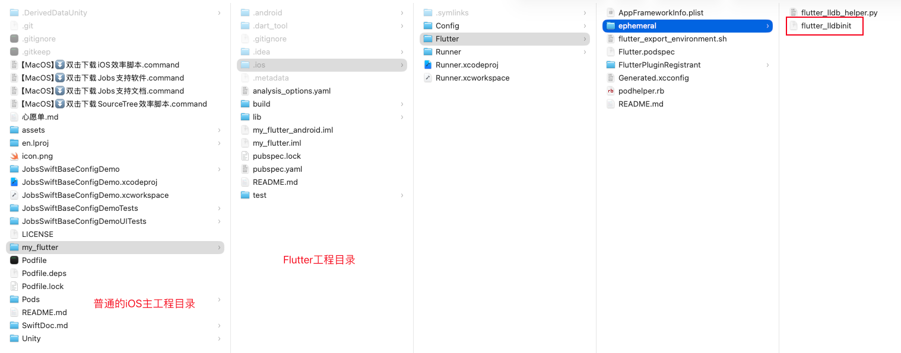
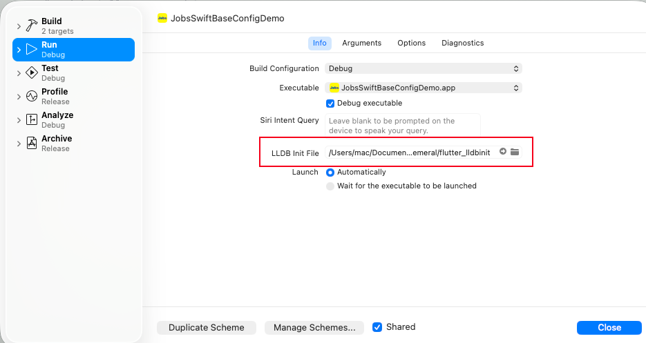

# Swift➤Flutter

[toc]

## 一、前言

### 1、实践目的：iOS项目主工程（[**Swift**](https://developer.apple.com/swift/)）集成和在个别页面调用[**Flutter**](https://flutter.dev/)页面

### 2、经验总结

* [**Flutter**](https://flutter.dev/)官方文档 ➤ [**将 Flutter module 集成到 iOS 项目**](https://docs.flutter.cn/add-to-app/ios/project-setup/)
* 集成[**Flutter**](https://flutter.dev/)页面，绝对不是只引入单个的`*.dart`文件，而是需要将整个[**Flutter**](https://flutter.dev/)工程文件全部集成（[**Flutter**](https://flutter.dev/) 里面还包含各种依赖）
* iOS主工程项目里面的`Podfile`里面，[**仅仅是做钩子**](#Podfile)，勾住[**Flutter**](https://flutter.dev/)项目里面的配置。<font color=red>而此文件并不直接写pod Flutter</font>
* 需要安装[**Flutter**](https://flutter.dev/)环境
* 必须进入[**Flutter**](https://flutter.dev/)目录中执行`flutter pub get`生成中间产物`podhelper.rb`才能跑通`pod install`
* 关于iOS程序的入口配置，会因为[**Flutter**](https://flutter.dev/)的出现，有一点小变化，这里总结出一个[**通例**](iOS侧的入口配置)

## 二、集成步骤

### 1、**目录结构**

> 需要进入[**Flutter**](https://flutter.dev/)工程目录 ➤ 执行 <font size=5>`flutter build ios --config-only`</font> ➤ 生成文件 <font size=5>`flutter_lldbinit`</font>



### 2、**Product ➤ Scheme ➤ Edit Scheme**



### 3、配置 <font size=5 id=Podfile>`Podfile`</font> ➤ <font size=5>`pod install`</font>

```ruby
# ================================== Podfile ==================================
ENV['COCOAPODS_DISABLE_STATS'] = 'true'

# ⚠️ 与 post_install 保持一致
platform :ios, '15.6'

#source 'https://cdn.cocoapods.org/'
source 'https://github.com/CocoaPods/Specs.git'
# pod install --repo-update

# 关键：恢复这段，避免 Assets.car 重复产物冲突
install! 'cocoapods',
  :deterministic_uuids => false,
  :disable_input_output_paths => true
# 如需的话，你也可以加上（可选）:
# , :generate_multiple_pod_projects => false

use_frameworks! :linkage => :static
inhibit_all_warnings!

# Flutter module
FLUTTER_APPLICATION_PATH = File.expand_path('./my_flutter', __dir__)
flutter_podhelper = File.join(FLUTTER_APPLICATION_PATH, '.ios', 'Flutter', 'podhelper.rb')
unless File.exist?(flutter_podhelper)
  raise "[Podfile] ❌ 找不到 #{flutter_podhelper}，请确认 Flutter module 路径正确：#{FLUTTER_APPLICATION_PATH}"
end
load flutter_podhelper

# 预留钩子，给 Podfile.deps 调用
def cocoPodsConfig
  # 按需扩展
end

# 加载拆分出来的依赖定义
deps_path = File.join(__dir__, 'Podfile.deps')
unless File.exist?(deps_path)
  raise "[Podfile] ❌ 找不到 #{deps_path}，请确认 Podfile.deps 存在于工程根目录"
end
instance_eval(File.read(deps_path), deps_path, 1)

# 统一工程设置 & 把 Podfile.deps 显示到 Pods 分组里
post_install do |installer|
  flutter_post_install(installer) if defined?(flutter_post_install)
  # -------- 1、宿主 App 工程设置 --------
  installer.aggregate_targets.each do |agg|
    user_project = agg.user_project
    user_project.native_targets.each do |t|
      t.build_configurations.each do |config|
        config.build_settings['ENABLE_USER_SCRIPT_SANDBOXING'] = 'NO'
        config.build_settings['IPHONEOS_DEPLOYMENT_TARGET'] = '15.0'
      end
    end
    user_project.save
  end
  # -------- 2、Pods 工程最低系统版本统一 --------
  pods_project = installer.pods_project
  pods_project.targets.each do |t|
    t.build_configurations.each do |config|
      # MacOS 15 以后，苹果采取了更加严格的权限写入机制。新Swift项目如果要利用Cocoapods来集成第三方,就需要将ENABLE_USER_SCRIPT_SANDBOXING设置为NO
      config.build_settings['ENABLE_USER_SCRIPT_SANDBOXING'] = 'NO'
#      config.build_settings['ENABLE_USER_SCRIPT_SANDBOXING'] = '$(inherited)'
      config.build_settings['IPHONEOS_DEPLOYMENT_TARGET'] = '15.0'
    end
  end
  # -------- 3、在 Pods 分组里展示 Podfile.deps（Ruby 语法高亮） --------
  main_group   = pods_project.main_group
  deps_relpath = '../Podfile.deps'
  file_ref = main_group.find_file_by_path(deps_relpath) || main_group.new_file(deps_relpath)
  if file_ref.respond_to?(:explicit_file_type=)
    file_ref.explicit_file_type = 'text.script.ruby'
  end
  pods_project.save
end
```

```ruby
# ============================== 目标工程（新工程记得改名） ==============================
# ❤️ 新工程需要修改这里：把目标名替换为你的实际 target 名字
target 'JobsSwiftBaseConfigDemo' do
  use_frameworks! :linkage => :static

  flutter_application_path = File.join(__dir__, 'my_flutter')
  load File.join(flutter_application_path, '.ios', 'Flutter', 'podhelper.rb')
  install_all_flutter_pods(flutter_application_path)

	/// TODO
end
```

### 4、<font id=iOS侧的入口配置>iOS侧的入口配置</font>

```swift
//
//  AppDelegate.swift
//  JobsSwiftBaseConfigDemo
//
//  Created by Jobs on 2025/6/4.
//

#if os(OSX)
import AppKit
#elseif os(iOS) || os(tvOS)
import UIKit
#endif

if canImport(Flutter)
import Flutter
import FlutterPluginRegistrant
@main
class AppDelegate: FlutterAppDelegate{
    lazy var flutterEngine: FlutterEngine = {
        let e = FlutterEngine(name: "jobs_flutter_engine")
        e.run()
        GeneratedPluginRegistrant.register(with: e)
        FlutterBridge.shared.setup(engine: e)
        return e
    }()
    override func application(
        _ application: UIApplication,
        didFinishLaunchingWithOptions launchOptions: [UIApplication.LaunchOptionsKey: Any]?
    ) -> Bool {
        SA()
        return super.application(application, didFinishLaunchingWithOptions: launchOptions)
    }
    // MARK: UISceneSession Lifecycle
    override func application(
        _ application: UIApplication,
        configurationForConnecting connectingSceneSession: UISceneSession,
        options: UIScene.ConnectionOptions
    ) -> UISceneConfiguration {
        return UISceneConfiguration(name: "Default Configuration", sessionRole: connectingSceneSession.role)
    }
}

#else
@main
class AppDelegate: UIResponder, UIApplicationDelegate {
    lazy var flutterEngine = FlutterEngine(name: "my flutter engine")
    override func application(
        _ application: UIApplication,
        didFinishLaunchingWithOptions launchOptions: [UIApplication.LaunchOptionsKey: Any]?
    ) -> Bool {
        SA()
        return true
    }
    // MARK: UISceneSession Lifecycle
    override func application(
        _ application: UIApplication,
        configurationForConnecting connectingSceneSession: UISceneSession,
        options: UIScene.ConnectionOptions
    ) -> UISceneConfiguration {
        return UISceneConfiguration(name: "Default Configuration", sessionRole: connectingSceneSession.role)
    }
}

#endif

extension AppDelegate {
    func SA(){
      _ = flutterEngine
	    /// TODO
    }
}
```

