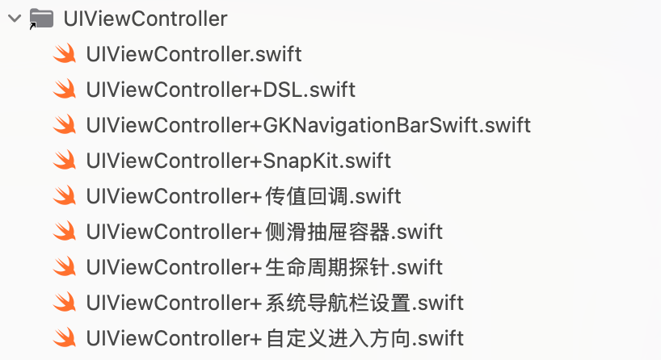
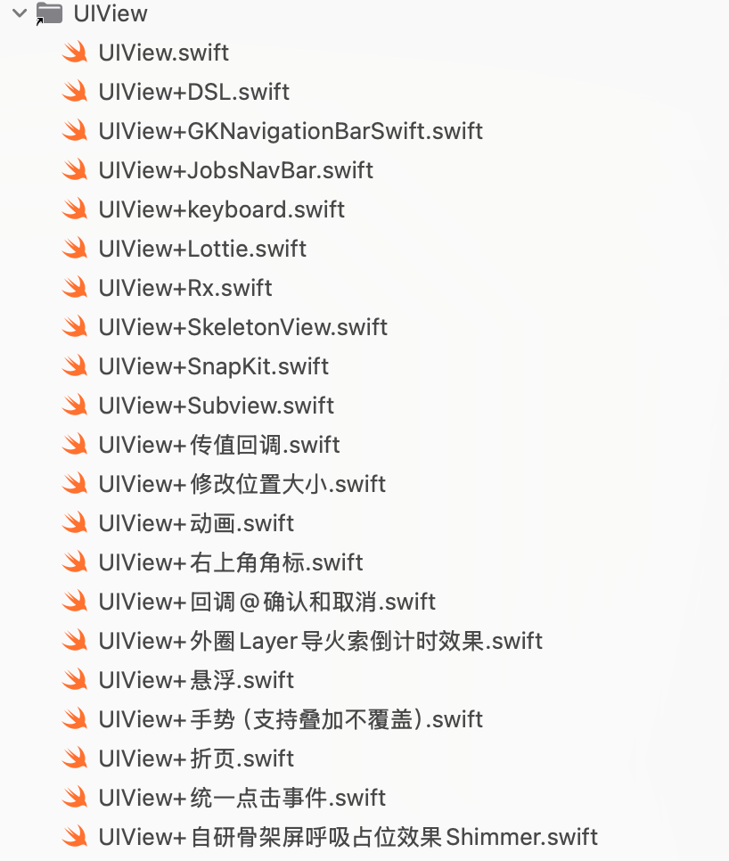
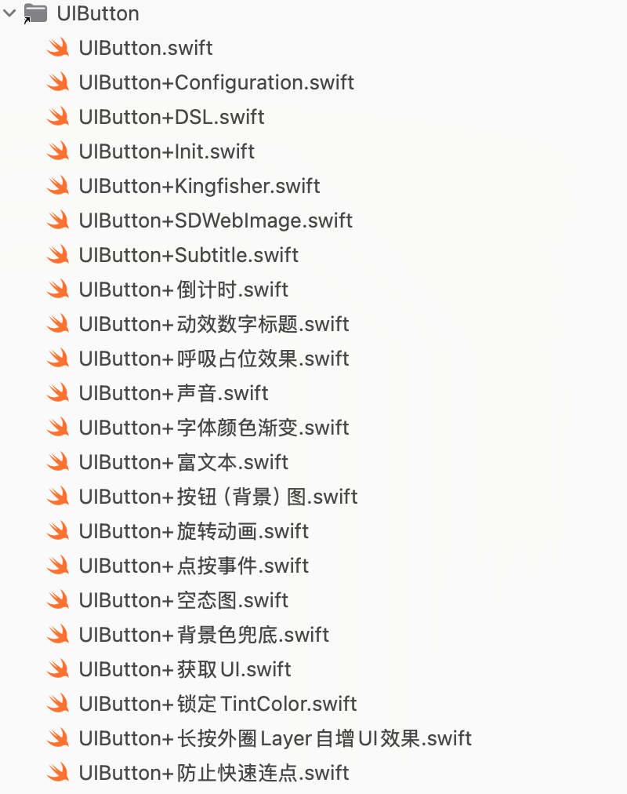
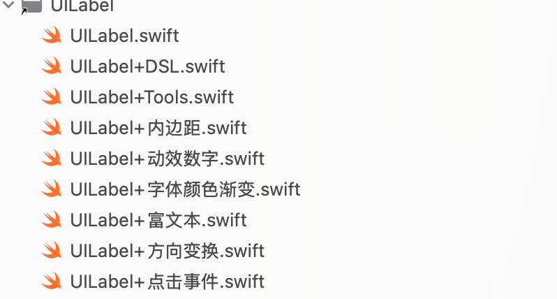
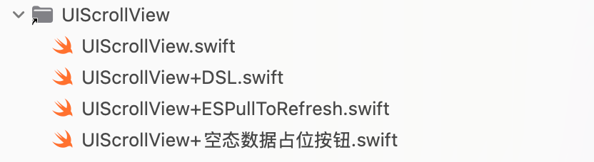
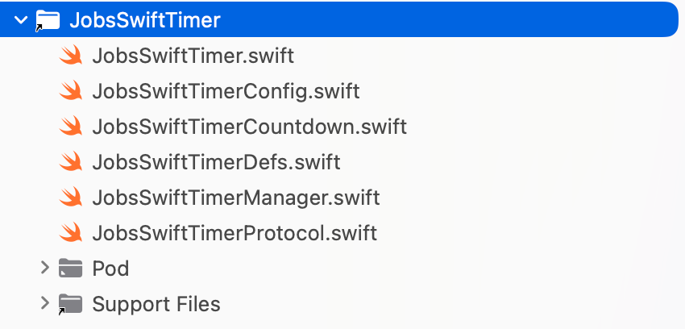
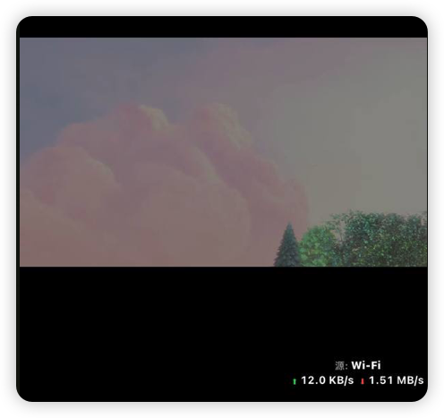
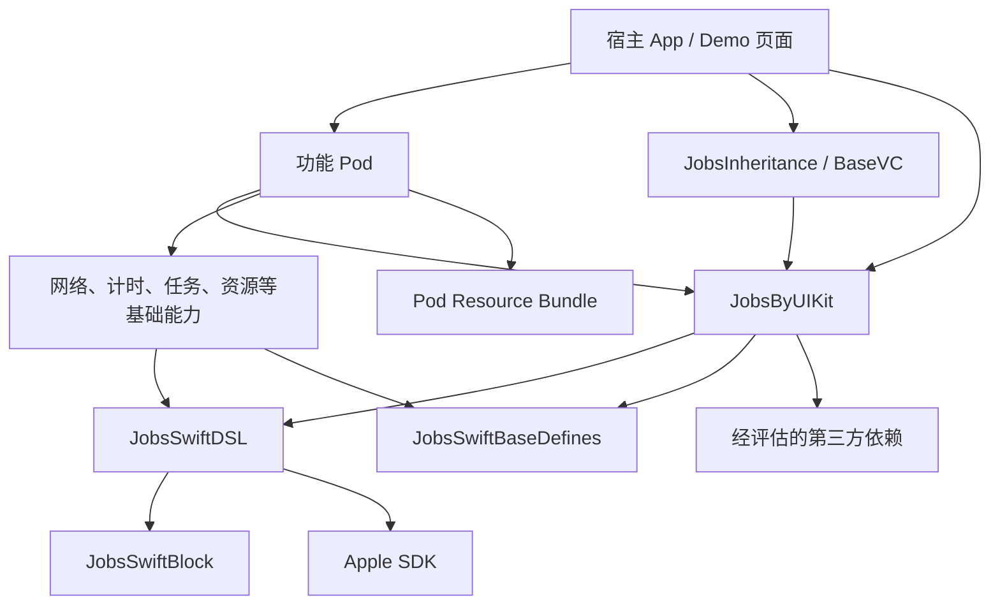
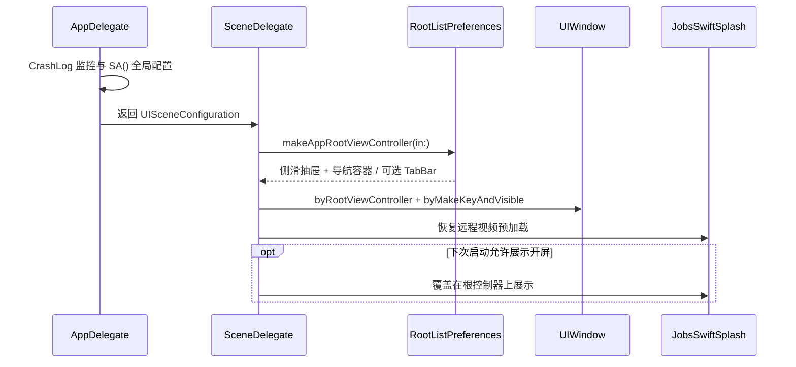

# [**Swift**](https://www.swift.org/)工程项目框架配置方案@JobsKits


[toc]

---

## 🔥 <font id=前言>前言</font>

> 本文以 `JobsSwiftBaseConfigDemo` 当前可运行工程为样板，说明一个 Jobs [**Swift**](https://www.swift.org/) 项目从宿主、启动、基础 Pod、功能 Pod、资源、扩展到验证工具的完整配置方案。文中的代码不是脱离工程的 API 摘抄，凡与当前源码冲突时，以自建 Pod 实现、`*.podspec`、`Podfile.deps`、`Podfile` 和 Xcode target 配置为准。

- 权威源优先级：

  1. `JobsByPods/` 下 Jobs 自建 Pod 的当前实现与 `*.podspec`。
  2. 宿主工程源码、`Podfile.deps`、`Podfile`、Xcode target 与 Build Phase。
  3. 对应 Pod 的 `README.md`、本 `SwiftDoc` 和 Xcode CodeSnippets。

- 扫描和修改边界：

  - 可以维护：`JobsSwiftBaseConfigDemo/` 与 `JobsByPods/` 下 Jobs 自建、已明确接管的源码和文档。
  - 默认排除：根目录 `Pods/`、`JobsByPods/ManualBySwiftPods@Pods/`、`generated/`、Flutter 生成目录、Unity 导出产物、构建缓存和所有权不明源码。
  - 生成物只由对应流程刷新，不手工改 `Podfile.lock`、Pods 工程、依赖报告或最终构建产物。

- 当前宿主基线：

  - App、Unit Tests、UI Tests、Widget Extension 共同组成工程 target。
  - 宿主部署目标为 iOS 15，使用 Swift 5 和 CocoaPods 静态 framework 链接。
  - 自建 Pod 可以按自身能力保留更低部署目标；新旧系统兼容必须在封装层消化，不能把 `#available` 和已废弃系统 API 泄漏到业务调用方。

## 一、<font id=一些基本的原则>一些基本的原则</font>

### 1.1、Swift 优先，但不把语言纯度当成架构目标

- Jobs 新写的宿主和自建组件优先使用 [**Swift**](https://www.swift.org/)，让类型系统、并发能力、模块化和 Apple 新 API 成为默认路径。
- 依赖选择看维护状态、源码可审计性、许可证、二进制体积、最低系统版本、能力完整度和替换成本，不按“Swift / Objective-C”单一条件决策。
- 对仍有稳定价值的 Objective-C / C / C++ 能力，统一隔离在 `JobsBy3rdTools`、`JobsNetworking` 或明确的功能 Pod 中；业务页面不直接到处散落第三方 API。
- 第三方依赖通过 [**CocoaPods**](https://cocoapods.org/) 或 [**Swift Package Manager**](https://www.swift.org/package-manager/) 固定版本和依赖图。不要因为库较旧就把源码复制进主工程，更不能直接修改根目录 `Pods/` 或手工第三方目录。
- 评估体积时以链接结果、最终 App 包和 `Assets.car` 为证据；“调用旧 API 就一定额外打入旧 framework”不是通用结论。

### 1.2、播放器与音视频能力按边界选型

- 播放器选型至少检查：协议和封装格式、硬解支持、直播 / 点播、缓存、首帧、Seek、倍速、字幕、后台音频、AirPlay、日志、许可证和维护频率。
- 当前工程用 `BMPlayer` 展示播放器能力，用 `HaishinKit` 承接采集编码类能力；业务层仍应通过 Jobs 包装层或独立功能 Pod 接入，避免页面直接绑定某一家实现。
- 自研适合强定制协议、端到端加密、专有缓存或多端统一内核；普通播放场景优先复用成熟内核，把精力放在稳定性、观测和替换边界上。
- 闭源 SDK 不是绝对禁用，但必须记录隐私、合规、符号可见性、二进制架构、离线能力和退出方案。无法审计或无法替换的能力不能下沉成全局基础层。

## 二、我对iOS开发的认知

- iOS 是客户端工程，不只是“画 UI”。完整交付至少包含视图、状态、数据、生命周期、权限、错误恢复、缓存、日志、可测试性和发布配置。
- 数据可以来自网络、数据库、App Group、Keychain、文件缓存和系统框架；轻重由业务决定，不预设“客户端只存轻量数据”。
- 服务端不能信任客户端输入；客户端也不能假设服务端响应永远正确。两侧都要做校验、超时、幂等、降级和可观测性。
- `UIButton` 可以承载图片、主标题、副标题和配置背景，但它有独立的 `UIButton.Configuration` 状态管线；可见背景和圆角不能再当普通 `UIView.layer` 处理。
- 推荐交付公式：

  ```text
  成品 = UI + 状态机 + 数据流 + 生命周期 + 异常与降级 + 日志与测试
  ```

- 数据模型生成工具只能减少样板代码；字段语义、可选性、日期格式、兼容策略和业务校验仍需人工确认。

## 三、我的构架方案

### 3.1、外部依赖分层

> 下面只列工程中具有代表性的依赖类别，不复制完整 `Podfile.deps`。依赖是否真实接入、版本和 subspec 选择始终以 `Podfile.deps` 与 `Podfile.lock` 为准。

| 层级 | 代表依赖 | 接入原则 |
| --- | --- | --- |
| UI 与布局 | [**SnapKit**](https://github.com/SnapKit/SnapKit)、[**GKNavigationBarSwift**](https://github.com/QuintGao/GKNavigationBarSwift)、[**JXSegmentedView**](https://github.com/pujiaxin33/JXSegmentedView)、[**SwiftEntryKit**](https://github.com/huri000/SwiftEntryKit) | 页面优先使用 Jobs 二次封装，布局统一走 SnapKit。 |
| 网络与接口 | [**Alamofire**](https://github.com/Alamofire/Alamofire)、[**Moya**](https://github.com/Moya/Moya)、[**YTKNetwork**](https://github.com/kanyun-inc/YTKNetwork) | 统一经 `JobsNetworking` 或功能层适配，不让请求头、BaseURL、缓存和错误映射散落到页面。 |
| 响应式与异步 | [**RxSwift**](https://github.com/ReactiveX/RxSwift)、[**PromiseKit**](https://github.com/mxcl/PromiseKit) | 按模块选择，不在同一条业务链中无意义混用多套异步模型。 |
| 图片与媒体 | [**Kingfisher**](https://github.com/onevcat/Kingfisher)、[**SDWebImage**](https://github.com/SDWebImage/SDWebImage)、[**lottie-ios**](https://github.com/airbnb/lottie-ios)、[**BMPlayer**](https://github.com/BrikerMan/BMPlayer)、[**HaishinKit**](https://github.com/HaishinKit/HaishinKit.swift) | 资源加载、缓存、占位、取消、复用防串图和播放器生命周期由包装层统一。 |
| 数据与安全 | [**WCDB**](https://github.com/Tencent/wcdb)、[**ObjectBox**](https://github.com/objectbox/objectbox-swift)、[**Cache**](https://github.com/hyperoslo/Cache)、[**KeychainAccess**](https://github.com/kishikawakatsumi/KeychainAccess) | 数据所有权、迁移、线程模型、加密和清理策略由具体模块声明。 |
| 工程工具 | [**CocoaLumberjack**](https://github.com/CocoaLumberjack/CocoaLumberjack)、[**DeviceKit**](https://github.com/devicekit/DeviceKit)、[**PhoneNumberKit**](https://github.com/marmelroy/PhoneNumberKit) | 基础能力只暴露稳定门面，第三方类型不向业务模型扩散。 |

#### 3.1.1、ObjectBox Swift 集成基线

- ObjectBox Apple SDK 按其 Swift 语言边界接入；当前只在 Swift 工程提供 CRUD Demo，OC 新/旧工程无需创建无官方语言基础的占位实现。
- `Podfile.deps` 负责声明 `ObjectBox`，`Podfile.lock` 负责记录实际版本；首次或依赖结构变化后按官方 `Pods/ObjectBox/setup.rb` 结果维护 `[OBX] Update Sourcery Generated Files` 构建阶段。
- App Target 必须保持 `ENABLE_USER_SCRIPT_SANDBOXING = NO`，否则构建阶段无法更新生成文件。
- `Human.swift` 的 `// objectbox: entity` 是代码生成标记；`model-JobsSwiftBaseConfigDemo.json` 和 `generated/EntityInfo-JobsSwiftBaseConfigDemo.generated.swift` 是稳定实体 ID 的工程基线，实体变更时三者一起复核并提交。
- Demo 代码统一位于 `JobsSwiftBaseConfigDemo/主业务流程/VC/SubVC/Demo@ObjectBox/`；数据库初始化以 `Result` 暴露失败，不用 `try!` 把存储目录或 Store 初始化错误升级为启动崩溃。

- `swiftAppCommon` 管理通用外部依赖，`byJobs` 管理 Jobs 自建 Pod；新依赖先判断归属，再加入对应函数。
- 页面已经有 Jobs 封装时，不直接导入第三方实现。确实需要第三方类型作为公开参数时，由功能 Pod 明确承担耦合。
- `inhibit_all_warnings!` 只隐藏第三方告警，不是忽略 Jobs 自维护源码问题的理由。

### 3.2、我的封装（重点）

下列片段默认已在所属 target 引入 `JobsByUIKit`、`JobsSwiftDSL`、`JobsSwiftBaseDefines` 与 `SnapKit`；为突出调用方式，不在每段代码里重复书写 import。

#### 3.2.0、系统类创建与实例 DSL

- `NSObject` 子类的无参构造统一使用 `Type.jobsMake { object in ... }`；带参初始化由真实类型提供 `Type.make(arguments, configure:)`，例如 `NSUserActivity.make(activityType:configure:)`。
- 原生系统构造器只存在于创建工厂底层；实例生成后，属性、无参实例方法和单参实例方法统一使用返回 `Self` 的 `byXxx(...)`，查询与明确终止动作除外。
- `JobsSwiftBlock` 提供最低层通用创建 Block，`JobsSwiftDSL` 公开转出，`JobsByUIKit` 提供具体 UIKit / Foundation 工厂；低层 Pod 不反向依赖高层 UI Pod。
- `NSObject.jobsMake` 由 `JobsNSObjectMaking where Self: NSObject` 的协议扩展承载，保留配置参数与返回对象的具体类型，避免类扩展动态 `Self` 在旧 Swift 编译器的协议调用方中触发 IRGen 崩溃。调用方写法不变；CI 同时验证回调行为和 arm64 / x86_64 模拟器代码生成。

#### 3.2.1、对`UIViewController`的封装



* 解决某些情况下，多次**push**或者**present**的Bug

  * 正向push带参传值
  * 自定义出现的方向
  * 自定义出现的方式是**push**还是**present**
  * 退出页面需要回传的参数

  ```swift
  DemoDetailVC()
      .byData("https://www.baidu.com")
      .byDirection(.fromBottom)   // 👈 下
      .byPush(self)
      .byCompletion { print("❤️结束❤️ fromBottom") }
  ```

  ```swift
  DemoDetailVC()
      .byData(3.14)// 基本数据类型
      .onResult { name in
          print("回来了 \(name)")
      }
      .byPresent(self)
      .byCompletion{
          print("结束")
      }
  ```

#### 3.2.2、对`UIView`层的封装格式



* 懒加载+代码块，在实际用的地方利用这个`UIView`的`alpha `或者`hidden`属性进行唤起

* 利用`byAddTo`将约束全部写进此闭包中，代码不再割裂。因为约束也是对此UI控件的补充说明

  ```swift
  private lazy var tvBlue: UITextView = { [unowned self] in
      	UITextView()
          .byAttributedText(NSMutableAttributedString(
              string: "🔗 默认蓝色链接（系统样式）：",
              attributes: [
                  .font: JobsFont.systemFont(ofSize: 15),
                  .foregroundColor: JobsCor.secondaryLabel
              ])
              .add(NSAttributedString(
                  string: " Apple 官网",
                  attributes: [
                      .link: URL(string: "https://www.apple.com")!,
                      .font: JobsFont.boldSystemFont(ofSize: 16)
                  ]))
              .add(NSAttributedString(
                  string: "\n客服电话：400-123-4567",
                  attributes: [.font: JobsFont.systemFont(ofSize: 15)]
              )))
          .byEditable(false)
          .bySelectable(true)
          .byDataDetectorTypes([.link, .phoneNumber])   // 系统自动识别
          .byTextContainerInset(UIEdgeInsets(top: 8, left: 10, bottom: 8, right: 10))
          .byRoundedBorder(color: JobsCor.systemGray4, width: 1, radius: 8)
          .byAddTo(self.view) { [unowned self] make in
              make.top.equalTo(self.tv.snp.bottom).offset(12)   // 紧跟在 tv 下面
              make.centerX.equalToSuperview()
              make.height.equalTo(36)
          }
  }()
  ```

* 旋转视图

  ```swift
  btn.onTap { [weak self] btn in
  			 guard let _ = self else { return }
         btn.playTapBounce(haptic: .light)  // 👈 临时放大→回弹（不注册任何手势/事件）
         if btn.jobs_isSpinning {
             // 暂停旋转
             btn.bySpinPause()
             // 暂停计时（保留已累计秒，不重置）
             btn.timer?.pause()        // ✅ 推荐：你的统一内核挂在 button.timer 上
             // 如果你有封装方法，则用：btn.pauseTimer()
             JobsToast.show(
                 text: "已暂停旋转 & 计时",
                 config: .init().byBackgroundColor(JobsCor.systemGreen.withAlphaComponent(0.9)).byCornerRadius(12)
             )
         } else {
             // 恢复旋转
             btn.bySpinStart()
             // 恢复计时（从暂停处继续累加）
             btn.timer?.resume()       // ✅ 推荐
             // 如果你有封装方法，则用：btn.resumeTimer()
             JobsToast.show(
                 text: "继续旋转 & 计时",
                 config: .init().byBackgroundColor(JobsCor.systemGreen.withAlphaComponent(0.9)).byCornerRadius(12)
             )
         }
  }
  ```

* 悬浮视图

  ```swift
  UIView().bySuspend { cfg in
      cfg
          .byContainer(view)
          .byFallbackSize(CGSize(width: 88, height: 44))
          .byDocking(.nearestEdge)
          .byInsets(UIEdgeInsets(top: 20, left: 16, bottom: 34, right: 16))
          .byHapticOnDock(true)
  }
  ```

  ```swift
  UIView().suspend(
      .default
          .byContainer(view)
          .byFallbackSize(CGSize(width: 88, height: 44))
          .byDocking(.nearestEdge)
          .byInsets(UIEdgeInsets(top: 20, left: 16, bottom: 34, right: 16))
          .byHapticOnDock(true)
  )
  ```

* 角标提示@右上角提示文案

  * 展示

    * 右上角自定义文字

      ```swift
      UIView().byCornerBadgeText("NEW") { cfg in
                  cfg.byOffset(.init(horizontal: -6, vertical: 6))
                      .byInset(.init(top: 2, left: 6, bottom: 2, right: 6))
                      .byBackgroundColor(JobsCor.systemRed)
                      .byFont(JobsFont.systemFont(ofSize: 11, weight: .bold))
                      .byShadow(color: JobsCor.black.withAlphaComponent(0.25),
                                radius: 2,
                                opacity: 0.6,
                                offset: .init(width: 0, height: 1))
              }
      ```

    * 右上角小红点

      ```swift
      UIView().byCornerDot(diameter: 10, offset: .init(horizontal: -4, vertical: 4))// 红点
      ```

  * 关闭

    ```swift
    UIButton.sys()
        /// 事件触发@点按
        .onTap { [weak self] sender in
            guard let self else { return }
            sender.byToggleSelected()
            if sender.isSelected {
                sender.byCornerDot(diameter: 10, offset: .init(horizontal: -4, vertical: 4))
            } else {
                sender.removeCornerBadge()
            }
            JobsToast.show(
                text: "优惠@点按事件",
                config: JobsToast.Config()
                    .byBackgroundColor(JobsCor.systemGreen.withAlphaComponent(0.9))
                    .byCornerRadius(12)
            )
        }
    ```

#### 3.2.3、对`UIButton`按钮的封装

##### 3.2.3.1、利用分类作用于`UIButton`



```swift
private lazy var exampleButton: UIButton = {
    UIButton.sys()
        /// 锁死标题颜色：任何 state 都保持同一种颜色，不跟 tint / 系统态自动变化
        .byLockTitleColor(JobsCor.red)
        /// 图片吃 tint，但 tint 锁死为某个颜色
        .byLockTintColor(JobsCor.red)
        /// 只锁 Background（背景色不随状态变）
        .byLockBackgroundColor(JobsCor.red)
        /// 只锁 Border（边框色不随状态变，iOS 15+）
        .byLockBorderColor(JobsCor.red)
        /// 背景色@按照不同的状态
        .byBackgroundColor(JobsCor.systemGreen)
        .byBackgroundColor("#2F2F2F".cor, for: .disabled) // 对应按钮不可点击的状态
        /// 背景图片
        .byBackgroundImage("背景图片".img, for: .normal)
        /// 字体颜色渐变@只处理主标题（titleLabel）
        .byGradientMainTitle(colors: [UIColor(r: 221, g: 221, b: 221), UIColor(r: 127, g: 126, b: 126)], direction: .leftToRight)
        /// 字体颜色渐变@只副标题渐变
        .byGradientSubtitle(colors: [UIColor(r: 221, g: 221, b: 221), UIColor(r: 127, g: 126, b: 126)], direction: .topLeftToBottomRight)
        /// 字体颜色渐变@主副一致
        .byGradientTitlesSame(colors: [UIColor(r: 221, g: 221, b: 221), UIColor(r: 127, g: 126, b: 126)], direction: .leftToRight)
        /// 普通字符串@设置主标题
        .byTitle("显示")
        .byTitle("隐藏", for: .selected)
        /// 字体颜色@按照不同的状态
        .byTitleColor("#2F2F2F".cor)
        .byTitleColor("#BBBBBB".cor, for: .disabled) // 对应按钮不可点击的状态
        .byTitleFont(JobsFont.systemFont(ofSize: 16, weight: .medium))
        /// 普通字符串@设置副标题
        .bySubTitle("显示")
        .bySubTitle("隐藏", for: .selected)
        .bySubTitleColor(JobsCor.systemBlue)
        .bySubTitleColor(JobsCor.systemRed, for: .selected)
        .bySubTitleFont(JobsFont.systemFont(ofSize: 16, weight: .medium))
        /// 富文本字@设置主标题
        .byRichTitle(JobsRichText.make([
            JobsRichRun(.text("¥99")).font(JobsFont.systemFont(ofSize: 18, weight: .semibold)).color(JobsCor.systemRed),
            JobsRichRun(.text(" /月")).font(JobsFont.systemFont(ofSize: 16)).color(JobsCor.white)
        ]))
         /// 富文本字@设置副标题
        .byRichSubTitle(JobsRichText.make([
            JobsRichRun(.text("原价 ")).font(JobsFont.systemFont(ofSize: 12)).color(JobsCor.white.withAlphaComponent(0.8)),
            JobsRichRun(.text("¥199")).font(JobsFont.systemFont(ofSize: 12, weight: .medium)).color(JobsCor.systemYellow)
        ]))
        /// 主标题和副标题之间的距离（兼容 iOS12+）
        .byTitlePadding(4.h)
        /// 按钮图片@图文关系
        .byImage("eye.slash".sysImg)                // 未选中图标
        .byImage("eye".sysImg, for: .selected)                    // 选中图标
        /// 清除所有状态下的按钮配置背景
        .byClearConfigurationBackground() 
        /// 按钮@图文位置关系
        .byImagePlacement(.top ,padding: 5)        // 通用（向下兼容）
        .byImagePlacementLegacy(.top, padding: 5)  // 只满足iOS13以下
        /// 按钮图文间距@iOS13（与下文互斥）
        .byTitleEdgeInsets(UIEdgeInsets(top: 0, left: 6, bottom: 0, right: -6)) 
        /// 按钮图文内边距@iOS12（与上文互斥）
        .byContentEdgeInsets(UIEdgeInsets(top: 4, left: 8, bottom: 4, right: 8))
        /// 点击@播放声音
        .byTapSound("Sound.wav")    
        /// 普通@点按事件触发
        .onTap { [weak self] sender in
            guard let self else { return }
            sender.byToggleSelected()
            // 文字与图标自动切换
            self.passwordTF.isSecureTextEntry.toggle()
            self.passwordTF.togglePasswordVisibility()
            print("👁 当前状态：\(sender.isSelected ? "隐藏密码" : "显示密码")")
        }
        /// 追加@点按事件触发
        .onTapAppend{ sender in
            print("追加的点按事件")
        }
        /// 右上角提示文案@小红点
        .byCornerDot(diameter: 10, offset: .init(horizontal: -4, vertical: 4))// 红点
        /// 右上角提示文案@文字
        .byCornerBadgeText("NEW") { cfg in
            cfg.byOffset(.init(horizontal: -6, vertical: 6))
                .byInset(.init(top: 2, left: 6, bottom: 2, right: 6))
                .byBackgroundColor(JobsCor.systemRed)
                .byFont(JobsFont.systemFont(ofSize: 11, weight: .bold))
                .byShadow(color: JobsCor.black.withAlphaComponent(0.25),
                          radius: 2,
                          opacity: 0.6,
                          offset: .init(width: 0, height: 1))
        }
        /// 普通@长按事件触发
        .onLongPress(minimumPressDuration: 0.8) { btn, gr in
             if gr.state == .began {
                 btn.byAlpha(0.6)
                 print("长按开始 on \(btn)")
             } else if gr.state == .ended || gr.state == .cancelled {
                 btn.byAlpha(1.0)
                 print("长按结束")
             }
         }
        /// 追加@长按事件触发
        .onLongPressAppend(minimumPressDuration: 0.8) { btn, gr in
            print("追加的长按事件")
        }
        /// UIButton.Configuration 管可见背景、圆角和描边，避免被配置态覆盖
        .byConfiguration { configuration in
            configuration
                .byTitle("背景图：Base64 / URL")
                .byBaseForegroundColor(JobsCor.white)
                .byContentInsets(.init(top: 16, leading: 16, bottom: 16, trailing: 16))
                .byCornerStyle(.fixed)
                .byImagePlacement(.trailing)
                .byImagePadding(8)
                .byBackground(
                    configuration.background
                        .byBackgroundColor(JobsCor.systemBlue)
                        .byCornerRadius(8.h)
                        .byStrokeColor(JobsCor.cyan)
                        .byStrokeWidth(0.5)
                )
        }
        .byAddTo(view) { [unowned self] make in
            make.top.equalTo(self.view.safeAreaLayoutGuide.snp.top).offset(40)
            make.left.right.equalToSuperview().inset(24)
            make.height.equalTo(44)
        }
}()
```

* <font color=red>风险提示：`UIButton.Configuration` 会参与标题、背景和状态更新；启用以后，同一项视觉不要再同时依赖旧式 `setTitle`、`backgroundColor` 或只改 `layer.cornerRadius`，统一从 Jobs 的按钮配置管线写入。</font>

* 可视**UI**（向下兼容，且启用`UIButtonConfiguration`）

  * 普通文本配置主副标题（文本内容、文本字体颜色大小）
  * <font color=blue>富文本</font>配置主副标题
  * 设置**背景图**片
  * 设置背景色
  * **前景图**文位置关系（空间位置和距离）
  * 操作Layer层：切角、描边
  * 锁住**tint**
  * [**snapkit**](https://github.com/SnapKit/SnapKit)约束
  * 右上角提示（参考**Objc**库[**PPBadgeView**](https://github.com/jkpang/PPBadgeView)）

* 事件

  * （点按、长按）事件封装 **➤** 绕过<font color=red>**@selector**</font>和**Target**

  * （点按、长按）<font color=blue>**事件追加**</font>

  * 点击播放声音

  * 主副标题的数字动效

    * 小数点后数字的处理（保留多少有效数字、定义小数部分的字体颜色大小）
    * 小数点之前可以选择开启分隔符（国际3位、中国4位）
    
    ```swift
    import JobsByUIKit
    
    private let defaultStart: Double = 1234567890
    /// 数字动效按钮@主标题（普通文本）
    private lazy var btn_1: UIButton = {
        UIButton.sys()
            .byLockBackgroundColor(JobsCor.clear)
            .byTitle("\(Int(defaultStart))")
            .byTitleColor(JobsCor.white)
            .byTitleFont(.DINPro.Bold(14.fz))
            .byImage("钱".img)
            .byImagePlacement(.right ,padding: 5.w)        // 通用（向下兼容）
            /// 数字动效按钮@关键配置
            .byAnimationTitleConfig({ cfg in
                cfg.byDuration(10) // 动画的作用时间
                    .byFps(60) //
                    .byTitleColor(JobsCor.white)
                    .byTitleFont(.DINPro.Bold(14.fz))
                    .byStartValue("\(Int(0))") // 如果这个地方没有配置，则从按钮的主标题取值
                    .byEndValue("\(Int(1000))") // 如果这个地方没有配置，则从按钮的主标题取值
                    .byShowsDecimals(true)// 是否展示小数（默认不展示）
                    .bySeparate(",")// 分隔符是 , 不写也行
                    .byDecimals(2)// 保留2位小数（默认）
                    .byTitleDecimalsCor(.red)
                    .byTitleDecimalsFont(.DINPro.Bold(12.fz))
            })
            .onTap { [weak self] sender in
                guard let self else { return }
                /// 启动动效@回调倒计时行为：进行中（多次）
                sender.byStartAnim { m in
                    print("title:", m.title ?? "nil",
                          "sub:", m.subTitle ?? "nil",
                          "seconds:", m.seconds)
                }
                /// 启动动效@回调倒计时行为：结束（一次）
                .byEndAnim {
                    "动画结束".tr.toast
                }
            }
            .byAddTo(topBarBackgroundView) { [unowned self] make in
                /// TODO
            }
    }()
    /// 数字动效按钮@主标题（富文本）
    private lazy var btn_2: UIButton = {
        UIButton.sys()
            // 初始展示：你原来的 rich title 仍然可以保留（首次显示用）
            .byRichTitle(JobsRichText.make([
                JobsRichRun(.text("¥99")).font(JobsFont.systemFont(ofSize: 18, weight: .semibold)).color(JobsCor.systemRed),
                JobsRichRun(.text(" /月")).font(JobsFont.systemFont(ofSize: 16)).color(JobsCor.white)
            ]))
            .byTitleColor(JobsCor.white)
            .byImage("star.fill".sysImg)
            .byImagePlacement(.leading, padding: 8)
            .byBackgroundColor(JobsCor.systemGreen)
            /// 数字动效按钮@关键配置➤主标题富文本Builder
            .byAnimationTitleConfig { cfg in
                cfg.byDuration(10)
                    .byFps(60)
                    .byStartValue("\(Int(0))")
                    .byEndValue("\(Int(1000))")
                    .byShowsDecimals(true)
                    .bySeparate(",")
                    .byDecimals(2)
                    // 如果仍然希望 plain/fallback 的字体颜色也一致，可以保留
                    .byTitleColor(JobsCor.white)
                    .byTitleFont(.DINPro.Bold(14.fz))
                    .byTitleDecimalsCor(.red)
                    .byTitleDecimalsFont(.DINPro.Bold(12.fz))
                    // 主标题整体富文本（¥ + 数字 + /月）
                    .byTitleAttributedBuilder { text, decimalsRange, _ in
                        // full: "¥1,234.56 /月"
                        let full = "¥\(text) /月"
                        let attr = NSMutableAttributedString(string: full)
                        // 数字段（含 ¥）：红色 18 semibold
                        let numberRange = NSRange(location: 0, length: 1 + (text as NSString).length) // "¥" + text
                        attr.addAttributes([
                            .font: JobsFont.systemFont(ofSize: 18, weight: .semibold),
                            .foregroundColor: JobsCor.systemRed
                        ], range: numberRange)
                        // 后缀段：白色 16
                        let suffixStart = numberRange.length
                        let suffixRange = NSRange(location: suffixStart, length: (full as NSString).length - suffixStart)
                        attr.addAttributes([
                            .font: JobsFont.systemFont(ofSize: 16),
                            .foregroundColor: JobsCor.white
                        ], range: suffixRange)
                        // 小数段（如果存在）：DINPro 12 + 红色（只改小数部分，不影响整数）
                        if let dr = decimalsRange {
                            // decimalsRange 是在 text 里的 range，要平移到 full 里（前面多了一个 "¥"）
                            let shifted = NSRange(location: 1 + dr.location, length: dr.length)
                            attr.addAttributes([
                                .font: UIFont.DINPro.Bold(12.fz),
                                .foregroundColor: JobsCor.red
                            ], range: shifted)
                        };return attr
                    }
            }
            .onTap { [weak self] sender in
                guard let self else { return }
    
                // 你这里读 tf 的 start/end 只是业务参数；真正动画起终值由 config 的 startValue/endValue 控制
                // 如果你想“按输入框变更动画起终值”，需要在点击时重新调用 byAnimationTitleConfig 覆盖 start/end
                // 这里先按你原逻辑保留回调即可
                sender.byStartAnim { m in
                    print("title:", m.title ?? "nil",
                          "sub:", m.subTitle ?? "nil",
                          "seconds:", m.seconds)
                }
                .byEndAnim {
                    "动画结束".tr.toast
                }
            }
            .byAddTo(contentView) { [unowned self] make in
                make.top.equalTo(tf3Start.snp.bottom).offset(10)
                make.left.right.equalToSuperview().inset(16)
                make.height.equalTo(56)
            }
    }()
    /// 数字动效按钮@副标题（普通文本）
    private lazy var btn_3: UIButton = {
        UIButton.sys()
            .byTitle("会员价格")
            .byTitleColor(JobsCor.white)
            .byTitleFont(JobsFont.systemFont(ofSize: 16, weight: .medium))
            .bySubTitle("原价 ¥199 /月")
            .bySubTitleColor(JobsCor.white.withAlphaComponent(0.85))
            .bySubTitleFont(JobsFont.systemFont(ofSize: 13))
            .byBackgroundColor("#2F2F2F".cor)
            /// 数字动效按钮@关键配置
            .byAnimationSubTitleConfig({ cfg in
                cfg.byDuration(10) // 动画的作用时间
                    .byFps(60) //
                    .bySubTitleColor(JobsCor.blue)
                    .bySubTitleFont(.DINPro.Bold(14.fz))
                    .byStartValue("\(Double(tf1Start.text ?? "") ?? 99)") // 如果这个地方没有配置，则从按钮的主标题取值
                    .byEndValue("\(Double(tf1End.text ?? "") ?? 199)") // 如果这个地方没有配置，则从按钮的主标题取值
                    .byShowsDecimals(true)// 是否展示小数（默认不展示）
                    .bySeparate(",")// 分隔符是 , 不写也行
                    .byDecimals(2)// 保留2位小数（默认）
                    .bySubTitleDecimalsCor(.red)
                    .bySubTitleDecimalsFont(.DINPro.Bold(12.fz))
            })
            .onTap { [weak self] sender in
                guard let self else { return }
                /// 启动动效@回调倒计时行为：进行中（多次）
                sender.byStartAnim { m in
                    print("title:", m.title ?? "nil",
                          "sub:", m.subTitle ?? "nil",
                          "seconds:", m.seconds)
                }
                /// 启动动效@回调倒计时行为：结束（一次）
                .byEndAnim {
                    "动画结束".tr.toast
                }
            }
            .byAddTo(contentView) { [unowned self] make in
                make.top.equalTo(tf2Start.snp.bottom).offset(10)
                make.left.right.equalToSuperview().inset(16)
                make.height.equalTo(64)
            }
    }()
    /// 数字动效按钮@副标题（富文本）
    private lazy var btn_4: UIButton = {
        UIButton.sys()
            .byTitle("限时折扣")
            .byTitleColor(JobsCor.white)
            .byTitleFont(JobsFont.systemFont(ofSize: 16, weight: .medium))
            // 初始展示：先给一个普通副标题（首次显示用）
            .bySubTitle("倒计时 199 秒")
            .bySubTitleColor(JobsCor.white.withAlphaComponent(0.85))
            .bySubTitleFont(JobsFont.systemFont(ofSize: 13))
            .byImage("clock".sysImg)
            .byImagePlacement(.leading, padding: 8)
            .byBackgroundColor(JobsCor.systemPurple)
            .byCornerRadius(10)
            /// 数字动效按钮@关键配置➤副标题富文本Builder
            .byAnimationSubTitleConfig { cfg in
                cfg.byDuration(10)
                    .byFps(60)
    
                    // 这里的 start/end 才是副标题动画的数值来源
                    .byStartValue("199")
                    .byEndValue("9")
    
                    // 倒计时一般不需要小数，这里关掉
                    .byShowsDecimals(false)
    
                    // 可选：给副标题的基础样式（非 builder 场景兜底）
                    .bySubTitleColor(JobsCor.white.withAlphaComponent(0.85))
                    .bySubTitleFont(JobsFont.systemFont(ofSize: 13))
    
                    // ✅ 副标题整体富文本： "倒计时 199 秒"
                    .bySubTitleAttributedBuilder { text, _, _ in
                        let prefix = "倒计时 "
                        let suffix = " 秒"
                        let full = prefix + text + suffix
                        let attr = NSMutableAttributedString(string: full)
    
                        // 全段默认（灰白 13）
                        attr.addAttributes([
                            .font: JobsFont.systemFont(ofSize: 13),
                            .foregroundColor: JobsCor.white.withAlphaComponent(0.85)
                        ], range: NSRange(location: 0, length: (full as NSString).length))
    
                        // 数字段强调（白色 13 medium，或你想要的高亮色）
                        let numberRange = NSRange(location: (prefix as NSString).length,
                                                  length: (text as NSString).length)
                        attr.addAttributes([
                            .font: JobsFont.systemFont(ofSize: 13, weight: .semibold),
                            .foregroundColor: JobsCor.white
                        ], range: numberRange)
    
                        return attr
                    }
            }
    
            .onTap { [weak self] sender in
                guard let self else { return }
                sender.byStartAnim { m in
                    print("title:", m.title ?? "nil",
                          "sub:", m.subTitle ?? "nil",
                          "seconds:", m.seconds)
                }
                .byEndAnim {
                    "动画结束".tr.toast
                }
            }
            .byAddTo(contentView) { [unowned self] make in
                make.top.equalTo(tf4Start.snp.bottom).offset(10)
                make.left.right.equalToSuperview().inset(16)
                make.height.equalTo(64)
                make.bottom.equalToSuperview().offset(-24)
            }
    }()
    ```

##### 3.2.3.2、利用继承作用于`JobsButton`

> 解决在某些iOS版本向下兼容的情况下，无法把握`UIButton`内部控件的生命周期，导致UI错版的问题

```swift
private lazy var btn1: JobsButton = {
    JobsButton()
        .byMode(.imageTopTextBottom)
        .byTitleLabel { lab in
            lab.byText("上图下文")
                .byTextColor(JobsCor.red)
        }
        .bySubTitleLabel { lab in
            lab.byText("image -> title -> subtitle")
                .byTextColor(JobsCor.blue)
        }
        // 前景图：内部 foregroundImageView（链式不丢 self）
        .byForegroundImageView { iv in
            iv.byContentMode(.scaleAspectFill)
                .byClipsToBounds()
                .kf_setImage("https://picsum.photos/200?random=111", placeholder: "Ani".img)
        }
        // 背景图：JobsButton 自己是 UIImageView
        .byContentMode(.scaleAspectFill)
        .byClipsToBounds()
        .kf_setImage("https://picsum.photos/600/200?random=11", placeholder: "Ani".img)
        .byImageTitleSpacing(6)
        .byTitleSubtitleSpacing(2)
        .byContentInsets(.zero)
        .byForegroundImageFixedSize(true)
        .addTapActionAppend { _ in
            print("btn1 tap #1")
            "点击了悬浮按钮：上图下文（tap #1）".toast
        }
        .addTapActionAppend { _ in
            print("btn1 tap #2 (append)")
            "点击了悬浮按钮：上图下文（tap #2 叠加）".toast
        }
        .addLongPressActionAppend { gr in
            guard gr.state == .began else { return }
            print("btn1 longPress #1 began")
            "长按了悬浮按钮：上图下文（longPress #1）".toast
        }
        .addLongPressActionAppend { gr in
            guard gr.state == .began else { return }
            print("btn1 longPress #2 began (append)")
            "长按了悬浮按钮：上图下文（longPress #2 叠加）".toast
        }
        .byBorderColor(JobsCor.cyan)
        .byBorderWidth(0.5)
        .byMasksToBounds(YES)
        .byClipsToBounds(YES)
        .byCornerRadius(8.h)
        .byAddTo(view) { [unowned self] make in
            make.top.equalTo(self.hintLabel.snp.bottom).offset(18)
            make.left.equalToSuperview().offset(horizontalInset)
            make.right.equalToSuperview().inset(horizontalInset)
            make.height.equalTo(itemHeight)
        }
}()
```

#### 3.2.4、对`UIGestureRecognizer`手势的封装

<p align="center">
  
  
</p>

* 绕过<font color=red>**@selector**</font>和**Target**，只关心加载的视图对象，以及响应方法

  * ```swift
    // MARK: - 点击 Tap
    UIView().jobs_addGesture(
        UITapGestureRecognizer
            .byConfig { gr in
                print("Tap 触发 on: \(String(describing: gr.view))")
            }
            .byTaps(2)                       // 双击
            .byTouches(1)                    // 单指
            .byCancelsTouchesInView(true)
            .byEnabled(true)
            .byName("customTap")
    )
    ```

  * ```swift
    // MARK: - 长按 LongPress
    UIView().addGestureRecognizer(
        UILongPressGestureRecognizer
            .byConfig { gr in
                if gr.state == .began {
                    print("长按开始")
                } else if gr.state == .ended {
                    print("长按结束")
                }
            }
            .byMinDuration(0.8)              // 最小按压时长
            .byMovement(12)                  // 允许移动距离
            .byTouches(1)                    // 单指
    )
    ```

  * ```swift
    // MARK: - 拖拽 Pan
    UIView().jobs_addGesture(
        UIPanGestureRecognizer
            .byConfig { gr in
                let p = (gr as! UIPanGestureRecognizer).translation(in: gr.view)
                if gr.state == .changed {
                    print("拖拽中: \(p)")
                } else if gr.state == .ended {
                    print("拖拽结束")
                }
            }
            .byMinTouches(1)
            .byMaxTouches(2)
            .byCancelsTouchesInView(true)
    )
    ```

  * ```swift
    // MARK: - 轻扫 Swipe（单方向）
    UIView().jobs_addGesture(
        UISwipeGestureRecognizer
            .byConfig { _ in
                print("👉 右滑触发")
            }
            .byDirection(.right)
            .byTouches(1)
    )
    // MARK: - 轻扫 Swipe（多方向）
    let swipeContainer = UIView()
    swipeContainer.jobs_addGesture(
        UISwipeGestureRecognizer
            .byConfig { _ in print("← 左滑") }
            .byDirection(.left)
    )
    swipeContainer.jobs_addGesture(
        UISwipeGestureRecognizer
            .byConfig { _ in print("→ 右滑") }
            .byDirection(.right)
    )
    swipeContainer.jobs_addGesture(
        UISwipeGestureRecognizer
            .byConfig { _ in print("↑ 上滑") }
            .byDirection(.up)
    )
    swipeContainer.jobs_addGesture(
        UISwipeGestureRecognizer
            .byConfig { _ in print("↓ 下滑") }
            .byDirection(.down)
    )
    ```

  * ```swift
    // MARK: - 捏合 Pinch
    UIView().jobs_addGesture(
        UIPinchGestureRecognizer
            .byConfig { _ in }
            .byOnScaleChange { gr, scale in
                if gr.state == .changed {
                    print("缩放比例: \(scale)")
                }
            }
            .byScale(1.0)
    )
    ```

  * ```swift
    // MARK: - 旋转 Rotate
    UIView().jobs_addGesture(
        UIRotationGestureRecognizer
            .byConfig { _ in }
            .byOnRotationChange { gr, r in
                if gr.state == .changed {
                    print("旋转角度(弧度): \(r)")
                }
            }
            .byRotation(0)
    )
    ```

  * ```swift
    // MARK: - 直接设置手势（已锚定视图）
    let views = UIView()
        .addTapAction { gr in
            print("点击 \(gr.view!)")
        }
        .addLongPressAction { gr in
            if gr.state == .began { print("长按开始") }
        }
        .addPanAction { gr in
            let p = (gr as! UIPanGestureRecognizer).translation(in: gr.view)
            print("拖拽中: \(p)")
        }
        .addPinchAction { gr in
            let scale = (gr as! UIPinchGestureRecognizer).scale
            print("缩放比例：\(scale)")
        }
        .addRotationAction { gr in
            let rotation = (gr as! UIRotationGestureRecognizer).rotation
            print("旋转角度：\(rotation)")
        }
    ```

#### 3.2.5、对`UITextView`的封装（含输入监控过滤）

* 输入监控 + 退格监控

  ```swift
  private lazy var tv1: UITextView = {
      UITextView()
          .byFont(JobsFont.systemFont(ofSize: 16))
          .byKeyboardType(.default)
          .byEditable(true)
          .bySelectable(true)
          .byTextContainerInset(UIEdgeInsets(top: 8, left: 10, bottom: 8, right: 10))
          .byRoundedBorder(color: JobsCor.systemGray4, width: 1, radius: 8)
          .byPlaceHolder("哈哈哈哈".tr)
          .byPlaceHolderCor(.blue)
          .byPlaceHolderFont(JobsFont.boldSystemFont(ofSize: 15))
          .byHintLimit(12) { lb in
              lb.byFont(.monospacedDigitSystemFont(ofSize: 11, weight: .semibold))
                  .byTextColor(JobsCor.red)
          }
          .byOnInput(limit: nil) { [unowned self] char, value, mode, isLimited, text ,tv in
              // text 就是当前 UITextView.text（保证不是 nil，空就是 ""）
              // value 仍然是“本次变更后的值”（由监听器计算出来的 new）
              // char：删除/回车时为 ""
              // mode：space/delete/return/normal
              // isLimited：是否设置了限制（limit != nil）
              print("✏️ char='\(char)' value='\(value)' mode=\(mode) limited=\(isLimited) text='\(text)'")
          }
          .byBeginEditing { value in
              print("✍️ begin:", value)
          }
          .byEndEditing { value in
              print("✅ end:", value)
          }
          .byAddTo(contentView) { [unowned self] make in
              make.top.equalTo(title1.snp.bottom).offset(8)
              make.left.equalToSuperview().offset(16)
              make.right.equalToSuperview().offset(-16)
              make.height.equalTo(100)
          }
  }()
  ```
  
* 配合富文本

  ```swift
  private lazy var tvRed: UITextView = {
      UITextView()
          .byAttributedText(NSMutableAttributedString(
              string: "🔴 自定义红色链接：",
              attributes: [.font: JobsFont.systemFont(ofSize: 15),
                           .foregroundColor: JobsCor.secondaryLabel]
          ).byAdd(NSAttributedString(
              string: " Jobs 官网",
              attributes: [.link: URL(string: "https://www.google.com")!,
                           .font: JobsFont.boldSystemFont(ofSize: 16)]
          )).byAdd(NSAttributedString(
              string: "\n客服电话：400-123-4567",
              attributes: [.font: JobsFont.systemFont(ofSize: 15)]
          )))
          .byEditable(false)
          .bySelectable(true)
          .byDataDetectorTypes([.link, .phoneNumber])
          .byLinkTextAttributes([
              .foregroundColor: JobsCor.systemRed,
              .underlineStyle: NSUnderlineStyle.single.rawValue
          ])
          .byTextContainerInset(UIEdgeInsets(top: 8, left: 10, bottom: 8, right: 10))
          .byRoundedBorder(color: JobsCor.systemGray4, width: 1, radius: 8)
          .byBeginEditing { value in
              print("✍️ begin:", value)
          }
          .byEndEditing { value in
              print("✅ end:", value)
          }
          .byAddTo(contentView) { [unowned self] make in
              make.top.equalTo(tvBlue.snp.bottom).offset(12)
              make.left.right.equalTo(tv1)
              make.height.equalTo(110)
          }
  }()
  ```

#### 3.2.6、对`UITextField`输入框的封装

##### 3.2.6.1、利用分类，对`UITextField`输入框的封装（含输入监控过滤）

* 密码输入框

  ```swift
  /// 密码输入框
  private lazy var passwordTF: UITextField = {
      UITextField()
          .byPlaceholder("请输入密码（最长 5）")
          .byFont(JobsFont.systemFont(ofSize: 16))
          .byTextColor(JobsCor.label)
          .byKeyboardType(.default)
          .byReturnKeyType(.done)
          .byClearButtonMode(.whileEditing)
          .byDelegate(self)
          .byLeftView(UIView(frame: CGRect(x: 0, y: 0, width: 12, height: 1)))
          .byLeftViewMode(.always)
          .bySecureTextEntry(true)
          // MARK: Jobs 输入监听（无 Rx）—— 密码：最长 5，只做监听
          .byBeginEditing { value in
              print("✍️ password begin:", value)
          }
          .byOnInput(limit: 5) { [weak self] char, value, mode, isLimited in
              guard let self else { return }
              let current = self.passwordTF.text ?? value
              print("🔐 char='\(char)' value='\(current)' mode=\(mode) limited=\(isLimited)")
          }
          .byEndEditing { value in
              print("✅ password end:", value)
          }
          .byAddTo(view) { [unowned self] make in
              make.top.equalTo(emailTF.snp.bottom).offset(16)
              make.left.right.height.equalTo(emailTF)
          }
          .byBorderColor(JobsCor.cyan)
          .byBorderWidth(0.5)
          .byMasksToBounds(YES)
          .byClipsToBounds(YES)
          .byCornerRadius(8.h)
  }()
  ```
  
* 邮箱输入框

  ```swift
  /// 邮箱输入框
  private lazy var emailTF: UITextField = {
      UITextField()
          .byPlaceholder("请输入邮箱（去空格 / 最长 8）")
          .byFont(JobsFont.systemFont(ofSize: 16))
          .byTextColor(JobsCor.label)
          .byKeyboardType(.emailAddress)
          .byReturnKeyType(.next)
          .byClearButtonMode(.whileEditing)
          .byDelegate(self)
          .byLeftView(UIView(frame: CGRect(x: 0, y: 0, width: 12, height: 1)))
          .byLeftViewMode(.always)
          // MARK: Jobs 输入监听（无 Rx）—— 邮箱：去空格 + 最长 8 + 简单规则
          .byBeginEditing { value in
              print("✍️ email begin:", value)
          }
          .byOnInput(limit: 8) { [weak self] char, value, mode, isLimited in
              guard let self else { return }
              let trimmed = value.trimmingCharacters(in: .whitespaces)
              if trimmed != value {
                  self.emailTF.text = trimmed
              }
              let current = self.emailTF.text ?? trimmed
              let ok = current.count >= 3 && current.contains("@")
              print("📧 char='\(char)' value='\(current)' mode=\(mode) limited=\(isLimited) ok=\(ok)")
          }
          .byEndEditing { value in
              print("✅ email end:", value)
          }
          .byAddTo(view) {[unowned self] make in
              make.left.equalToSuperview().offset(16)
              make.right.equalToSuperview().offset(-16)
              make.height.equalTo(44)
              if view.jobs_hasVisibleTopBar() {
                  make.top.equalTo(self.gk_navigationBar.snp.bottom).offset(10)
              } else {
                  make.top.equalTo(view.safeAreaLayoutGuide.snp.top)
              }
          }
          .byBorderColor(JobsCor.cyan)
          .byBorderWidth(0.5)
          .byMasksToBounds(YES)
          .byClipsToBounds(YES)
          .byCornerRadius(8.h)
  }()
  ```

##### 3.2.6.2、利用继承，对`UITextField`输入框的封装 ➤ `JobsTextField`

> 在`UITextField`下面加了一个`UImageView`作为父视图，方便设置边距

```swift
private lazy var titleTF: JobsTextField = {
    JobsTextField()
        .byTextFieldConfig({ textField in
            textField
                .byPlaceholder("请输入内容（必填）")
                .byPlaceholderFont(.PingFangSC.Regular(14))
                .byPlaceholderColor("#BBBBBB".cor)
                .byFont(.PingFangSC.Regular(14))
                .byTextColor("#BBBBBB".cor)
                .byKeyboardType(.default)
                .byReturnKeyType(.next)
                .byClearButtonMode(.whileEditing)
                .byRightView(
                    UIView(frame: CGRect(x: 0, y: 0, width: 20, height: 20))
                        .byAddSubviewRetSuper(
                            UIButton.sys()
                                .bySize(CGSizeMake(20, 20))
                                /// 背景图片
                                .byBackgroundImage("删除".img, for: .normal)
                                /// 普通@点按事件触发
                                .onTap { [weak self] sender in
                                    guard let self else { return }
                                    sender.byToggleSelected()
                                    titleTF.text = ""
                                }
                        )
                )
                .byRightViewMode(.whileEditing)
                /// 输入框由不活跃状态 ➤ 活跃状态 只调用一次
                .byBeginEditing { value in
                    self.titleTF.byBorderColor("#C33E2D".cor)
                        .byBorderWidth(0.5)
                        .byMasksToBounds(YES)
                    print("✍️ email begin:", value)
                }
                /// 效果@等于父系方法UIControl.byAddAction.editingChanged，只不过比父系方法先调用
                .byOnInput(limit: nil) { [weak self] char, value, mode, isLimited in
                    guard let self else { return }
                    self.buttonStatusToChange()
                }
                .byEndEditing { value in
                    print("✅ email end:", value)
                    self.titleTF.byBorderColor("#eaeaea".cor)
                }
        })
        .byInsetTop(14)
        .byInsetLeft(12)
        .byInsetRight(12)
        .byInsetBottom(14)
        .byAddTo(cardView) { [unowned self] make in
            make.top.equalTo(typeRowView.snp.bottom).offset(AD(0))
            make.leading.equalTo(cardView).offset(AD(16))
            make.trailing.equalTo(cardView).offset(AD(-16))
            make.height.equalTo(AD(44))
        }
        .byBorderColor("#eaeaea".cor)
        .byBorderWidth(0.5)
        .byMasksToBounds(YES)
        .byClipsToBounds(YES)
        .byCornerRadius(4.h)
    }()
```

#### 3.2.7、对`UIImageView`的封装（暂时只展示[**Kingfisher**](https://github.com/onevcat/Kingfisher) ,当然 [**SDWebImage **](https://github.com/SDWebImage/SDWebImage)也有）

* `UIImageView`@**字符串本地图**

  ```swift
  /// UIImageView@字符串本地图
  private lazy var localImgView: UIImageView = {
      UIImageView()
          .byImage("Ani".img)
          .byContentMode(.scaleAspectFill)
          .byClipsToBounds()
          .onTap { iv in
              toastBy("单击图片：\(iv)")
           }
          .onLongPress(minDuration: 0.8, movement: 12, touches: 1, name: "customLongPress") { iv, gr in
              switch gr.state {
              case .began:
                  toastBy("长按开始 on \(iv)")
              case .ended, .cancelled, .failed:
                  toastBy("长按结束 on \(iv)")
              default:
                  break
              }
          }
          .byAddTo(scrollView) { [unowned self] make in
              make.top.equalTo(scrollView.contentLayoutGuide.snp.top).offset(10.h)
              make.left.equalTo(scrollView.frameLayoutGuide.snp.left).offset(20.w)
              make.right.equalTo(scrollView.frameLayoutGuide.snp.right).inset(20.w)
              make.height.equalTo(180.h)
          }
  }()
  ```

* `UIImageView`**字符串网络图**@[**Kingfisher**](https://github.com/onevcat/Kingfisher)

  ```swift
  /// UIImageView字符串网络图@Kingfisher
  private lazy var asyncImgView: UIImageView = {
      UIImageView()
          .byAsyncImageKF("https://picsum.photos/200/300", fallback: "唐老鸭".img)
          .byContentMode(.scaleAspectFill)
          .byClipsToBounds()
          .onTap { iv in
              toastBy("单击图片：\(iv)")
           }
          .onLongPress(minDuration: 0.8, movement: 12, touches: 1, name: "customLongPress") { iv, gr in
              switch gr.state {
              case .began:
                  toastBy("长按开始 on \(iv)")
              case .ended, .cancelled, .failed:
                  toastBy("长按结束 on \(iv)")
              default:
                  break
              }
          }
          .byAddTo(scrollView) { [unowned self] make in
              make.top.equalTo(localImgView.snp.bottom).offset(20.h)
              make.left.equalTo(scrollView.frameLayoutGuide.snp.left).offset(20.w)
              make.right.equalTo(scrollView.frameLayoutGuide.snp.right).inset(20.w)
              make.height.equalTo(180.h)
          }
  }()
  ```

* `UIImageView`**网络图**（失败兜底图）@[**Kingfisher**](https://github.com/onevcat/Kingfisher)

  ```swift
  /// UIImageView网络图（失败兜底图）@Kingfisher
  private lazy var wrapperImgView: UIImageView = {
      UIImageView()
          .byContentMode(.scaleAspectFill)
          .byClipsToBounds()
          .kf_setImage("https://picsum.photos/200", placeholder: "Ani".img)
          .onTap { iv in
              toastBy("单击图片：\(iv)")
           }
          .onLongPress(minDuration: 0.8, movement: 12, touches: 1, name: "customLongPress") { iv, gr in
              switch gr.state {
              case .began:
                  toastBy("长按开始 on \(iv)")
              case .ended, .cancelled, .failed:
                  toastBy("长按结束 on \(iv)")
              default:
                  break
              }
          }
          .byAddTo(scrollView) { [unowned self] make in
              make.top.equalTo(asyncImgViewSD.snp.bottom).offset(20.h)
              make.left.equalTo(scrollView.frameLayoutGuide.snp.left).offset(20.w)
              make.right.equalTo(scrollView.frameLayoutGuide.snp.right).inset(20.w)
              make.height.equalTo(180.h)
          }
  }()
  ```

#### 3.2.8、对`UICollectionView`的封装


* 没数据时，自动显示空态图（是一个按钮）
* 封装了**拉新/刷新** 功能 ➤ 基于[**JobsSwiftRefresher**](https://github.com/JobsKits/JobsSwiftRefresher)

```swift
private lazy var flowLayout: UICollectionViewFlowLayout = {
    UICollectionViewFlowLayout()
        .byScrollDirection(.vertical)
        .byMinimumLineSpacing(10)
        .byMinimumInteritemSpacing(10)
        .bySectionInset(UIEdgeInsets(top: 10, left: 12, bottom: 10, right: 12))
}()

private lazy var collectionView: UICollectionView = {
    UICollectionView(frame: .zero, collectionViewLayout: flowLayout)
        .byDataSource(self)
        .byDelegate(self)
        .byRegisterCell(UICollectionViewCell.self)
        .byBackgroundView(nil)
        .byDragInteractionEnabled(false)
        .byContentInsetTop(8)
        .byExpandVerticalScrollDistance(200.h)
        // 非正式协议闭包化
        .byTarget(self)
        .numberOfItemsInSection { [weak self] (obj: AnyObject, cv: UICollectionView, section: Int) -> Int in
            self?.hItems ?? 0
        }
        .cellForItemAt { _, cv, indexPath in
            cv
                .dequeueCell(HCell.self, for: indexPath)
                .byData(indexPath.item)
                .onResult { _ in }
        }
        .didSelectItemAt({ obj, cv, idx in
            cv.deselectItem(at: idx, animated: true)
            print("点选逻辑")
        })
        // 空态按钮
        .byEmptyButtonProvider { [unowned self] in
            UIButton.sys()
                .byTitle("暂无数据")
                .bySubTitle("点我填充示例数据")
                .byImage(UIImage(systemName: "square.grid.2x2"))
                .byImagePlacement(.top)
                .onTap { [weak self] _ in
                    guard let self else { return }
                    self.items = (1...12).map { "Item \($0)" }
                    self.collectionView.byReloadData()        // ✅ reload 后自动评估空态
                }
                // 可选：自定义空态按钮布局
                .byEmptyLayout { btn, make, host in
                    make.centerX.equalTo(host)
                    make.centerY.equalTo(host).offset(-40)
                    make.leading.greaterThanOrEqualTo(host).offset(16)
                    make.trailing.lessThanOrEqualTo(host).inset(16)
                    make.width.lessThanOrEqualTo(host).multipliedBy(0.9)
                }
        }
        .byAddTo(view) { [unowned self] make in
            if view.jobs_hasVisibleTopBar() {
                make.top.equalTo(self.gk_navigationBar.snp.bottom).offset(10)
                make.left.right.bottom.equalToSuperview()
            } else {
                make.edges.equalToSuperview()
            }
        }
//        .showRefreshHeaderInfo(NO)   // 竖向Header + 横向Left
//        .showRefreshFooterInfo(YES)  // 竖向Footer + 横向Right
        .setLeftLottie(.custom(.init(animationName: "9squares_AlBoardman")))
        .setRightLottie(.inherit)     // 继承全局（没有全局就回退菊花）
        .enableRefreshHaptics(true)
        .setRefreshSound("Sound.wav") 
        // 下拉刷新
        .byRefreshHeader(component: JobsDefaultHeader(),
                         container: self,
                         trigger: 66) { [weak self] in
            guard let self else { return }
            jobsRunOnMain(self) { vc in
                self.items = self.makeMockItems(count: 12)
                self.collectionView.byReloadData()
                self.collectionView.switchRefreshHeader(to: .normal)
                self.collectionView.switchRefreshFooter(to: .normal)
            }
        }
        // 上拉加载
        .byRefreshFooter(component: JobsDefaultFooter(),
                         container: self,
                         trigger: 66) { [weak self] in
            guard let self else { return }
            jobsRunOnMain(self) { vc in
                if self.items.count < 60 {
                    self.items.append(contentsOf: self.makeMockItems(count: 12, startAt: self.items.count + 1))
                    self.collectionView.byReloadData()
                    self.collectionView.switchRefreshFooter(to: .normal)
                } else {
                    self.collectionView.switchRefreshFooter(to: .noMoreData)
                }
            }
        }
        // 左侧拉：比如“上一页/回退”
        .configSideRefresh(with: JobsDefaultLeftRefresher(),
                           container: self,
                           at: .left,
                           trigger: 70) { [weak self] in
            guard let self else { return }
            jobsRunOnMain(self) { vc in
                try? await Task.sleep(nanoseconds: 900_000_000)
                // 模拟“刷新完成”：减少一个 item 并刷新
                self.hItems = max(8, self.hItems - 1)
                self.collectionView.byReloadData()
                self.collectionView.switchSideRefresh(.left, to: .normal)
            }
       }
       // 右侧拉：比如“下一页/加载更多卡片”
       .configSideRefresh(with: JobsDefaultRightRefresher(),
                          container: self,
                          at: .right,
                          trigger: 70) { [weak self] in
           guard let self else { return }
           jobsRunOnMain(self) { vc in
               try? await Task.sleep(nanoseconds: 900_000_000)
               self.hItems += 3
               self.collectionView.byReloadData()
               self.collectionView.switchSideRefresh(.right, to: .normal)
           }
       }
      .setHeaderLottie(.custom(.init(animationName: "LottieLogo1")))
      .setFooterLottie(.disabled) // 强制 footer 回退菊花（即使全局配置了）
      .enableRefreshHaptics(true)
      .setRefreshSound("Sound.wav")
}()
```

```swift
/// UICollectionViewDataSource
func numberOfSections(in collectionView: UICollectionView) -> Int { 1 }

func collectionView(_ collectionView: UICollectionView, numberOfItemsInSection section: Int) -> Int {
    items.count
}

func collectionView(_ collectionView: UICollectionView,
                    cellForItemAt indexPath: IndexPath) -> UICollectionViewCell {
    let cell: UICollectionViewCell = collectionView.byDequeueCell(UICollectionViewCell.self, for: indexPath)
    let label: UILabel
    if let exist = cell.contentView.viewWithTag(1001) as? UILabel {
        label = exist
    } else {
        label = UILabel()
            .byNumberOfLines(1)
            .byTextAlignment(.center)
            .byFont(JobsFont.systemFont(ofSize: 16, weight: .medium))
            .byTextColor(JobsCor.label)
            .byTag(1001)
            .byAddTo(cell.contentView) { make in     // ✅ 加到 contentView
                make.edges.equalToSuperview().inset(8)
            }

        // 背景 & 圆角（只需设一次）
        cell.contentView.byBackgroundColor(JobsCor.secondarySystemBackground)
            .byCornerRadius(10)
            .byMasksToBounds(true)
    }

    label.text = items[indexPath.item]
    return cell
}
```

```swift
/// UICollectionViewDelegate
func collectionView(_ collectionView: UICollectionView, didSelectItemAt indexPath: IndexPath) {
    print("✅ didSelect Item: \(indexPath.item)")
    collectionView.deselectItem(at: indexPath, animated: true)
}
```

```swift
/// UICollectionViewDelegateFlowLayout
func collectionView(_ collectionView: UICollectionView,
                    layout collectionViewLayout: UICollectionViewLayout,
                    sizeForItemAt indexPath: IndexPath) -> CGSize {
    // 计算 2 列卡片宽度（考虑 sectionInset / interItemSpacing）
    guard let layout = collectionViewLayout as? UICollectionViewFlowLayout else {
        return CGSize(width: 100, height: 60)
    }
    let inset = layout.sectionInset
    let spacing = layout.minimumInteritemSpacing
    let columns: CGFloat = 2
    let totalH = inset.left + inset.right + (columns - 1) * spacing
    let w = floor((collectionView.bounds.width - totalH) / columns)
    return CGSize(width: w, height: 64)
}
```

#### 3.2.9、对`UITableView`的封装

* 没数据时，自动显示空态图（是一个按钮）
* 封装了**拉新/刷新** 功能 ➤ 基于[**JobsSwiftRefresher**](https://github.com/JobsKits/JobsSwiftRefresher)

```swift
private lazy var tableView: UITableView = {
    UITableView(frame: .zero, style: .insetGrouped)
        .byDataSource(self)
        .byDelegate(self)
        .byRegisterCell(UITableViewCell.self)
        .byNoContentInsetAdjustment()
        .bySeparatorStyle(.singleLine)
        .byNoSectionHeaderTopPadding()
        .byContentInsetTop(8)
        .byExpandVerticalScrollDistance(200.h)
        .byTableHeaderView(
          UIView()
              .byHeight(65)
              .byBackgroundColor(JobsCor.clear)
        )
        // 非正式协议闭包化
        .byTarget(self)
        .numberOfRowsInSection { [weak self] (obj: AnyObject, tv: UITableView, section: Int) -> Int in
            self?.rows ?? 0
        }
        .cellForRowAt { _, tv, indexPath in
            let c = tv.dequeueReusableCell(withIdentifier: "cell") ??
                    UITableViewCell(style: .default, reuseIdentifier: "cell")
            var cfg = c.defaultContentConfiguration()
            cfg.text = "Row \(indexPath.row)"
            c.contentConfiguration = cfg
            return c
        }
        .didSelectRowAt { _, tv, indexPath in
            tv.deselectRow(at: indexPath, animated: true)
            print("点选逻辑")
        }
         // 空态按钮
        .byEmptyButtonProvider { [unowned self] in
            UIButton.sys()
                .byTitle("暂无数据")
                .bySubTitle("点我填充示例数据")
                .byImage("tray".sysImg)
                .byImagePlacement(.top)
                .onTap { [weak self] _ in
                    guard let self else { return }
                    self.items = (1...10).map { "Row \($0)" }
                    self.tableView.reloadData()   // ✅ reload 后会自动评估空态，无需你再手动调用
                }
                // 可选：不满意默认居中 -> 自定义布局
                .byEmptyLayout { btn, make, host in
                    make.centerX.equalTo(host)
                    make.centerY.equalTo(host).offset(-40)
                    make.leading.greaterThanOrEqualTo(host).offset(16)
                    make.trailing.lessThanOrEqualTo(host).inset(16)
                    make.width.lessThanOrEqualTo(host).multipliedBy(0.9)
                }
        }
//            .byContentInset(UIEdgeInsets(
//                top: UIApplication.jobsSafeTopInset + 30,
//                left: 0,
//                bottom: 0,
//                right: 0
//            ))
        // 下拉刷新 Header
        .byRefreshHeader(component: JobsDefaultHeader(),
                         container: self,
                         trigger: 66) { [weak self] in
            guard let self else { return }
            jobsRunOnMain {
                self.tableView.byReloadData()
                self.tableView.switchRefreshHeader(to: .normal)
                self.tableView.switchRefreshFooter(to: .normal) // 复位“无更多”
            }
        }
        // 上拉加载 Footer
        .byRefreshFooter(component: JobsDefaultFooter(),
                         container: self,
                         trigger: 66) { [weak self] in
            guard let self else { return }
            jobsRunOnMain {
                self.tableView.switchRefreshFooter(to: .noMoreData)
            }
        }
        .byAddTo(view) {[unowned self] make in
            if view.jobs_hasVisibleTopBar() {
                make.top.equalTo(self.gk_navigationBar.snp.bottom).offset(10)
                make.left.right.bottom.equalToSuperview()
            } else {
                make.edges.equalToSuperview()
            }
        }
//        .showRefreshHeaderInfo(NO)   // 竖向Header + 横向Left
//        .showRefreshFooterInfo(YES)  // 竖向Footer + 横向Right
        .setLeftLottie(.custom(.init(animationName: "9squares_AlBoardman")))
        .setRightLottie(.inherit)     // 继承全局（没有全局就回退菊花）
        // 左侧拉：比如“上一页/回退”
        .configSideRefresh(with: JobsDefaultLeftRefresher(),
                           container: self,
                           at: .left,
                           trigger: 70) { [weak self] in
            guard let self else { return }
            jobsRunOnMain(self) { vc in
                try? await Task.sleep(nanoseconds: 900_000_000)
                // 模拟“刷新完成”：减少一个 item 并刷新
                self.hItems = max(8, self.hItems - 1)
                self.collectionView.byReloadData()
                self.collectionView.switchSideRefresh(.left, to: .normal)
            }
       }
       // 右侧拉：比如“下一页/加载更多卡片”
       .configSideRefresh(with: JobsDefaultRightRefresher(),
                          container: self,
                          at: .right,
                          trigger: 70) { [weak self] in
           guard let self else { return }
           jobsRunOnMain(self) { vc in
               try? await Task.sleep(nanoseconds: 900_000_000)
               self.hItems += 3
               self.collectionView.byReloadData()
               self.collectionView.switchSideRefresh(.right, to: .normal)
           }
       }
      .setHeaderLottie(.custom(.init(animationName: "LottieLogo1")))
      .setFooterLottie(.disabled) // 强制 footer 回退菊花（即使全局配置了）
      .enableRefreshHaptics(true)
      .setRefreshSound("Sound.wav")
}()
```

```swift
extension BMPlayerDemoVC : UITableViewDataSource,UITableViewDelegate{
    func tableView(_ tableView: UITableView, numberOfRowsInSection section: Int) -> Int { Row.allCases.count }
    func tableView(_ tableView: UITableView, cellForRowAt indexPath: IndexPath) -> UITableViewCell {
        tableView.byDequeueReusableCell(withType: UITableViewCell.self, for: indexPath)
            .byData(data[indexPath.row])
            .byText(Row(rawValue: indexPath.row)?.title)
            .byAccessoryType(.disclosureIndicator)
    }
    func tableView(_ tableView: UITableView, heightForRowAt indexPath: IndexPath) -> CGFloat { 64 }
    func tableView(_ tableView: UITableView, didSelectRowAt indexPath: IndexPath) {
        tableView.deselectRow(at: indexPath, animated: true)
        switch Row(rawValue: indexPath.row)! {
        case .local:  PlayerLocalVC().byPush(self)
        case .remote: PlayerRemoteVC().byPush(self)
        case .feed:   FeedListVC().byPush(self)
        case .float:  JobsLiveFloatPlayer.shared.showRemoteLive()
        }
    }
}
```

#### 3.2.10、对`UILabel`的封装



##### 3.2.10.1、动效数字标签（内核基于`JobsSwiftTimer`）

```swift
private lazy var valueLabel: UILabel = {
    UILabel()
        .byTextAlignment(.center)
        .byFont(JobsFont.systemFont(ofSize: 52, weight: .bold))
        .byTextColor(JobsCor.label)
        .byText("\(Int(defaultStart))")
        .byNumberOfLines(1)
        /// 配置@数字动效
        .byAnimatedTextNumber(duration: 0.9, minimumInterval: 1.0 / 60.0)
        .byAddTo(cardView) { [unowned self] make in
            make.top.equalToSuperview().offset(24)
            make.left.equalToSuperview().offset(self.cardInset)
            make.right.equalToSuperview().inset(self.cardInset)
        }
}()
```

```swift
/// 启动@数字动效
self.valueLabel
    .byStopAnimatedTextNumber()
    .byAnimatedTextNumber(
        start: startValue,
        step: nil,
        duration: 0.9,
        minimumInterval: 1.0 / 60.0,
        completion: nil
    )
    .byStartAnimatedTextNumber(endText)
```

#### 3.2.11、对`UIScrollView`的封装



#### 3.2.12、<font id=UIAlertController>对`UIAlertController`的封装</font>

> `UIAlertController` 是系统弹框，不参与 Demo 导航栏和全局主题按钮注入；直接 `present` 即可。
>
> `JobsSwiftGraphicCaptchaCharacterUnit.simplifiedChinese` / `.traditionalChinese` 分别表示简体、繁体汉字，兼容值 `.chinese` 表示两者合集。英文大写、英文小写、阿拉伯数字、简体汉字、繁体汉字按五类独立组合；配置可使用 `twoMixedConfig`、`threeMixedConfig`、`fourMixedConfig`、`fullMixedConfig`。

* 最简单的 Alert

  ```swift
  private lazy var simpleAlert: UIAlertController = {
      UIAlertController
          .makeAlert("提示", "这是一条简单提示")
          .byAddCancel { [weak self] _ in
              guard let self else { return }
              print("Cancel")
              // TODO: 这里写你的取消逻辑
          }
          .byAddOK { [weak self] _ in
              guard let self else { return }
              print("OK")
              // TODO: 这里写你的确认逻辑
          }
  }()
  ```

* ```swift
  private lazy var simpleAlert: UIAlertController = {
      UIAlertController
          .makeAlert("重命名", "请输入新的名称")
  //        .bySDBgImageView("https://picsum.photos/800/600",
  //                         image: "唐老鸭".img,
  //                         hideSystemBackdrop: true)
  //        .byKFBgImageView("https://picsum.photos/800/600",
  //                         image: "唐老鸭".img,
  //                         hideSystemBackdrop: true)
          .byBgImage("唐老鸭".img)                      // 本地图背景（同步阶段，无动画）
          .byCardBorder(width: 1, color: JobsCor.systemBlue)   // 外层卡片描边
          .byAddTextField(placeholder: "新名称",
                          borderWidth: nil,             // ← 不给 tf 自身描边
                          borderColor: nil,
                          cornerRadius: 8) { alert, tf, input, oldText, isDeleting in
              let ok = alert.actions.first { $0.title == "确定" }
              ok?.isEnabled = !(tf.text ?? "").trimmingCharacters(in: .whitespacesAndNewlines).isEmpty
          }
          .byTextFieldOuterBorder(at: 0,
                                  width: 1,
                                  color: JobsCor.systemBlue,
                                  cornerRadius: 10,
                                  insets: .init(top: 6, left: 12, bottom: 6, right: 12)) // ← 给灰色容器描边
          .byAddCancel { _ in                          // ✅ 一个回调（只给 action）
              print("Cancel tapped")
          }
          .byAddOK{ alert, _ in                 // 需要 alert + action 的回调
              let name = alert.textField(at: 0)?.text ?? ""
              print("new name =", name)
          }
          .byTintColor(JobsCor.systemBlue)
          .byPresent(self)
  }()
  ```

* ```swift
  private lazy var simpleAlert: UIAlertController = {
      UIAlertController
          .makeActionSheet("选择来源", nil)
          .byAddAction(title: "相机") { _ in
              print("camera")
          }
          .byAddAction(title: "相册") { _ in
              print("photos")
          }
          .byAddCancel { _ in
              print("Cancel tapped")
          }
          .byPresent(self)
  }()
  ```

* ```swift
  private lazy var simpleAlert: UIAlertController = {
      UIAlertController
          .makeActionSheet("操作", nil)
          .byAddDestructive("删除") { _ in
              print("delete")
          }
          .byAddCancel { _ in
              print("Cancel tapped")
          }
          .byPresent(self, anchor: .view(sender, sender.bounds)) // 指定锚点
  }()
  ```

#### 3.2.13、对`WebView`的封装

* `registerMobileAction`后的名字即为和前端联调对准的方法名

  ```swift
  private lazy var web: BaseWebView = { [unowned self] in
          return BaseWebView()
              .byBackgroundColor(JobsCor.clear)
              .byAllowedHosts([])                  // 不限域
              .byOpenBlankInPlace(true)
              .byDisableSelectionAndCallout(false)
              .byUserAgentSuffixProvider { _ in
                  // 按请求动态追加 UA 后缀；nil = 使用系统默认 UA。
                  // 需要区分页面时在此 return "YourApp/1.0"
                  return nil
              }
  //            .byNormalizeMToWWW(false)               // ❗️关闭 m→www
  //            .byForceHTTPSUpgrade(false)             // ❗️关闭 http→https
  //            .bySafariFallbackOnHTTP(false)          // ❗️关闭 Safari 兜底
  //            .byInjectRedirectSanitizerJS(false)     // 可关，避免干涉 H5 自己跳转
              /// URL 重写策略（默认不重写；这里保持关闭）
              .byURLRewriter { _ in
                  // 例如要做 http→https 升级：检测 url.scheme == "http" 再返回新 URL
                  // 现在返回 nil 表示不改写
                  return nil
              }
              /// Safari 兜底（默认不开）；返回 true 即交给 Safari 打开
              .bySafariFallbackRule { _ in
                  return false
              }
              /// 一键开导航栏（默认标题=webView.title，默认有返回键）
              .byNavBarEnabled(true)
              .byNavBarStyle { s in
                  s.byHairlineHidden(false)
                   .byBackgroundColor(JobsCor.systemBackground)
                   .byTitleAlignmentCenter(true)
              }
              /// 自定义返回键（想隐藏就：.byNavBarBackButtonProvider { nil }）
              .byNavBarBackButtonProvider {
                  UIButton.sys()
                      .byBackgroundColor(JobsCor.clear)
                      .byImage(UIImage(systemName: "chevron.left"))
                      .byTitle("返回")
                      .byTitleFont(JobsFont.systemFont(ofSize: 16, weight: .medium))
                      .byTitleColor(JobsCor.label)
                      .byContentEdgeInsets(.init(top: 6, left: 10, bottom: 6, right: 10))
                      .byTapSound("Sound.wav")
              }
              /// 返回行为：优先后退，否则关闭当前控制器
              .byNavBarOnBack { [weak self] in
                  guard let self else { return }
                  closeByResult("")
              }
              .byAddTo(view) { [unowned self] make in
                  make.edges.equalToSuperview()
              }
              /// 以下是依据前端暴露的自定义方法进行的JS交互
              .registerMobileAction("navigateToHome") {  [weak self] body, reply in
                  /// 跳转到首页
                  self!.closeByResult("")
                  reply(nil)
              }
              .registerMobileAction("getToken") {  [weak self] body, reply in
  
                  reply(nil)
              }
              .registerMobileAction("navigateToSecurityCenter") {  [weak self] body, reply in
                  /// 跳转福利中心
                  reply(nil)
              }
              .registerMobileAction("navigateToLogin") {  [weak self] body, reply in
                  /// 跳转到登录页
                  reply(nil)
              }
              .registerMobileAction("navigateToDeposit") {  [weak self] body, reply in
                  /// 跳转到充值页
                  reply(nil)
              }
              .registerMobileAction("closeWebView") {  [weak self] body, reply in
                  /// 关闭WebView
                  reply(nil)
              }
              .registerMobileAction("showToast") {  [weak self] body, reply in
                  /// 显示Toast
                  JobsToast.show(
                      text: body.stringValue(for: "message") ?? "",
                      config: JobsToast.Config()
                          .byBackgroundColor(JobsCor.systemGreen.withAlphaComponent(0.9))
                          .byCornerRadius(12)
                  )
                  reply(nil)
              }
  }()
  ```

* 一般的**WKWebView**，只关心一般的显示，不做过多的交互处理

  ```swift
  import WebKit
  
  private lazy var webView: WKWebView = {
      WKWebView(frame: .zero, configuration: WKWebViewConfiguration()
          .byWebsiteDataStore(.default())
          .byAllowsInlineMediaPlayback(true)
          .byUserContentController(WKUserContentController().byAddUserScript(Self.makeBridgeUserScript()))
          .byDefaultWebpagePreferences { wp in
              wp.allowsContentJavaScript = true
          }
      )
      .byAddTo(view) { [unowned self] make in
          make.top.equalTo(textField.snp.bottom).offset(12)
          make.centerX.equalToSuperview()
          make.height.equalTo(36)
      }
  }()
  ```

#### 3.2.14、带箭头的对话框

```swift
UIView().byDialogBoxContent { dialogBoxView in
    UITextView()
        .byBackgroundColor(JobsCor.clear)
        .byText(
            "1.电话、QQ、微信号、乱码、全数字皆、不雅字眼、辱骂 词汇带、负面情绪字眼、标点符号皆会审核失败"
                .add("\n")
                .add("2. 中文字母8个为限、全英文字母或全拼音、中文字母或拼 音加数字、字母数字最多2个、超过、一律拒绝")
                .add("\n")
                .add("3. 昵称30日内仅能更改一次")
        )
        .byTextColor(JobsCor.white)
        .byFont(JobsFont.systemFont(ofSize: 16))
        .byEditable(NO)
        .byAddTo(dialogBoxView) { [unowned self] make in
            make.edges.equalToSuperview()
        }
}
```

#### 3.2.15、对计时器的封装`JobsSwiftTimer`



* **统一协议**

  ```swift
  // MARK: - 统一协议
  public protocol JobsSwiftTimerProtocol: AnyObject {
      /// 计时器当前是否处于运行中
      var isRunning: Bool { get }
      /// 启动计时器
      @discardableResult
      func start() -> Self
      /// 暂停计时器
      @discardableResult
      func pause() -> Self
      /// 恢复计时器
      @discardableResult
      func resume() -> Self
      /// 停止计时器（销毁@有回调）
      @discardableResult
      func fireOnce() -> Self
      /// 停止计时器（销毁@无回调）
      @discardableResult
      func stop() -> Self
      /// 注册回调（每 tick 执行一次）
      @discardableResult
      func onTick(_ block: @escaping JobsTimerCallback) -> Self
      /// 注册完成回调（用于一次性定时器或倒计时）
      @discardableResult
      func onFinish(_ block: @escaping JobsTimerCallback) -> Self
  }
  // MARK: - 标识协议（建议用于 Manager ID 管理）
  public protocol JobsSwiftTimerIdentifiable {
      var identifier: String? { get }
  }
  ```

* **使用**

  ```swift
  import JobsSwiftTimer
  
  let t = JobsTimer(kind: kind, config: config) { [weak self] in
   guard let self else { return }
   guard self.state == .running else { return }
   guard let start = self.startDate else { return }
       /// TODO
  }
  
  timer?.stop()
  timer = t
  t.start()
  ```

* **列表多 Timer 与页面生命周期**

  `JobsSwiftTimerMgr.create(...scopeIdentifier:)` 把同一页面的 Timer 纳入 Scope。Cell 在复用或离屏时保存并传回受管句柄，通过 `stopAndRemove(identifier:expectedTimer:)` 做实例安全取消；页面在 `viewWillDisappear` / `viewWillAppear` 调用 Scope 暂停恢复，在 `deinit` 整组清理。倒计时业务只把 `model.endAt` 作为时间真值，Timer tick 只触发刷新。

* **iOS**系统中存在三大计时器核心，分别是：**NSTimer** / **GCD** / **CADisplayLink**。其间的差异在于精确粒度的区别，在大多数场景下都无差别，除非在特定场景下才会有分别
* 在敏捷开发的基础下，我们只需要关心业务层，而不善于关心创建流程（期望快速一键创建），而偏偏系统的创建流程较为复杂。其难点在于计时器的销毁在不经意之间可能会引起循环引用问题，造成页面的不释放，导致内存泄露或者进数据异常
* 如果是面向业务开发，程序员其实最关心的，是计时器向外抛出的4～5种状态（用协议的方式对外暴露）。分别是：（结束有2种形态，其中一种结束时需要执行一段操作）
  * 启动计时器  `func start()`
  * 暂停计时器  `func pause()`
  * 恢复计时器  `func resume()`
  * 停止计时器（销毁@**有回调**）`func fireOnce()`
  * 停止计时器（销毁@**无回调**）` func stop()`
* 相较于[**YYKit**](https://github.com/ibireme/YYKit)带的计时器
  * **YYTimer**是一个纯**Objc**的库
  * **YYTimer**只是一个计时器的最佳实践：多种定时器组合出来的一个计时器模块
  * 我个人认为还是需要把使用方式暴露给用户，让用户自己去定义
    * 使用何种计时器核心
    * 步频
    * 事件回调（运行中、结束那一刻）
    * 是否是正计时/是否是倒计时
    * 。。。

##### 3.2.15.1、倒计时按钮

* 创建方案一

  ```swift
  import JobsByUIKit
  
  private lazy var startButton: UIButton = {
      UIButton.sys()
          .byTitle("开始")
          .byTitleFont(JobsFont.systemFont(ofSize: 22, weight: .bold))
          .byTitleColor(JobsCor.white)
          .byBackgroundColor(JobsCor.systemBlue)
          .byCornerRadius(10)
          .byMasksToBounds(true)
          // 每 tick：更新时间 & 最近触发时间
          .onCountdownTick({ button, remain, total, kind in
              /// TODO
          })
          // 状态变化：驱动控制键（暂停/继续/Fire/停止）的可用与配色
          .onTimerStateChange({ [weak self] button, old, new in
              guard let self else { return }
              /// TODO
          })
          // 点击开始：不传 total => 正计时
          .onTap { [weak self] btn in
              guard let self else { return }
              /// 正/倒计时配置
              guard isCountdownTime else {
                  btn.startTimer(
                      total: 60,// ❤️ 这里的参数如果不传（nil） => 则为正计时
                      interval: 1,
                      kind: nil) { [weak self] btn in
                          guard let self else { return }
                          isCountdownTime = YES
                                          /// TODO
                      };return
              }
          }
          .byAddTo(view) { [unowned self] make in
              /// TODO
          }
  }()
  ```

* 创建方案二

  ```swift
  import JobsCountdownButton
  
  private lazy var countdownButton: UIButton = {
      UIButton.sys()
          /// 倒计时按钮核心配置
          .byCountdown { cfg in
              cfg.mode = .down(from: 12)
              cfg.clickableWhileRunning = true
              cfg.onTapWhileRunning = { btn, _ in
                  "运行中被点击！".toast
              }
              cfg.renderConfiguration = { sec, base in
                  var c = base
                  c.title = "可点 \(sec)s"
                  return c
              }
          }
          /// 把「点击按钮」和「启动倒计时」自动绑定起来
          //.byCountdownOnTapAuto()
          .onTap { [weak self] sender in
              guard let self = self,
                    let ctrl = sender.jobsCountdownController
              else { return }
  
              if ctrl.isRunning {
                  // 正在跑
                  if ctrl.config.clickableWhileRunning {
                      ctrl.config.onTapWhileRunning?(sender, ctrl.config)
                  } else {
                      // 不可点就直接吞掉点击
                  }
              } else {
                  // 未运行 -> 开始
                  ctrl.start()
              }
          }
      
          .byAddTo(self) { [unowned self] make in
              /// TODO
          }
          .byBorderColor(JobsCor.cyan)
          .byBorderWidth(0.5)
          .byMasksToBounds(YES)
          .byClipsToBounds(YES)
          /// 切角@平面四个角全切
          .byCornerRadius(8.h)
          /// 切角@切固定角，iOS11及其以后可用。需要再配合layer.cornerRadius以生效
          .byMaskedCorners([.layerMinXMinYCorner, .layerMaxXMinYCorner])
          /// 切角@切固定角，兼容旧版本iOS系统
          .byCornerRaduis(corner: [.bottomLeft, .bottomRight], raduis: 4)
  }()
  ```

##### 3.2.15.2、跑马灯（实际展现的控件是按钮）

```swift
// MARK: - 1. 向上连续滚动
private lazy var upContinuousMarquee: JobsMarqueeView = { [unowned self] in
        JobsMarqueeView()
            .byDirection(.up)
            .byScrollMode(.continuous(speed: 40))
            .byItemSizeMode(.fitContent)   // 典型公告跑马灯
            .byDataSourceButtons([
                UIButton.sys()
                    .byBackgroundColor(JobsCor.systemYellow.withAlphaComponent(0.2))
                    .byTitle("向上连续 · 公告 1")
                    .byTitleColor(JobsCor.label)
                    .byTitleFont(JobsFont.systemFont(ofSize: 14, weight: .medium))
                    .bySubTitle("更多内容 1")
                    .bySubTitleColor(JobsCor.secondaryLabel)
                    .bySubTitleFont(JobsFont.systemFont(ofSize: 11, weight: .regular))
                    .byImage("megaphone.fill".sysImg)
                    .byContentEdgeInsets(UIEdgeInsets(top: 4, left: 8, bottom: 4, right: 8))
                    .byTitleEdgeInsets(UIEdgeInsets(top: 0, left: 6, bottom: 0, right: -6))
                    .byTapSound("Sound.wav")
                    .onTap { sender in
                        print("🔔 向上连续 · 公告 1 tapped, selected=\(sender.isSelected)")
                        sender.title?.toast
                    }
                    .onLongPress(minimumPressDuration: 0.8) { btn, gr in
                        if gr.state == .began {
                            btn.byAlpha(0.6)
                            print("长按开始 on \(btn)")
                        } else if gr.state == .ended || gr.state == .cancelled {
                            btn.byAlpha(1.0)
                            print("长按结束")
                        }
                    },
                UIButton.sys()
                    .byBackgroundColor(JobsCor.systemYellow.withAlphaComponent(0.2))
                    .byTitle("向上连续 · 公告 2")
                    .byTitleColor(JobsCor.label)
                    .byTitleFont(JobsFont.systemFont(ofSize: 14, weight: .medium))
                    .bySubTitle("更多内容 2")
                    .bySubTitleColor(JobsCor.secondaryLabel)
                    .bySubTitleFont(JobsFont.systemFont(ofSize: 11, weight: .regular))
                    .byImage("megaphone.fill".sysImg)
                    .byContentEdgeInsets(UIEdgeInsets(top: 4, left: 8, bottom: 4, right: 8))
                    .byTitleEdgeInsets(UIEdgeInsets(top: 0, left: 6, bottom: 0, right: -6))
                    .byTapSound("Sound.wav")
                    .onTap { sender in
                        print("🔔 向上连续 · 公告 2 tapped, selected=\(sender.isSelected)")
                        sender.title?.toast
                    }
                    .onLongPress(minimumPressDuration: 0.8) { btn, gr in
                        if gr.state == .began {
                            btn.byAlpha(0.6)
                            print("长按开始 on \(btn)")
                        } else if gr.state == .ended || gr.state == .cancelled {
                            btn.byAlpha(1.0)
                            print("长按结束")
                        }
                    },
                UIButton.sys()
                    .byBackgroundColor(JobsCor.systemYellow.withAlphaComponent(0.2))
                    .byTitle("向上连续 · 公告 3")
                    .byTitleColor(JobsCor.label)
                    .byTitleFont(JobsFont.systemFont(ofSize: 14, weight: .medium))
                    .bySubTitle("更多内容 3")
                    .bySubTitleColor(JobsCor.secondaryLabel)
                    .bySubTitleFont(JobsFont.systemFont(ofSize: 11, weight: .regular))
                    .byImage("megaphone.fill".sysImg)
                    .byContentEdgeInsets(UIEdgeInsets(top: 4, left: 8, bottom: 4, right: 8))
                    .byTitleEdgeInsets(UIEdgeInsets(top: 0, left: 6, bottom: 0, right: -6))
                    .byTapSound("Sound.wav")
                    .onTap { sender in
                        print("🔔 向上连续 · 公告 3 tapped, selected=\(sender.isSelected)")
                        sender.title?.toast
                    }
                    .onLongPress(minimumPressDuration: 0.8) { btn, gr in
                        if gr.state == .began {
                            btn.byAlpha(0.6)
                            print("长按开始 on \(btn)")
                        } else if gr.state == .ended || gr.state == .cancelled {
                            btn.byAlpha(1.0)
                            print("长按结束")
                        }
                    }
            ])
            .byBackgroundColor(.randomColor)
            .byAddTo(self.scrollView) { [unowned self] make in
                make.top.equalTo(self.scrollView.contentLayoutGuide.snp.top).offset(10)
                make.left.equalTo(self.scrollView.frameLayoutGuide.snp.left).offset(self.horizontalInset)
                make.right.equalTo(self.scrollView.frameLayoutGuide.snp.right).inset(self.horizontalInset)
                make.height.equalTo(self.marqueeHeight)
            }
    }()
```

##### 3.2.15.3、轮播图（实际展现的控件是按钮）

```swift
// MARK: - 13. Kingfisher@背景图
private lazy var kingfisherImageButtonsMarquee: JobsMarqueeView = { [unowned self] in
    JobsMarqueeView()
        .byDirection(.left)
        .byScrollMode(.frequency(interval: 1.0))
        .byItemSizeMode(.fillBounds)
        .byDataSourceButtons ([
            UIButton.sys()
                .byTitle("我是UIButton主标题@Kingfisher").byTitleColor(JobsCor.red)
                .bySubTitle("我是UIButton副标题@Kingfisher").bySubTitleColor(JobsCor.yellow)
                .kf_imageURL("https://picsum.photos/" + ScreenWidth().toString(0) + "/" + self.marqueeHeight.toString(0))
                .kf_placeholderImage("唐老鸭".img)
                .kf_options([
                    .processor(DownsamplingImageProcessor(size: CGSize(width: 500, height: 200))),
                    .scaleFactor(UIScreen.main.scale),
                    .cacheOriginalImage,
                    .transition(.fade(0.25)),
                    .retryStrategy(DelayRetryStrategy(maxRetryCount: 2, retryInterval: .seconds(1)))
                ])
                .kf_bgNormalLoad()// 之前是配置项，这里才是真正决定渲染背景图/前景图
                .byTapSound("Sound.wav")
                .onTap { sender in
                    print("🔴 Kingfisher@背景图 1 tapped, selected=\(sender.isSelected)")
                    "点击了Kingfisher@背景图".toast
                }
                .onLongPress(minimumPressDuration: 0.8) { btn, gr in
                    if gr.state == .began {
                        btn.byAlpha(0.6)
                        print("长按开始 on \(btn)")
                    } else if gr.state == .ended || gr.state == .cancelled {
                        btn.byAlpha(1.0)
                        print("长按结束")
                    }
                },
            UIButton.sys()
                .byTitle("我是UIButton主标题@Kingfisher").byTitleColor(JobsCor.red)
                .bySubTitle("我是UIButton副标题@Kingfisher").bySubTitleColor(JobsCor.yellow)
                .kf_imageURL("https://picsum.photos/" + ScreenWidth().toString(0) + "/" + self.marqueeHeight.toString(0))
                .kf_placeholderImage("唐老鸭".img)
                .kf_options([
                    .processor(DownsamplingImageProcessor(size: CGSize(width: 500, height: 200))),
                    .scaleFactor(UIScreen.main.scale),
                    .cacheOriginalImage,
                    .transition(.fade(0.25)),
                    .retryStrategy(DelayRetryStrategy(maxRetryCount: 2, retryInterval: .seconds(1)))
                ])
                .kf_bgNormalLoad()// 之前是配置项，这里才是真正决定渲染背景图/前景图
                .byTapSound("Sound.wav")
                .onTap { sender in
                    print("🔴 Kingfisher@背景图 2 tapped, selected=\(sender.isSelected)")
                    "点击了Kingfisher@背景图".toast
                }
                .onLongPress(minimumPressDuration: 0.8) { btn, gr in
                    if gr.state == .began {
                        btn.byAlpha(0.6)
                        print("长按开始 on \(btn)")
                    } else if gr.state == .ended || gr.state == .cancelled {
                        btn.byAlpha(1.0)
                        print("长按结束")
                    }
                },
            UIButton.sys()
                .byTitle("我是UIButton主标题@Kingfisher").byTitleColor(JobsCor.red)
                .bySubTitle("我是UIButton副标题@Kingfisher").bySubTitleColor(JobsCor.yellow)
                .kf_imageURL("https://picsum.photos/" + ScreenWidth().toString(0) + "/" + self.marqueeHeight.toString(0))
                .kf_placeholderImage("唐老鸭".img)
                .kf_options([
                    .processor(DownsamplingImageProcessor(size: CGSize(width: 500, height: 200))),
                    .scaleFactor(UIScreen.main.scale),
                    .cacheOriginalImage,
                    .transition(.fade(0.25)),
                    .retryStrategy(DelayRetryStrategy(maxRetryCount: 2, retryInterval: .seconds(1)))
                ])
                .kf_bgNormalLoad()// 之前是配置项，这里才是真正决定渲染背景图/前景图
                .byTapSound("Sound.wav")
                .onTap { sender in
                    print("🔴 Kingfisher@背景图 3 tapped, selected=\(sender.isSelected)")
                    "点击了Kingfisher@背景图".toast
                }
                .onLongPress(minimumPressDuration: 0.8) { btn, gr in
                    if gr.state == .began {
                        btn.byAlpha(0.6)
                        print("长按开始 on \(btn)")
                    } else if gr.state == .ended || gr.state == .cancelled {
                        btn.byAlpha(1.0)
                        print("长按结束")
                    }
                },
        ])
        .byBackgroundColor(.randomColor)
        .byAddTo(self.scrollView) { [unowned self] make in
            make.top.equalTo(self.sdWebImageButtonsMarquee.snp.bottom).offset(self.verticalSpacing)
            make.left.right.height.equalTo(self.upContinuousMarquee)
            // 🔚 最后一条封底，决定 scrollView.contentSize.height
            make.bottom.equalTo(self.scrollView.contentLayoutGuide.snp.bottom).inset(20)
        }
}()
```

##### 3.2.15.4、计划任务（内核基于`JobsSwiftTimer`）

```swift
import JobsSwiftTaskCenter

let task = JobsPlan.after(.second * 2).do {
    print("2 秒后执行")
}
```

##### 3.2.15.5、动态时钟图标（内核基于`JobsSwiftTimer`）

`JobsClockIconView` 只输出无数字、无刻度的时钟图形：时针固定，分针按固定步频绕圆心旋转；默认顺时针，外界可主动传入逆时针和 Timer tick 间隔。

```swift
import JobsImageRotation

private lazy var clockIcon: JobsClockIconView = {
    JobsClockIconView(
        direction: .counterclockwise,
        interval: JobsClockIconView.defaultInterval
    )
        .byTintColor(JobsCor.secondaryLabel)
        .byAddTo(view) { make in
            make.center.equalToSuperview()
            make.size.equalTo(CGSize(width: 84, height: 84))
        }
}()

clockIcon.start()
```

##### 3.2.15.6、红包雨

```swift
private lazy var rainView: RedPacketRainView = {
      RedPacketRainView
          .dsl(
              config: RedPacketRainConfig(
                  // 你可以改成 .default，或者继续用这套 Demo 配置
                  spawnInterval: 0.2,
                  minFallDuration: 5.5,
                  maxFallDuration: 8.0,
                  packetSize: CGSize(width: 44, height: 54),
                  maxConcurrentCount: 80,
                  spawnInsets: .init(top: 0, left: 10, bottom: 0, right: 10),
                  tapEnabled: true,
                  packetImage: nil
              ),
              timerKind: .gcd
          )
          .onPacketTap { [weak self] _, count in
              guard let self else { return }
              self.countLabel.byText("已抢到：\(count) 个")
          }
          .byAddTo(view) { [unowned self] make in
              make.edges.equalToSuperview()
          }
  }()
```

##### 3.2.15.7、网络数据的监听



* 监听：数据来源 + 上行⬆️ / 下载⬇️

  ```swift
  networkNormalListenerBy(view) // 普通文本
  networkRichListenerBy(view) // 富文本
  ```

  ```swift
  /// 手动移除
  deinit {
      JobsNetworkTrafficMonitorStop()  /// 停止网络实时监听
  }
  ```

* 监听第一次数据源

  ```swift
  jobsWaitNetworkDataReady(
     onWiFiReady: {
         print("✅ Wi-Fi 已有真实流量")
     },
     onCellularReady: {
         print("✅ 蜂窝已实际可用，可以走后续逻辑")
         // 比如这里再去重试接口、发起播放等
     }
  )
  ```

  ```swift
  /// 手动移除
  deinit {
      JobsCancelWaitNetworkDataReady()       /// 停止网络数据源监听
  }
  ```

##### 3.2.15.7、旋转的抽奖轮盘

* ```swift
  private lazy var wheelView: LuckyWheelView = {
      LuckyWheelView()
          .bySegments([
              .init(text: "一等奖".tr,
                    textFont: JobsFont.systemFont(ofSize: 12, weight: .medium),
                    textColor: .randomColor,
                    backgroundColor: .randomColor,
                    placeholderImage: "globe".sysImg,
                    imageURLString:"https://picsum.photos/30"),
              .init(text: "二等奖".tr,
                    textFont: JobsFont.systemFont(ofSize: 12, weight: .medium),
                    textColor: .randomColor,
                    backgroundColor: .randomColor,
                    placeholderImage: "plus".sysImg,
                    imageURLString:"https://picsum.photos/30"),
              .init(text: "三等奖".tr,
                    textFont: JobsFont.systemFont(ofSize: 12, weight: .medium),
                    textColor: .randomColor,
                    backgroundColor: .randomColor,
                    placeholderImage: "message".sysImg,
                    imageURLString:"https://picsum.photos/30"),
              .init(text: "谢谢参与".tr,
                    textFont: JobsFont.systemFont(ofSize: 12, weight: .medium),
                    textColor: .randomColor,
                    backgroundColor: .randomColor,
                    placeholderImage: "tray".sysImg,
                    imageURLString:"https://picsum.photos/30"),
          ])
          .byPointerDirection(.right) // 停止锚点作为中奖结果
          .bySpinDuration(3.0)
          .byInitialVelocity(25.0)
          .byPanRotationEnabled(true)
          .onSegmentTap { segment in
              /// 短按和旋转停止后的中奖结果
              toastBy("🍀 短按扇形 \(String(describing: segment.text?.rnl))")
          }
          .onSegmentLongPress { segment, gr in
              if gr.state == .began {
                  toastBy("👆 长按开始 \(String(describing: segment.text?.rnl))")
              }
          }
          .byAddTo(view) { make in
              make.center.equalToSuperview()
              make.width.height.equalTo(300)
          }
  }()
  ```

* ```swift
  wheelView.stopSpin() // 停止
  ```

#### 3.2.16、进度条

##### 3.2.16.1、系统进度条

```swift
/// 进度条（显示剩余/已完成比例，取决于 progressMode）
private lazy var progressView: UIProgressView = {
    UIProgressView(progressViewStyle: .default)
        .byProgress(0)
        .byAddTo(view) { [unowned self] make in
            make.top.equalTo(self.timeLabel.snp.bottom).offset(20)
            make.left.equalToSuperview().offset(horizontalInset)
            make.right.equalToSuperview().inset(horizontalInset)
        }
}()
```

##### 3.2.16.2、自定义进度条（内核基于`JobsSwiftTimer`）  ➤ `JobsProgressBar`

```swift
/// 自定义进度条
private lazy var progressView: JobsProgressBar = {
    JobsProgressBar()
        .byDirection(.leftToRight)
        .byValueMode(.countDown)           // 初始：显示为 100→0
        .byTrackColor(.systemGray5)        // 你外层灰条在父视图，这里清空即可
        .byTrackHorizontalInset(0)         // ✅ 不要内部留边
        .byTrackVerticalInset(0)           // ✅ 不要内部留边
        .byTrackThickness(nil)             // ✅ 厚度 = JobsProgressBar.height（也就是父视图高度）
        .byAutoHideLabel(true)             // ✅ 小高度自动隐藏 label（12 高会隐藏）
        .byLabelMinVisibleHeight(18)
        .byLabelBackgroundColor(.secondarySystemBackground)
        .byLabelFont(.monospacedDigitSystemFont(ofSize: 12, weight: .medium))
        .byAddTo(view) { [unowned self] make in
            make.top.equalTo(modeToggleButton.snp.bottom).offset(24.h)
            make.left.equalToSuperview().offset(40.w)
            make.right.equalToSuperview().inset(40.w)
            make.height.equalTo(20.h)
        }
}()
```

#### 3.2.17、雪花算法的[**Swift**](https://www.swift.org/)实践

```swift
SnowflakeSwift(IDCID: 4, machineID: 30).nextID() 
```

#### 3.2.18、对字符串的封装

##### 3.2.18.1、多语言化

```swift
"🔑 注册登录".tr
```

##### 3.2.18.2、通用格式的转换

```swift
 "123".toInt()   
 // ✅ 输出：123
 // 📘 说明：将字符串转为 Int，如果包含非数字字符则返回 nil
 
 "9876543210".toInt64()   
 // ✅ 输出：9876543210
 // 📘 说明：适用于超出 Int 范围的大整数
 
 "3.14159".toDouble()   
 // ✅ 输出：3.14159
 // 📘 说明：支持小数点与千分位（如 "1,234.56" → 1234.56）
 
 "3.1".toDouble(2, 2)   
 // ✅ 输出：3.10
 // 📘 说明：限制最多 2 位小数，最少也显示 2 位（自动补零）
 
 "123.45".toFloat()   
 // ✅ 输出：123.45
 // 📘 说明：浮点数版本（精度略低于 Double）
 
 "true".toBool()     // ✅ true
 "False".toBool()    // ✅ false
 "YES".toBool()      // ✅ true
 "no".toBool()       // ✅ false
 "1".toBool()        // ✅ true
 "0".toBool()        // ✅ false
 "maybe".toBool()    // ❌ nil（无法识别）
 // 📘 说明：大小写不敏感
 
 "你好".toNSString   
 // ✅ 输出：NSString("你好")
 // 📘 说明：Swift String 转 Foundation NSString
 
 "Hello".rich   
 // ✅ 输出：NSAttributedString("Hello")
 // 📘 说明：将普通字符串转为富文本（无样式）
 
 "红色加粗".rich([
     .foregroundColor: JobsCor.red,
     .font: JobsFont.boldSystemFont(ofSize: 18)
 ])
 // ✅ 输出：红色加粗（富文本样式）
 // 📘 说明：附加字体与颜色属性
```

##### 3.2.18.3、字符串加载图片资源

* 取本地图片

  ```swift
  /// 本地图像名（在 Assets 中放一张叫 "Ani" 的图）
  localImageView.image = "Ani".img
  ```

* 取网络图片@[**Kingfisher**](https://github.com/onevcat/Kingfisher) 

  ```swift
  /// UIImageView字符串网络图@Kingfisher
  private lazy var asyncImgView: UIImageView = {
      let imageView = UIImageView()
          .byContentMode(.scaleAspectFill)
          .byClipsToBounds()
          .byAddTo(scrollView) { [unowned self] make in
              make.top.equalTo(localImgView.snp.bottom).offset(20)
              make.left.equalTo(scrollView.frameLayoutGuide.snp.left).offset(20)
              make.right.equalTo(scrollView.frameLayoutGuide.snp.right).inset(20)
              make.height.equalTo(180)
          }
      Task {
          do {
              imageView.byImage(try await "https://picsum.photos/200/300".kfLoadImage())
              print("✅ 加载成功 (KF async)")
          } catch {
              print("❌ 加载失败 (KF async)：\(error)")
          }
      }
      return imageView
  }()
  ```

  ```swift
  /// UIImageView网络图（失败兜底图）@Kingfisher
  private lazy var wrapperImgView: UIImageView = {
      UIImageView()
          .byContentMode(.scaleAspectFill)
          .byClipsToBounds()
          .kf_setImage("https://picsum.photos/200", placeholder: "Ani".img)
          .byAddTo(scrollView) { [unowned self] make in
              make.top.equalTo(asyncImgViewSD.snp.bottom).offset(20)
              make.left.equalTo(scrollView.frameLayoutGuide.snp.left).offset(20)
              make.right.equalTo(scrollView.frameLayoutGuide.snp.right).inset(20)
              make.height.equalTo(180)
          }
  }()
  ```

##### 3.2.18.4、字符串打开

* 打开网站 / **`Scheme`**（带参）

  ```swift
  "www.baidu.com".open()
  "https://example.com/search?q=中文 关键词".open()
  ```

* 打电话（仅支持真机）

  ```swift
  "13434343434".call()
  ```

* 发邮件（带参）

  ```swift
  "test@qq.com".mail()
  ```

  ```swift
  "ops@company.com".mail(
      subject: "反馈",
      body: "你好，遇到一个问题..."
  )
  ```

  ```swift
  "a@b.com,c@d.com".mail(
      subject: "日报",
      body: "<b>今天完成：</b><br/>1. xxx<br/>2. yyy",
      isHTML: true,
      cc: ["pm@company.com"],
      bcc: ["boss@company.com"]
  ) { result in
      print("mail result = \(result)")
  }
  ```

##### 3.2.18.5、🍡 字符串取色🎨（校验规定格式）<a href="#前言" style="font-size:17px; color:green;"><b>🔼</b></a> <a href="#🔚" style="font-size:17px; color:green;"><b>🔽</b></a>

```swift
/// 支持格式：
/// "#RRGGBB" / "RRGGBB" / "0xRRGGBB"
/// "#RGB"   / "RGB"
/// "#AARRGGBB" / "AARRGGBB"

"#353a3e".cor          // OK → 正常色
"353a3e".cor           // OK
"0x353a3e".cor         // OK
"#FFF".cor             // OK → 展开成 #FFFFFF
"80FF0000".cor         // OK → alpha=0x80, red
"乱七八糟".cor         // ❌ → 直接红色

"80FF0000".cor(alpha: 1) // alpha 走字符串里的 0x80，而不是你传的 1
"垃圾".cor(.black)        // 非法 → black
```

##### 3.2.18.6、<font id=国际化>对全局普通的字符串进行多语言国际化的处理</font> <a href="#前言" style="font-size:17px; color:green;"><b>🔼</b></a> <a href="#🔚" style="font-size:17px; color:green;"><b>🔽</b></a>

##### 3.2.18.7、<font id=富文本>富文本相关</font> <a href="#前言" style="font-size:17px; color:green;"><b>🔼</b></a> <a href="#🔚" style="font-size:17px; color:green;"><b>🔽</b></a>

* 数据层（转换）

  * 把普通字符串**升格**为富文本字符串

    ```swift
    NSAttributedString(string: s)
    ```

  * 把富文本字符串**降格**为普通字符串

    ```swift
    a.string
    ```

* UI层（设置）

  * ```swift
    UILabel().richTextBy(runs, paragraphStyle: ps)
    ```

  * ```swift
    UIButton.sys()
        /// 富文本字@设置主标题
        .byRichTitle(JobsRichText.make([
            JobsRichRun(.text("¥99")).font(JobsFont.systemFont(ofSize: 18, weight: .semibold)).color(JobsCor.systemRed),
            JobsRichRun(.text(" /月")).font(JobsFont.systemFont(ofSize: 16)).color(JobsCor.white)
        ]))
         /// 富文本字@设置副标题
        .byRichSubTitle(JobsRichText.make([
            JobsRichRun(.text("原价 ")).font(JobsFont.systemFont(ofSize: 12)).color(JobsCor.white.withAlphaComponent(0.8)),
            JobsRichRun(.text("¥199")).font(JobsFont.systemFont(ofSize: 12, weight: .medium)).color(JobsCor.systemYellow)
        ]))
    ```

  * ```swift
    UITextView().richTextBy(runs, paragraphStyle: ps)
    ```

    ```swift
    UITextView()
            .byAttributedText(NSMutableAttributedString(
                string: "🔗 默认蓝色链接（系统样式）：",
                attributes: [
                    .font: JobsFont.systemFont(ofSize: 15),
                    .foregroundColor: JobsCor.secondaryLabel
                ])
                .byAdd(NSAttributedString(
                    string: " Apple 官网",
                    attributes: [
                        .link: URL(string: "https://www.apple.com")!,
                        .font: JobsFont.boldSystemFont(ofSize: 16)
                    ]))
                .byAdd(NSAttributedString(
                    string: "\n客服电话：400-123-4567",
                    attributes: [.font: JobsFont.systemFont(ofSize: 15)]
                )))
    ```

  * ```swift
    UITextField().richTextBy(runs, paragraphStyle: ps)
    ```

* 配置层

  * 富文本@图

    ```swift
    // 图标附件
    let image = UIImage(systemName: "paperclip", withConfiguration: config)!
    let att = NSTextAttachment()
    att.image = image
    
    let ps = jobsMakeParagraphStyle {
        $0.alignment = .center
        $0.lineSpacing = 2
    }
    
    let runs: [JobsRichRun] = [
        JobsRichRun(.attachment(att, CGSize(width: 16, height: 16))),
        JobsRichRun(.text("  附件说明"))
            .font(JobsFont.systemFont(ofSize: 15))
            .color(JobsCor.secondaryLabel)
    ]

  * 下划线

    ```swift
    // 段落样式
    let ps = jobsMakeParagraphStyle {
        $0.alignment = .center
        $0.lineSpacing = 6
    }
    // 富文本配置数组
    let runs: [JobsRichRun] = [
        JobsRichRun(.text("欢迎使用 "))
            .font(JobsFont.systemFont(ofSize: 18))
            .color(JobsCor.secondaryLabel),
    
        JobsRichRun(.text("JobsRichText "))
            .font(JobsFont.boldSystemFont(ofSize: 18))
            .color(JobsCor.systemBlue)
            .underline(.single, color: JobsCor.systemBlue),
    
        JobsRichRun(.text("封装示例"))
            .font(JobsFont.systemFont(ofSize: 18))
            .strike(.single, color: JobsCor.systemRed)
    ]
    ```

  * 超链接

    ```swift
    let ps = jobsMakeParagraphStyle {
        $0.alignment = .center
        $0.lineSpacing = 4
    }
    
    let runs: [JobsRichRun] = [
        JobsRichRun(.text("如需帮助，请联系 "))
            .font(JobsFont.systemFont(ofSize: 15))
            .color(JobsCor.secondaryLabel),
    
        JobsRichRun(.text("专属客服"))
            .font(JobsFont.systemFont(ofSize: 15))
            .color(JobsCor.systemBlue)
            .link("click://customer")
    ]
    ```

  * 富文本点击事件

    * 利用 **`UITextViewDelegate`** 处理点击事件

      ```swift
      extension RichTextDemoVC: UITextViewDelegate {
          // MARK: ✅ iOS17+ 新 API
          @available(iOS 17.0, *)
          func textView(_ textView: UITextView,
                        textItemMenuConfiguration configuration: UITextItem.MenuConfiguration,
                        for textRange: UITextRange,
                        point: CGPoint) -> UITextItem.MenuConfiguration? {
              // 可自定义菜单行为（复制/打开/分享）
              return configuration
          }
      
          @available(iOS 17.0, *)
          func textView(_ textView: UITextView,
                        primaryActionFor textItem: UITextItem) -> UIAction? {
      
              switch textItem.content {
              case .link(let url):
                  if url.scheme == "click" {
                      print("点击事件")
                      // 返回 nil 表示不执行系统默认行为
                      return nil
                  }
                  return nil
      
              default:
                  // 非 link 类型的内容，保持默认
                  return nil
              }
          }
          // MARK: ✅ iOS16 及以下旧 API
          @available(iOS, introduced: 10.0, deprecated: 17.0, message: "Use textView(_:primaryActionFor:) on iOS17+ instead")
          func textView(_ textView: UITextView,
                        shouldInteractWith URL: URL,
                        in characterRange: NSRange,
                        interaction: UITextItemInteraction) -> Bool {
              if URL.scheme == "click" {
                  print("点击事件")
                  return false
              }
              return true
          }
      }
      ```

    * 利用 [**RxSwift**](https://github.com/ReactiveX/RxSwift)/[**RxCocoa**](https://github.com/ReactiveX/RxSwift) 处理点击事件

      ```swift
      // 🔹订阅点击（RAC风格）
      textView.linkTap
              .observe(on: MainScheduler.instance)
              .subscribe(onNext: { [weak self] url in
                  guard let self else { return }
                  if url.scheme == "click" {
                      self.presentAlert(for: url.absoluteString)
                  }
              })
              .disposed(by: disposeBag)
      ```

* 将不同的数据合二为一 ➤ 普通字符串➕富文本字符串

  * 协议层

    ```swift
    /// MARK: - 统一的「任意配置」协议（覆盖 UIView / UIViewController）
    ///  正向：byData（单参 + 不定参）
    ///  逆向：onResult + sendResult（单参 + 不定参）
    @MainActor
    /// ViewDataProtocol@单参数
    public protocol ViewDataProtocol: AnyObject {
        /// 正向@入参
        @discardableResult
        func byData(_ data: Any?) -> Self
        /// 逆向@入参
        func sendResult(_ data: Any?)
        /// 逆向@出参
        @discardableResult
        func onResult(_ callback: @escaping (Any?) -> Void) -> Self
    }
    /// ViewDataProtocol@不定参数
    public extension ViewDataProtocol {
        /// 正向@入参
        @_disfavoredOverload
        @discardableResult
        func byData(_ items: Any?...) -> Self {
            items.count == 1 ? byData(items[0]) : byData(items)
        }
        /// 逆向@入参
        @_disfavoredOverload
        func sendResult(_ items: Any?...) {
            if items.count == 1 { sendResult(items[0]) }
            else { sendResult(items) }
        }
        /// 逆向@出参
        @_disfavoredOverload
        @discardableResult
        func onResult(_ callback: @escaping ([Any?]) -> Void) -> Self {
            onResult { payload in
                if let arr = payload as? [Any?] {
                    callback(arr)
                } else {
                    callback([payload])
                }
            }
        }
    }
    /// ViewDataProtocol@默认空实现
    public extension ViewDataProtocol {
        /// 正向@入参
        @discardableResult
        func byData(_ data: Any?) -> Self { self }
        /// 逆向@入参
        func sendResult(_ data: Any?) {}
        /// 逆向@出参
        @discardableResult
        func onResult(_ callback: @escaping (Any?) -> Void) -> Self { self }
    }
    
    public extension ViewDataProtocol {
        /// 逆向@无（入）参数；便捷重载，等价于“发一个nil”
        func sendResult() {
            sendResult(nil as Any?)
        }
    }
    ```
  
  * 应用层
  
    * ```swift
      private enum JobsViewResultKey {
          static var callback: UInt8 = 0
      }
      /// ✅ 覆盖所有 View（UIView 及其子类）
      extension UIView: @retroactive ViewDataProtocol {}
      @MainActor
      public extension ViewDataProtocol where Self: UIView {
          // ================================== 正向：传值即渲染（默认 no-op） ==================================
          /// 默认实现：什么都不做，留给自定义 View/Cell 在自己的类里实现 `byData(_:)`
          @discardableResult
          func byData(_ any: Any?) -> Self { self }
          // ================================== 逆向：回传 ==================================
          @discardableResult
          func onResult(_ callback: @escaping jobsByAnyBlock) -> Self {
              objc_setAssociatedObject(self, &JobsViewResultKey.callback, callback, .OBJC_ASSOCIATION_COPY_NONATOMIC)
              return self
          }
      
          func sendResult(_ any: Any?) {
              (objc_getAssociatedObject(self, &JobsViewResultKey.callback) as? jobsByAnyBlock)?(any)
          }
      }
      ```
  
    * ```swift
      @MainActor
      public extension ViewDataProtocol where Self: UICollectionViewCell {
          @discardableResult
          func byData(_ any: Any?) -> Self { self }
      }
      ```
  
    * ```swift
      @MainActor
      public extension ViewDataProtocol where Self: UITableViewCell {
          @discardableResult
          func byData(_ any: Any?) -> Self {
              guard let cfg = any as? JobsBaseCellConfig else { return self }
              if #available(iOS 14.0, *) {
                  return self
                      .byJobsText(cfg.title)
                      .bySecondaryJobsText(cfg.detail)
                      .byImage(cfg.image)
              } else {
                  if let title = cfg.title { textLabel?.byJobsAttributedText(title) }
                  if let detail = cfg.detail { detailTextLabel?.byJobsAttributedText(detail) }
                  if let image = cfg.image { imageView?.byImage(image) }
                  return self
              }
          }
      }
      ```
      
    * ```swift
      private enum JobsAssocKey {
          static var callback: UInt8 = 0
          static var onAppearCompletions: UInt8 = 1
          static var appearCompletionFired: UInt8 = 2
      }
      /// ✅ 覆盖所有 ViewController（UIViewController 及其子类）
      extension UIViewController: @retroactive ViewDataProtocol {}
      @MainActor
      public extension ViewDataProtocol where Self: UIViewController {
          // ================================== 正向：传值即渲染（默认 no-op） ==================================
          /// 默认实现：什么都不做，留给子类 VC 自己实现 `byData(_:)` 去解析/渲染
          @discardableResult
          func byData(_ any: Any?) -> Self { self }
          // ================================== 逆向：回传 ==================================
          @discardableResult
          func onResult(_ callback: @escaping jobsByAnyBlock) -> Self {
              objc_setAssociatedObject(self, &JobsAssocKey.callback, callback, .OBJC_ASSOCIATION_COPY_NONATOMIC)
              return self
          }
          func sendResult(_ any: Any?) {
              (objc_getAssociatedObject(self, &JobsAssocKey.callback) as? jobsByAnyBlock)?(any)
          }
      }
      ```
  
  * 自定义数据（模型）层**`JobsCellConfig`**
  
    * 数据模型里面的数据类型是**`JobsText`**
  
      ```swift
      // MARK: - 通用于 UITableViewCell 和 UICollectionViewCell 的模型组件
      public struct JobsCellConfig {
          public let title: JobsText?
          public let detail: JobsText?
          public let image: UIImage?
          public let data: Any?
      
          public init(title: JobsText? = nil,
                      detail: JobsText? = nil,
                      image: UIImage? = nil,
                      data: Any? = nil) {
              self.title = title
              self.detail = detail
              self.image = image
              self.data = data
          }
      }
      ```
  
    * 枚举里面的值的类型是**`JobsText`**
  
      ```swift
      // MARK: - 行模型
      private enum EditProfileRow: CaseIterable {
          case avatar
          case nickname
          case gender
      
          var title: JobsText {
              switch self {
              case .avatar:     return "头像"
              case .nickname:   return "昵称"
              case .gender:     return "性别"
              }
          }
      		/// ❤️ 这里的字段“detail”，既可以是String类型，也可以是NSAttributedString类型。合二为一
          var detail: JobsText? {
              switch self {
              case .avatar:
                  return nil
              case .nickname:
                	/// 富文本
                  return JobsText(JobsRichText.make([
                      JobsRichRun(.text("等级达到2级才能修改昵称"))
                          .font(JobsFont.systemFont(ofSize: 14))
                          .color(JobsCor.systemRed),
                      JobsRichRun(.text("Eric"))
                          .font(JobsFont.systemFont(ofSize: 14, weight: .semibold))
                          .color(JobsCor.secondaryLabel)
                  ]))
              case .gender:
                  /// 普通文本
                  return "female"
          }
      }
      ```

  * 数据灌入
  
    ```swift
    tableView.byDequeueReusableCell(withType: BaseTableViewCellByValue1.self, for: indexPath)
        .byTitleFont(JobsFont.systemFont(ofSize: 16))
        .byDetailTitleFont((JobsFont.systemFont(ofSize: 14)))
        .bySelectionStyle(.none)
        .byAccessoryType(.disclosureIndicator)
        .bySeparatorInset(.init(top: 0, left: 16, bottom: 0, right: 16))
        .byData(JobsCellConfig(title: row.title,detail:row.detail))
    ```
  
  * <font color=red>**数据解析（核心）**</font>
  
    * 解析数据到`UILabel`
  
      ```swift
      extension UILabel {
          @discardableResult
          func byJobsAttributedText(_ text: JobsText?) -> Self {
              guard let text else { return self }
              self.attributedText = text.asAttributed
              return self
          }
          @discardableResult
          func byJobsText(_ text: JobsText?) -> Self {
              guard let text else { return self }
              self.text = text.asString
              return self
          }
      }
      ```
  
    * 解析数据到`UITableViewCell`
  
      ```swift
      public extension UITableViewCell {
          /// 解析为富文本
          func byJobsAttributedText(_ text: JobsText?) -> Self {
              guard let text else { return self }
              if #available(iOS 14.0, *) {
                  return byContentConfiguration { $0.attributedText = text.asAttributed }
              } else {
                  self.textLabel?.attributedText = text.asAttributed
                  return self
              };
          }
          /// 解析为普通文本
          func byJobsText(_ text: JobsText?) -> Self {
              guard let text else { return self }
              if #available(iOS 14.0, *) {
                  return byContentConfiguration { $0.text = text.asString }
              } else {
                  self.textLabel?.text = text.asString
                  return self
              };
          }
      }
      ```


##### 3.2.18.8、条形码 <a href="#前言" style="font-size:17px; color:green;"><b>🔼</b></a> <a href="#🔚" style="font-size:17px; color:green;"><b>🔽</b></a>

* `Code128 条形码`（可指定目标尺寸；自动无插值放大）

  ```swift
  UIImageView().byImage(barContent.code128BarcodeImage(size: CGSize(width: 260, height: 100)))
  ```

* 生成带底部文字的人类可读 `Code128 条形码`

  ```swift
  UIImageView().byImage(barContent.code128ByText(width: 260, barHeight: 100))
  ```

##### 3.2.18.9、二维码 <a href="#前言" style="font-size:17px; color:green;"><b>🔼</b></a> <a href="#🔚" style="font-size:17px; color:green;"><b>🔽</b></a>

* 纯二维码（中间无Logo）

  ```swift
  UIImageView().byImage(qrContent.qrcodeImage(260))
  ```

* 生成带中心 Logo 的二维码

  ```swift
  UIImageView().byImage(
      "https://www.google.com".qrcodeImage(
          260,
          correction: "H",
          centerLogo: "Ani".img,
          logoRatio: 0.22,
          logoCornerRadius: 10,
          borderWidth: 6,
          borderColor: .white
      )
  )
  ```

##### 3.2.18.10、裁剪 <a href="#前言" style="font-size:17px; color:green;"><b>🔼</b></a> <a href="#🔚" style="font-size:17px; color:green;"><b>🔽</b></a>

* 去掉首尾空白 / 换行

  ```swift
  let raw = "  Hello World \n"
  let cleaned = raw.byTrimmed
  print(cleaned)  // "Hello World"
  ```

* 裁剪后非空才要这个字符串（否则用 nil）

  ```swift
  let input = "   \n  "              // 用户乱输入的东西
  let value = input.byTrimmedOrNil  // -> nil
  
  let input2 = "  Jobs  "
  let value2 = input2.byTrimmedOrNil // -> "Jobs"
  ```

* 判断一个字符串是不是非空的 http/https URL

  ```swift
  let urlString = "  https://example.com/path  "
  
  if urlString.isNonEmptyHttpURL {
      print("这是一个 http(s) URL")
  } else {
      print("不是合法的 http(s) URL 字符串")
  }
  ```

* 只要 http(s) 字符串，其他一律当 nil

  ```swift
  let input = "  www.example.com  "
  let httpString = input.asHttpURLOrNil   // -> nil
  
  let input2 = "  https://example.com  "
  let httpString2 = input2.asHttpURLOrNil // -> "https://example.com"
  ```

#### 3.2.19、对点击事件的封装

##### 3.2.19.1、封装在`UIControl` 层的点击事件

* ```swift
  private lazy var toggle: UISwitch = {
      UISwitch()
          .onJobsChange { (sw: UISwitch) in
              print("开关状态：\(sw.isOn)")
          }
  }()
  ```

* ```swift
  private lazy var datePicker: UIDatePicker = {
      UIDatePicker()
          .byDatePickerMode(.date)
          .onJobsChange { (picker: UIDatePicker) in
              print("选择日期：\(picker.date)")
          }
  }()
  ```

* ```swift
  private lazy var slider: UISlider = {
      UISlider()
          .onJobsChange { (slider: UISlider) in
              print("滑块值：\(slider.value)")
          }
  }()
  ```

* ```swift
  private lazy var textField: UITextField = {
      UITextField()
          .onJobsEvent(.editingChanged) { (tf: UITextField) in
              print("文字变化：\(tf.text ?? "")")
          }
  }()
  ```

* ```swift
  private lazy var kindSeg: UISegmentedControl = {
      UISegmentedControl(items: ["Foundation", "GCD", "DisplayLink", "RunLoopCore"])
          .bySelectedSegmentIndex(0)
          .byAddTo(view) { [unowned self] make in
              make.top.equalTo(self.view.safeAreaLayoutGuide.snp.top).offset(16)
              make.left.right.equalToSuperview().inset(16)
              make.height.equalTo(34)
          }
          .onJobsChange { [weak self] (_: UISegmentedControl) in
              self?.onKindChanged()
          }
  }()
  ```

##### 3.2.19.2、**封装在`UIButton` 层的点击事件**

```swift
let button = UIButton.sys()
    .byTitle("提交")
    .onTap { btn in
        print("✅ 使用 UIButton 专属 UIAction 实现")
    }
```

#### 3.2.20、对弹出框的封装

* [**UIAlertController**](#UIAlertController)

* **`JobsToast`**

  - 自定义持续动画时间

    ```swift
    JobsToast.show(
        text: "当前控制器销毁成功",
        config: JobsToast.Config()
            .byBackgroundColor(JobsCor.systemGreen.withAlphaComponent(0.9))
            .byCornerRadius(12)
            .duration = 2.5       // ⬅️ 停留 2.5s
    )
    ```

  - 自定义入场动画时间

    ```swift
    JobsToast.show(
        text: "已保存",
        showDuration: 0.30   // ⬅️ 入场动画 0.30s（默认 0.18）
    )
    ```

  - 自定义事件

    ```swift
    JobsToast.show(
        text: "点我重试",
        tap: { btn in
            print("用户点击了 Toast 按钮：\(btn)")
            /// TODO
        }
    )
    ```

#### 3.2.21、安全取Cell

> 通过数组下标安全取**Cell**，即使越界也不会奔溃（只是去不到**Cell**值返回nil）

```swift
let cell = collectionView[section: 0, item: 3]
let cell = tableView[section: 0, row: 3]
```

#### 3.2.22、（全局）协议传参（支持不定参数）

##### 3.2.22.1、正向传参数：<font size=5>**`byData`**</font>

* **VC / View**

  ```swift
  /// 正向传入
  DemoDetailVC().byData("https://www.baidu.com")
  /// 获取（使用）
  private var input: Any?
  @discardableResult
  func byData(_ any: Any?) -> Self {
      input = any
      return self
  }
  ```

* **Cell**

  ```swift
  /// UITableViewDataSource
  func tableView(_ tableView: UITableView,
                 cellForRowAt indexPath: IndexPath) -> UITableViewCell {
      let row = sections[indexPath.section][indexPath.row]
  
      switch row {
      case .avatar:
          /// 用自定义的 AvatarCell 子类，在其子类中覆写byData
          return tableView.byDequeueReusableCell(
              withType: AvatarCell.self,
              for: indexPath
          ).byData(JobsCellConfig(title: row.title))
      default:
          /// 用系统默认的 UITableViewCell，在分类中统一处理数据
          return tableView.byDequeueReusableCell(withType: BaseTableViewCellByValue1.self, for: indexPath)
              .byTitleFont(JobsFont.systemFont(ofSize: 16))
              .byDetailTitleFont((JobsFont.systemFont(ofSize: 14)))
              .bySelectionStyle(.none)
              .byAccessoryType(.disclosureIndicator)
              .bySeparatorInset(.init(top: 0, left: 16, bottom: 0, right: 16))
              .byData(JobsCellConfig(title: row.title,detail:row.detail))
      }
  }
  ```

  ```swift
  /// 覆写 byData
  final class AvatarCell: UITableViewCell {
      @discardableResult
      /// 富文本的优先级比普通文本高。即，如果同时设置富文本和普通文本，优先展示富文本
      func byData(_ any: Any?) -> Self {
          guard let cfg = any as? JobsCellConfig else { return self }
          if let title = cfg.title {
              textLabel?.byJobsAttributedText(title)
          }
          if let detail = cfg.detail {
              detailTextLabel?.byJobsAttributedText(detail)
          }
          if let image = cfg.image {
              avatarView.byImage(image)
          };return self
      }
  }
  ```

  ```swift
  #if os(OSX)
  import AppKit
  #elseif os(iOS) || os(tvOS)
  import UIKit
  #endif
  @MainActor
  public extension ViewDataProtocol where Self: UITableViewCell {
      @discardableResult
      func byData(_ any: Any?) -> Self {
          guard let cfg = any as? JobsCellConfig else { return self }
          if #available(iOS 14.0, *) {
              return self
                  .byJobsText(cfg.title)
                  .bySecondaryJobsText(cfg.detail)
                  .byImage(cfg.image)
          } else {
              if let title = cfg.title { textLabel?.byJobsAttributedText(title) }
              if let detail = cfg.detail { detailTextLabel?.byJobsAttributedText(detail) }
              if let image = cfg.image { imageView?.byImage(image) }
              return self
          }
      }
  }
  ```

##### 3.2.22.2、逆向传参数：<font size=5>**`sendResult`**</font> ➤ <font size=5>**`onResult`**</font>

```swift
/// 逆向传入
sendResult("Jobs")
/// 获取（使用）
DemoDetailVC().onResult { name in
		print("回来了 \(name)")
}
```

#### 3.2.23、Debug模式下弹窗检测是否释放`UIViewController`

* 引入框架 **`JobsSwiftDebugTools`**

  ```swift
  #if DEBUG
  import JobsSwiftDebugTools
  #endif
  ```

* App入口处进行调用 **➤**  **`AppDelegate.swift`**

  ```swift
  #if DEBUG
  VCDebugDeallocDebug.install()
  #endif
  ```

### 3.3、对抗记忆衰弱

- 使用 [**Xcode**](https://developer.apple.com/xcode) CodeSnippets 固化高频模板；代码块只记录使用方式，真实 API 仍以自建 Pod 当前实现为准。
- 调整 `JobsSwiftDSL`、`JobsByUIKit`、导航、事件闭包或固定写法后，要同步检查 CodeSnippets，避免片段继续传播旧 API。

  

### 3.4、工程脚本与 JobsGenesis

- `ScriptsByDevTools/`：面向开发机环境、Xcode 配件、打包和效率工具。
- `ScriptsByPods/`：由 `Podfile` 可选调用的 Flutter、Unity、SPM、依赖图和 [**CodeGraph**](https://github.com/colbymchenry/codegraph) 工程脚本。
- 简单系统编排优先使用 zsh；结构化解析、跨平台数据处理或现有工具链更适合 [**Python**](https://www.python.org) 时可以使用 Python，不把语言偏好凌驾于可维护性和验证性。
- 每个双击脚本需要配套 README、内置自述、防误触、日志和语法检查。

### 3.5、将组件库 Pod 化

- `Podfile.deps` 只维护依赖声明；完整清单直接读取 `swiftAppCommon`、`debugPods`、`testPods` 和 `byJobs`，不要在文档里复制一份很快过期的全量列表。
- `Podfile` 负责安装策略、静态 framework、统一部署目标、Build Settings、Flutter/Unity/SPM 可选脚本和安装后的依赖报告。
- 最小结构示意：

  ```ruby
  def byJobs
    pod 'JobsSwiftBaseDefines', :path => 'JobsByPods/JobsSwiftBaseDefines@Pods'
    pod 'JobsSwiftDSL',         :path => 'JobsByPods/JobsSwiftDSL@Pods'
    pod 'JobsByUIKit',          :path => 'JobsByPods/JobsByUIKit@Pods'
    pod 'JobsInheritance',      :path => 'JobsByPods/JobsInheritance@Pods'
    pod 'JobsNetworking/Async', :path => 'JobsByPods/JobsNetworking@Pods'
  end

  target 'JobsSwiftBaseConfigDemo' do
    swiftAppCommon
    debugPods
    testPods
    byJobs
  end
  ```

- 新建 Pod 时，代码放 `Core/`，资源放平级 `Resource/`，必要的兼容文件放 `Support/`；禁止出现磁盘 `Core/Core/`。
- Pod 的直接依赖写进自己的 `*.podspec`，调用方显式导入直接消费的模块，不依赖偶然的转导出。

## 四、网络环境与 BaseURL 架构

- `JobsNetworking/Core` 承担请求模型、RequestConfig、Agent、上传、下载、缓存和统一错误；`AF5` 是兼容适配，`Async` 提供 iOS 13+ async/await，`PromiseKit` 按需接入。
- 当前宿主同时选择 `JobsNetworking/Async` 与 `JobsNetworking/AF5`。业务页只描述接口和展示状态，不自行拼接 BaseURL、请求头、Token、重试和缓存键。
- BaseURL 至少按 Debug、Test、Release 或真实业务环境配置；切换入口、持久化、日志脱敏和发布默认值必须可审计。
- 多入口探活与动态路由是可选容灾能力，不是所有 App 的默认前提。需要时按以下顺序处理：

  1. 从签名或可信配置中读取候选服务端。
  2. 并发探活并设置总超时，不让启动页无限等待。
  3. 选出健康节点并记录失效时间、失败原因和回退顺序。
  4. 运行中出现可恢复网络错误时切换节点；鉴权失败、业务错误不能误判为节点不可达。
  5. 所有候选均失败时进入明确的离线 / 重试 / 客服降级，不静默卡死。

- 动态域名不能代替安全设计。TLS、证书策略、请求签名、Token 生命周期、重放保护和敏感日志脱敏仍需独立完成。
- 完整调用示例以 `JobsNetworking@Pods/README.md` 和宿主 `Demo@JobsNetworking共用网络接口/` 为准。

## 五、快速 UI DSL 全配置

### 5.1、书写约定

- 所有 UI 配置优先使用 `JobsSwiftDSL` 点语法链式写法。
- 同一配置语义必须“一镜到底”：主对象只作为链起点出现一次，后续属性、子对象和终止动作继续从当前链点出；缺 API 时先补返回 `Self` 的底层 DSL。
- `UITableViewCell` 不重新起 `cell.textLabel`、`cell.detailTextLabel`、`cell.imageView` 或 `cell.contentView`；优先使用 Cell 级标题/副标题/图片 API，特殊子对象配置使用 `byTextLabel`、`byDetailTextLabel`、`byImageView`、`byContentView` 闭包。
- 点语法以行为最小单位提行书写，方便复制后按行删除或注释。
- 跟在某一行 DSL 后面的说明统一用两根双斜杠 `//`；单独成行的说明统一用三根双斜杠 `///`。
- 颗粒度要细：标题、颜色、字体、图片、状态、事件、装配、约束分别独立成行，不合并表达。
- 同一 DSL 同时存在单参数和二参数写法时，默认首选单参数写法；二参数写法只用于 `.selected`、`.disabled`、`.highlighted` 等非默认状态差异。
- 调用顺序固定为：当前 UI 类型本层 DSL、父类公共 DSL、事件 DSL、`byAddTo` + SnapKit 约束。
- 示例默认运行在当前 iOS 15 宿主。若同一封装要下沉到更低部署目标，兼容分支写进 `JobsSwiftDSL` / `JobsByUIKit`，调用方保持同一套 Jobs API。
- 使用 `JobsCor`、`JobsFont`、`YES` / `NO` 时显式导入 `JobsSwiftBaseDefines`：

  ```swift
  import JobsByUIKit
  import JobsSwiftBaseDefines
  import JobsSwiftDSL
  import SnapKit
  ```

  ```swift
  return cell
      .byText("关闭".tr)
      .byTitleCor(JobsCor.systemBlue)
      .byTitleTextAlignment(.center)
      .byTitleFont(JobsFont.systemFont(ofSize: 16, weight: .semibold))
      .byDetailText(nil)
      .bySelectionStyle(.default)
      .byContentView { $0.byBackgroundColor(JobsCor.systemBackground) }
  ```

### 5.2、`UILabel`

```swift
private lazy var titleLab: UILabel = { [unowned self] in
    UILabel()
        .byText("标题") // 设置文本
        .byFont(JobsFont.boldSystemFont(ofSize: 16)) // 设置字体
        .byTextColor(JobsCor.label) // 设置文字颜色
        .byTextAlignment(.center) // 设置对齐方式
        .byNumberOfLines(1) // 设置行数
        .byLineBreakMode(.byTruncatingTail) // 设置截断方式
        .byBackgroundColor(JobsCor.clear) // 设置背景色
        .byCornerRadius(8) // 设置圆角
        .byClipsToBounds(YES) // 裁剪圆角
        .byAddTo(self.view) { make in // 加入父视图并部署约束
            make.top.equalToSuperview().offset(16)
            make.left.right.equalToSuperview().inset(16)
            make.height.equalTo(24)
        }
}()
```

### 5.3、`UIButton`

```swift
private lazy var submitBtn: UIButton = { [unowned self] in
    UIButton.sys()
        .byTitle("确认") // 设置标题
        .byTitleColor(JobsCor.white) // 设置标题颜色
        .byTitleFont(JobsFont.boldSystemFont(ofSize: 16)) // 设置标题字体
        .byImage("icon_submit".img) // 设置图片
        .byImage("icon_submit_selected".img, for: .selected) // 设置选中图片
        .byConfiguration( // UIButton 可见背景与圆角统一进入配置管线
            UIButton.Configuration.filled()
                .byBaseForegroundColor(JobsCor.white)
                .byBackground(
                    UIBackgroundConfiguration.byClear()
                        .byBackgroundColor(JobsCor.systemBlue)
                        .byCornerRadius(10)
                )
        )
        .byContentEdgeInsets(.init(top: 0, left: 16, bottom: 0, right: 16)) // 设置内容边距
        .onTap { btn in // 设置点按事件
            btn.byToggleSelected()
        }
        .byAddTo(self.view) { make in // 加入父视图并部署约束
            make.left.right.equalToSuperview().inset(16)
            make.height.equalTo(48)
            make.bottom.equalTo(self.view.safeAreaLayoutGuide.snp.bottom).offset(-16)
        }
}()
```

### 5.4、`UITextField`

```swift
private lazy var nameTextField: UITextField = { [unowned self] in
    UITextField()
        .byText("") // 设置文本
        .byFont(JobsFont.systemFont(ofSize: 15)) // 设置字体
        .byTextColor(JobsCor.label) // 设置文字颜色
        .byTextAlignment(.left) // 设置对齐方式
        .byPlaceholder("请输入名称") // 设置占位文字
        .byKeyboardType(.default) // 设置键盘类型
        .byReturnKeyType(.done) // 设置返回键
        .byClearButtonMode(.whileEditing) // 设置清除按钮
        .byDelegate(self) // 设置代理
        .byBackgroundColor(JobsCor.secondarySystemBackground) // 设置背景色
        .byCornerRadius(8) // 设置圆角
        .byClipsToBounds(YES) // 裁剪圆角
        .byAddTo(self.view) { make in // 加入父视图并部署约束
            make.top.equalTo(self.titleLab.snp.bottom).offset(12)
            make.left.right.equalToSuperview().inset(16)
            make.height.equalTo(44)
        }
}()
```

### 5.5、`UITextView`

```swift
private lazy var remarkTextView: UITextView = { [unowned self] in
    UITextView()
        .byText("备注") // 设置文本
        .byFont(JobsFont.systemFont(ofSize: 15)) // 设置字体
        .byTextColor(JobsCor.label) // 设置文字颜色
        .byTextAlignment(.left) // 设置对齐方式
        .byEditable(YES) // 允许编辑
        .bySelectable(YES) // 允许选择
        .byDataDetectorTypes([]) // 设置数据识别
        .byKeyboardType(.default) // 设置键盘类型
        .byDelegate(self) // 设置代理
        .byBackgroundColor(JobsCor.secondarySystemBackground) // 设置背景色
        .byCornerRadius(8) // 设置圆角
        .byClipsToBounds(YES) // 裁剪圆角
        .byAddTo(self.view) { make in // 加入父视图并部署约束
            make.top.equalTo(self.nameTextField.snp.bottom).offset(12)
            make.left.right.equalToSuperview().inset(16)
            make.height.equalTo(120)
        }
}()
```

### 5.6、`UIImageView`

```swift
private lazy var avatarImgView: UIImageView = { [unowned self] in
    UIImageView()
        .byImage("avatar_placeholder".img) // 设置图片
        .byHighlightedImage("avatar_selected".img) // 设置高亮图片
        .byContentMode(.scaleAspectFill) // 设置填充模式
        .byUserInteractionEnabled(YES) // 开启交互
        .byBackgroundColor(JobsCor.tertiarySystemBackground) // 设置背景色
        .byCornerRadius(32) // 设置圆角
        .byClipsToBounds(YES) // 裁剪圆角
        .byAddTo(self.view) { make in // 加入父视图并部署约束
            make.top.equalTo(self.remarkTextView.snp.bottom).offset(12)
            make.left.equalToSuperview().offset(16)
            make.size.equalTo(CGSize(width: 64, height: 64))
        }
}()
```

### 5.7、`UITableView`

```swift
private lazy var tableView: UITableView = { [unowned self] in
    UITableView(frame: .zero, style: .plain)
        .byRowHeight(56) // 设置行高
        .byEstimatedRowHeight(56) // 设置预估行高
        .bySeparatorStyle(.singleLine) // 设置分割线
        .byKeyboardDismissMode(.onDrag) // 拖拽收键盘
        .byShowsVerticalScrollIndicator(YES) // 显示纵向滚动条
        .byAlwaysBounceVertical(YES) // 允许纵向回弹
        .byDelegate(self) // 设置代理
        .byDataSource(self) // 设置数据源
        .byBackgroundColor(JobsCor.systemBackground) // 设置背景色
        .byAddTo(self.view) { make in // 加入父视图并部署约束
            make.edges.equalToSuperview()
        }
}()
```

### 5.8、`UICollectionView`

```swift
private lazy var collectionView: UICollectionView = { [unowned self] in
    UICollectionView(frame: .zero, collectionViewLayout: self.flowLayout)
        .byCollectionViewLayout(self.flowLayout) // 设置布局对象
        .byShowsVerticalScrollIndicator(NO) // 隐藏纵向滚动条
        .byAlwaysBounceVertical(YES) // 允许纵向回弹
        .byKeyboardDismissMode(.onDrag) // 拖拽收键盘
        .byDelegate(self) // 设置代理
        .byDataSource(self) // 设置数据源
        .byBackgroundColor(JobsCor.systemBackground) // 设置背景色
        .byAddTo(self.view) { make in // 加入父视图并部署约束
            make.edges.equalToSuperview()
        }
}()
```

## 六、成熟工程总览 <a href="#前言" style="font-size:17px; color:green;"><b>🔼</b></a> <a href="#🔚" style="font-size:17px; color:green;"><b>🔽</b></a>

### 6.1、工程基线

| 维度 | 当前方案 | 维护边界 |
| --- | --- | --- |
| 宿主 | `JobsSwiftBaseConfigDemo` | 业务装配、Demo 入口、宿主资源与启动配置。 |
| 工程入口 | `JobsSwiftBaseConfigDemo.xcworkspace` | 集成 Pods 后统一从 workspace 打开和构建。 |
| 部署与语言 | iOS 15、Swift 5 | 自建 Pod 可保留更低部署目标，兼容由 Pod 内部承担。 |
| 链接方式 | CocoaPods 静态 framework | `use_frameworks! :linkage => :static`，避免业务自行切换。 |
| Targets | App、Unit Tests、UI Tests、Widget Extension | 新 target 同步检查 Bundle ID、Info、Entitlements、资源与依赖。 |
| 本地组件 | `JobsByPods/*@Pods` | Jobs 自建 Pod；`Pods/` 与 `ManualBySwiftPods@Pods/` 不属于维护源。 |
| 可选跨栈 | Flutter、Unity、本地 SPM | 通过安全脚本和明确入口接入，缺失时默认不阻塞主流程。 |
| 自动化 | GitHub Actions Simulator Build | 安装 Pods、构建 workspace、打包模拟器 `.app` 产物。 |

### 6.2、目录职责

以下路径均以仓库根目录为基准：

```text
.
├── JobsSwiftBaseConfigDemo/        # App 宿主：启动、主业务、资源、多语言
├── JobsByPods/                     # Jobs 自建本地 Pods 与手工第三方隔离区
├── JobsBySwiftPackageManager/      # 本地 SPM Library、Macro Demo 与验证脚本
├── JobsWidgetExtension/            # WidgetKit Extension
├── JobsWidgetShared/               # App 与 Widget 共享状态
├── ScriptsByPods/                  # Podfile 可选调用的工程脚本
├── ScriptsByDevTools/              # 开发机环境与效率脚本
├── Podfile                         # 安装策略、脚本、Build Settings、安装钩子
├── Podfile.deps                    # 外部依赖与 Jobs 本地 Pod 声明
├── PodspecDependencyReport/        # 自动生成的 Pod 依赖分析产物
├── SwiftDoc.md/                    # 可直接复用的 Swift 工程文档
└── .github/workflows/              # CI
```

- 宿主 `Resources/` 统一承载 AppIcons、数据模型、JSON、Lottie、PDF、SVG、Storyboard、Assets、声音、字体、网页和视频。
- 主业务按 `VC`、`View` 与功能 Demo 组织；可复用能力达到稳定边界后下沉本地 Pod，不在多个页面复制。
- 一个类型或一组成套文件用同名目录包裹；控制器不顺手塞入独立 Model、Cell、View 或 Helper。

### 6.3、分层关系



- `JobsSwiftBaseDefines`：`JobsCor`、`JobsFont`、`YES` / `NO` 等跨模块基础定义。
- `JobsSwiftBlock`：闭包类型和跨框架事件语义。
- `JobsSwiftDSL`：系统 API 与 Jobs Model 的链式属性 / 方法封装。
- `JobsByUIKit`：UIKit 工厂、事件、装配、SnapKit 约束、导航与主题等上层 UI 能力。
- `JobsInheritance`：`BaseVC`、通用控制器 / View 基座和统一生命周期。
- 功能 Pod：只组合完成本功能所需的直接依赖，不反向污染基础层。

### 6.4、权威源与所有权

- 自建 API 的唯一权威源是 `JobsByUIKit`、`JobsSwiftDSL` 等当前实现；README、本文和 CodeSnippets 都是消费说明。
- 文件位于 `JobsByPods/` 不代表一定属于 Jobs。文件头、版权、上游路径或仓库历史显示为第三方时仍然排除。
- 依赖关系以 `*.podspec` 和自动生成的 `PodspecDependencyReport` 为证据；文档不维护第二份全量依赖图。
- 未执行 `pod install` 时，不手工修改 `Podfile.lock`、Pods 工程和安装后生成的报告。

## 七、启动、根容器与全局 UI <a href="#前言" style="font-size:17px; color:green;"><b>🔼</b></a> <a href="#🔚" style="font-size:17px; color:green;"><b>🔽</b></a>

### 7.1、启动链路



- Flutter 可用时，`AppDelegate` 继承 `FlutterAppDelegate` 并持有长生命周期 `FlutterEngine`；Flutter 不可用时走普通 `UIApplicationDelegate` 分支。
- `AppDelegate` 只做进程级配置：崩溃监控、本地通知、日志、多语言、导航、比例尺、键盘、Flutter 引擎和第三方全局初始化。
- `SceneDelegate` 只做窗口级配置：创建 `UIWindow`、装配根控制器、恢复开屏缓存、展示开屏覆盖层和记录 Scene 前后台安全点。
- 新业务初始化不要继续堆进 `SA()`；能模块化的能力放到对应 Pod 或独立启动任务，再由入口编排。

### 7.2、根容器

- `RootListPreferences.makeAppRootViewController(in:)` 是根页面权威入口。
- 默认结构是 `RootListVC → Jobs Navigation Container → JobsSideDrawerVC`。
- 设置允许切换为 TabBar 入口时，Demo、消息、我的三个根项各自持有导航容器。
- 修改根入口、抽屉模式或 TabBar 形态时，通过 `connectedScenes` 更新全部有效 Window，不只处理第一个 Scene。
- 根列表新增、删除或重命名 Demo 时，同时对账 section、路由、图标映射、资源和独立 DemoVC；同一能力不因 Table / Collection 两种表现重复占用根入口。

### 7.3、`BaseVC` 与导航

- Jobs 自维护页面默认继承 `BaseVC`，不要直接继承 `UIViewController`。
- `BaseVC.viewWillAppear` / `viewDidAppear` 统一补齐导航默认项、返回按钮和侧滑返回能力，不覆盖页面在 `viewDidLoad` 中声明的背景色。
- 页面通过 `jobsSetupGKNav(title:leftButton:rightButtons:)` 配置导航；`@` 标题按第一个 `@` 拆成主、副标题。
- 具体 Demo 右上角只保留一个入口：

  - 入口按钮始终使用透明背景，不显示额外色块。
  - 没有业务动作时，入口直接切换主题。
  - 有业务动作时，入口展开主题与页面动作菜单。
  - 原有业务按钮先配置，再由公共导航层收纳，不能被主题按钮覆盖。

### 7.4、全局主题

- `JobsThemeCenter` 位于 `JobsSwiftBaseDefines`，负责读取主工程 `JobsThemeResources.json`、持久化主题状态、维护弱引用绑定并发布 `.JobsThemeDidChange`。
- `JobsSwiftDSL` 在 `byBackgroundColor(...)`、`byTextColor(...)`、`byTitleColor(...)` 等入口识别 `JobsCor` 主题 Key；切换时只重放这些已标记资源，不遍历 Scene、Window 或控制器树，不写入 `overrideUserInterfaceStyle`。
- 数据包属于 App 业务资源，不下沉到 Pod；框架只定义可扩展 Key、解析器和绑定机制。默认主题范围是背景色与文字色，图片只有显式使用 `byThemeImage(...)` 时才参与。
- 自定义绘制、`CGColor`、`CALayer`、CoreText 和第三方容器使用 `JobsThemeCenter.bind(...)` 显式登记背景 / 文字资源，不以整页刷新代替资源绑定。

### 7.5、页面标准骨架

```swift
#if os(OSX)
import AppKit
#elseif os(iOS) || os(tvOS)
import UIKit
#endif

import JobsByUIKit
import JobsInheritance
import JobsSwiftBaseDefines
import JobsSwiftDSL
import SnapKit

final class FeatureDemoVC: BaseVC {
    private lazy var contentView: UIView = {
        UIView()
            .byBackgroundColor(JobsCor.systemBackground)
            .byAddTo(view) { make in
                make.edges.equalToSuperview()
            }
    }()

    override func viewDidLoad() {
        super.viewDidLoad()
        jobsSetupGKNav(title: "功能演示".tr)
        contentView.byVisible(YES)
    }
}
```

- 长期进入视图层级、绑定事件 / 约束 / delegate 或可能刷新换肤的对象，必须是类型属性并使用懒加载。
- UI 布局统一使用 [**SnapKit**](https://github.com/SnapKit/SnapKit)；首次约束 `makeConstraints`，常量变化 `update`，结构变化才 `remake`。
- `viewDidLoad` 只编排导航、唤醒 UI、绑定数据和首屏请求，不承载大段创建与业务状态机。
- UI 验证覆盖初始、布局、交互、刷新 / 停止、前后台、明暗主题、键盘、弹层和自定义绘制状态。

## 八、本地 Pod 与依赖治理 <a href="#前言" style="font-size:17px; color:green;"><b>🔼</b></a> <a href="#🔚" style="font-size:17px; color:green;"><b>🔽</b></a>

### 8.1、标准目录

```text
JobsByPods/FeatureName@Pods/
├── Core/                      # Swift / Objective-C / C 系统源码
├── Resource/                  # 图片、字体、音视频、JSON、strings、xcprivacy
├── Support/                   # 必要的兼容或桥接实现
├── FeatureName.podspec
├── README.md
└── LICENSE
```

- `Core` 只保留一层真实目录；不要再虚拟套一层同名 `Core`。
- `Resource` 与 `Core` 平级，没有资源时不强制创建。
- 聚合入口、README、podspec、Package 清单和发布脚本可以留在根部。
- Pod 内一个主类型及其 extension、资源适配文件用同名目录成组，避免大量源码平铺在功能根目录。

### 8.2、Podspec 职责

| 配置 | 规则 |
| --- | --- |
| `source_files` | 只覆盖真实源码，排除 README、脚本、样例和生成物。 |
| `resource_bundles` | 自建资源使用独立 Bundle 名，调用方不假设 `Bundle.main`。 |
| `dependency` | 写完整的直接依赖，不能依赖宿主碰巧已经安装。 |
| `platform` | 取本 Pod 能力真实最低版本，不机械复制宿主版本。 |
| `swift_version` | 与当前工具链和源码语法一致。 |
| `subspec` | 只为真实可选能力拆分，不用 subspec 掩盖循环依赖。 |

- `JobsAppDoor` 使用 `Core / Resource` subspec 与独立资源 Bundle。
- `JobsNetworking` 使用 `Core / AF5 / Async / PromiseKit` 表达兼容与并发模型边界。
- `JobsSwiftRefresher` 使用 `Core / Lottie / SDWebImage` 让动画素材能力按需安装。
- `JobsBluetooth` 将 `PrivacyInfo.xcprivacy` 通过资源 Bundle 交付。

### 8.3、依赖方向

- 基础定义层不能依赖 UI 业务层；功能 Pod 可以依赖基础层，基础层不能反向依赖功能 Pod。
- 链式 DSL 默认返回当前具体对象类型；子类专属能力不能接在会把静态类型降为父类的 DSL 后面。
- 业务层不直接调用已纳入 Jobs 封装的系统 API；封装缺失时先补 `JobsSwiftDSL` / `JobsByUIKit`，再回到调用方。
- Apple API 的版本差异和 deprecated 回退在封装内部处理；业务调用方不重复写新旧分支。
- 使用 `JobsCor`、`JobsFont`、`YES` / `NO` 的文件显式导入 `JobsSwiftBaseDefines`，使用纯 DSL 的 Pod 显式依赖并导入 `JobsSwiftDSL`。

### 8.4、`Podfile` 与脚本边界

- `Podfile.deps` 不执行外部脚本，只声明 Pods。
- `Podfile` 中脚本统一经 `jobs_run_external_script(...)`，调用前检查文件、解释器、权限和执行条件。
- Flutter、Unity、SPM、依赖报告与 CodeGraph 默认属于可选增强；脚本缺失、权限失败或主动跳过时不阻塞 `pod install`。
- 用户明确选择执行 SPM 门禁后，构建或测试失败可以停止集成，因为这是已选择的验证动作。
- `post_install` 统一宿主与 Pods Build Settings，`post_integrate` 再处理安装完成后的 CodeGraph。

### 8.5、修改本地 Pod 后的同步扫描

- 同步检查宿主 import、类型 / 方法调用、Demo 入口、其它 Pod 的依赖、`Podfile.deps`、README、SwiftDoc 和 CodeSnippets。
- 删除或重命名时同时处理目录、文件、公开类型、菜单文案、资源名和依赖声明。
- 资源变化同步检查 resource bundle、podspec、访问 helper 和最终构建产物。
- 没有执行依赖生成流程时，最终说明 `Podfile.lock`、Pods 工程和依赖报告仍待刷新，不手工伪造一致。

## 九、资源、多语言、隐私与系统扩展 <a href="#前言" style="font-size:17px; color:green;"><b>🔼</b></a> <a href="#🔚" style="font-size:17px; color:green;"><b>🔽</b></a>

### 9.1、宿主资源

- App 通用资源放 `JobsSwiftBaseConfigDemo/Resources/`，按类型分目录；不要把图片、JSON、字体和视频散落在控制器目录。
- 颜色优先使用语义 Asset 或 `JobsCor`；系统字体使用 `JobsFont`，不拿某个语言字体替代系统 fallback 语义。
- 本地图、网络图、SVG、Icon Font 和 Unicode 图标优先通过 `JobsImageTools` / `JobsIconfont` 等统一门面访问。
- 新增入口图标先从 [**iconfont**](https://www.iconfont.cn/) 选择语义匹配资源，落入实际使用的 Assets 或 Pod Resource Bundle；业务代码不散落远程 URL 和 codepoint。

### 9.2、Pod 资源

- 功能资源跟随功能 Pod，通过 `resource_bundles` 交付。
- Bundle 名是公开契约，重命名时同步修改 podspec、访问 helper、README、Demo 和测试。
- 资源访问失败必须有可见兜底或明确错误，不能因为图片缺失直接崩溃。
- 动图、视频和大 JSON 需要评估首屏解码、内存峰值、后台行为和缓存清理。
- Markdown 文档浏览功能由 `JobsSwiftMarkdown` 提供运行时资源；宿主 Build Phase 扫描仓库内 Jobs 自有 `*.md`，保留相对目录并复制本地引用资源到 `JobsMarkdownDocuments.bundle`。设备端只读取该构建产物，不依赖开发机文件路径。

### 9.3、多语言

- App 文案使用 `Localizable.strings` 与 `.tr`；`Info.plist` 展示名和权限文案使用各语言 `InfoPlist.strings`。
- 当前宿主声明 `en`、`zh-Hans` 等本地化资源；新增语言时同步 target membership、`CFBundleLocalizations` 和缺失 key 检查。
- `jobsSetupGKNav` 支持翻译绑定，切换语言后导航标题也要刷新。
- 不把服务端原始错误、硬编码 Toast 或按钮下一步行为留在单一语言。

### 9.4、权限、Entitlements 与 Privacy Manifest

- 权限 key 只在真实能力需要时启用，文案说明“为什么需要”和“用户会得到什么”，不写空泛占位。
- `Info.plist`、`InfoPlist.strings`、target capabilities 和调用代码必须成套存在。
- App Group、后台音频、本地网络、Bonjour、相册、相机、麦克风、蓝牙等能力分别核对系统版本和审核边界。
- 使用 Required Reason API 的自建 Pod，在自己的 `Resource/PrivacyInfo.xcprivacy` 中声明并由 podspec 打包；第三方清单不手工改写。

### 9.5、Widget Extension 与 App Group

- `JobsWidgetExtension/` 承载 WidgetKit target；`JobsWidgetShared/JobsWidgetSharedStore.swift` 是宿主与 Widget 的共享状态入口。
- App 与 Widget 的 Entitlements 必须使用完全相同的 App Group。
- 宿主写入共享状态后调用 `WidgetCenter.reloadTimelines`；Extension 只读取共享模型并生成 Timeline。
- Widget target 保持 `APPLICATION_EXTENSION_API_ONLY = YES`，不能引用仅 App 可用的 API 或把宿主 Pod 全量拖入扩展。
- 验证需要真机 / 模拟器桌面添加 Widget，不以宿主页预览卡片代替系统 Widget 运行证据。

### 9.6、AppIcon 与最终资源

- 备用 AppIcon 是编译期资源，名称必须与 Build Settings 和 Info 配置一致。
- 当前工程在 CocoaPods 资源阶段后重新合并主工程、Pods Assets 和 Icon Composer `*.icon`，生成最终 `Assets.car`。
- 相册照片只能作为 App 内副本；要成为桌面图标，必须制作无透明通道的 `1024×1024` 编译期资源并重新构建安装。
- 排查空白图标时检查最终安装包的 `Assets.car`，不能只看 `setAlternateIconName` 回调或中间 actool 输出。

## 十、跨栈能力、工具链与 CI <a href="#前言" style="font-size:17px; color:green;"><b>🔼</b></a> <a href="#🔚" style="font-size:17px; color:green;"><b>🔽</b></a>

### 10.1、网络、数据、日志与崩溃

- 网络统一经 `JobsNetworking`；页面状态至少区分加载、成功、空、可重试失败、不可恢复失败和取消。
- 数据层按业务选择 WCDB、ObjectBox、文件 Cache、UserDefaults 或 Keychain，不把所有状态塞进单例。
- `CocoaLumberjack` 承担结构化日志，敏感字段必须脱敏；Debug 打印不能成为 Release 唯一观测手段。
- `CrashLogCenter` 在 App / Scene 生命周期标记启动、安全退出与后台点，避免把正常后台误报为上次崩溃。
- 定时器、录音录像、网络帧队列、WebView、通知和观察者都要有停止、清理和后台策略。

### 10.2、Flutter Module

- `my_flutter/` 是可选 Flutter module；`Podfile` 先检查生成的 `podhelper.rb` 与 `Generated.xcconfig`。
- 环境或生成文件缺失时，通过 `ScriptsByPods/配置Flutter环境.sh/` 和 `拉取Flutter侧三方资源.sh/` 尝试准备；失败默认降级为占位 helper，不阻塞原生主流程。
- `FlutterEngine` 由 `AppDelegate` 长期持有并注册 `FlutterBridge`，避免页面每次进入重复冷启动。
- Flutter 生成目录不作为手工维护源码；业务桥接协议放在 Jobs 自维护边界。

### 10.3、Unity

- Unity 导出和 `.DerivedDataUnity` 是可选集成，不属于普通 Swift 页面源码。
- `pre_install` 仅在检测到 Unity 痕迹时清理 Bee / Tundra 中间缓存并解压大资源。
- 清理脚本要有范围保护，不对仓库根目录、用户目录或未知路径做递归删除。
- Unity 生成源码和缓存不做 Jobs Swift 风格批改；桥接层与宿主装配才进入维护范围。

### 10.4、本地 Swift Package Manager

- `JobsSPMDemoPackage/` 是宿主可引用的零远程依赖 Library。
- `MacroDemo/` 独立承载 `swift-syntax`、Macro、Client 与宏测试，不进入 App 的默认依赖图。
- 验证脚本依次执行解析、构建、测试和 Client；`pod install` 只提供一次可选门禁，不强制所有环境下载宏依赖。
- Pod 和 SPM 不重复维护同一模块；选择一种分发形态后明确权威源。

### 10.5、依赖图、CodeGraph 与 CI

- `PodspecDependencyReport` 在安装后生成 Markdown、Mermaid、DOT、PNG 和交互 HTML，并检查 Pod 间循环依赖。
- 仓库存在 `.codegraph/` 时，理解符号和调用路径优先使用 CodeGraph；索引是辅助证据，编译器和测试仍是正确性门禁。
- GitHub Actions 使用 workspace + App scheme 构建 iOS Simulator，并打包 `.app`；本地仅打开 `.xcodeproj` 不能代表集成构建成功。
- CI 应保持依赖安装、构建命令和产物路径可复现，避免写死个人证书、Cookie、Token 或开发机缓存。

## 十一、新项目落地清单 <a href="#前言" style="font-size:17px; color:green;"><b>🔼</b></a> <a href="#🔚" style="font-size:17px; color:green;"><b>🔽</b></a>

### 11.1、先复制骨架，再做减法

- [ ] 修改 App、Tests、UITests、Extension target 名称和 Scheme。
- [ ] 修改 Bundle ID、Display Name、Development Team、版本号和 AppIcon。
- [ ] 统一部署目标、Swift 版本、静态链接和 User Script Sandboxing。
- [ ] 在 `Podfile.deps` 修改 target 名，并删除新项目不需要的外部依赖与功能 Pod。
- [ ] 保留 `JobsSwiftBaseDefines → JobsSwiftDSL → JobsByUIKit → JobsInheritance` 的基础依赖方向。
- [ ] 按真实需求决定 Flutter、Unity、SPM、Widget 和 App Group，不把演示能力全部带进生产项目。

### 11.2、启动与根页面

- [ ] `AppDelegate` 只保留生产需要的全局初始化，Demo 数据解析和测试打印迁出。
- [ ] `SceneDelegate` 创建 Window，并通过唯一工厂返回根容器。
- [ ] 根容器决定 Navigation / SideDrawer / TabBar，不让业务页私自重建应用根层级。
- [ ] 开屏、深链、推送和登录态跳转都通过可测试的路由 / 配置入口编排。
- [ ] 多 Scene 场景下，主题、语言、根切换和全局浮层覆盖全部 Window。

### 11.3、资源与系统能力

- [ ] 整理 `Resources/`，删除靶场无关大资源和未引用字体 / 视频。
- [ ] 对账 `Info.plist`、`InfoPlist.strings`、`Localizable.strings` 与权限调用。
- [ ] 对账 Entitlements、Capabilities、App Group、后台模式和 Extension Bundle ID。
- [ ] 自建 Pod 资源使用独立 Bundle；Privacy Manifest 跟随真实使用 API 的模块。
- [ ] AppIcon、备用图标和最终 `Assets.car` 在 Debug / Release 都能生成。

### 11.4、组件与业务

- [ ] 页面继承 `BaseVC`，导航统一 `jobsSetupGKNav`。
- [ ] UI 使用属性 + 懒加载 + Jobs DSL + SnapKit。
- [ ] 按钮创建用 `UIButton.sys()` / `custom()`；背景与圆角走按钮专用配置管线。
- [ ] 颜色 / 字体使用 `JobsCor` / `JobsFont`，业务不依赖传递 import。
- [ ] 网络、缓存、日志、计时器、权限和通知分别通过稳定门面接入。
- [ ] 每个独立功能有独立 Demo / Feature 页面，空壳和聚合 Workbench 不作为完成标准。

### 11.5、测试与交付

- [ ] Unit Tests 覆盖纯逻辑、解析、缓存键和状态机。
- [ ] UI Tests 覆盖启动、根入口、关键导航、主题和语言切换。
- [ ] CI 使用 workspace 构建，依赖和脚本在无个人环境时可以安全降级。
- [ ] README、SwiftDoc、Pod README、CodeSnippets 与真实 API 对齐。
- [ ] 删除、重命名或拆 Pod 后重新生成依赖图，并确认无循环依赖。

## 十二、验证与持续维护 <a href="#前言" style="font-size:17px; color:green;"><b>🔼</b></a> <a href="#🔚" style="font-size:17px; color:green;"><b>🔽</b></a>

### 12.1、低副作用静态检查

```shell
git diff --check -- \
  'SwiftDoc.md/Swift工程项目框架配置方案@Jobs.md/Swift工程项目框架配置方案@Jobs.md'

plutil -lint \
  JobsSwiftBaseConfigDemo/Info.plist \
  JobsSwiftBaseConfigDemo/JobsSwiftBaseConfigDemo.entitlements \
  JobsWidgetExtension/Info.plist \
  JobsWidgetExtension/JobsWidgetExtension.entitlements

ruby -c Podfile
ruby -c Podfile.deps
```

- Markdown 还要检查标题层级、代码围栏、相对图片、内部锚点、专有名词链接和列表缩进。
- 改动 Swift 文件时，对变更文件执行 `xcrun swiftc -frontend -parse`；这只能证明语法可解析，不能替代模块编译。
- 改动 podspec 时先做语法 / spec 解析，再生成依赖报告；不把旧报告当当前证据。

### 12.2、按风险升级验证

| 变更类型 | 最低验证 | 完整验证 |
| --- | --- | --- |
| 纯文档 | 标题、围栏、链接、图片、`git diff --check` | 人工通读代码示例与当前 API。 |
| Swift 源码 | Parse + 定向静态扫描 | 对应 Pod / Scheme 编译与相关测试。 |
| Pod / podspec | spec 解析、直接依赖扫描 | `pod install`、workspace `-list`、真实 Scheme 构建。 |
| 资源 / AppIcon | 路径、声明、尺寸、透明通道 | 检查最终 Bundle / `Assets.car` 并安装验证。 |
| UI / 主题 / 生命周期 | 静态调用链与约束检查 | 模拟器 / 真机覆盖全状态，不以静态检查冒充视觉证据。 |
| Widget / App Group | Entitlements 与共享 key 一致 | 系统桌面添加 Widget、写入共享状态并刷新 Timeline。 |
| Flutter / Unity / SPM | 脚本语法与路径检查 | 选择执行对应门禁、构建或运行示例。 |

- `pod install`、`xcodebuild`、清缓存、下载依赖等有副作用命令，只在任务确实需要时执行并明确范围。
- workspace 构建失败时区分本轮改动、项目格式 / 缓存、第三方依赖和既有环境错误，不把所有失败都归因于当前文档或组件。
- 静态通过、模块编译通过、App 编译通过、模拟器表现和真机表现是五种不同证据，交付时分别说明。

### 12.3、文档防漂移

- 新增或修改 Swift 底层自建 API：同步 Swift 对应实现、公开入口、相关 Pod / 根 README、宿主示例、本文相关章节以及公共 Xcode 代码块目录 `/Users/jobs/Library/Developer/Xcode/UserData/CodeSnippets`；没有对应项也要完成检索并在交付中说明。
- OC 底层自建 API 按相同流程同步 OC 新老工程对应实现、相关 README / Demo、两份《OC工程项目框架配置方案@Jobs.md》和同一个公共 Xcode CodeSnippets 目录。
- 修改 `Podfile` / `Podfile.deps`：更新依赖分层、脚本边界和新项目落地说明，不在文档复制完整依赖清单。
- 修改启动、根容器、导航、主题、语言或 Widget：同步更新调用流程与全生命周期验证项。
- 生成报告只记录生成器真实输出；人工结论放在非生成文档中，避免下次生成被覆盖。
- 文档示例应能直接复制，但仍需按使用模块保留最小必要 import、依赖和系统版本边界。

<a id="🔚" href="#前言" style="font-size:17px; color:green; font-weight:bold;">我是有底线的➤点我回到首页</a>
