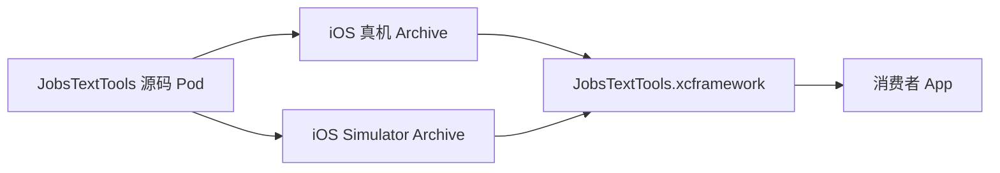

# `iOS Framework` 与 `XCFramework` 打包指南（Swift）


[toc]

---

## 🔥 <font id=前言>前言</font>

> 本文回答“iOS 的 Framework 包怎么打”，并直接使用 `JobsSwiftBaseConfigDemo` 中 Jobs 自建本地 Pod `JobsTextTools` 做最小可运行示范。目标产物不是只支持真机的一份 `.framework`，而是同时包含 iOS 真机与 iOS Simulator 变体的 `.xcframework`。

- 当前示范不修改 `JobsTextTools` 的源码、公开 API、`Podfile` 或 Pods 工程，只消费 [**CocoaPods**](https://cocoapods.org/) 已生成的 `JobsTextTools` Scheme。
- `JobsTextTools` 只有 `JobsText.swift`、`JobsRichText.swift` 两个源码文件，没有其它 Pod 依赖，适合先把“源码 Pod → 二进制 Framework”的主流程跑通。
- Apple 推荐用 [**XCFramework**](https://developer.apple.com/documentation/xcode/creating-a-multi-platform-binary-framework-bundle) 保存不同平台与架构的 Framework 变体，不要使用 `lipo` 把真机和模拟器二进制强行合并为一份旧式胖 Framework。

## 一、先把几个概念说清楚 <a href="#前言" style="font-size:17px; color:green;"><b>🔼</b></a> <a href="#🔚" style="font-size:17px; color:green;"><b>🔽</b></a>

### 1.1、`.framework` 是一个平台变体

一个 `.framework` 是代码、模块描述、公开接口与可选资源组成的 Bundle。它通常只对应一个平台变体，例如：

- iOS 真机：通常包含 `arm64`。
- iOS Simulator：在 Apple Silicon 上至少包含 `arm64`，需要兼容 Intel Mac 时还应包含 `x86_64`。

同名 Framework 的真机二进制和模拟器二进制不能因为都叫 `JobsTextTools.framework` 就互相替换。

### 1.2、`.xcframework` 是多个变体的容器

`.xcframework` 不等于一种新的链接方式，它只是把 iOS、iOS Simulator、macOS、Mac Catalyst 等不同变体放在一个有清晰索引的容器中，由 [**Xcode**](https://developer.apple.com/xcode) 在构建时自动选对切片。



### 1.3、静态与动态是链接方式，不是文件后缀

当前 Swift 工程使用 `use_frameworks! :linkage => :static`，所以 CocoaPods 生成的是“Framework 目录包裹的静态库”：

| 项目 | 当前示范 |
| --- | --- |
| 外层形式 | `JobsTextTools.framework` |
| 二进制类型 | `staticlib` |
| 最终容器 | `JobsTextTools.xcframework` |
| App 接入 | 链接，通常选择 `Do Not Embed` |
| App 启动开销 | 不新增动态库装载项 |

如果目标确实需要动态加载边界，应在独立 Framework target 中明确使用动态 Framework，再由消费者选择 `Embed & Sign`。不要只改文件名或 `MACH_O_TYPE` 就假定依赖、资源和签名已经处理完整。

## 二、什么时候应该下沉为二进制包 <a href="#前言" style="font-size:17px; color:green;"><b>🔼</b></a> <a href="#🔚" style="font-size:17px; color:green;"><b>🔽</b></a>

适合下沉：

- 需要把闭源 SDK 交付给其它团队或客户。
- 源码稳定、公开 API 已经收口，希望缩短上层工程编译时间。
- 需要同一份能力在多个 Apple 平台或多个 App 中复用。
- 需要明确版本、校验和、许可证、符号与兼容边界。

不适合急着下沉：

- API 仍频繁变化，每次修改都要重新打包和发布。
- Pod 依赖很多且存在循环依赖，尚未形成可独立编译边界。
- 资源仍通过 `Bundle.main`、裸路径或宿主约定读取。
- 公开 API 泄漏了私有类型、第三方类型或宿主业务模型。
- 只是为了“看起来更底层”，却没有交付、复用或构建收益。

## 三、最小 Demo 的真实基线 <a href="#前言" style="font-size:17px; color:green;"><b>🔼</b></a> <a href="#🔚" style="font-size:17px; color:green;"><b>🔽</b></a>

### 3.1、样板模块

| 项目 | 内容 |
| --- | --- |
| workspace | `JobsSwiftBaseConfigDemo.xcworkspace` |
| Scheme | `JobsTextTools` |
| Product | `JobsTextTools.framework` |
| 源码 | `JobsByPods/JobsTextTools@Pods/JobsText.swift`、`JobsRichText.swift` |
| Pod 依赖 | 无 |
| 系统 Framework | `UIKit` |
| 链接形态 | 静态 Framework |

### 3.2、Demo 目录

```text
iOS Framework 与 XCFramework 打包指南.md/
├── README.md
└── Demo/
    ├── JobsTextToolsConsumerDemo.swift
    └── 【MacOS】📦生成JobsTextTools.xcframework.command
```

- `【MacOS】📦生成JobsTextTools.xcframework.command` 负责真机归档、模拟器归档、创建 XCFramework、结构验证、消费者类型检查、ZIP 压缩和 SHA-256 生成。
- `JobsTextToolsConsumerDemo.swift` 是最小消费者，证明产物能够被新的 Swift 编译单元通过 `import JobsTextTools` 导入。

## 四、一条命令打包 <a href="#前言" style="font-size:17px; color:green;"><b>🔼</b></a> <a href="#🔚" style="font-size:17px; color:green;"><b>🔽</b></a>

### 4.1、执行前检查

```shell
cd "/Users/jobs/Documents/Github/JobsBaseConfig/JobsBaseConfig@JobsSwiftBaseConfigDemo"
xcodebuild -workspace JobsSwiftBaseConfigDemo.xcworkspace -list | rg "JobsTextTools"
```

能看到 `JobsTextTools` Scheme 后再执行 Demo：

```shell
zsh "SwiftDoc.md/iOS Framework 与 XCFramework 打包指南.md/Demo/【MacOS】📦生成JobsTextTools.xcframework.command"
```

脚本会先展示自述并等待回车。确认后才开始写入被 `.gitignore` 排除的 `build/XCFrameworkDemo`。

### 4.2、输出结构

```text
build/XCFrameworkDemo/JobsTextTools/时间戳/
├── Archives/
│   ├── JobsTextTools-iOS.xcarchive
│   └── JobsTextTools-iOS-Simulator.xcarchive
├── JobsTextTools.xcframework
├── JobsTextTools.xcframework.zip
└── JobsTextTools.xcframework.zip.sha256
```

如果需要把产物写入其它目录，把目标目录作为第一个参数传入：

```shell
zsh "SwiftDoc.md/iOS Framework 与 XCFramework 打包指南.md/Demo/【MacOS】📦生成JobsTextTools.xcframework.command" \
  "/目标输出目录"
```

## 五、脚本实际执行了什么 <a href="#前言" style="font-size:17px; color:green;"><b>🔼</b></a> <a href="#🔚" style="font-size:17px; color:green;"><b>🔽</b></a>

### 5.1、归档 iOS 真机变体

```shell
xcodebuild archive \
  -workspace JobsSwiftBaseConfigDemo.xcworkspace \
  -scheme JobsTextTools \
  -configuration Release \
  -destination "generic/platform=iOS" \
  -archivePath "JobsTextTools-iOS.xcarchive" \
  SKIP_INSTALL=NO \
  BUILD_LIBRARY_FOR_DISTRIBUTION=YES \
  CODE_SIGNING_ALLOWED=NO \
  ONLY_ACTIVE_ARCH=NO
```

### 5.2、归档 iOS Simulator 变体

```shell
xcodebuild archive \
  -workspace JobsSwiftBaseConfigDemo.xcworkspace \
  -scheme JobsTextTools \
  -configuration Release \
  -destination "generic/platform=iOS Simulator" \
  -archivePath "JobsTextTools-iOS-Simulator.xcarchive" \
  SKIP_INSTALL=NO \
  BUILD_LIBRARY_FOR_DISTRIBUTION=YES \
  CODE_SIGNING_ALLOWED=NO \
  ONLY_ACTIVE_ARCH=NO
```

### 5.3、组合为 XCFramework

```shell
xcodebuild -create-xcframework \
  -archive "JobsTextTools-iOS.xcarchive" \
  -framework "JobsTextTools.framework" \
  -archive "JobsTextTools-iOS-Simulator.xcarchive" \
  -framework "JobsTextTools.framework" \
  -output "JobsTextTools.xcframework"
```

关键设置：

| 设置 | 必要性 |
| --- | --- |
| `SKIP_INSTALL=NO` | 让 Framework 真正进入 `.xcarchive/Products/Library/Frameworks`。 |
| `BUILD_LIBRARY_FOR_DISTRIBUTION=YES` | 为 Swift 生成稳定的 `.swiftinterface`，开启 library evolution 支持。 |
| `CODE_SIGNING_ALLOWED=NO` | 构建静态二进制样板时不占用 App 签名环境；最终 App 仍按自身发布流程签名。 |
| `ONLY_ACTIVE_ARCH=NO` | 不把产物限制为当前机器正在使用的单一架构。 |
| `generic/platform=...` | 让 Xcode 按目标平台决定架构，不手写 `-arch`。 |

## 六、消费者怎么接入 <a href="#前言" style="font-size:17px; color:green;"><b>🔼</b></a> <a href="#🔚" style="font-size:17px; color:green;"><b>🔽</b></a>

### 6.1、手工拖入 Xcode

1. 把 `JobsTextTools.xcframework` 拖入消费者工程。
2. 在 App target 的 `Frameworks, Libraries, and Embedded Content` 中确认已链接。
3. 当前产物是静态 Framework，选择 `Do Not Embed`。
4. Swift 文件直接导入并调用：

```swift
import JobsTextTools

let text: JobsText = "JobsTextTools XCFramework 可用"
print(text.asString)
```

### 6.2、通过 CocoaPods 二进制 Pod 接入

二进制 Pod 的 `podspec` 不再声明源码，而是声明：

```ruby
Pod::Spec.new do |spec|
  spec.name             = 'JobsTextToolsBinary'
  spec.version          = '1.0.0'
  spec.summary          = 'Binary distribution for JobsTextTools.'
  spec.platform         = :ios, '15.0'
  spec.swift_version    = '5.0'
  spec.source           = { :http => 'https://example.com/JobsTextTools.xcframework.zip' }
  spec.vendored_frameworks = 'JobsTextTools.xcframework'
end
```

不要让源码 Pod 和二进制 Pod 同时向同一个 target 提供 `JobsTextTools` 模块，否则会出现重复模块、重复符号或不确定链接来源。

### 6.3、通过 Swift Package Manager 接入

Apple 的[**二进制 Framework Swift Package 分发文档**](https://developer.apple.com/documentation/xcode/distributing-binary-frameworks-as-swift-packages)要求 ZIP 根目录直接包含 `.xcframework`，远程二进制还要提供校验和：

```shell
swift package compute-checksum JobsTextTools.xcframework.zip
```

```swift
.binaryTarget(
    name: "JobsTextTools",
    url: "https://example.com/JobsTextTools.xcframework.zip",
    checksum: "这里填写 compute-checksum 的结果"
)
```

## 七、换成其它 Jobs Pod <a href="#前言" style="font-size:17px; color:green;"><b>🔼</b></a> <a href="#🔚" style="font-size:17px; color:green;"><b>🔽</b></a>

先做四项检查：

1. `xcodebuild -workspace ... -list` 能看到只构建目标 Framework 及其依赖的 Scheme。
2. `FULL_PRODUCT_NAME` 是预期的 `Pod名.framework`。
3. 目标所有源码、公开 API、资源和依赖都属于允许分发的范围。
4. Pod 的依赖图没有循环，并已经决定“依赖分别发包”还是“统一门面包”。

然后把 Demo 脚本中的以下常量换成目标值：

```shell
readonly WORKSPACE_PATH="目标.xcworkspace"
readonly SCHEME_NAME="目标Scheme"
readonly PRODUCT_NAME="目标Product"
```

如果目标 Pod 有依赖，最稳妥的做法是每个模块分别产出 XCFramework，并在二进制 `podspec` 或 Swift Package 中显式声明依赖。不要私自把多个静态库合并后继续沿用原模块声明，除非已经验证重复符号、Category、Swift module、资源与许可证边界。

## 八、资源、依赖和公开 API 边界 <a href="#前言" style="font-size:17px; color:green;"><b>🔼</b></a> <a href="#🔚" style="font-size:17px; color:green;"><b>🔽</b></a>

### 8.1、资源

- `JobsTextTools` 当前没有运行时资源，所以最小示范只打代码。
- 有图片、JSON、字体、音视频、本地化或 `xcassets` 时，继续使用独立 `Resource Bundle`，由二进制 Pod / Package 同步交付。
- Framework 内部取资源时使用模块 Bundle 或明确的资源 Bundle，不使用 `Bundle.main` 猜宿主路径。

### 8.2、依赖

- 系统 Framework 可以通过 target 的 Link Binary 配置解决。
- 自建 Pod 与第三方 Pod 必须形成可发布的二进制依赖图。
- 公开 API 一旦出现依赖模块的公开类型，消费者也必须能导入那个模块。
- 静态 Framework 不会因为放进 XCFramework 就自动把所有依赖代码安全吞进去。

### 8.3、Swift ABI 与模块稳定性

- `BUILD_LIBRARY_FOR_DISTRIBUTION=YES` 会生成 `.swiftinterface`，解决不同 Swift 编译器之间的模块接口读取问题。
- 这不代表任意未来 Swift / Xcode 都永久兼容；每次升级 Xcode、最低系统版本或公开 API 后仍要重新归档并做消费者构建。
- `public`、`open`、`@inlinable`、`@frozen` 会影响二进制兼容承诺，不能为了暴露更多符号随意添加。

## 九、验证与交付清单 <a href="#前言" style="font-size:17px; color:green;"><b>🔼</b></a> <a href="#🔚" style="font-size:17px; color:green;"><b>🔽</b></a>

### 9.1、结构验证

```shell
plutil -lint JobsTextTools.xcframework/Info.plist
find JobsTextTools.xcframework -type f -name JobsTextTools -exec file {} \;
find JobsTextTools.xcframework -type f -name "*.swiftinterface" -print
```

### 9.2、消费者验证

最低要求不是“脚本最后显示成功”，而是另一个编译单元确实可以导入模块。Demo 脚本会自动对 `JobsTextToolsConsumerDemo.swift` 执行 `swiftc -typecheck`。

正式交付还应覆盖：

- 消费者 App 的 Debug / Release 构建。
- iOS Simulator 启动。
- 真机安装与核心 API 调用。
- 静态 / 动态 Framework 的 Embed 设置。
- 资源读取、本地化与隐私清单。
- ZIP 下载、SHA-256 或 Swift Package checksum 校验。
- `LICENSE`、版本号、变更记录和最低系统版本。
- 需要崩溃符号化时同步交付对应 dSYM。

## 十、常见错误 <a href="#前言" style="font-size:17px; color:green;"><b>🔼</b></a> <a href="#🔚" style="font-size:17px; color:green;"><b>🔽</b></a>

| 错误 | 原因 | 处理 |
| --- | --- | --- |
| Archive 里没有 Framework | `SKIP_INSTALL=YES`，或 Scheme 没有构建目标 Framework | 归档时传入 `SKIP_INSTALL=NO`，检查 Scheme Build 列表。 |
| `No such module` | Framework Search Paths、模块名或目标切片不匹配 | 检查 `Info.plist`、`Modules`、消费者 `-F` 与模块名。 |
| `building for iOS Simulator, but linking in object file built for iOS` | 把真机 `.framework` 直接给模拟器使用 | 交付同时含真机和模拟器变体的 XCFramework。 |
| 缺少 `.swiftinterface` | 未开启 `BUILD_LIBRARY_FOR_DISTRIBUTION` | 重新归档 Swift Framework。 |
| `Undefined symbols` | 依赖没有随二进制图交付，或静态库未链接 | 显式发布并链接依赖，不靠宿主偶然提供。 |
| `Duplicate symbols` | 源码 Pod 与二进制 Pod 同时接入，或多个静态包重复包含同一实现 | 每个模块只保留一个实现来源。 |
| 图片 / JSON 找不到 | 仍通过 `Bundle.main` 或资源没有进入独立 Bundle | 独立交付资源 Bundle，并从模块 Bundle 定位。 |
| Intel 模拟器无法使用 | Simulator 变体没有 `x86_64` | 检查工程 `ARCHS` / `EXCLUDED_ARCHS`，在支持的构建机重新归档。 |

## 十一、版本与发布建议 <a href="#前言" style="font-size:17px; color:green;"><b>🔼</b></a> <a href="#🔚" style="font-size:17px; color:green;"><b>🔽</b></a>

- 使用语义化版本管理公开 API；破坏性变化升级主版本。
- 每个版本固定 Xcode、Swift、最低 iOS、支持平台、架构和依赖版本。
- ZIP 与 SHA-256 一起保存；远程 Swift Package 使用 `compute-checksum` 的结果。
- 发布前在一个不包含源码 Pod 的干净消费者工程中构建，防止间接依赖掩盖缺包。
- 闭源只能提高阅读门槛，不能把密钥、Token、私钥或安全决策放进客户端二进制。
- Framework 签名用于证明来源与完整性；是否签名及使用哪类证书按实际分发渠道决定，不能复用 App 的签名结论。

<a id="🔚" href="#前言" style="font-size:17px; color:green; font-weight:bold;">我是有底线的➤点我回到首页</a>
